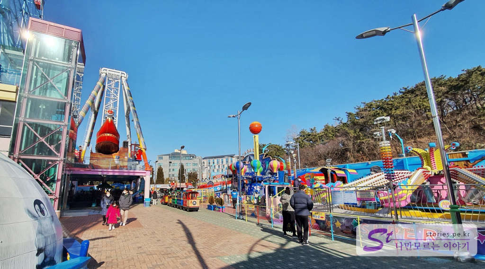
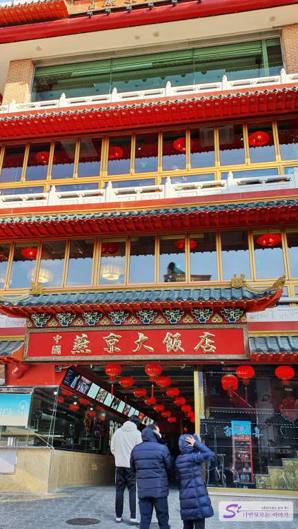

인천은 서울에서 가까워서 당일치기로 다녀오기에 좋은 지역입니다. 우리는 1박 2일로 다녀왔지만 충분히 당일치기로 다녀올 수 있습니다. 일정은 우리가 다녀온 일정을 중심으로 포스팅하려고 합니다. 

## 영종도의 바닷가 을왕리 해수욕장  
영종도하면 **인천국제공항**으로 유명합니다. 거의 대부분의 사람들이 인천공항을 가기 위해 방문할 텐데.. 그 국제공항을 돌아서면 을왕리 해수욕장으로 갈 수 있습니다. 

  
을왕리 해수욕장의 특징이라면 서해에서 드물게 뻘이 아닌 고운 모래로 이루어져 있다는 것입니다. 물론 물이 빠지고 깊이 들어가면 뻘로 되어 있지만 해변과 가까운 곳은 모래입니다. 

  
을왕리해수욕장은 모래밭과 소나무 숲으로 이루어져 있는 해변이 있고 큰 화장실과 수많은 조개구이집으로 이루어져 있습니다. 

  
조개구이는 서로 합의를 했는지 모두 동일한 금액을 제시하고있고 대략 인당 2만원정도 생각하시면 됩니다. 

  
해가 지면서 가로등에 불이 들어오고 사람들이 해변으로 모이기 시작합니다. 왜냐하면 을왕리 해수욕장은 낙조로 유명한 해변이기 때문입니다.

  
그리고 낙조가 시작됩니다. 이 사진은 을왕리해수욕장에 있는 **더위크앤리조트**에서 찍긴 했는데 동일한 낙조를 볼 수 있습니다.  

  
해가 지면 많은 사람들이 폭죽을 터뜨립니다. 살짝 얼굴을 디밀면 공짜로 폭죽을 배경으로 사진을 찍을 수 있습니다. ㅎㅎ

  
저희는 **더위크앤리조트**에서 숙박을 했습니다.  

## 프랑세즈 단팥빵  
을왕리해수욕장 근처에 단팥빵으로 유명한 프랑세즈 단팥빵집이 있습니다. 원래는 빵과 커피를 파는 카페로 운영을 했었던 것 같은데 방송의 버프에 힘 입고 현재는 거의 단팥빵만 판매를 하고 있습니다. 

   
을왕리 해수욕장에서 서울로 나가는 길 삼거리 길목에 빵집이 자리 잡고 있습니다. 100% 국내산 팥을 직접 끓여서 만드는 빵으로 유명하며 팥이 달지 않고 맛이 좋습니다. 인기가 있을 만한 맛입니다만 그만큼 가격은 비쌉니다. 

  
SBS 생방송 투데이로 버프를 먹었나 보네요. 1,800원~ 2,300원으로 가격대가 형성되어 있으며 단팥빵 치고는 비싼 편이지만 국내산 단팥이라면 이해할 만한 수준입니다. 
 

## 인천 월미도  
을왕리에서 단팥빵을 사 먹고 영종도를 빠져나와서 인천 쪽으로 향하면 30분 거리에 월미도가 있습니다. 월미도에는 다양한 유. 무료 주차장이 있는데 **공영 주차장**은 기본 30분에 600원, 추가 15분당 300원이 붙고 하루 최대 6,000원이 넘지 않습니다.  

또한 주위에 있는 많은 **민간 주차장**이 하루 2,000원으로 호객행위를 하고 있습니다. 만약 월미도에 오래 있을 예정이라면 민간 주차장을 이용하는 것이 좋을 수도 있습니다. 다만 성수기 때는 가격이 더 올라갈 수 도 있겠네요. 

  
우리는 **월미테마파크**가 있는 **제1 공영주차장**에 주차를 했습니다. 이곳은 인천 바다열차 박물관역에 있습니다.  

  
바로 가까운 곳에 테마파크가 있습니다. 이곳에 그 유명한 월미도 바이킹과 디스코팡팡이 있습니다.  

  
어린아이들을 위한 놀이 기구들도 많이 있기 때문에 어린이들을 데리고 오기에도 좋습니다.   

  
저~ 멀리 바이킹이 보입니다. 겨울이라 그런지, 코로나 19 때문에 그런지 바이킹은 운영을 하고 있는데 디스코팡팡은 운영을 하고 있지 않았습니다.  

  
실내인 듯 실내 아닌 곳에서는 아이들이 놀 수 있는 몇 가지의 놀이기구들이 있습니다. 롯데리아 같은 먹거리들도 좀 있고요. 

  
참고하라고 매표소 가격을 올려봅니다.  

## 월미도 등대   
저희는 바이킹만 타고 테마파크를 나왔습니다. 테마파크 바깥쪽에는 월미도 등대가 있습니다. 별거는 아니지만 바닷가라는 느낌을 느끼기 위해서 한번 다녀왔습니다.  

  
방파제 길을 따라 등대로 가는 길은 대략 2~30m 정도의 짧은 길입니다. 등대에 도착해도 등대가 멋있게 생겼거나 하지는 않습니다.   

  
등대를 찍고 돌아오는 길에 보면 멀리 테마파크의 대관람차가 보이네요. 

## 차이나타운  
월미도와 가까운 거리에 차이나타운이 있기 때문에 같이 묶어서 여행을 다녀오기에 좋습니다. 코로나 19로 문이 닫혀있을 줄 알았는데 많지는 않지만 운영은 하고 있었습니다. 

   
저희는 차이나타운의 태림봉쪽으로 들어왔으며 주위의 웬만한 곳에 주차를 하고 걸어서 이동했습니다. 

   
차이나타운에서 가장 유명한 하얀 짜장면으로 유명한 **연경**입니다.  

  
**차이나타운하면 양꼬치죠~** 라는 말은 이제 옛말이 되었나 봅니다. 이번에 갔을 때 양꼬치집은 1곳밖에 보지 못했습니다. 사실 저희는 예전에 먹었던 양꼬치 때문에 온 것이었는데... 아쉽네요.

  
차이나타운의 매인 거리입니다. 많지도 적지도 않은 사람들이 여기저기 군것질을 하는 모습을 볼 수 있습니다.  

  
보기에는 좋으나 먹기에는 좋지 않은 탕후루입니다.  

  
그리고 화덕만두로 유명한 십리향입니다.  

  
이렇게 화덕의 벽면에 반죽을 붙여서 익힙니다.  

  
주문을 하면 구운 빵 형태의 화덕만두를 하나씩 싸서 줍니다. 먹어보면 빵과 속이 따로 놀기는 하는데 기름을 사용하지 않아 단백한 맛이 특징입니다.  

  
고구마, 단호박, 팥, 고기 종류가 있고 가격은 개당 2,000원입니다.

## 총평   
저희는 1박 2일이었으나 그냥 당일치기로도 다녀올 수 있는 인천 코스입니다. 아침 10시쯤 월미도에서 놀고 오후 차이나타운을 방문해서 중식으로 점심을 먹고 저녁에 을왕리해수욕장에서 낙조를 보고 집으로 돌아온다면 하루 코스로 매우 좋을 수 있습니다. 
