서동요 테마파크를 여유롭게 구경하고 이번에는 부여군청 가까이에 있는 궁남지로 이동했습니다. 

궁남지는 백제시대에 형성된 연못으로 궁의 남쪽에 있다고 하여 **궁남지**라고 명명되었다고 합니다. 

> [[부여] 1박2일 휴식 같은 부여여행 (서동요테마파크)](https://blog.stories.pe.kr/539)

서동요 테마파크가 중심지에서 좀 떨어져 있다면 궁남지는 시내 중심 쪽에 있습니다. 

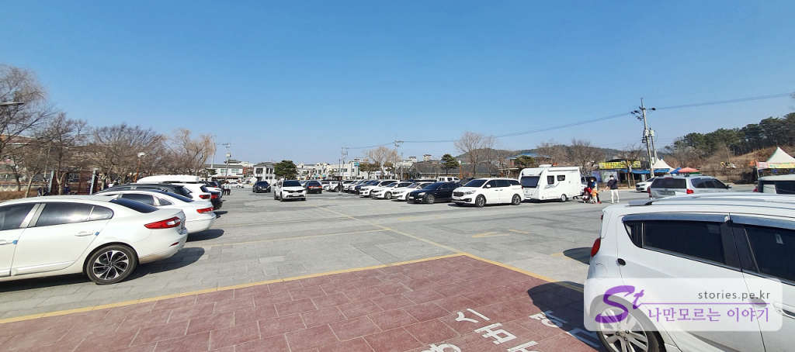  
궁남지의 주차장은 60~70대 정도 주차가 가능한 무료 주차장입니다. 

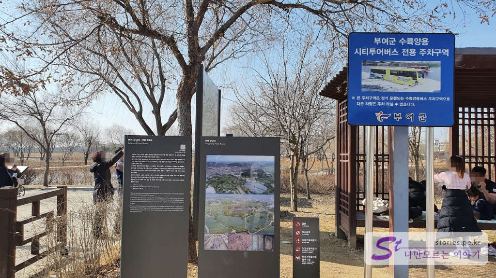  
이 주차장은 부여 수륙양용 시티투어버스가 주차하는 곳인가 봅니다. 저희가 갔을 때는 운행 중인지 해당 버스를 보지는 못했습니다. 

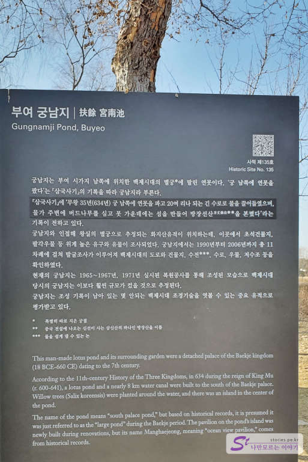  
궁남지에 대한 설명이 있네요. 

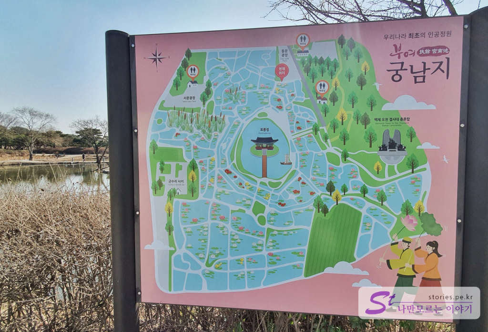 
궁남지는 궁남지를 중심으로 외곽에 다양한 크기의 연못들이 나누어져 있습니다. 

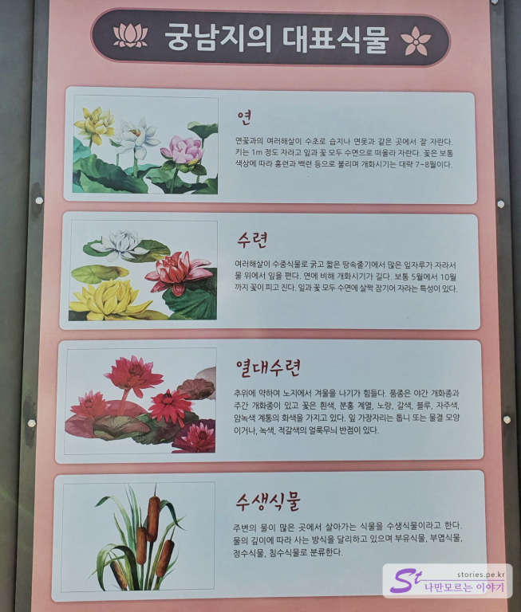  
그 연못에는 다양한 수생식물들이 있다고 합니다. 저희는 겨울에 방문해서 시기적으로 식물들을 볼 수 없었지만 연, 수련, 열대수련, 수생식물들이 있다고 합니다. 

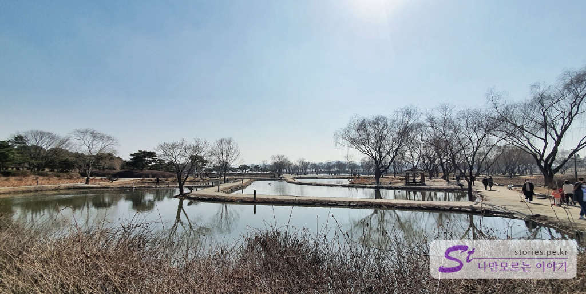  
이제 주차장에서 궁남지로 들어가 보면 수생식물들이 없는 연못들을 볼 수 있습니다.   

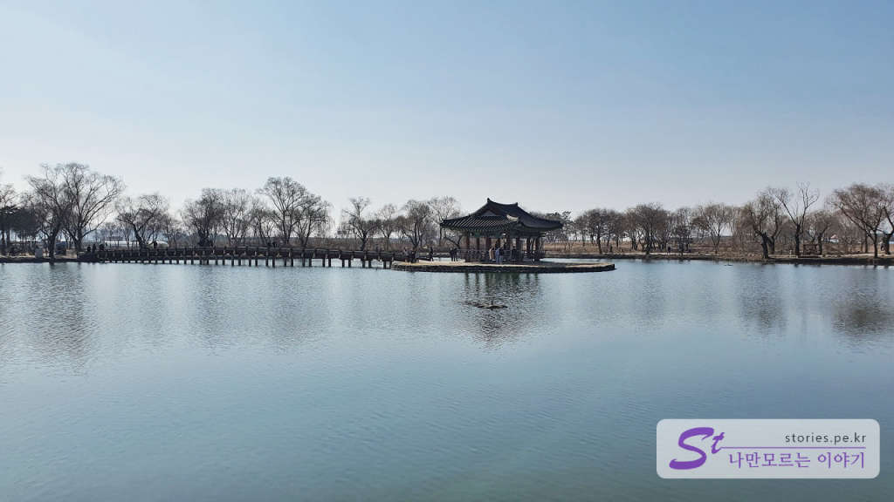  
조금 더 들어서면 궁남지를 만날 수 있습니다. 커다란 연못의 중앙에 포룡정(정자)이 있어서 매우 멋진 모습을 하고 있습니다. 

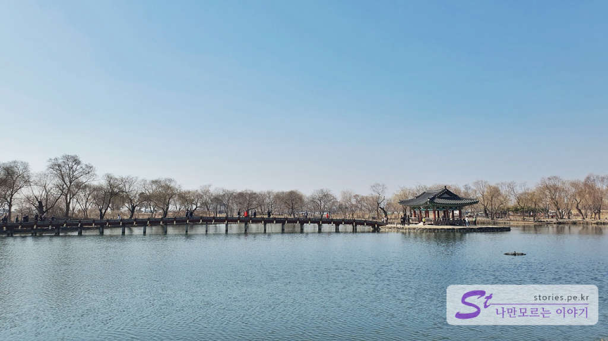  
최근 TVN에서 방영한 **철인왕후**에도 궁남지가 나왔습니다. 

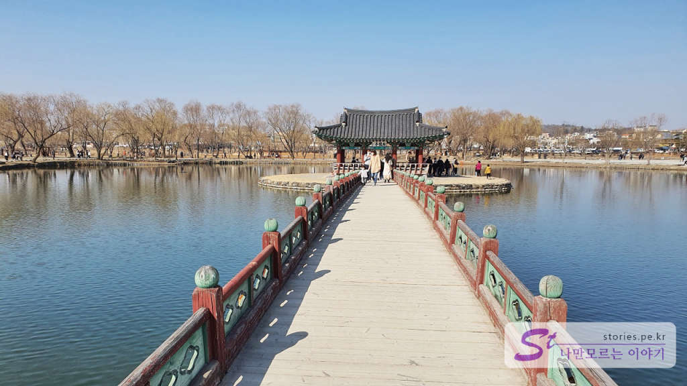  
**포룡정**으로 들어가는 나무다리 또한 너무 멋집니다. 

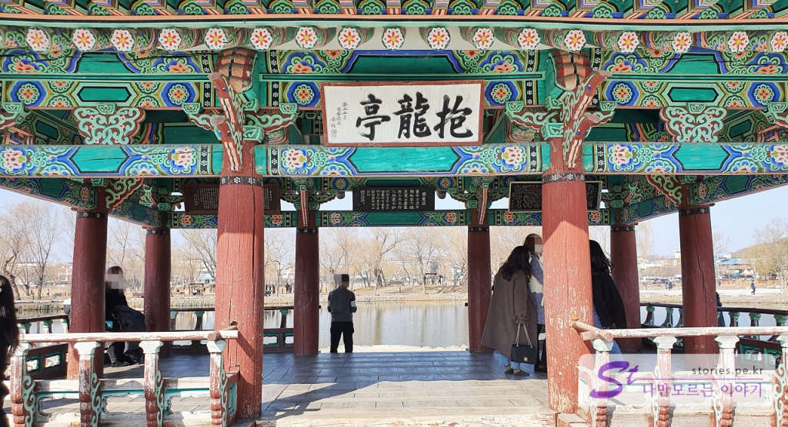  
포룡정에서는 간단하게 쉬어 갈 수 있습니다. 햇빛도 피할 수 있고요. 실제로 사용 가능하게 구성되어 있습니다. 

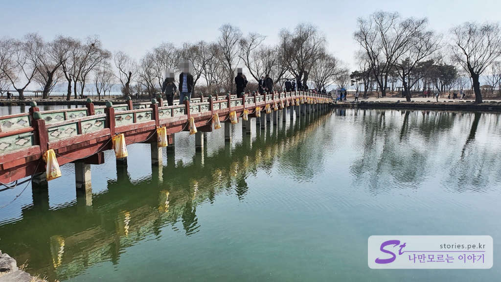  
포룡정에서 바라본 나무다리입니다. 멋진 화면 구성을 볼 수 있네요. 

궁남지도 연인과 천천히 걸으면서 서로 이야기도 나누고 잠깐 의자나 그네에 앉아서 쉴 수도 있고 좋습니다. 쉼을 얻을 수 있는 곳입니다. 겨울에는 와 봤으니 나중에 봄, 여름, 가을에도 한번 와 보고 싶은 곳입니다. 

## 비용  
무료

## 입장시간  
- 운영시간 : 24시간  
- 소요시간 : 왕복 1시간 

## 여행지 정보  
- 주소 : 충남 부여군 부여읍 동남리    
- 연락처 : 041-830-2330   

<iframe src='https://www.google.com/maps/embed?pb=!1m18!1m12!1m3!1d3216.7615640974236!2d126.91002421507316!3d36.26956728006136!2m3!1f0!2f0!3f0!3m2!1i1024!2i768!4f13.1!3m3!1m2!1s0x357075785db15193%3A0x198607656495dcaa!2z6raB64Ko7KeAICjmibbppJgg5a6u5Y2X5rGgKQ!5e0!3m2!1sko!2skr!4v1614324815563!5m2!1sko!2skr' class='embed-responsive-item' allowfullscreen></iframe>

## 인근 맛집  
### 본가 석갈비
부여를 2번 여행을 가봤는데 음식이 가격 대비 맛이 썩 만족스럽지는 못했습니다. 그러다가 이번에 점심겸 저녁으로 먹은 본가 석갈비가 가격대비 맛이 괜찮아서 가볍게 소개해 보려고 합니다. 

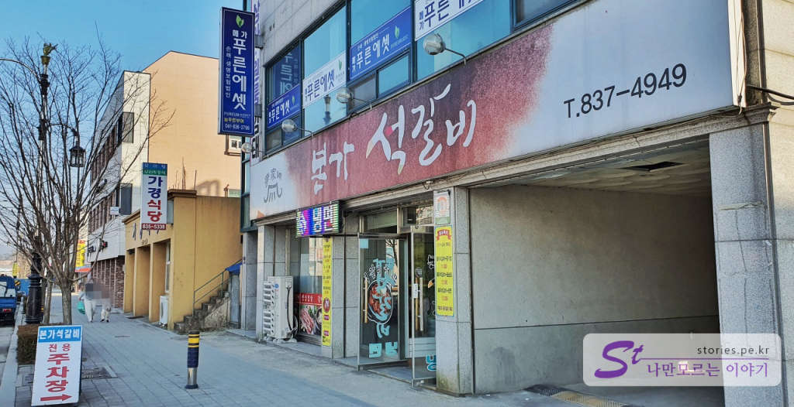  
부소산성 인근에 있지만 관광지가 대부분 시내권에 있어서 접근성이 나쁘지는 않습니다. 

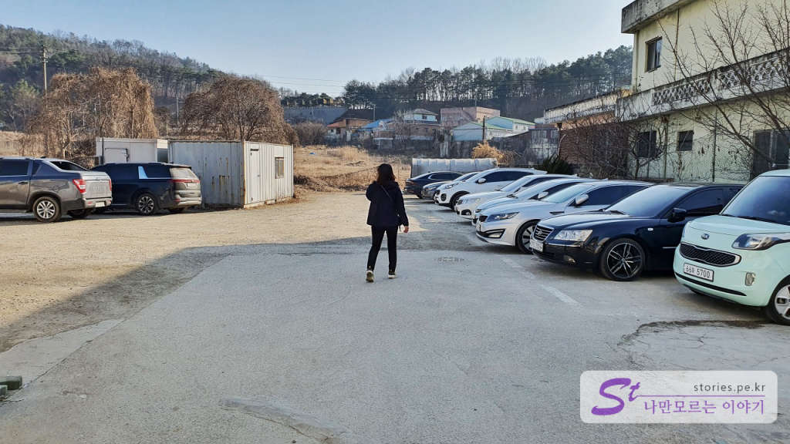  
주차장도 20대가량 주차할 수 있어서 주차에 문제도 없습니다.  

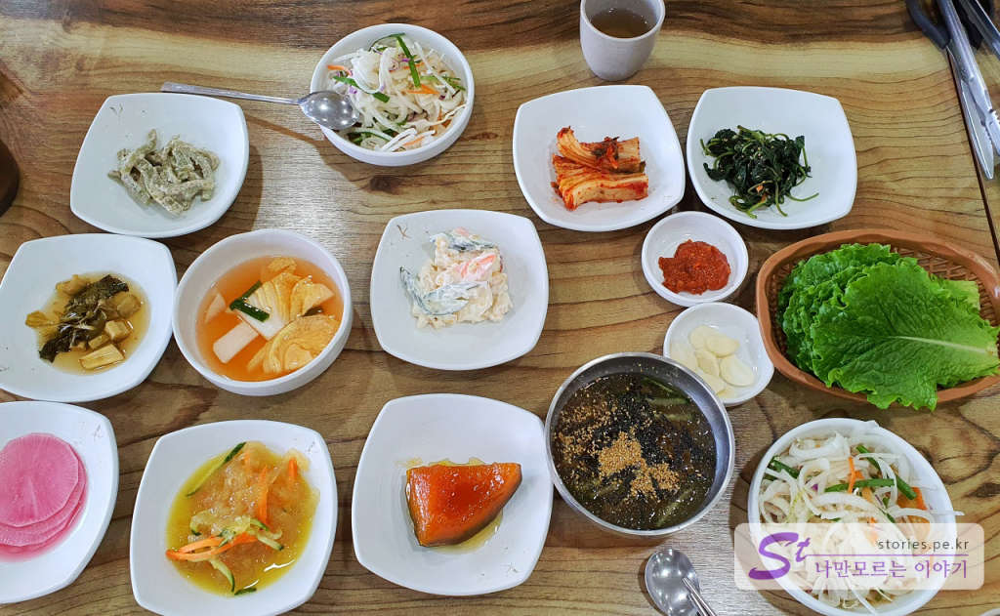  
반찬이 먼저 나와서 찍어봤습니다. 반찬도 전반적으로 맛이 좋습니다. 

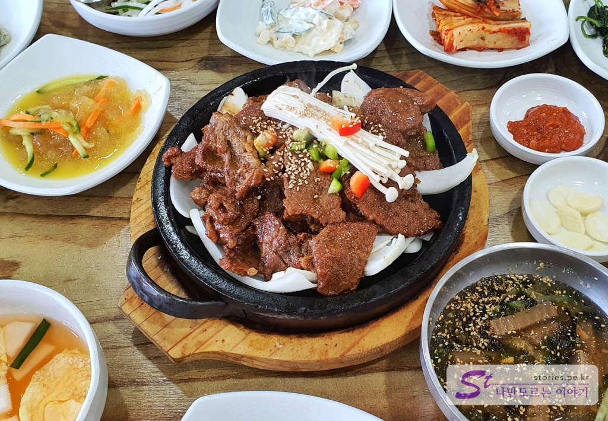  
석갈비가 나왔습니다. 뜨거운 돌판 위에 양파를 깔고 고기를 얹어서 먹을 수 있게 되어 있습니다. 지금 이 양이 2인분입니다. 저희는 적당한 양이였습니다. 좀 많이 드신다면 조금 더 시켜야 할 수 있습니다. 

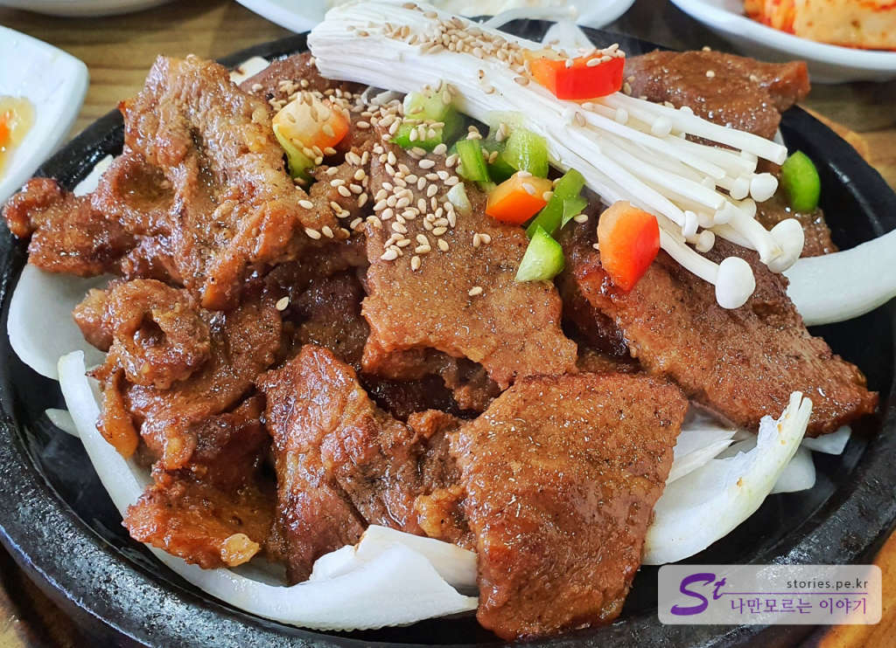  
맛이 좋습니다. 괜찮아요..

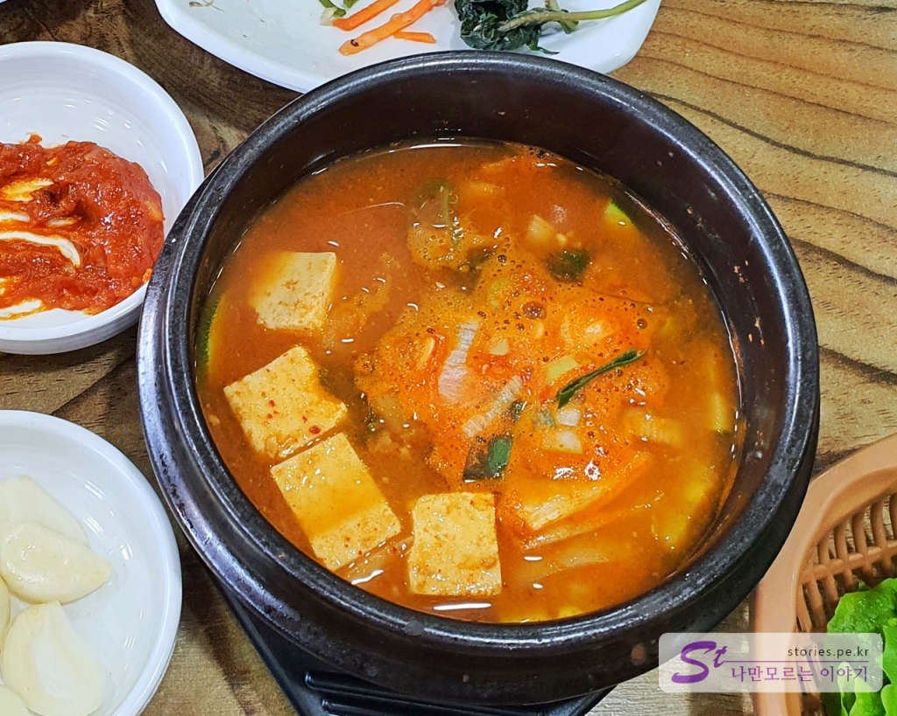  
후식 1,000원짜리 공깃밥을 시키면 된장찌개와 같이 나옵니다. 된장찌개도 얼큰하니 맛이 좋았습니다. 

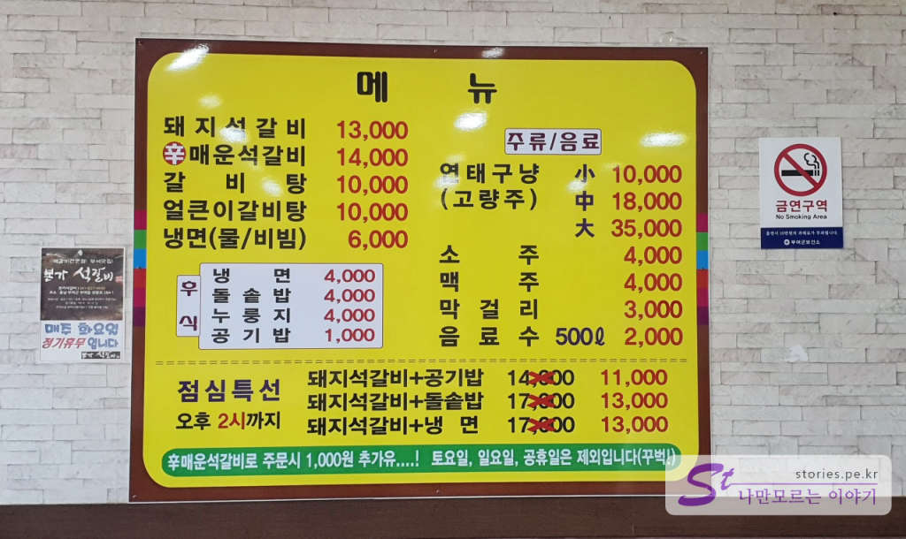  
메뉴가 약간은 비싼 감이 없지 않으나 그래도 관광지에서 만족스러운 가성비의 맛집입니다. 추천할 만해요 ~~ 

평일날 점심에 간다면 점심특선에 도전해 볼 만합니다. ㅎㅎ
