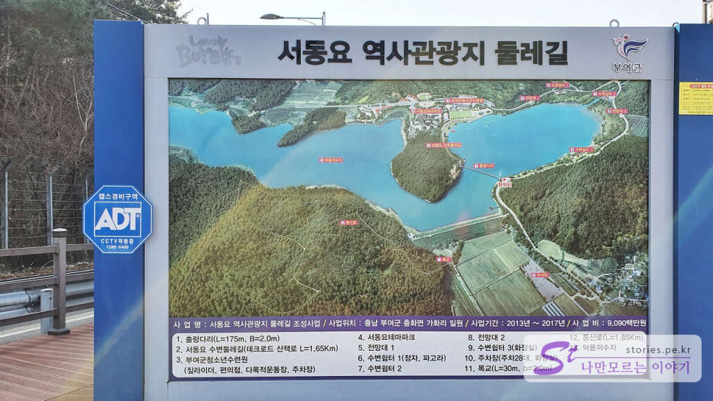

겨울이 지나갈 무렵 휴일을 곁들여 1박 2일로 부여여행을 다녀왔습니다. 백제의 얼이 서려있기는 하지만 강원도처럼 액티브 한 느낌도 없고 경주처럼 역사적인 장소가 많은 곳도 아닙니다. 그래도 부여는 부여만의 독특한 느낌을 가지고 있습니다. 백제의 문화가 일본으로 넘어가서 그런지 약간 일본에 온 듯한 느낌이 들기도 합니다. 단정하고 심플하지만 정갈한 느낌, 쉼이 있을 것 같은 느낌을 받았습니다. 

1박 2일이라고는 하지만 첫날을 저녁 늦게 도착해서 바로 숙소에서 잠을 잤기 때문에 그냥 하루 코스 부여여행이라고 보시면 될 것 같습니다. 쉼이 목적이기 때문에 시간을 넉넉히 잡고 2~3군데 관광지를 돌아봤습니다. 

## 서동요 테마파크 (역사관광지)  
첫번째로 방문한 곳은 서동요테마파크(역사관광지)입니다. 역사관광지 내에 주차장이 있었지만 우리는 출렁다리가 있는 방향에 주차를 했고 다리를 건너 서동요 역사관광지로 이동했습니다. (네비를 잘못 찍어서 그리로 갔어요 ^^)

    
  
출렁다리는 둘레길에 속해있는 길로 덕용 저수지를 한 바퀴 돌 수 있습니다. 

  
출렁다리가 출렁이기는 하나 심하게 흔들리지는 않습니다. 

  
다리를 건너서 반대쪽을 본모습입니다. 아름답습니다. 

  
다리를 건너 둘레길을 따라 테마파크 방향으로 오다 보면 호랑이 가족을 볼 수 있습니다. 호랑이가 무섭지 않고 귀엽게 생겼습니다. 이쁘게 생겼더라고요. ㅎㅎ

  
조금 더 가다 보면 이번에는 학 2마리를 만날 수 있습니다. 학을 배경으로 사진을 찍을 수 있습니다. 뜬금없이 호랑이와 학이 나오는 것을 보면 무슨 전설이 있는 것 같은데... 뭔지 모르겠단 말이야.. 뭘까요??

  
조금 더 오다 보면 서동요 테마파크를 만날 수 있습니다. 짚라인도 있고 여러가지 체험시설이 있습니다.  

  
이제 축구장도 볼 수 있습니다. 부여군 청소년수련원에 속해있는 운동장 겸 축구장인 것 같습니다. 

  
서동요 역사관광지는 유료입니다. 매표소에서 매표를 하고 입장을 해야 합니다. 

  
어른은 2,000원 청소년은 1,500원으로 입장료는 저렴한 편입니다. 

  
역시나 대부분의 관광지가 그렇듯 매주 월요일에는 휴관을 합니다. 방문 시 고려해야 합니다.  

  
매표를 하면 입장권과 팜플렛을 하나 줍니다. 테마파크에 대한 설명이 잘 되어 있습니다. 

  
  
입구를 들어서면 서동요 테마파크의 전체적인 약도와 어느 영화나 드라마에 출연했는지에 대한 설명이 붙어 있습니다. 

  
첫 번째 보이는 곳은 주막입니다. 2층으로 되어 있는 주막에서 바라보는 풍경은 옛날 느낌이 충분히 많이 납니다.  

  
  
물건을 사고 파는 왕궁마을 저잣거리입니다. 초가집 사이로 보이는 저수지는 마치 바다처럼 보입니다. 

  
  
백제의 태학사를 표현한 건물입니다. 태학사는 지금의 연구기관과 비슷한 곳이라고 합니다.  

  
  
  
조금 더 들어가면 백제왕궁을 만날 수 있습니다. 왕이 앉아있는 용좌와 어전이 있습니다. 사진 좀 찍어보려고 했는데.. 다른 관광객들이 들어와 버렸네요.  

  
  
왕궁 서고입니다. 서고라서 그런지 탁자와 의자도 있습니다. 

  
  
  
입구의 반대쪽으로 오면 양반집이 있는데 마당과 건물을 보면 상당한 재력가의 집인 모양입니다. 

   
  
양반댁에서 바라본 저잣거리의 모습입니다. 포토존이라고 해서 찍어봤습니다. 

서동요 테마파크로 방문자가 많지 않지만 나름 실감 나는 세트장이라 방문해 볼 만합니다. 한가하게 쉬엄쉬엄 걸어 다니며 구경하기 너무 좋습니다. 

## 입장시간  
- 운영시간 : 09:00~18:00(하절기), 09:00~17:00(동절기)  
- 소요시간 : 왕복  1시간~2시간 정도 
- 휴무일 : 매주 월요일  

## 여행지 정보  
- 주소 : 부여군 충화면 충신로 616   
- 연락처 : 041-832-9913  
- URL : http://www.buyeofmc.or.kr/index.php?MenuID=17  

<iframe src='https://www.google.com/maps/embed?pb=!1m18!1m12!1m3!1d3221.8784596869064!2d126.82133381506941!3d36.1451724800887!2m3!1f0!2f0!3f0!3m2!1i1024!2i768!4f13.1!3m3!1m2!1s0x35706fcc984d03f9%3A0xec293624fdd5acd4!2z7ISc64-Z7JqUIO2FjOuniO2MjO2BrA!5e0!3m2!1sko!2skr!4v1614265709353!5m2!1sko!2skr' class='embed-responsive-item' allowfullscreen></iframe>

## 주차정보  
  
주차장은 방문자에 비해 상당히 넓은 편입니다. 아래 사진은 매표소 바로 앞에 있는 주차장이고 그 위쪽으로 또 다른 주차장이 있습니다.  
