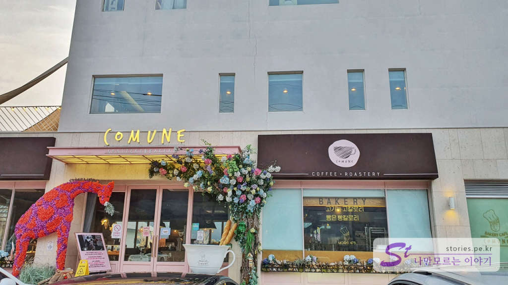
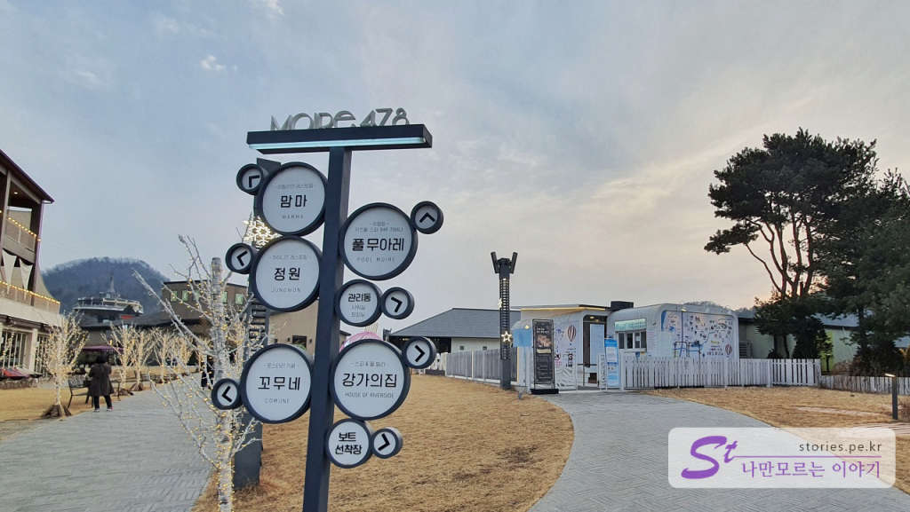

가평의 북한강변을 따라 많은 펜션과 카페, 음식점들이 있습니다. 그중에 **카페 꼬무네(Comune)**를 보기 위해 찾아갔으나 차창너머로 아무리 찾아봐도 꼬무네(Comune)는 보이지 않았습니다. 초행길에 내비게이션을 켜고 갔고 내비게이션에는 분명 꼬무네(Comune)라고 되어 있었는데 밖을 보면 그냥 **무아레478**이라고만 되어 있고 보이지 않았습니다. 한참을 지나쳐 가다가 다시 돌아오는 길에 꼬무네(Comune)를 찾고 보니 무아레478안에 있는 하나의 카페인걸 알게 되었습니다. 

  

# 무아레478 리조트
무아레478은 상당히 넓은 범위를 차지하고 있는 리조트입니다. 391번 지방도를 끼고 있고 담벼락이 없어 그냥 개별의 건물들이 모여있는 것처럼 보이지만 다양한 숙소와 회의실을 제공하고 있으며 이탈리안 레스토랑인 **맘마**와 중식 레스토랑인 **정원**, 그리고 카페인 **꼬무네**로 부대시설을 운영하고 있습니다.   

   
이 부대시설은 지방도에 붙어 있어서 리조트를 이용하는 이용객뿐만 아니라 단지 부대시설만 이용하기 위해 오는 사람도 상당히 많아 보입니다. 

  
 
그렇게 찾을 때는 보이지 안더니만 찾고 나니 아주 대문짝 만하게 **Comune**라고 간판이 서 있었습니다.. 영어라 ㅠㅠ 그냥 지나쳤나 봅니다. (영어랑 안 친해ㅠㅠ)

  
  
가까운 곳에 무아레 주차장이 있어서 주차를 하고 무아레 정원 안쪽으로 들어가 봤습니다. 먼저 중식 레스토랑인 **정원**이 보이고 그 뒤편으로 이탈리안 레스토랑인 **맘마**도 보입니다.  

  
입구에는 사진 찍기에 좋게 다양한 설치품들이 있습니다. 밤에 보면 조명 때문에 좀 더 멋있지 않을까 합니다. 

  
인근에 사는 지인이 중식 레스토랑 정원에서 짬뽕은 꼭 한번 먹어보라고 추천을 해 줬습니다. 시중보다 약간 비싸기는 하지만 맛과 품질에서 그만큼 값어치는 한다고 하네요 (참고로 저희는 아직 먹어보지는 안았습니다.) 

  
뒤쪽으로 외떨어져있는 건물이 이탈리안 레스토랑인 **맘마**입니다. 

  
그 옆으로 **풀 무아레**가 보입니다. 초상권 침해가 있을 것 같아 사람이 보이지 않을 때 사진을 찍었습니다만 추운 날씨임에도 몇몇이 수영을 하고 있었습니다. 들어가 보지 않았으나 당연히 온수를 받아 놨겠지요? ㅎ 

  
**풀 무아레**를 끼고 반대쪽으로 돌면 **꼬무네 뒤쪽**으로 길이 나 있습니다.  

  
사진 찍기에 좋은 설치품들이 여기저기 있어서 식당이나 카페를 이용하지 않더라도 잠시 방문하여 사진 찍기에도 좋게 되어 있습니다.   

  
끝에쯤 다다르면 이정표가 보입니다. 그러고 보니 저희는 거꾸로 돌아온 것 같네요. 강가의집은 북한강변이 보이는 잔디밭 위에 세워져 있는 숙소입니다. 

  
그 옆으로 주차장과 북한강변으로 내려가는 길이 조그맣게 있습니다. 

비록 많이 넓지는 않지만 따뜻한 날에는 식사 후나 커피를 들고 나와서 잠시 여유를 가지며 시간을 보내기에 좋을 것 같습니다. 

다음번에 올 때는 중식 레스토랑에서 짬뽕을 먹고 꼬무네에서 커피를 사서 들고 나와 야외에서 마시고 싶은 생각이 드네요. 

## 여행지 정보  
- 주소 : 경기 가평군 청평면 북한강로1636번길 34   
- 연락처 : 1599-0853  
- URL : http://moire478.com

<iframe src='https://www.google.com/maps/embed?pb=!1m18!1m12!1m3!1d3158.2785794869533!2d127.37831581511631!3d37.666161379779304!2m3!1f0!2f0!3f0!3m2!1i1024!2i768!4f13.1!3m3!1m2!1s0x356335743cf554c9%3A0x7c8193940c226c36!2z6rys66y064SkIENvbXVuZQ!5e0!3m2!1sko!2skr!4v1614089027361!5m2!1sko!2skr' class='embed-responsive-item' allowfullscreen></iframe>

 
