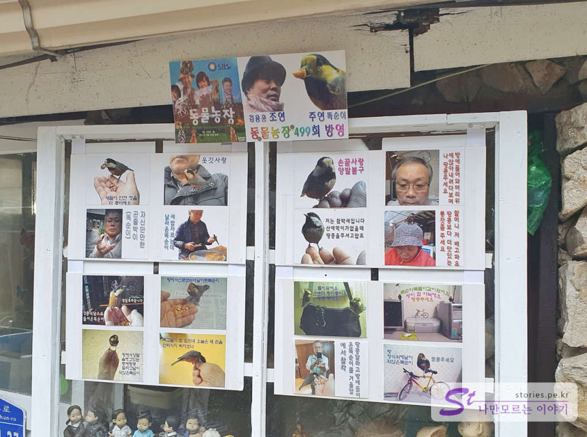
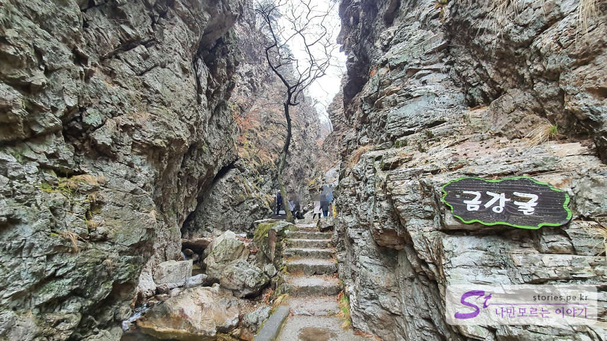
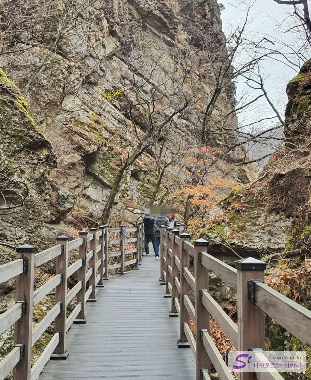

춘천으로 가기 전 운 좋게도 삼악산 **등선폭포**에 방문했습니다. 그 폭포가 뭐 얼마나 대단하겠어 라고 생각하겠지만 입구에 들어서는 순간 그 풍경에 바로 압도를 당하게 됩니다. 더욱이 우리가 방문했을 때는 마침 비가 온 날이라 그런지 폭포에 흐르는 물도 많았고  방문객도 없어서 너무 좋았습니다. 

  
등선폭포의 주차장은 총 3곳이라고 할 수 있습니다. 첫 번째는 입구와 조금 떨어져 있지만 주차를 많이 할 수 있는 주차장과 입구 쪽으로 오는 길에 있는 주차를 할 수 있는 두 번째 길거리 주차장, 그리고 입구 앞에 주차를 할 수 있습니다. 

  
저희는 첫 번째 장소에 주차를 하고 입구 쪽으로 걸어왔습니다. 

  
입구 앞에는 주차장도 있고 약간의 물건을 파는 가게도 있습니다.  

  
주차비는 경차 1,000원, 소형차 2,000원, 대형차는 4,000원입니다. 먼지떨이 기계도 있고요.

  
삼악산에서 캔듯한 삼 뿌리도 있습니다. 한뿌리에 1,000원이네요.. 먹고 힘내서 올라가셔도 될 것 같네요. 

  
지금은 상권이 많이 죽은 듯 문 닫은 식당이 있는 곳을 지나서 100m 정도 올라가며 등선폭포 매표소가 나타납니다.  

  
   
등선폭포 입장료는 지역 주민은 무료이고 그렇지 않으면 2,000원입니다. 그 2,000원은 춘천사랑 상품권으로 다시 돌려줍니다. 만약 춘천에서 춘천사랑 상품권을 사용한다면 입장료는 무료라고 할 수 있겠네요.  

  
매표소를 지나 약간만 올라가면 등선폭포로 들어가는 아치형의 조그만 문이 보입니다. 특이하게 문이면서 그 위는 식당으로 운영하고 있습니다. 

  
바로 옆에는 동물농장에 출연한 앵무새가 있었던 곳인가 봅니다. 

  
입구에 들어서자마자 입이 떡 벌어지는 풍경이 눈앞에 펼쳐집니다. 이래서 한국의 장가계라고 하는구나라는 말이 나오게 됩니다. 

  
금강굴이라는 표지판을 지나서 잘 정비된 길을 따라 더 올라가 봅니다. 

  
사진 찍기 좋은 아치형 다리에는 삼악산을 등산할 수 있는 등산 코스가 표시되어 있습니다. 

  
비가 와서 그런지 폭포의 물도 충분히 흐르고 있어서 너무 좋았습니다. 폭포에서 계단을 따라 위쪽으로 올라갈 수 있습니다. 

  
그렇게 위쪽으로 올라가면 또 다른 폭포를 만날 수 있습니다. 

  
조금 더 올라가면 승학 폭포를 만날 수 있습니다. 

  
  
산으로 올라갈 수 있는 길이 비교적 잘 정비되어 있어서 어렵지 않게 올라갈 수 있습니다. 

  
저희는 힘들기 이전, 비교적 길이 잘 닦여져 있는 곳만 둘러보고 바로 내려왔습니다. 대략 40~60분 정도 걸렸던 것 같습니다. 저희의 목적은 등산이 아니였으닌까요 ㅎㅎ

## 비용  
**주차비**
- 경차 : 1,000원
- 소형차 : 2,000원
- 대형차 : 4,000원

**입장료**
- 지역주민 : 무료
- 일반 : 2,000원 (춘천사랑 상품권 2,000원권으로 돌려줌)
  - 춘천사랑 상품권은 춘천에서 사용 가능함(닭갈비 먹을 때 사용해도 돼요)

## 여행지 정보  
- 주소 : 강원 춘천시 서면 경춘로 1401-30    
- 연락처 : 033-262-2215  

<iframe src='https://www.google.com/maps/embed?pb=!1m18!1m12!1m3!1d3151.4705972278443!2d127.65742011517584!3d37.825867479750215!2m3!1f0!2f0!3f0!3m2!1i1024!2i768!4f13.1!3m3!1m2!1s0x3562e0cd8a9b5fdb%3A0x417696b818c287a8!2z65Ox7ISg7Y-t7Y-s66ek7ZGc7IaM!5e0!3m2!1sko!2skr!4v1616601617429!5m2!1sko!2skr' class='embed-responsive-item' allowfullscreen></iframe>

 
