After Christmas, I flew to Jeju Island on the evening flight on the 26th. It was a short trip for one night and two days, so I made a short and fruitful trip to Jeju City and Aewol.

It snowed a lot on Jeju Island that day, so about 10 cars were canceled and pushed back. We got on the plane about an hour late and waited for more than 30 minutes over Jeju Airport before finally landing.

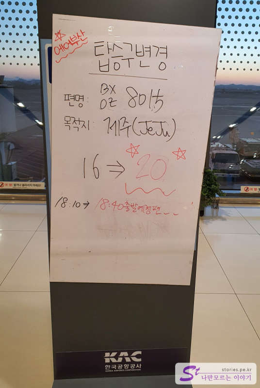

So we started the schedule about 2 to 3 hours later than the schedule, but it's a short schedule of 1 night and 2 days, so it's very fatal for us That's it.

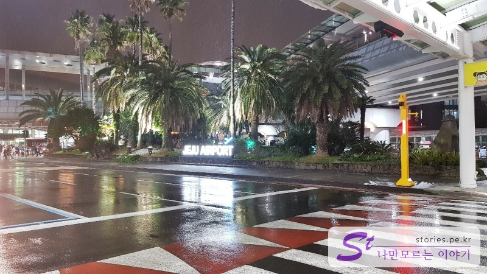

As soon as I arrived at Jeju Airport, I immediately moved to the rental car rental office without thinking about anything else, took over the rental car, and headed to the accommodation I booked in Jeju City first.

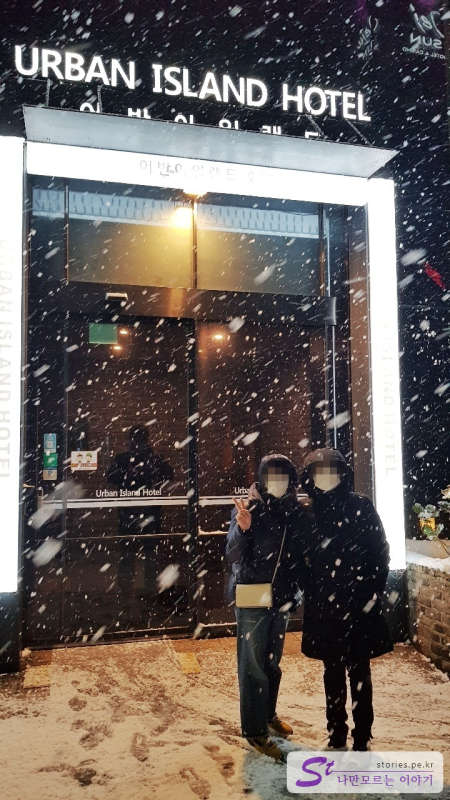

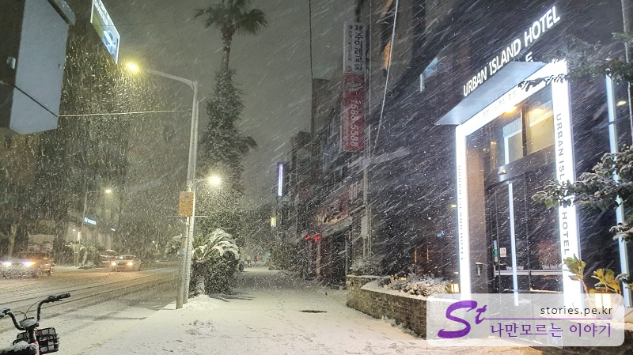

The accommodation we stayed at was **Urban Island Hotel**, and we could use clean accommodation at a reasonable price, so it was very cost-effective.

ㅠ 저녁에 I arrived too late in the evening and the restaurant was closed due to COVID-19, and as the meal schedule that I had reserved disappeared, I had a convenience store meal.

Fortunately, the hotel didn't make much of a problem, so I could barely eat. This is also a memory, consoling... I swallowed my tears. The food at the convenience store tasted good. (Reading the lyrics)

## a itinerary

It's a very short schedule of the day.

- [07:30] Departure from Urban Island Hotel
- [08:00] Breakfast: Chaebol Restaurant
- [09:30] Saebyeol Oreum
- [11:30] Panpo Breakwater
- [12:00] Singaemul
- [13:00] Lunch: Hyeopjae Suudong
- [15:00] Wolryeong-ri Cactus Village
- [17:00] Yongyeon
- [18:00] Dinner: JinJin Noodles
- [19:00] Departure to the airport

### Breakfast: Chaebol Restaurant

Since there is only one day to travel to Jeju, I woke up early at 7 o'clock, prepared, and moved to a chaebol restaurant to have breakfast. It's good for breakfast because you can eat from 8 a.m.

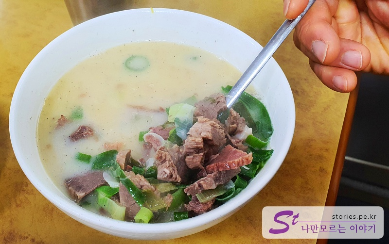

It's an old building, but it's a restaurant in a residential and commercial complex. There is only one **bomtang** as a single menu. The price is 15,000 won per person, which is evil, but it has a lot of meat, no smell, and tastes good, so it's worth a try when you come on a trip.

> [[Jeju's famous restaurant] [Shortcut to Jeju's chaebol restaurant](https://blog.stories.pe.kr/559)

### Saebyeol Oreum that I've been up to in winter

I had a good breakfast and headed to Saebyeol Oreum. In fact, the original schedule was Eoseungsaengak Trail, but I couldn't go because the roads were blocked due to heavy snow. I hurried to 981 Park for my next destination, but it snowed heavily here too. Not running... What is this...

I had no choice but to go to **Saebyeol Oreum**. Fortunately, it was out of control here, so I was able to arrive almost first. There's no one It's our first time today

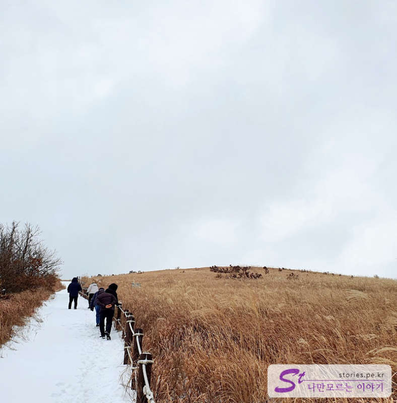

> [A place to see in Jeju] [Shortcut to Saebyeol Oreum in winter](https://blog.stories.pe.kr/562)

### Panpo breakwater

If you plan **Hyeopjaesu Udon** for lunch, you should make a reservation about 1 to 3 hours in advance. It's such a popular restaurant... We also made a reservation in Hyeopjae Suu-dong right after coming down from Saebyeol Oreum and went to Singaemul while waiting. On the way, I stepped out of the car for a moment because there was a pretty breakwater called **Panpo Breakwater**.

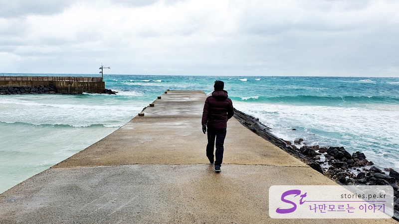

It's like a small breakwater in Jumunjin, Gangneung in the drama **Guardian** starring Gong Yoo. Jeju is much better for sea color.

### Singemul Park, where you can see the world's beautiful wind power generators

**Singemul** means **newly discovered tidal water**, and tidal water means spring water. Come to think of it, I imagine that it was created because haenyeo and haenam, who came back from work in salty water in the past, were good to wash up and come out of the fresh water, Yongcheonsu. There are also men's and women's baths here.

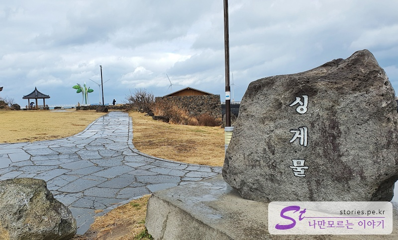

The scenery along the 30-minute trail from Singemul Park is truly amazing.

Check it out in the article below.

> [Shortcut to the world's most beautiful Singemul Park](https://blog.stories.pe.kr/563)

### Enjoy your lunch at Hyeopjae Suudong

As I said above, you have to be prepared to wait for about 1 to 3 hours to eat in Suudong. He's so popular.

We also made a reservation in Hyeopjae Suu U-dong first and went to Singemul Park while waiting.

I live alone in Hyeopjae Suu-dong, etc. It became well known when it was aired, so it became a place where many people visit. Of course, the food tastes really good. Biyangdo Island, which you can see through the window from the restaurant, is also a reminder that this is Jeju. It's a restaurant that fits three beats with taste, popularity, and scenery.

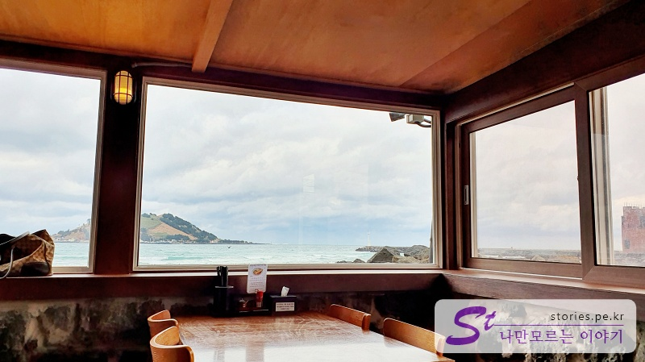

> [Shortcut to Enjoy Lunch in Hyeopjae's Suudong](https://blog.stories.pe.kr/560)

### Wolryeong-ri Cactus Village is good for a walk

I had lunch at Hyeopjae Suu-dong and went to Cactus Village nearby. Cactus Village isn't a big deal, but it's a place where you can take a walk while walking on the deck along the beach. Maybe it's because it's winter, but the cactus is not pretty, and it was just an impression that there was a cactus. It was also tasteful to drink centennial vinegar juice at the cafe at the end of the promenade to avoid the wind and cold.

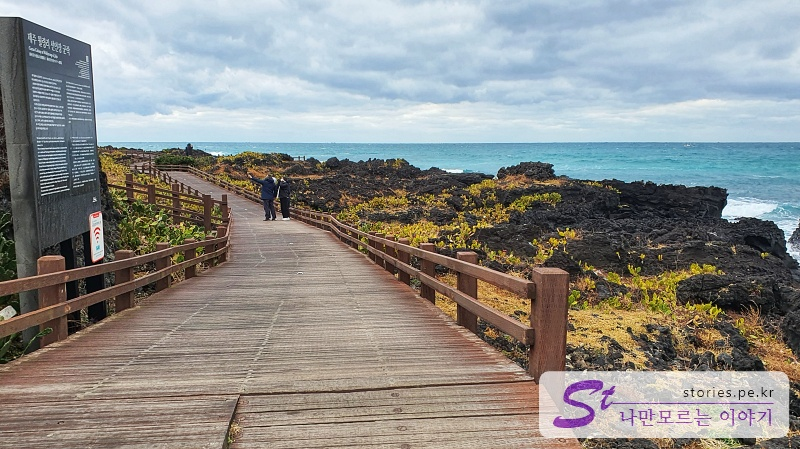

[[Jeju trip] Going straight to Wolryeong-ri Cactus Village, which is good for a walk](https://blog.stories.pe.kr/564)

### Yongyeon, who is said to have ascended to heaven

Finally, we moved to Yongyeon near Jeju Airport. It's not far from Woryeong-ri to Yongyeon, but it took longer than I thought maybe because of the traffic jam.

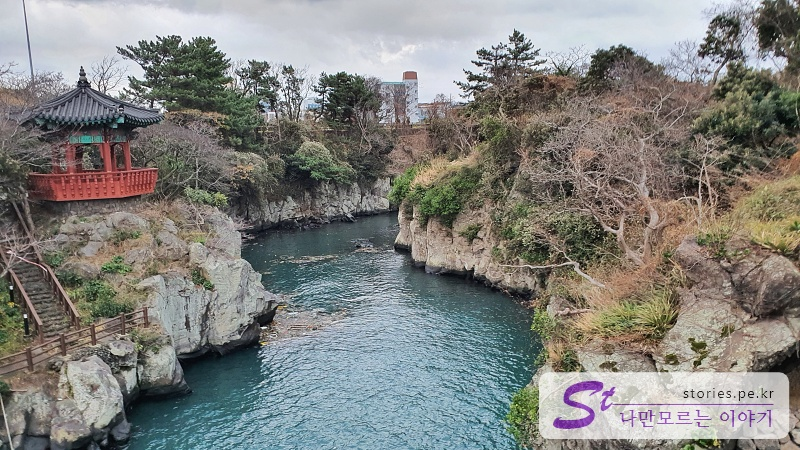

It's near the airport, so if you have time before getting on the plane, it's worth a short trip. It's a place where fresh water and sea water meet.

### JinJin's restaurant where meat noodles and sea bream meat are delicious

Lastly, we decided to have dinner at a restaurant introduced by a person who lives in Jeju Island before boarding the plane departing for the land. Jeju is famous for its meat noodles, but this place is cheap, has a lot of portions, and has a good taste.

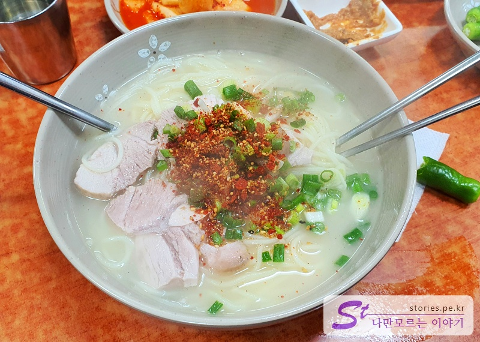

They were so generous that they gave me 30 tangerines when I left. I told you to eat while you go. Of course, I think the tangerine was cheap because it was a winter tangerine, but it was delicious and good.

It takes about 10 to 15 minutes from the restaurant to Jeju Airport. We have now moved to the airport to catch the evening flight.
