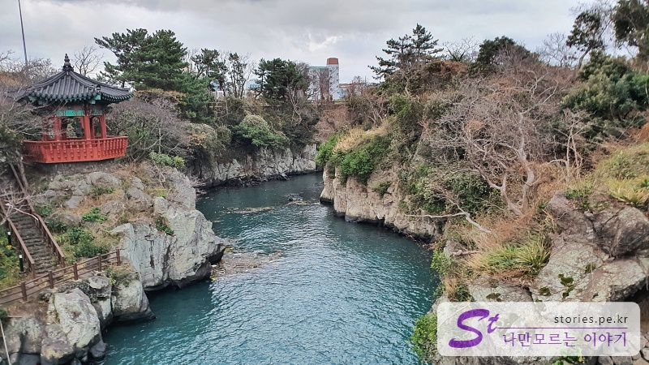
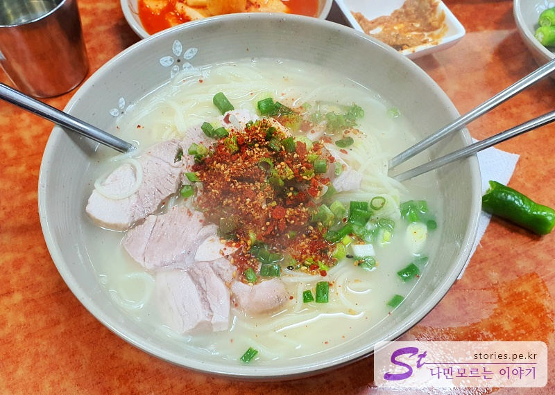

성탄절이 지나고 바로 26일에 저녁 비행기를 타고 제주도로 날아갔습니다. 1박 2일 아주 짧게 다녀오는 일정이라 제주시, 애월 쪽으로 짧고 알차게 일정을 잡아서 다녀왔습니다.

마침 그날 제주도에 눈이 많이 와서 10여 대가 결항이 되고 밀리면서 난리가 아니었습니다. 저희도 1시간 정도 늦게 비행기를 탔고 제주공항 상공에서 30분 이상 회전하며 대기하다가 겨우 착륙을 했습니다.

그래서 일정보다 2~3시간 정도 늦게 일정을 시작했는데, 1박 2일이라는 짧은 일정이라 저희에게는 아주 치명적? 이였습니다.

제주공항에 도착하자마자 딴생각도 못하고 바로 렌터카 대여소로 이동했고 렌터카를 인수하고 먼저 제주시에 잡아놓은 숙소로 향했습니다.

저희가 묵었던 숙소는 **Urban Island Hotel**이었는데, 저렴한 가격에 깨끗한 숙소를 이용할 수 있어서 가성비가 상당히 좋았습니다.

ㅠㅠ 저녁에 너무 늦게 도착하고 코로나로 인해 식당은 문을 닫으면서 잡아놨던 식사 일정이 사라지면서 편의점 식사를 하게 되었습니다.

다행히 호텔에서 크게 문제 삼지 않아서 겨우 식사를 할 수 있었습니다. 이것도 하나의 추억이라고 위로하면서.. 눈물을 삼켰습니다. ㅠㅠ (나름 편의점 음식도 맛이 좋았.. 또록~)

## 여행 일정

하루의 아주 짧은 일정입니다.

- [07:30] 숙소 Urban Island Hotel 출발
- [08:00] 아침식사 : 재벌식당
- [09:30] 새별오름
- [11:30] 판포방파제
- [12:00] 싱게물
- [13:00] 점심 식사 : 협재 수우동
- [15:00] 월령리 선인장 마을
- [17:00] 용연
- [18:00] 저녁식사 : 진진국수
- [19:00] 공항으로 출발

### 아침식사 : 재벌식당

제주여행이 하루밖에 없기 때문에 7시에 일찍 일어나 준비하고 아침식사를 하기 위해 재벌 식당으로 이동했습니다. 아침 8시부터 식사를 할 수 있기 때문에 아침식사를 하기 좋습니다.

오래된 건물이지만 나름 주상복합아파트에 있는 식당입니다. 메뉴는 단일 메뉴로 **곰탕** 하나만 존재합니다. 가격이 1인분에 15,000원으로 사악하지만 고기도 많고 냄새도 안 나고 맛도 좋아서 여행 와서 한번 먹어볼만합니다.

> [[제주 맛집] 곰탕으로 유명한 제주 재벌 식당 바로 가기](https://blog.stories.pe.kr/559)

### 겨울에 올라가 본 새별 오름

아침을 든든히 먹고 새별 오름으로 향했습니다. 사실 원래 일정은 어승생악 탐방로였는데 폭설로 인해 도로가 통제되는 바람에 가지 못하게 되었습니다. 부랴부랴 다음 행선지로 981파크로 향했으나 여기도 폭설로.. 운행 안 함.. ㅠㅠ 뭐야.....

어쩔 수 없이 **새별 오름**으로 갔습니다. 다행히 여기는 통제가 되지 않아서 거의 1등으로 도착을 할 수 있었습니다. 아무도 없어~ 오늘은 우리가 처음이야~

> [[제주가 볼만한 곳] 겨울에 올라가 본 새별 오름 바로 가기](https://blog.stories.pe.kr/562)

### 판포 방파제

점심으로 **협재수우동**을 계획했다면 대략 1~3시간 전에 먼저 예약을 해야 합니다. 너무 인기 식당이라... 저희도 새별 오름에서 내려와서 바로 협재 수우동에 예약을 걸어놓고 기다리는 동안 싱게물을 다녀왔습니다. 가는 길에 **판포 방파제**라고 배경이 이쁜 방파제가 있어서 잠시 차에서 내려봤습니다.

마치 공유 출연의 드라마 **도깨비**에 나오는 강릉 주문진의 작은 방파제가 연상되는 장소입니다. 바다색은 제주가 훨씬 좋고요..

### 세상 너무 이쁜 풍력발전기가 보이는 싱게물 공원

**싱게물**은 **새로 발견한 갯물**이라는 의미이며 갯물은 용천수를 의미한다고 합니다. 생각해 보면 옛날에 짠물에서 일을 마치고 돌아오는 해녀, 해남 분들이 민물인 용천수에서 씻고 나오기 좋아서 생긴 곳이 아닐까 상상해 봅니다. 마침 여기에 남자, 여자 목욕탕도 존재하고요.

싱게물 공원에서 30분 정도 소요되는 탐방로를 따라 걸으면서 보는 풍경은 정말 압권입니다.

아래 글에서 확인해 보세요.

> [세상 너무 이쁜 싱게물 공원 바로 가기](https://blog.stories.pe.kr/563)

### 협재 수우동에서 점심 식사 맛있게 먹기

위에서도 말씀을 드렸지만 수우동에서 식사를 하려면 대략 1~3시간 정도는 대기할 각오를 해야 합니다. 워낙 인기가 좋아서...

저희도 먼저 협재수우동에 예약을 걸어놓고 기다리는 시간 동안 싱게물공원에 다녀온 것입니다.

협재 수우동은 나 혼자 산다 등.. 방송에 방영이 되면서 많이 알려졌고 그래서 사람들도 많이 찾는 곳이 되었습니다. 물론 음식 맛도 상당히 좋은 편이고요. 또한 식당에서 창문을 통해 바라다 보이는 비양도는 여기가 제주라는 것을 다시 한번 상기시켜주는 요소이기도 합니다. 말하자면 맛, 인기, 경치로 3박자가 맞아떨어지는 식당입니다.

> [협재 수우동에서 점심 맛있게 먹기 바로 가기](https://blog.stories.pe.kr/560)

### 산책하기 좋은 월령리 선인장 마을

협재 수우동에서 점심 식사를 하고 가까이에 있는 선인장 마을에 다녀왔습니다. 선인장 마을이라고 대단한 건 아니지만 바닷가를 따라 놓여 있는 데크를 걸으면서 산책을 할 수 있는 곳입니다. 겨울이라 그런지 선인장이 이쁘지는 않고, 그냥 선인장이 있구나 정도의 감흥이었습니다. 산책로 끝에 있는 카페에서 바람과 추위를 피하면 마시는 백년초 주스를 먹는 것도 나름 운치가 있었습니다.

[[제주 여행] 산책하기 좋은 월령리 선인장 마을 바로가기 ](https://blog.stories.pe.kr/564)

### 용이 승천했다고 하는 용연

이제 마지막으로 제주공항 근처에 있는 용연으로 이동했습니다. 월령리에서 용연까지는 거리가 멀지는 않은데, 차가 막혀서 그런지 생각보다 시간이 많이 걸렸습니다.

공항 근처에 있어서 비행기 타기 전 시간이 남는다면 잠깐 다녀올만합니다. 민물과 바닷물이 만나는 장소입니다.

### 지인 소개로 알게 된 고기 국수와 돔배고기가 맛있는 진진 식당

마지막으로 육지로 출발하는 비행기를 타기 전에 제주도에 사시는 분이 소개해 주신 식당에서 저녁을 먹기로 하였습니다. 제주하면 고기 국수로 유명한데, 이곳은 로컬 식당 분위기로 가격도 싸고 양도 많고 맛도 좋았습니다.

인심이 너무 좋아서 밥 먹고 나갈 때 귤을 30개 가랑 주셨습니다. 먹으면서 가라고.. 물론 겨울철 노지 귤이라 귤이 싸서 주시긴 한 것 같은데, 나름 맛있고 좋았습니다.

식당에서 제주공항까지 대략 10분~15분 정도입니다. 우리도 이제 저녁 비행기를 타러 공항으로 이동하였습니다.
