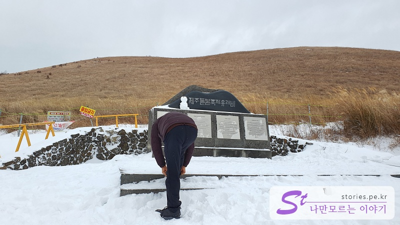
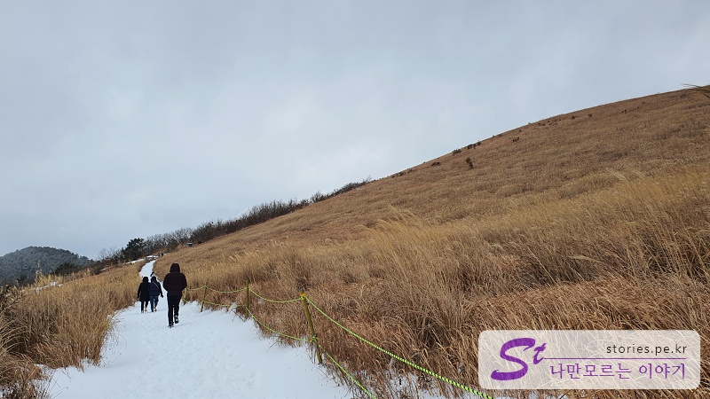
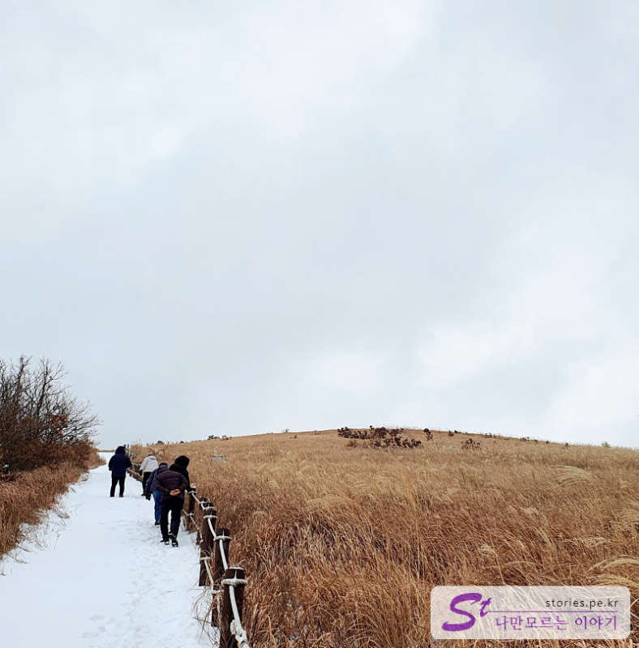
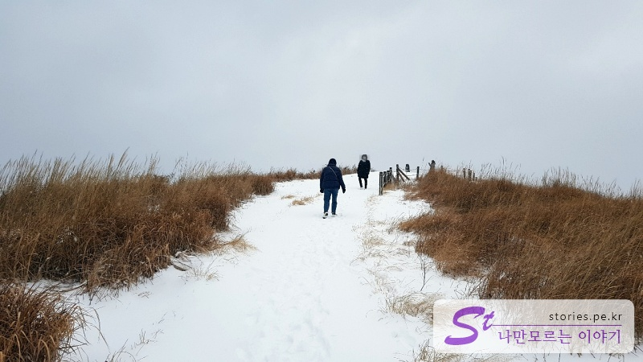
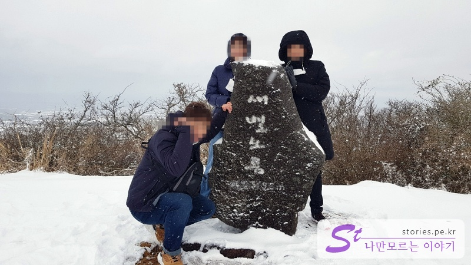
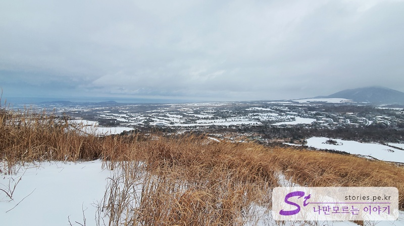
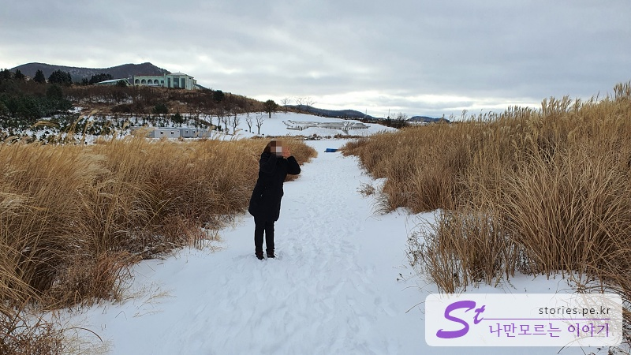

> [[Jeju trip] Short trip to Jeju Island for 2 days and 1 night](http://junistory.blogspot.com/2022/11/jeju-trip-short-and-fruitful-trip-to.html)

I had a good breakfast and headed to Saebyeol Oreum. In fact, the original schedule was Eoseungsaengak Trail, but I couldn't go because the roads were blocked due to heavy snow. I hurried to 981 Park for my next destination, but it snowed heavily here too. Not running... What is this...

I had no choice but to go to **Saebyeol Oreum**. Fortunately, it was out of control here, so I was able to arrive almost first. There's no one It's our first time today

I visited last fall and gave up because there were so many people, but this time I came when there were no people. Actually, this is the only place I can go urgently because of the heavy snow.Hahaha

It's time to go up. It's a course where you tie your shoelaces tightly and go up to the origin monument of the Wild Fire Festival and come down to the opposite side.

It's a road that walks up the snow in harmony with reeds. The combination of snow and reeds is wonderful. It's not hard until now.

Now we have to go up the Saebyeol Oreum. This is the beginning of the difficulty.

Now we've passed a difficult section and arrived at the ridge. The only thing left is to appreciate the scenery.

There is a signpost to certify that you have arrived at the top. If you're Korean, you should take a picture at a place like this at least once.

Now we're on our way down the other way. The scenery here is so beautiful, too. I can see Everis CC in the distance.

The way down is also slippery snow. It's a nice squeeze on the way down.

I'll try it once.

I've done this before.

If you come in winter, there are not many people and it's good to take pictures, so I recommend a winter trip.

## Travel destination information

- Address: San 59-8, Bongseong-ri, Aewol-eup, Jeju-si
- Contact number: 064-740-6000
- - URL : https://www.visitjeju.net/kr/detail/view?contentsid=CONT_000000000500309

<iframe src='https://www.google.com/maps/embed?pb=!1m18!1m12!1m3!1d13328.782217397391!2d126.34768523853216!3d33.365960313739954!2m3!1f0!2f0!3f0!3m2!1i1024!2i768!4f13.1!3m3!1m2!1s0x350c592ebfc92321%3A0xb173dbb86962eaf7!2z7IOI67OE7Jik66aE!5e0!3m2!1sko!2skr!4v1643447541819!5m2!1sko!2skr' class='embed-responsive-item' allowfullscreen></iframe>

## Parking information

The parking lot is very spacious and free. It is not only used as a parking lot, but also used as a venue for festivals.

## a good neighborhood restaurant

Hyeopjae Water udon
