> [[제주 여행] 겨울에 짧고 알차게 다녀온 1박 2일 제주도 여행 바로 가기](https://blog.stories.pe.kr/561)

아침을 든든히 먹고 새별 오름으로 향했습니다. 사실 원래 일정은 어승생악 탐방로였는데 폭설로 인해 도로가 통제되는 바람에 가지 못하게 되었습니다. 부랴부랴 다음 행선지로 981파크로 향했으나 여기도 폭설로.. 운행 안 함.. ㅠㅠ 뭐야.....

어쩔 수 없이 **새별 오름**으로 갔습니다. 다행히 여기는 통제가 되지 않아서 거의 1등으로 도착을 할 수 있었습니다. 아무도 없어~ 오늘은 우리가 처음이야~

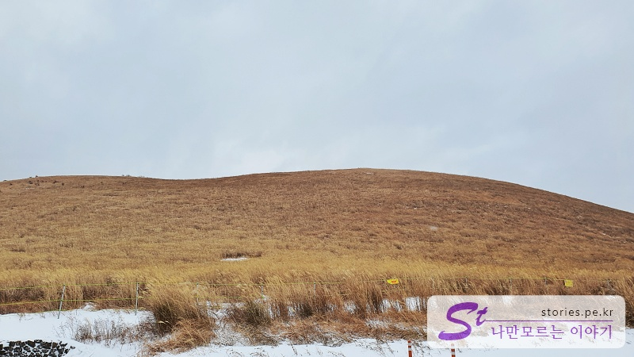

지난가을에 방문했다가 사람들이 너~무 많아서 포기하고 돌아갔었는데, 이번에는 사람이 없을 때 와봤습니다. 사실 폭설로 긴급히 갈 수 있는 곳이 여기밖에 없어서..ㅎㅎㅎ

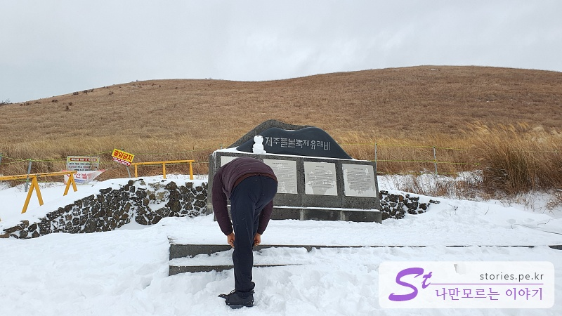

이제 올라갈 시간입니다. 신발 끈 단단히 묶고 들불축제 유래비로 올라가서 반대쪽으로 내려오는 코스입니다.

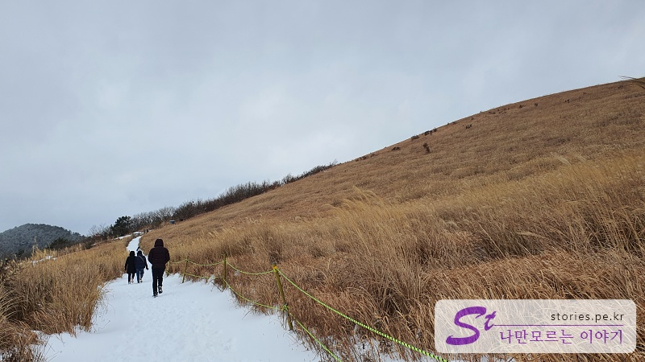

갈대와 어우러진 눈길을 걸어 올라가는 길입니다. 눈과 갈대의 어우러짐이 정말 멋집니다. 이때까지는 힘들지 않습니다.

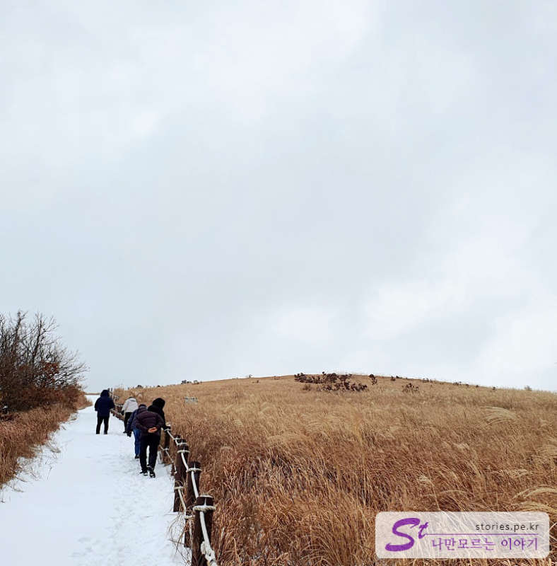

이제 새별 오름을 올라가야 합니다. 이때부터가 힘듦의 시작입니다.

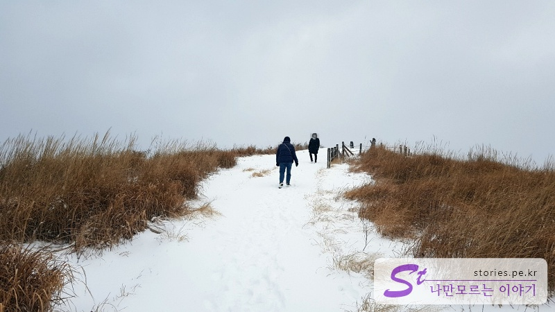

이제 힘든 구간을 지나 능선 쪽에 도착을 했습니다. 이제 풍경을 감상할 일만 남았습니다.

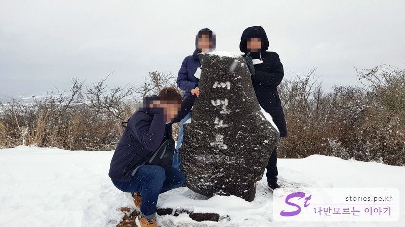

정상에 도착한 것을 인증할 수 있는 표지석이 있습니다. 한국 사람이라면 이런 데서 한 번은 찍어 줘야지요..

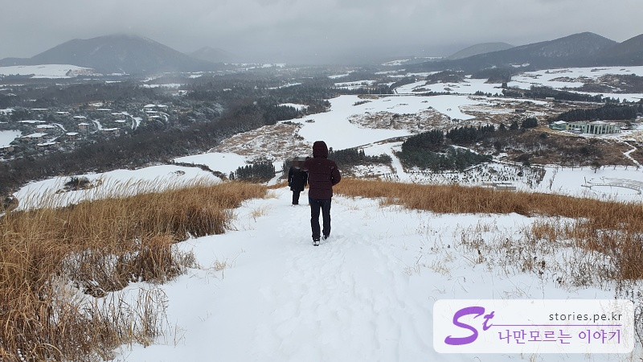

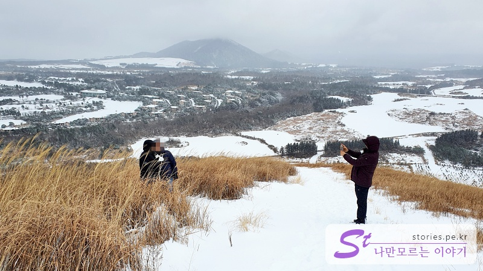

이제 반대쪽으로 내려오는 길입니다. 여기도 역시 풍경이 너무 아름답습니다. 멀리 에버리스 CC가 보이네요.

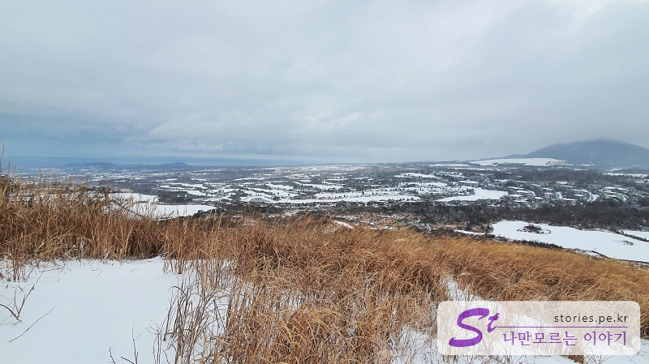

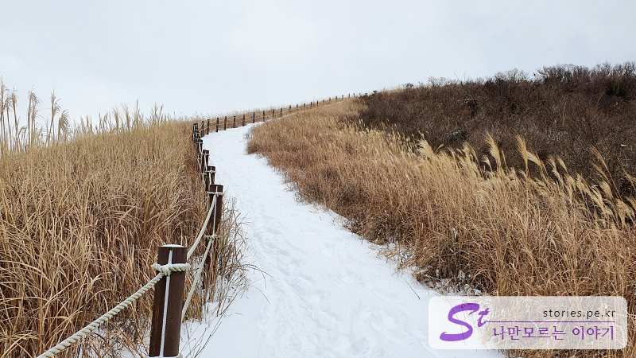

내려오는 길도 역시 미끄러운 눈길입니다. 내려오다 한번 멋지게 짜빠졌네요..

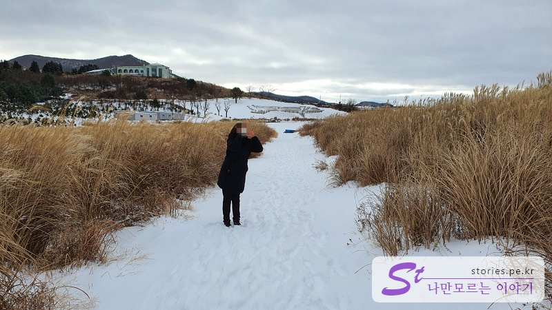

오겡끼데스까~ 도 한번 해보고...

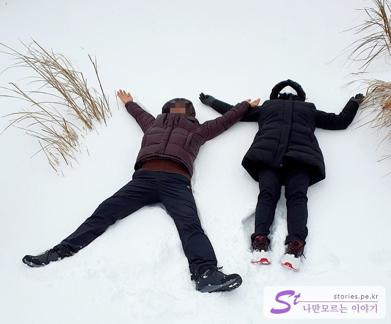

이런 것도 한번 해봤어요.

겨울에 오면 사람도 많지 않고 사진찍기도 좋아서 겨울 여행 추천합니다.

## 여행지 정보

- 주소 : 제주 제주시 애월읍 봉성리 산59-8
- 연락처 : 064-740-6000
- URL : https://www.visitjeju.net/kr/detail/view?contentsid=CONT_000000000500309

<iframe src='https://www.google.com/maps/embed?pb=!1m18!1m12!1m3!1d13328.782217397391!2d126.34768523853216!3d33.365960313739954!2m3!1f0!2f0!3f0!3m2!1i1024!2i768!4f13.1!3m3!1m2!1s0x350c592ebfc92321%3A0xb173dbb86962eaf7!2z7IOI67OE7Jik66aE!5e0!3m2!1sko!2skr!4v1643447541819!5m2!1sko!2skr' class='embed-responsive-item' allowfullscreen></iframe>

## 주차정보

주차장은 매우 넓으며 무료입니다. 주차장으로만 사용한지 않고 축제의 공간으로도 활용됩니다.

## 인근맛집

협재 수우동
