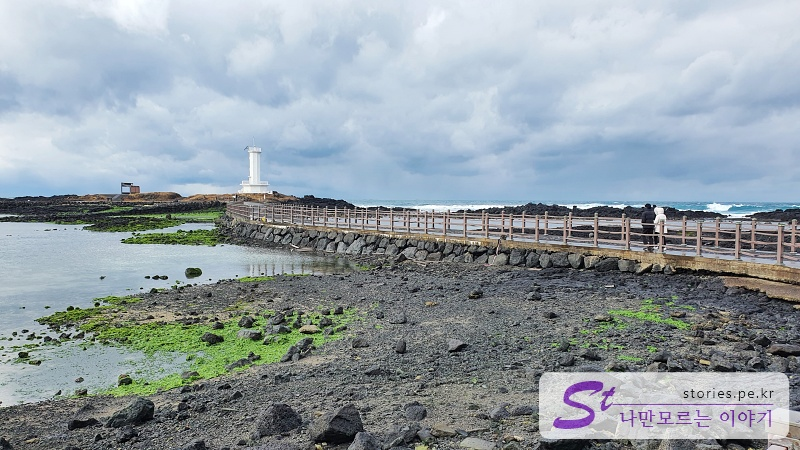
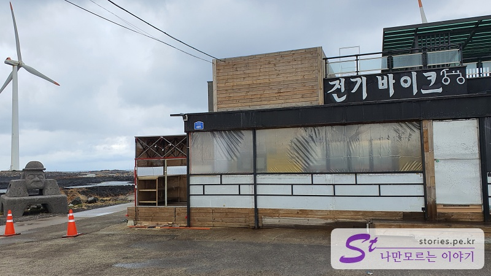

> [[제주 여행] 겨울에 짧고 알차게 다녀온 1박 2일 제주도 여행 바로 가기](https://blog.stories.pe.kr/561)

**싱게물**은 **새로 발견한 갯물**이라는 의미이며 갯물은 용천수를 의미한다고 합니다. 생각해 보면 옛날에 짠물에서 일을 마치고 돌아오는 해녀, 해남 분들이 민물인 용천수에서 씻고 나오기 좋아서 생긴 곳이 아닐까 상상해 봅니다.

제주도에 정말 여러번 왔었는데 이런곳이 있을 줄은 몰랐습니다. 정말 제주도는 숨겨진 멋진 장소가 엄청 많은것 같습니다.

  
공원 앞에 주차를 하고 싱게물 공원으로 들어서면 정자를 기준으로 짧게 돌아 볼 수있습니다. 이곳에는 싱게물의 용도로 사용되는 남여 야외 목욕탕이 있습니다.

  
남자 목용탕이지만 지금은 겨울이라 그런지 물이 없지만 그외의 계절에는 용천수가 나오겠지요?

싱게물 공원의 핵심은 공원 자체라기보다는 공원을 끼고 도는 30분 정도의 탐방로입니다. 탐방로를 따라 걸으면서 보는 풍경은 정말 압권입니다.

공원에서 행길을 따라 아랫쪽으로 가다 보면 국제풍력센터의 입구를 볼 수 있습니다. 입구에 들어가라는 것이 아니고 그 입구를 지나서 좁은 길로 가시면 됩니다.

  
  
이 길을 따라 바다쪽으로 걸어갑니다. 멀리 풍력발전기가 보이기 시작합니다.

  
바다를 따라 깨끗이 정비가된 길이 보입니다. 사방이 바다로 되어 있어서 풍경이 너무 좋습니다.

  
오른쪽으로 나열되어 있는 풍력발전기를 볼 수 있습니다. 굉장히 이국적인 화면이네요.

  
조금 더 걷다보면 풍력발전기와 연결된 다리를 만나게 됩니다. 다리 입구정도에 다가서면 다금바리를 만나게 됩니다.

다리 옆으로 다금바리 조형물을 만날 수 있습니다. 다금바리는 제주도에서 잡히는 매우 비싼 물고기라고 하네요.

  
다리는 사람이 건널 수 있는 작은 다리로 되어 있습니다.

  
다리를 건너서 다시 풍력발전기를 보면 또다른 풍경이 보입니다. 바다색과 어우러 지는 모습이 너무 이국적입니다.

  
좀 더 걸아가다보면 하얀 등대를 볼수 있습니다.

  
등대를 바라보고 찍어보면 인생샷을 남길 수 있습니다.

  
등대의 앞쪽에는 바다물을 가두어 놓은 작은 뚝이 있습니다. 이쪽의 길도 풍력발전기와 멋지게 어우러지는 화면을 보여 줍니다.

  
이제 제주 해녀의 동상이 나오면 거의 한바퀴를 돌았다고 보시면 됩니다. 옛날에는 이분들이 싱게물에서 목욕을 하셨겠지요?

  

이렇게 돌하루방이 있는 전기바이크 대여소가 나온다면 이제 한바퀴 모두 돌은 것입니다.

## 여행지 정보

- 주소 : 제주 제주시 한경면 신창리 1322-1
- URL : https://www.visitjeju.net/kr/detail/view?contentsid=CNTS_000000000020871
- 

  <iframe src='https://www.google.com/maps/embed?pb=!1m18!1m12!1m3!1d3333.0511924911566!2d126.17171021549093!3d33.34361236218568!2m3!1f0!2f0!3f0!3m2!1i1024!2i768!4f13.1!3m3!1m2!1s0x350c65d8567e2283%3A0xe87b65010941b011!2z7Iux6rOE66y86rO17JuQ!5e0!3m2!1sko!2skr!4v1643461448528!5m2!1sko!2skr' class='embed-responsive-item' allowfullscreen></iframe>
  

## 주차정보

주차장은 인근 무료 주차장이 있습니다.
