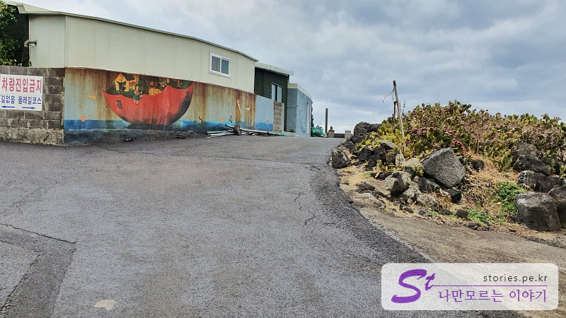
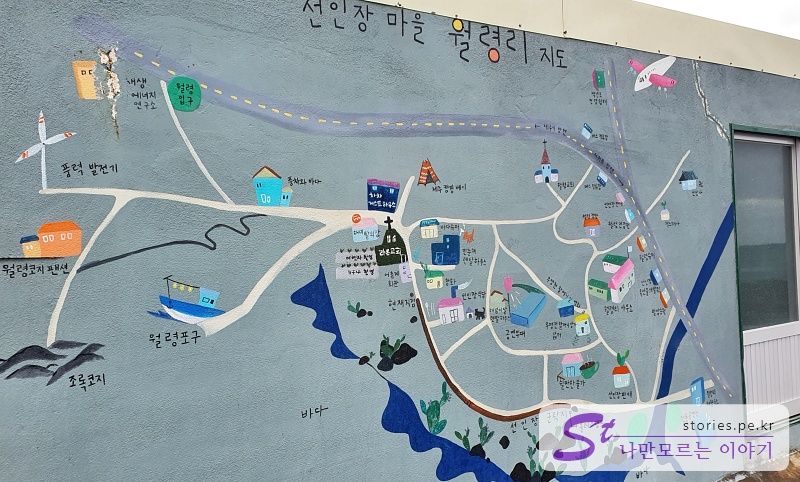
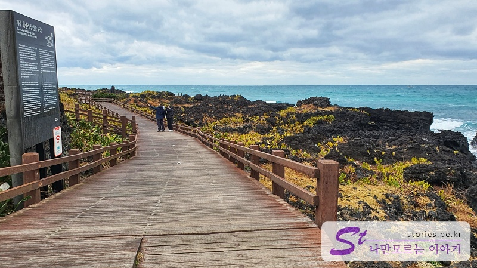
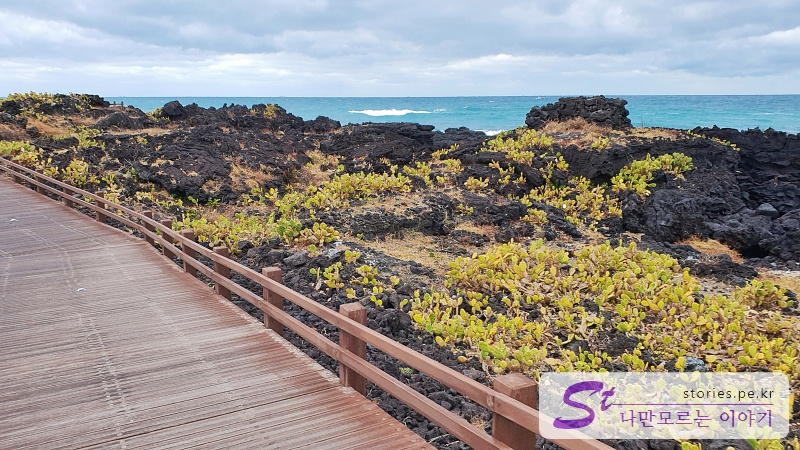
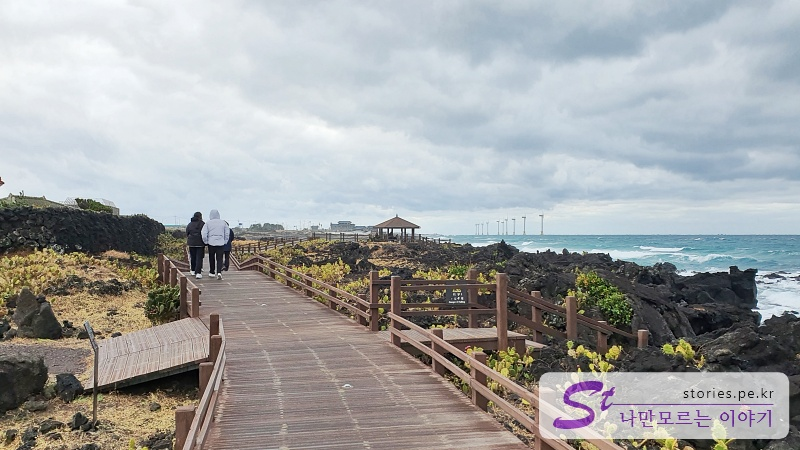
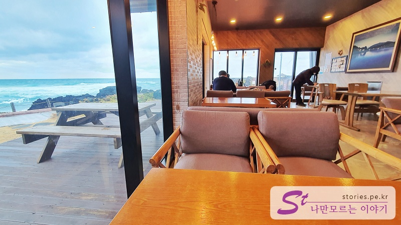
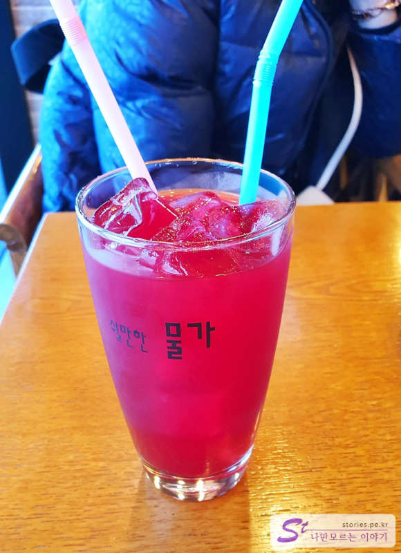
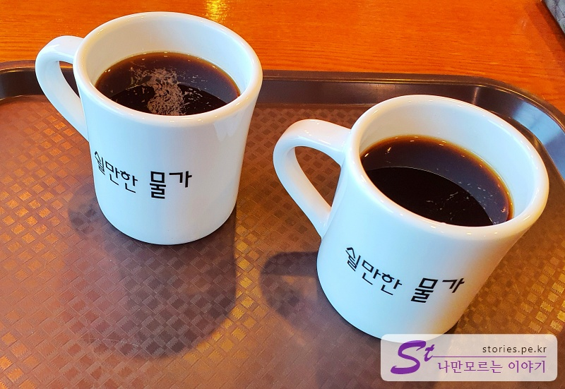

> [[Jeju trip] Short trip to Jeju Island for 2 days and 1 night](http://junistory.blogspot.com/2022/11/jeju-trip-short-and-fruitful-trip-to.html)

It is Wolryeong-ri Cactus Village where you can make a reservation in Hyeopjae Suu-dong and look around when you have time. You can go eat and digest.

Park in the village for a while, walk around Raon Church, and walk toward the Olle Trail course.

The brown line on the map above is the walking course.

These decks are connected to the end of the trail, so it's not uncomfortable to walk. There are cactus on both sides of the deck, but it's not that pretty because it's winter.

It's called a cactus. Cactus isn't pretty.

Still, it is very good to walk while looking at the sea.

When you arrive at the end of the deck in the cold sea breeze, you will see a small cafe called the water to rest. The coffee you drink while feeling safe and comfortable while looking outside the cold wind through the big window is excellent.

The main menu is centennial juice extracted from centennial cactus.

Of course, there's coffee.

## Travel destination information

- Address: Wolryeong-ri, Hallim-eup, Jeju-si

<iframe src='https://www.google.com/maps/embed?pb=!1m18!1m12!1m3!1d990.5346745524093!2d126.21480568023884!3d33.377638520416845!2m3!1f0!2f0!3f0!3m2!1i1024!2i768!4f13.1!3m3!1m2!1s0x350c66d468acb3db%3A0xa615dcdff904923e!2z7JuU66C5IOyEoOyduOyepSDqtbDrnb3sp4A!5e0!3m2!1sko!2skr!4v1643882849970!5m2!1sko!2skr' class='embed-responsive-item' allowfullscreen></iframe>

