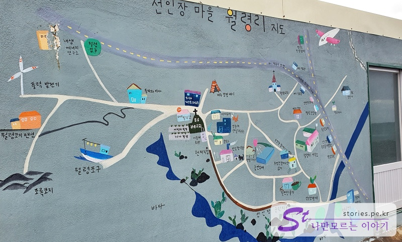
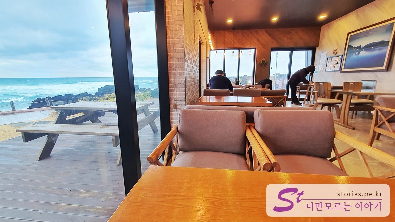

> [[제주 여행] 겨울에 짧고 알차게 다녀온 1박 2일 제주도 여행 바로 가기](https://blog.stories.pe.kr/561)

협재 수우동에 예약을 걸어놓고 잠시 시간이 났을 때 돌아볼 수 있는 월령리 선인장 마을입니다. 식사를 하고 소화도 시킬 겸 다녀와도 좋고요.

잠시 마을에 주차를 하고 라온교회를 끼고돌아 올레길 코스 방향으로 걸어가면 됩니다.

위의 지도에서 갈색선이 산책코스입니다.

이런 데크가 산책길 끝까지 이어져 있어서 걸어가기에 불편하지 않습니다. 데크 양옆으로 선인장들이 즐비한데 겨울이라 그런지 별로 이쁘지는 않습니다.

이게 선인장이라고 하는데.. 선인장이 이쁘지는 않네요.

그래도 바다를 보며 걷기에는 아주 좋습니다.

차가운 바다 바람을 맞으며 데크의 마지막 부분에 도착을 하면 쉴만한 물가라는 작은 카페가 보입니다. 큰 창을 통해 찬바람이 엄청 부는 바깥을 보며 안전하고 편안함을 느끼면서 마시는 커피가 일품입니다.

주메뉴는 백년초 선인장에서 추출한 백년초 주스를 맛볼 수 있습니다.

물론 커피도 있고요.

## 여행지 정보

- 주소 : 제주 제주시 한림읍 월령리

<iframe src='https://www.google.com/maps/embed?pb=!1m18!1m12!1m3!1d990.5346745524093!2d126.21480568023884!3d33.377638520416845!2m3!1f0!2f0!3f0!3m2!1i1024!2i768!4f13.1!3m3!1m2!1s0x350c66d468acb3db%3A0xa615dcdff904923e!2z7JuU66C5IOyEoOyduOyepSDqtbDrnb3sp4A!5e0!3m2!1sko!2skr!4v1643882849970!5m2!1sko!2skr' class='embed-responsive-item' allowfullscreen></iframe>

