> [[A place to visit in Ulsan and Pohang] Shortcut to the key points of their trip to Ulsan and Pohang](http://junistory.blogspot.com/2022/11/a-place-worth-visiting-in-ulsan-and.html)

The first destination of this trip to Ulsan is Amethyst Cave Country. Originally, it was a mine that digs the crystal, but it was decorated as a tourist destination when it was abandoned. The parking lot is large, there is a Viking, and there is a small amusement park. It is said that there is even a sledding slope in winter, so I don't think it's a place where you only go to see caves.

## the mouth of a cave

We went straight to the cave because there were no children.

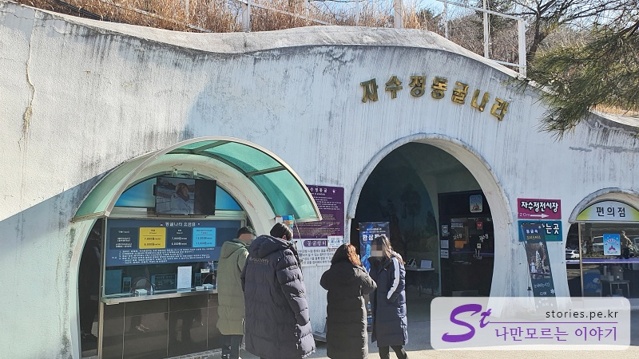

The entrance to the cave has an atmosphere full of traces of time. I don't think I can come out if I go in, but it's okay. It feels different when you go in.

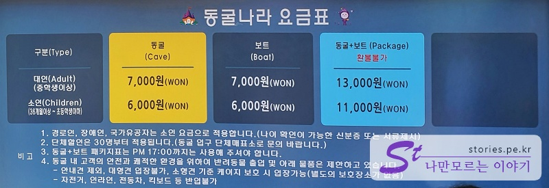

There are tickets to just go around the cave, and there are tickets to use the cave and boat together. If you don't mind, I recommend buying a cave + boat. It feels like I've done something before riding a boat

We also bought a cave+boat package. I'm looking forward to it.

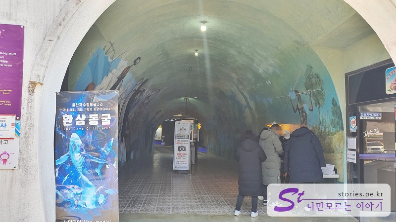

The entrance looks a little shady, but it's not that shady when you go in.

### a guide map of a cave

As soon as you enter, you will encounter a cave map. We rode the boat in the direction of the observatory first. And I passed the dinosaur cave and moved to the right, saw the square and the amethyst exhibition hall, and I passed the Sowon cave and the Media Art Hall.

## a boat ride

Boating is the most active activity in Amethyst Cave. It's right at the entrance, so there's no difficulty in finding it. Children can ride it, too.

If you wait for a while, the boat will come. It can accommodate about 10-15 people at a time and seems to be exploring for about 5-7 minutes. The driver explains by pointing a lantern to the amethyst embedded everywhere.

### a dinosaur cave

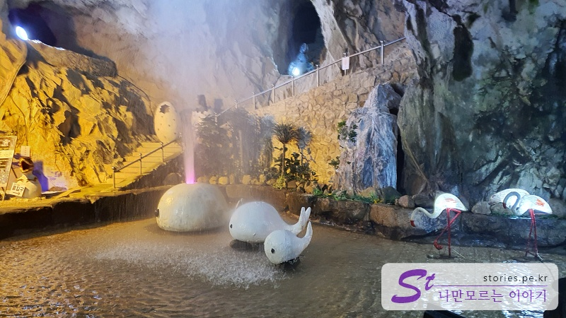

I took a boat and walked around the cave and looked around. If you walk a little further, you can see a very cute whale statue. It's very cute. This is the dinosaur cave. Boys will especially like it, but we just passed because we're adults

If you go to the left, it's Media Center, and if you go to the right, it's Amethyst We headed towards the amethyst.

There is a well-decorated space on the way. The blue bamboo in the gray cave is under blue light, so it looks quite exotic.

### an amethyst exhibition hall

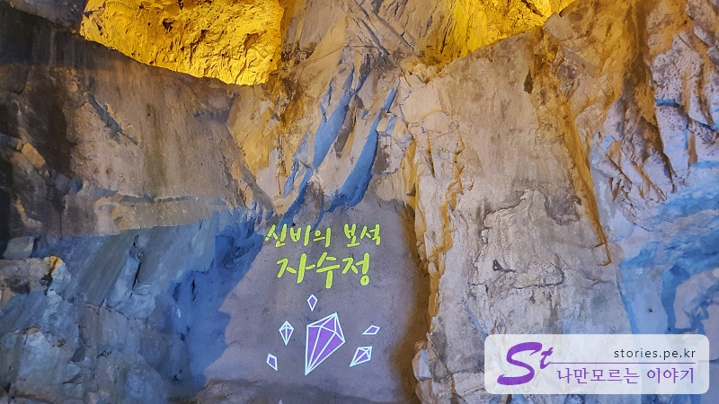

A little later, you'll see a mysterious \*\*jewel amethyst.

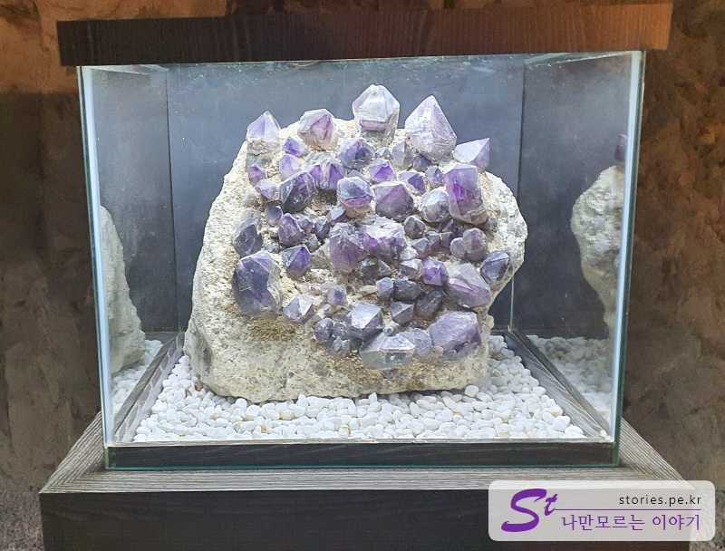

I only took one picture, but I displayed these amethyst gemstones.

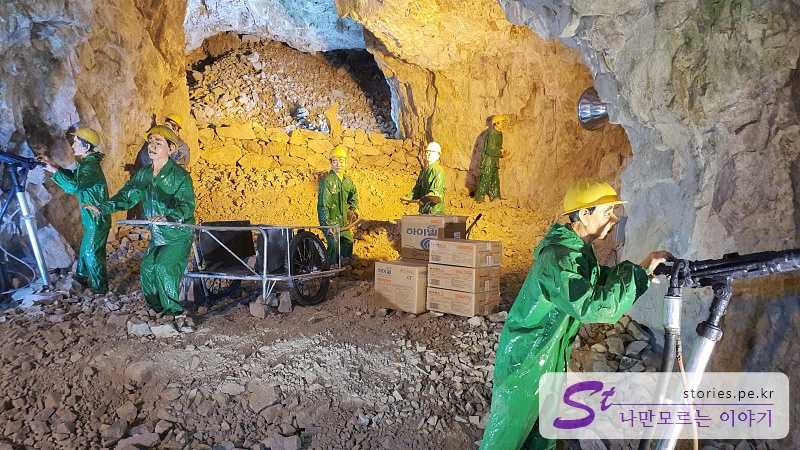

When you arrive at the end of the exhibition hall, you can see Korean mannequins that look like Japanese digging for amethyst. I think it would be scary to watch it alone at night.

### Cafe

If you come out again and walk to the left, you can meet the winery. We can sell wine and drink coffee, but we don't drink alcohol, so pass!

### Wish Cave

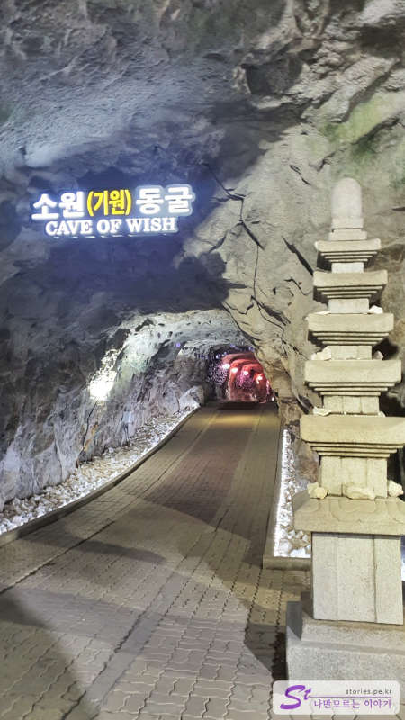

Next is Sowon Cave. There is a statue at the end of the long-running cave, and on the way, a sign with a wish is attached to the wall.

I think I pay for the sign and write down my wish and stick it on. I think it's probably fulfilling the seller's wish. Hah!

### a shelter

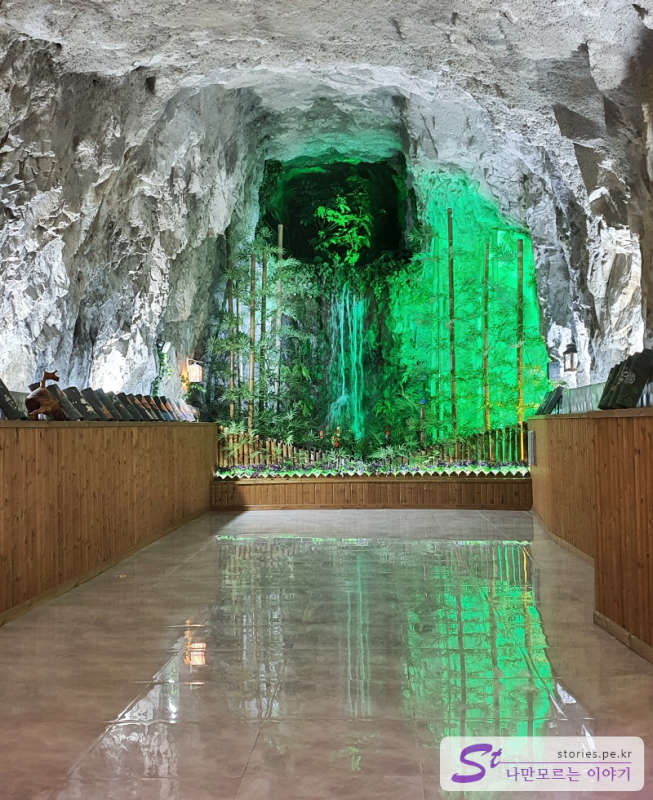

If you come back out and go down, you'll see a shelter. The shelter is decorated like an ondol room, so you can take off your shoes and go in and sit or lie down.

It looks like a jjimjilbang, but the floor is very lukewarm.

There are amethyst bedrocks, but I haven't gone in. Well, I'm not curious about the taste of water, but is it safe?That's what I thought first.

### a fantastic cave

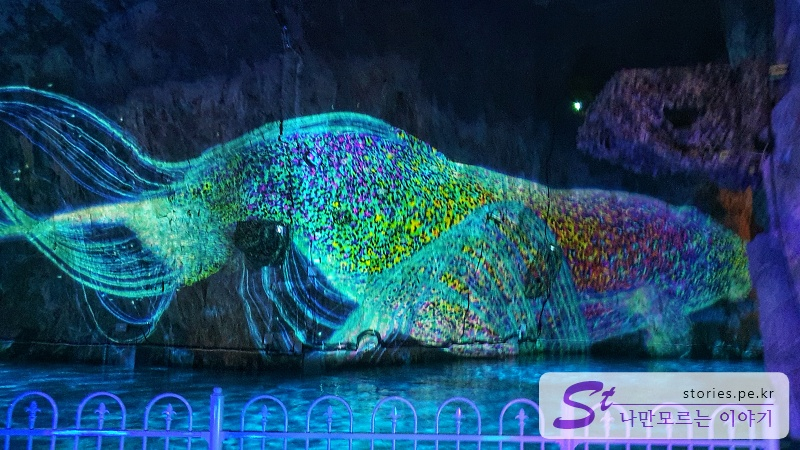

And you can meet the last highlight, **Fantastic Cave**. Along with boating, which is an attraction, it can be said to be a sight to see. If you're officially using it, you're in a little manual boat, you're going through a cave, and you're going to see a media fa드를ade. You can just look at it from the side of the road.

### a cave exit

After seeing the fantastic cave like this, you will meet the exit.

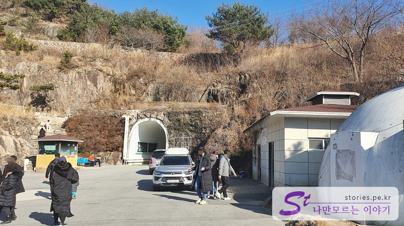

The exit is different from the entrance and is on the left side of the entrance. There are shops and restaurants that sell amethyst at the exit, so you can buy souvenirs and eat.

## Cost

The entrance fee is 7,000 won each for the cave and the boat, and if you buy it as a set, it's 13,000 won with a discount of 1,000 won.

## Time of entry

- Operating hours: 09:00 - 18:00 every day
- Time required: Approximately 1 hour round trip

## Travel destination information

- Address: 212 Amethyst Cave Country, Amethyst-ro, Sangbuk-myeon, Ulju-gun, Ulsan
- Contact number: 052-254-1515
- - URL : http://www.jsjland.co.kr

<iframe src='https://www.google.com/maps/embed?pb=!1m18!1m12!1m3!1d3246.3336841272217!2d129.09166331553246!3d35.545460345013055!2m3!1f0!2f0!3f0!3m2!1i1024!2i768!4f13.1!3m3!1m2!1s0x35662421b11ab287%3A0x541ddabc8a484298!2z7J6Q7IiY7KCVIOuPmeq1tOuCmOudvA!5e0!3m2!1sko!2skr!4v1644158681538!5m2!1sko!2skr' class='embed-responsive-item' allowfullscreen></iframe>

## Parking information

It's free parking and it's quite spacious, so you don't have to worry about parking.
