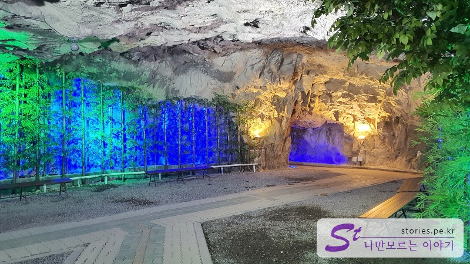

> [[울산 포항 가볼만한곳] 겨울에 다녀 온 2박3일 울산과 포항 여행의 핵심 포인트 바로가기](https://blog.stories.pe.kr/565)

이번 울산 여행의 첫 여행지는 자수정 동굴나라입니다. 원래는 자수정을 캐는 광산이었으나 폐광이 되면서 관광지로 꾸며진 곳이라고 합니다. 주차장도 넓고 바이킹도 있고 작은 놀이공원도 있더라구요. 겨울에는 눈썰매장까지 운영을 한다고 하니 꼭 동굴만 보러 가는 곳은 아닌 것 같습니다.

## 동굴 입구

저희는 아이들이 없기 때문에 바로 동굴로 갔습니다.

동굴의 입구는 세월의 흔적이 잔뜩 묻어있는 분위기입니다. 들어가면 못 나올 것 같은 분위기이지만 괜찮습니다. 들어가면 느낌이 또 다르니까요.

그냥 동굴만 돌아 보는 입장권도 있고 동굴과 보트를 같이 이용하는 입장권도 있습니다. 괜찮다면 동굴+보트를 구매하는 것을 추천합니다. 그나마 보트를 타야 뭘 해본 것 같은 느낌이 나닌까요~

저희도 동굴+보트 패키지를 구매했습니다. 기대하며 들어가 봅니다.

입구는 좀 음습하게 생겼으나 들어가 보면 그렇게 음습하지는 않습니다.

### 동굴 안내도

일단 들어가자마자 동굴 안내도를 만나게 됩니다. 우리는 먼저 전망대 방향에 있는 보트를 먼저 탔습니다. 그리고 공룡 동굴을 지나 오른쪽 방향으로 이동하여 광장과 자수정 전시관을 보고 소원 동굴, 미디어 아트관을 지나 나왔습니다.

## 보트 타기

자수정 동굴에서 가장 액티비티 한 놀 거리인 보트 타기입니다. 입구에서 바로 오른쪽에 있기 때문에 찾는 데는 별로 어려움이 없습니다. 어린아이들도 탈 수 있습니다.

잠깐 대기를 하면 보트가 옵니다. 대략 한 번에 10-15명 정도가 탑승할 수 있고 약 5-7분 정도 탐험을 하는 것 같습니다. 운전하시는 분이 곳곳에 박혀있는 자수정을 랜턴으로 가리키며 설명을 해줍니다.

### 공룡 동굴

보트를 타고 이제 동굴을 걸어 다니면서 구경을 했습니다. 조금만 더 걸어가다 보면 아주 귀여운 고래 동상을 볼 수 있습니다. 아주 귀여워요. 요기가 바로 공룡 동굴입니다. 남자아이들이 특히 좋아하겠지만 저희는 어른들이라 그냥 패스했습니다~

왼쪽으로 가면 미디어관, 오른쪽으로 가면 자수정관입니다. 우리는 자수정관쪽으로 향했습니다.

가는 길에 잘 꾸며진 공간이 있습니다. 회색빛의 동굴에 푸른색의 대나무가 파란 조명을 받고 있어서 상당히 이국적인 모양입니다.

### 자수정 전시관

조금 더 지나면 보이는 곳이 신비의 **보석 자수정관**입니다.

사진은 하나만 찍었지만 이런 자수정 원석을 쭉~ 전시해 놨습니다.

전시관 끝에 도착을 하면 자수정을 캐는 일본인처럼 생긴 조선인 마네킹들을 볼 수 있습니다. 밤에 혼자 보면 무서울 것 같아요.

### 카페

다시 나와서 왼쪽으로 걸어가다 보면 와이너리를 만날 수 있습니다. 와인도 팔고 커피도 마실 수 있으나 우리는 술을 먹지 않으므로 패스~~~~

### 소원 동굴

다음은 소원 동굴입니다. 길게 뻗어 있는 동굴의 끝 쪽에는 동상이 있고 가는 길에는 소원을 적은 푯말이 벽 쪽에 빼곡히 붙어 있습니다.

푯말을 돈 주고 사서 소원을 적고 붙이는 것 같습니다. 아마도 푯말 판매자의 소원을 들어주는 것은 아닌가 하는 생각을 잠시... ㅎ

### 쉼터

다시 나와서 아래쪽으로 내려오다 보면 쉼터를 만나게 됩니다. 쉼터는 온돌방처럼 꾸며져 있어서 신발 벗고 들어가서 간단히 앉거나 누울 수도 있는 공간입니다.

보기에는 찜질방처럼 뜨끈뜨끈할 것 같지만 바닥은 매우 미지근하네요.

자수정 암반수도 있으나 들어가 보지는 않았습니다. 음.. 물맛이 궁금하다기보다는 **안전할까?**라는 생각이 먼저 들어서...

### 환상 동굴

그리고 마지막 하이라이트인 **환상 동굴**을 만날 수 있습니다. 놀거리인 보트 타기에 더불어 그나마 볼거리라고 할 수 있습니다. 정식으로 이용한다면 작은 수동 보트를 타고 동굴을 지나면서 미디어 파사드를 보는 것이라 할 수 있는데.. 그냥 길 옆에서 간단하게 볼 수도 있습니다.

### 동굴 출구

이렇게 환상 동굴을 보고 나면 출구를 만나게 됩니다.

출구는 입구와 다르며 입구의 왼쪽에 있습니다. 출구를 나오면 자수정을 파는 상점과 식당이 있어서 기념품도 구입하고 식사도 할 수 있습니다.

## 비용

입장료는 동굴과 보트 각각 7.000원이며 세트로 구매를 하면 1,000원이 할인된 13,000원입니다.

## 입장시간

- 운영시간 : 매일 09:00 - 18:00
- 소요시간 : 왕복 약 1시간

## 여행지 정보

- 주소 : 울산 울주군 상북면 자수정로 212 자수정 동굴나라
- 연락처 : 052-254-1515
- URL : http://www.jsjland.co.kr

<iframe src='https://www.google.com/maps/embed?pb=!1m18!1m12!1m3!1d3246.3336841272217!2d129.09166331553246!3d35.545460345013055!2m3!1f0!2f0!3f0!3m2!1i1024!2i768!4f13.1!3m3!1m2!1s0x35662421b11ab287%3A0x541ddabc8a484298!2z7J6Q7IiY7KCVIOuPmeq1tOuCmOudvA!5e0!3m2!1sko!2skr!4v1644158681538!5m2!1sko!2skr' class='embed-responsive-item' allowfullscreen></iframe>

## 주차정보

무료주차이며 상당히 넓어서 주차 걱정은 하지 않아도 됩니다.
