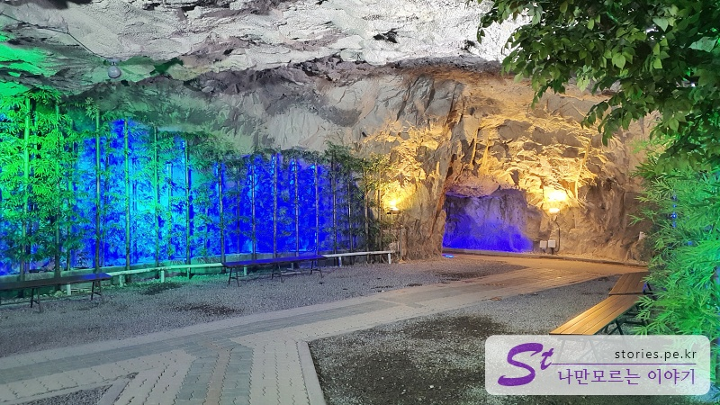
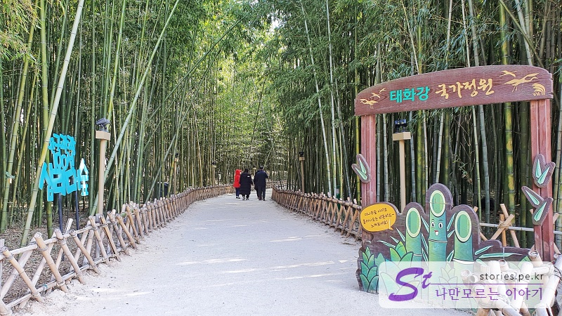
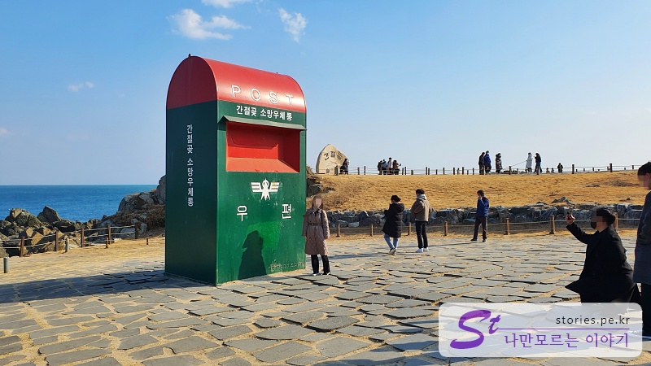
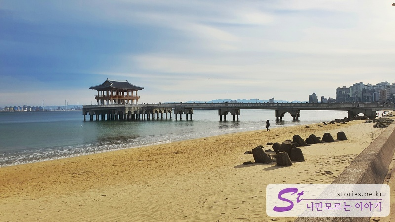
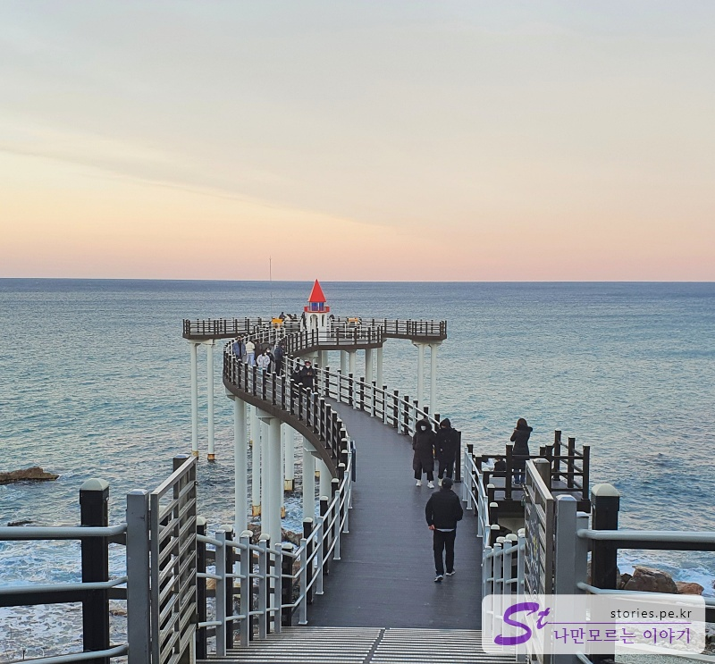

울산과 포항은 그다지 여행할 곳이 많지 않은 도시라고 합니다. 더군다나 설날 당일이면 그나마 운영하던 관광지도 문을 닫기 마련인데.. 그럼에도 불구하고 갔습니다. 볼게 뭐가 있나...

전체 일정은 빡세지 않게 쉬엄쉬엄 다녀오는 일정입니다.

#### 1일차

- [14:00] 울산 자수정 동굴나라
- [16:00] 점식식사 : 언양불고기(공원불고기)

#### 2일차

- [10:00] 태화강 국가 정원
- [14:00] 간절곶

#### 3일차

- [10:00] 엄마 찐빵
- [10:30] 구룡포 일본인 가옥거리
- [12:00] 호미곶
- [19:00] 환호공원 스페이스 워크
- [19:00] 영일대해수욕장
- [19:00] 이가리 닻 전망대

## 1일차

### 울산 자수정 동굴나라

숙소가 울산에 있기 때문에 먼저 울산에 있는 **자수정 동굴나라**에 향했습니다.

자수정 동굴은 자연적으로 생긴 동굴은 아니고 자수정을 캐기 위해 파기 시작한 광산이었는데 폐광이 되면서 관광지로 개발을 하였다고 합니다. 실제로 가보면 바이킹도 있고 눈썰매장도 있고 어린이들이 놓 수 있는 놀이동산이 있습니다.

동굴로 들어가면 동굴 보트도 탈 수 있고 산책도 할 수 있는 공간이 있습니다.

> [[울산 가볼만한곳] 어린이와 함께라면 더욱 즐거운 자수정 동굴나라 바로가기](https://blog.stories.pe.kr/566)

### 언양불고기 (공원불고기)

자수정 동굴나라를 나와서 점저를 먹기 위해 가까운 언양으로 갔습니다. 알다시피 언양 하면 **불고기!!!** 언양 불고기를 먹어보기로 했습니다. 인터넷에서는 **언양 기와집 불고기**가 유명했지만 설날이라 문을 닫아서 그나마 열려있는 **공원불고기**로 갔습니다.

언양 불고기는 비싸도 너어무~ 비싸

2명이서 요만큼 먹는데 5만원이 넘었어요.

> [[울산 맛집] 언양하면 언양불고기(공원불고기) 바로가기](https://blog.stories.pe.kr/566)

## 2일차 울산

2번째 날에는 태화강 국가 정원으로 먼저 향했습니다.

### 태화강 국가 정원

태화강 국가 정원은 산책하기에 좋은 장소입니다. 먼저 국가정원교 아래를 걸어서 지나갈 수 있는 **은하수 다리**가 있습니다. 이곳을 지나면 태화강을 내려다볼 수 있는 전망대가 있습니다.

그리고 **십리대 숲**을 지나면서 바람에 부딪히는 대나무의 소리를 들을 수 있습니다. 저희가 갔을 때는 겨울이라 정원이 허허벌판이었지만 그 외의 계절에 가면 다채로운 꽃들과 나무들을 볼 수 있을 것 같습니다.

> [[울산 가볼만한곳] 산책하기 좋은 곳 태화강 국가정원 바로가기](https://blog.stories.pe.kr/568)

### 간절곶

그리고 40분 거리에 있는 간절곶으로 향했습니다. 간절곶에서 유명한 우체통에서도 사진도 찍고 해변을 산책하고 연도 날릴 수 있습니다.

> [[울산 가볼만한곳] 간절히 기도하면 들어준다는 간절곶 바로가기](https://blog.stories.pe.kr/569)

## 3일차 포항

마지막 3일차에는 울산에서 1시간 거리에 있는 포항을 여행했습니다.

### 엄마 찐빵

먼저 구룡포 앞에 있는 엄마 찐빵에 가봤습니다. TV에 방송된 이후로 사람이 많을 줄 알았는데 아침 일찍 가서 그런지 사람은 많지는 않았습니다. 찐빵 맛은 좋았는데... 그렇게 친절하지는 않네요.

> [[포항 맛집] 빵맛이 부드럽고 쫄깆한 구룡포 엄마찐빵 바로가기](https://blog.stories.pe.kr/570)

### 구룡포 일본인 가옥거리

구룡포 앞에 일본인 가옥거리가 있습니다. 별로 볼 것은 없는데, **"동백꽃 필 무렴"** 때문에 유명해서 인지 사람들이 많이 오기는 하네요.

> [[포항 가볼만한곳] 구룡포 일본인 가옥 거리 바로가기](https://blog.stories.pe.kr/571)

### 호미곶

포항에서 가장 유명하다는 호미곶도 다녀왔습니다. 생각보다 손이 작지만 눈에 띄게 돋보이긴 하네요. 바다를 향해있는 전망대에서 갈매기와 찍은 사진이 인상 깊었습니다.

> [[포항 가볼만한곳] 호미처럼 생겼다 하여 호미곶 바로가기](https://blog.stories.pe.kr/572)

### 스페이스 워크 (환호 공원)

포항에서 요즘 핫하다는 환호공원에 있는 **스페이스 워크**입니다. 사진으로 봐도 아찔한데, 실제 걸어 보면 더 아찔아찔합니다.

> [[포항 가볼만한곳] 포항의 떠오르는 핫한 관광지인 환호공원의 스페이스워크 바로가기](https://blog.stories.pe.kr/573)

### 영일대 해수욕장

환호공원에서 내려다보이는 영일대 해수욕장입니다. 바다로 길게 뻗어있는 영일교가 눈에 띄네요.

> [[포항 가볼만한곳] 영일대해수욕장 바로가기](https://blog.stories.pe.kr/575)

### 이가리 닻 전망대

마지막으로 포항의 북쪽에 있는 이가리 닻 전망대를 들러봤습니다. 닻 모양의 전망대에서 보는 풍경이 나름 멋있습니다.

> [[포항 가볼만한곳] 바다와 만나는 곳 이가리 닻 전망대 바로가기](https://blog.stories.pe.kr/574)
