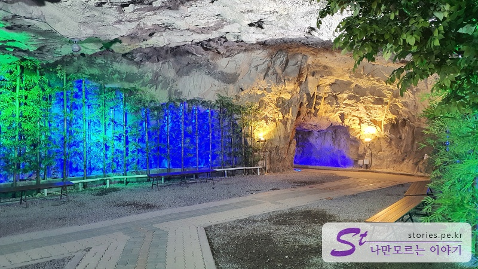
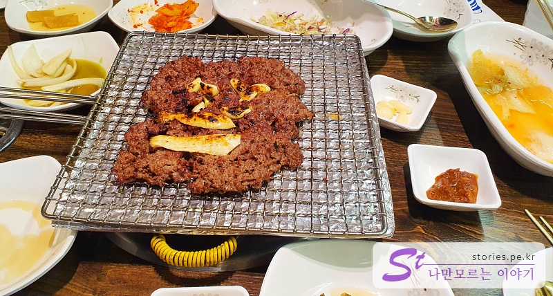
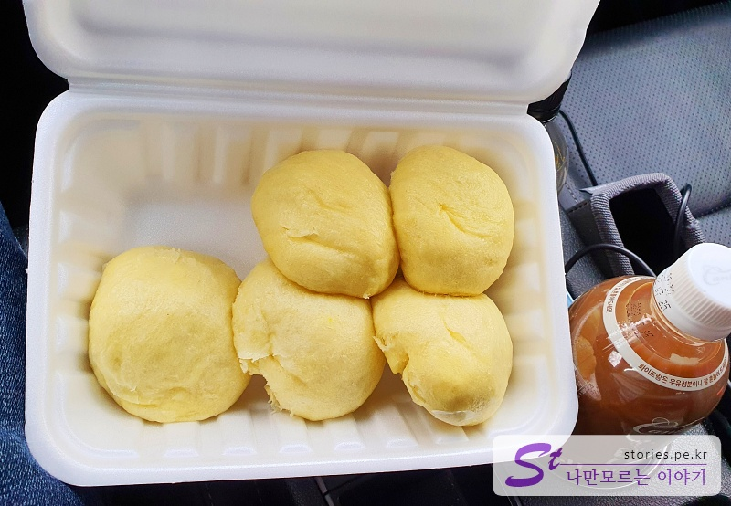
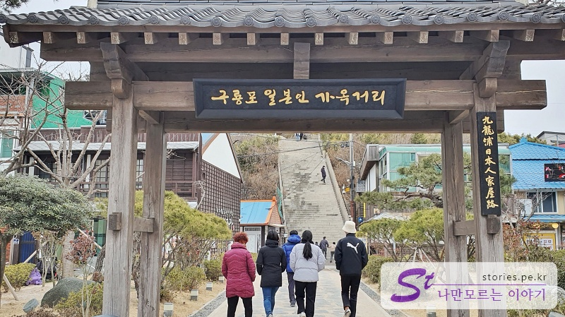
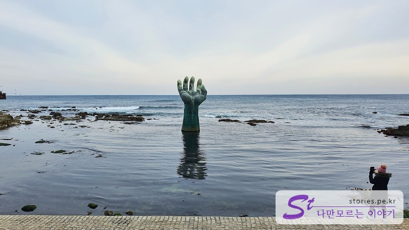
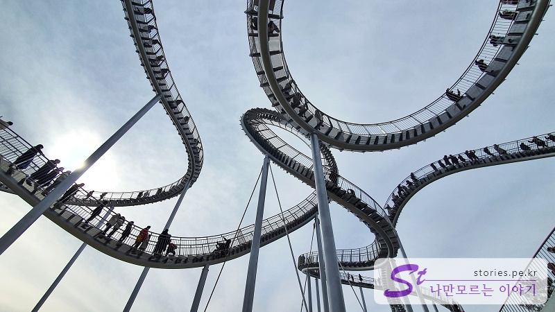
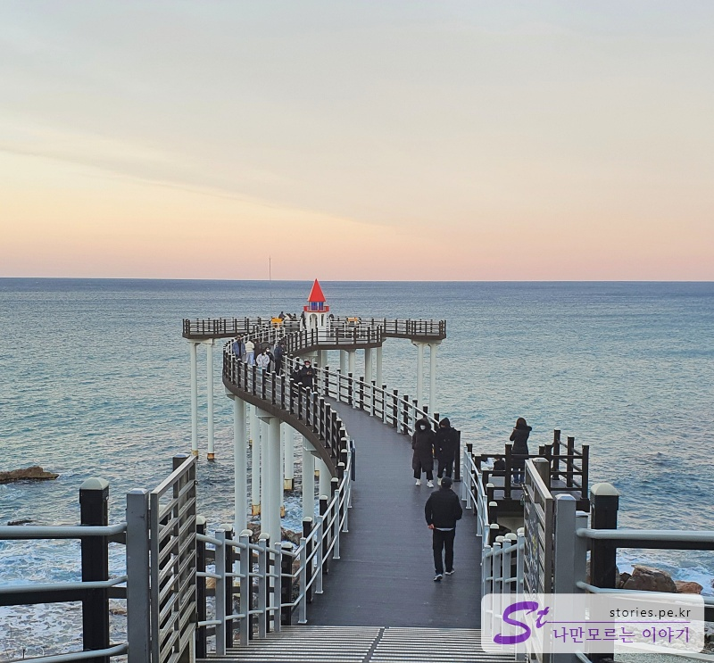

Ulsan and Pohang are not many cities to travel to. Moreover, on New Year's Day, the tourist attractions that were operated are bound to close. Nevertheless, he went. What's there to see...

The entire schedule is a schedule that is not too hard and comes back easily.

#### Day 1

- [14:00] Ulsan Amethyst Cave Country
- [16:00] Lunch: Eonyang Bulgogi (Park Bulgogi)

#### Day 2

- [10:00] Taehwagang National Garden
- [14:00] Ganjeolgot Cape

#### Day 3

- [10:00] Mom's steamed bun
- [10:30] Guryongpo Japanese House Street
- [12:00] Homigot
- [19:00] Cheer Park Space Walk
- [19:00] Yeongildae Beach
- [19:00] Iga-ri Anchor Observatory

## Day 1

### Ulsan Amethyst Cave Country

Since the accommodation is located in Ulsan, I first headed to the Amethyst Cave Country in Ulsan.

Amethyst Cave was not a naturally formed cave, but a mine that began to be dug to dig for amethyst, but it was developed as a tourist destination when it became an abandoned mine. If you go there, there is a Viking, a sledding slope, and an amusement park for children.

If you go into the cave, there is a space where you can ride a cave boat and take a walk.

> [[A place to visit in Ulsan] Shortcut to Amethyst Cave, which is more fun with children](http://junistory.blogspot.com/2022/02/blog-post_21.html)

### Eonyang Bulgogi (Park Bulgogi)

I left Amethyst Cave Country and went to Eonyang nearby to eat lunch. As you know, when it comes to Eonyang, it's Bulgogi!** I decided to try Eonyang Bulgogi. Although Eonyang tile-roofed restaurant Bulgogi ** was famous on the Internet, it was closed for New Year's Day, so we went to the open Bulgogi \*\* park.

Eonyang Bulgogi is too expensive

Two of us ate this much, but it was over 50,000 won.

> [[Famous restaurant in Ulsan] Go straight to Eonyang Bulgogi (Park Bulgogi)](http://junistory.blogspot.com/2022/02/blog-post_52.html)

## Day 2 Ulsan

On the second day, I headed first to the Taehwagang National Garden.

### Taehwagang National Garden

Taehwagang National Garden is a good place to take a walk. First, there is **Gallactic Bridge** where you can walk under the National Garden Bridge. After passing here, there is an observatory overlooking the Taehwa River.

And you can hear the sound of bamboo hitting the wind as you pass through the forest **Sipridae**. When we went, the garden was empty because it was winter, but I think we can see various flowers and trees in other seasons.

> [[A good place to visit in Ulsan] Shortcut to the National Garden of Taehwagang River](http://junistory.blogspot.com/2022/02/blog-post_7.html)

### Ganjeolgot Cape

And we headed for Ganjeolgot, which is 40 minutes away. You can take pictures, take a walk on the beach, and fly kites in the mailbox, which is famous at Ganjeolgot.

> [[A place worth visiting in Ulsan] Shortcut to Ganjeolgot Cape that you will listen to if you pray earnestly](http://junistory.blogspot.com/2022/02/blog-post_17.html)

## Day 3 in Pohang

On the last three days, I traveled to Pohang, an hour away from Ulsan.

### Mom's steamed bun

First, I went to Mom's Steamed Bread in front of Guryongpo. I thought there would be a lot of people since it was aired on TV, but there weren't many people because I went early in the morning. The steamed bun tasted good, but... You're not that kind.

> [[Pohang Restaurant] Shortcut to Guryongpo Mom's Steamed Bread](http://junistory.blogspot.com/2022/12/pohang-restaurant-taste-of-bread-is.html)

### Kowloonpo Japanese House Street

There is a Japanese house street in front of Guryongpo. There's not much to see, but there's a lot of people coming, perhaps because it's famous because **" Camellia Blooms"**

> [[A place to visit in Pohang] Shortcut to Guryongpo Japanese House Street](http://junistory.blogspot.com/2022/11/a-place-worth-visiting-in-pohang.html)

### Cape Homigot

I also went to Homigot, which is the most famous in Pohang. The hands are smaller than I thought, but they stand out. The picture taken with the seagull at the observatory facing the sea was impressive.

> [[A place to visit in Pohang] Shortcut to Homigot because it looks like a hoe](http://junistory.blogspot.com/2022/11/homigot-because-it-looks-like-hoe.html)

### Space Walk (Cheering Park)

This is **Space Walk** in Cheering Park, which is popular in Pohang these days. It's dizzying in the picture, but it's even more dizzying when you actually walk.

> [[A place to visit in Pohang] Shortcut to the spacewalk of Hooray Park, a hot tourist destination in Pohang](http://junistory.blogspot.com/2022/11/a-place-worth-visiting-in-pohang_29.html)

### Yeongildae Beach

It's Yeongildae Beach overlooking from Hoshi Park. Yeongilgyo Bridge, which stretches out into the sea, stands out.

> [[A good place to visit in Pohang] Shortcut to Yeongildae Beach](https://junistory.blogspot.com/2022/02/blog-post_19.html)

### Iga-ri Anchor

Finally, we visited the Igarari Anchor Observatory in the north of Pohang. The view from the anchor-shaped observatory is pretty cool.

> [[A place to visit in Pohang] Where you meet the sea, go straight to the observation deck](http://junistory.blogspot.com/2022/11/a-place-worth-visiting-in-pohang-place.html)
