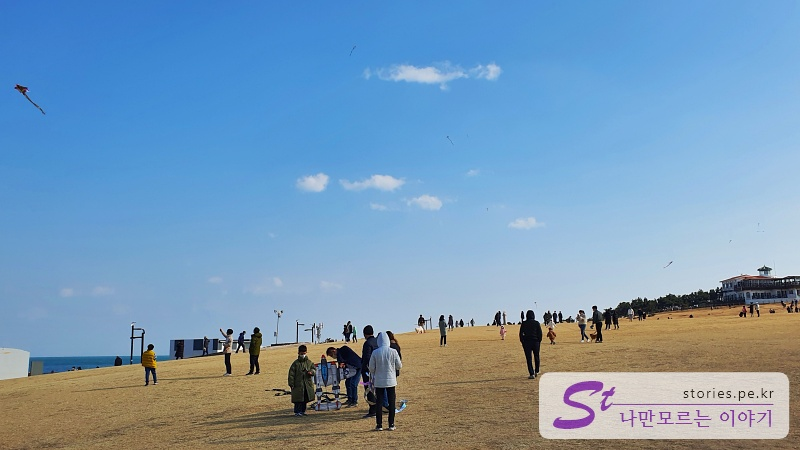
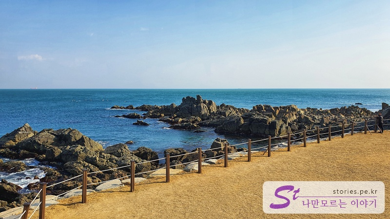
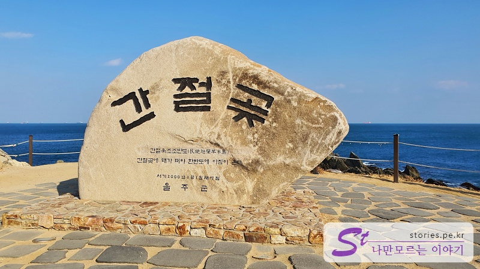

> [[A place to visit in Ulsan and Pohang] Shortcut to the key points of their trip to Ulsan and Pohang](http://junistory.blogspot.com/2022/11/a-place-worth-visiting-in-ulsan-and.html)

Ganjeolgot Cape is an indispensable place to talk about the sea of Ulsan. It is one of the first places where the sun rises in Korea, so it is a popular attraction where people gather every new year.

Of course, we didn't go there to greet the sun. We just didn't have a place to go.

I thought it was a place where people go to celebrate the sun every year because Ganjeolgot Cape said it would make their wishes come true if they prayed earnestly, but when I looked it up, I don't think that's what it meant.

When I looked up Wikipedia, I heard that the place name originated as below.

> Ganjeol is a place name derived from the fact that it looks like a ganjitdae, which refers to a pointed and long pole made of bamboo to pick fruits when viewed from afar. Cape was called Ganjeolgot Cape because it means the part where the land protrudes into the sea. - Wikipedia. -

Whatever the origin of the name is, if you pray earnestly, your wish...

## Ganjeolgot Cape

When you arrive at Ganjeolgot Cape, you park in a suitable parking lot. And if you walk to the beach, you'll see a wide lawn. Lawn by the sea. It's a bit unique.

Many people are flying kites here and there. It's windy and there's no electric wire, so it's definitely the best place to fly a kite. But... There are too many, even if there are too many.

If you look at the other side of the lawn, you can see the windmill. It's a windmill that can't produce electricity or pound wheat or rice, but it's doing its job as an eye candy.

On the lawn behind the windmill, there are small sculptures commemorating 2022.

Also, the red lighthouse acts as a prop for nice photos, contrasting with the blue sea.

The yellow grass, the rocks on the seashore, and the blue sea are beautiful. If you come in spring and summer, you can see the sea with blue grass.

## Desired mailbox

This is Ganjeolgot **Somang Postbox** that you must take a proof shot when you come to Ganjeolgot.  
It's completely different from the origin of the name Ganjeolgot, and it's a mailbox name that feels like something fits because of the nuance of the word. Desire, wish, wish... mailbox...

Many people are waiting in a line to take pictures here. We don't have to leave proofs, so pass!

## Ganjeolgot Monument

You have to take a proof shot at a place like this. Where the name came from.

There are some people waiting here, but it's better than the mailbox

The mailbox and the headstone are close to each other, so you can compare their popularity.

## Travel destination information

- Address: 39-2 Ganjeolgot 1-gil, Ulju-gun, Ulsan
- Contact information: 052-204-1751-1756 (forest park and park team)

<iframe src='https://www.google.com/maps/embed?pb=!1m18!1m12!1m3!1d3253.861062093378!2d129.36061000899292!3d35.35909422351384!2m3!1f0!2f0!3f0!3m2!1i1024!2i768!4f13.1!3m3!1m2!1s0x35687f826b5fcb6d%3A0x2aef1b53e825d43d!2z6rCE7KCI6rO2IOyGjOunneyasOyytO2GtQ!5e0!3m2!1sko!2skr!4v1644216662663!5m2!1sko!2skr' class='embed-responsive-item' allowfullscreen></iframe>

## Parking information

Parking is free nearby.
