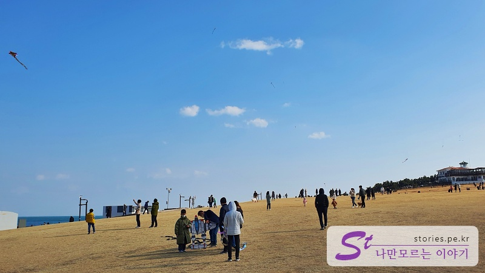
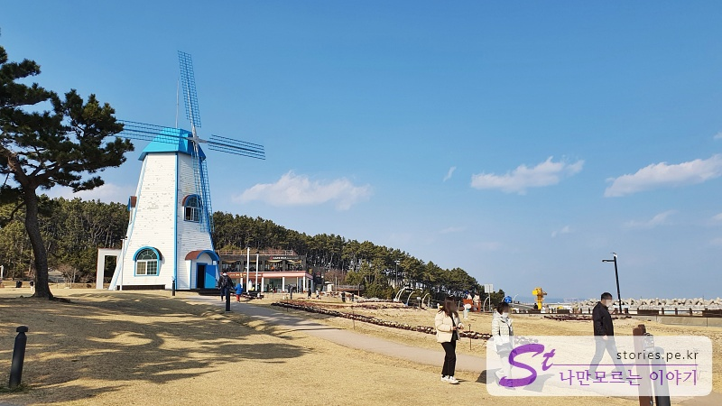
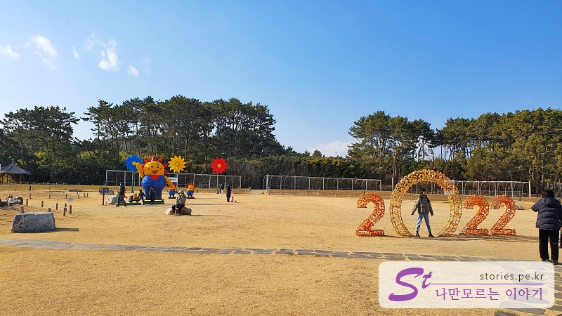
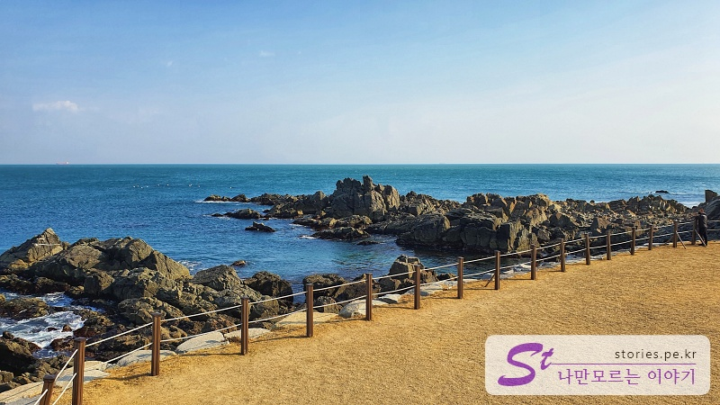
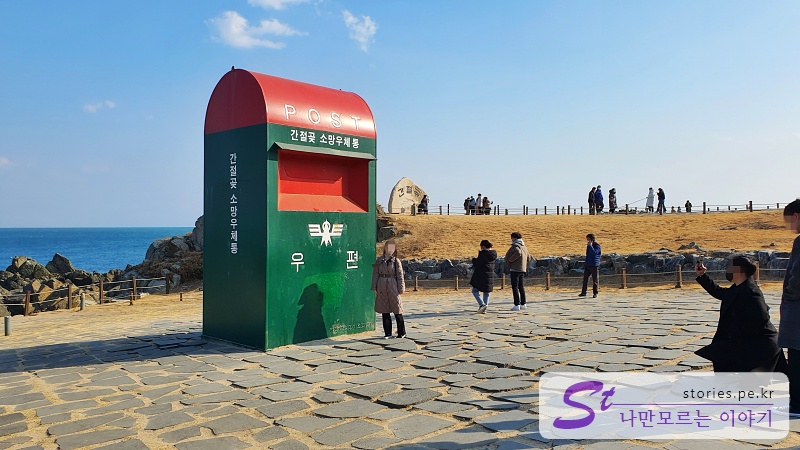
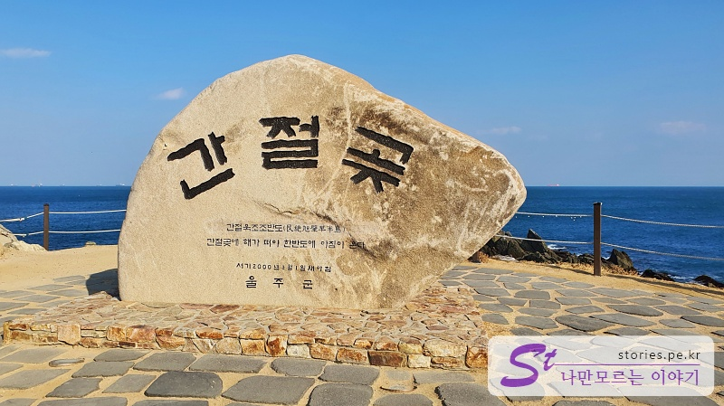
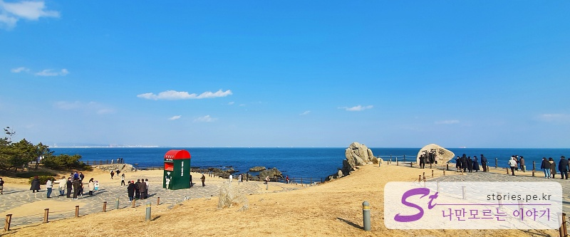

> [[울산 포항 가볼만한곳] 겨울에 다녀 온 2박3일 울산과 포항 여행의 핵심 포인트 바로가기](https://blog.stories.pe.kr/565)

울산의 바다를 이야기한다면 빼놓을 수 없는 곳이 간절곶입니다. 우리나라에서 가장 먼저 해가 뜨는 곳 중에 하나이기 때문에 매년 신년에는 해맞이 인파들이 몰려드는 명소입니다.

물론 우리는 해맞이를 하러 간 것은 아니고 그냥 딱히 갈 곳이 없어서...

간절곶이 간절히 기도하면 소원을 이루어 준다고 해서 매년 해맞으러 사람들이 가는 곳인 줄 알았는데 찾아보니 그런 의미는 아닌가 봅니다.

위키피디아를 찾아보니 아래와 같은 지명유래라고 하네요.

> 간절은 먼바다에서 바라보면 과일을 따기 위해 대나무로 만든 뾰족하고 긴 장대를 가리키는 간짓대처럼 보인다는 데에서 유래된 지명이다. 곶은 육지가 바다로 돌출해 있는 부분을 의미하므로 간절곶으로 부르게 되었다. -위키피디아 -

명칭의 유래야 어찌 되었든 간절히 빌면 소원이.....

## 간절곶

간절곶에 도착을 하면 적당한 주차장에 주차를 합니다. 그리고 걸어서 바닷가로 가게 되면 드넓게 펼쳐진 잔디밭을 만나게 됩니다. 바닷가에 잔디밭이라니.. 좀 이색적인 느낌이 납니다.

여기저기 많은 사람들이 연을 날리고 있습니다. 바람도 세게 불고 전깃줄도 없으니 연날리기에 최적의 장소인 것은 확실한 것 같습니다. 다만.. 너무 많어, 많아도 너무 많어..

잔디밭의 반대쪽을 쳐다보면 풍차를 볼 수 있습니다. 뭐 전기를 생산한다거나 밀이나 쌀을 찧지는 못하지만 그런대로 눈요깃거리로 자신의 소임은 다 하고 있는 풍차입니다.

풍차 뒤로 잔디밭에는 2022년을 기리는 작은 조형물들이 있구요.

또한 빨간 등대가 푸른색의 바다와 대비를 이루면서 멋진 사진의 소품 역할을 하고 있습니다.

누런 잔디와 갯바위 그리고 푸른 바다가 이어지는 시진이 아름답습니다. 봄, 여름에 오면 파란색 잔디와 어우러진 바다를 볼 수 있겠지요.

## 소망우체통

간절곶에 오면 꼭 인증샷을 남겨야 한다는 간절곶 **소망우체통**입니다.  
간절곶 이름의 유래와는 전혀 다른 것인데, 단어의 뉘앙스로 인해 뭔가 맞아떨어지는 느낌의 우체통 이름입니다. 간절, 소원, 소망.... 우체통...

여기서 사진을 찍으려고 많은 사람들이 줄지어 대기를 하고 있습니다. 우리는 굳이 인증을 남길 필요가 없어서 패스~~

## 간절곶 비석

인증샷은 이런 데서 찍어야지.. 이름이 확실히 나온 곳에서 말이야..

여기도 대기자가 좀 있긴 한데 그래도 우체통보다는 찍을만해요~

우체통과 비석은 서로 가까운 곳에 있어서 서로의 인기를 비교해 볼 수 있습니다.

## 여행지 정보

- 주소 : 울산 울주군 간절곶1길 39-2
- 연락처 : 052-204-1751~1756 (산림공원과 공원팀)

<iframe src='https://www.google.com/maps/embed?pb=!1m18!1m12!1m3!1d3253.861062093378!2d129.36061000899292!3d35.35909422351384!2m3!1f0!2f0!3f0!3m2!1i1024!2i768!4f13.1!3m3!1m2!1s0x35687f826b5fcb6d%3A0x2aef1b53e825d43d!2z6rCE7KCI6rO2IOyGjOunneyasOyytO2GtQ!5e0!3m2!1sko!2skr!4v1644216662663!5m2!1sko!2skr' class='embed-responsive-item' allowfullscreen></iframe>

## 주차정보

주차장은 인근에 무료로 주차를 할 수 있습니다.
