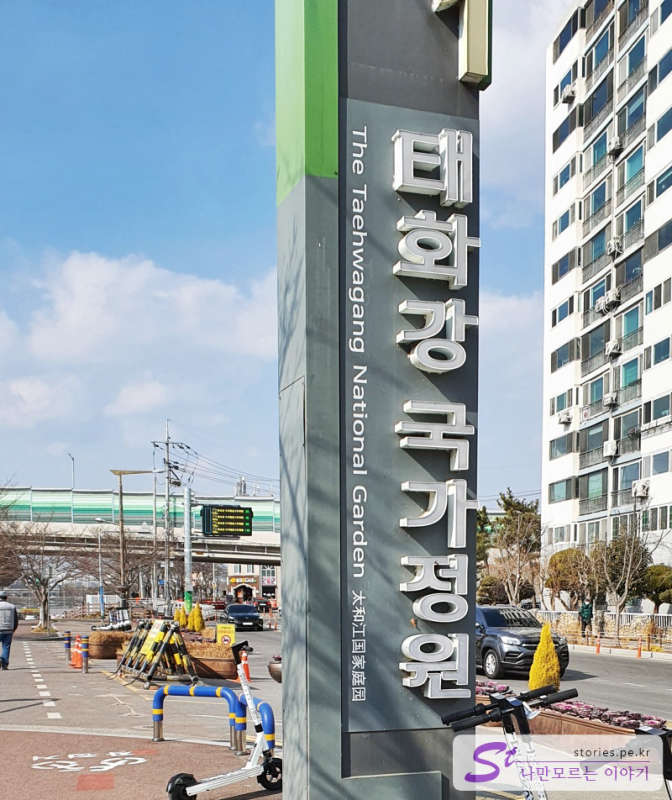
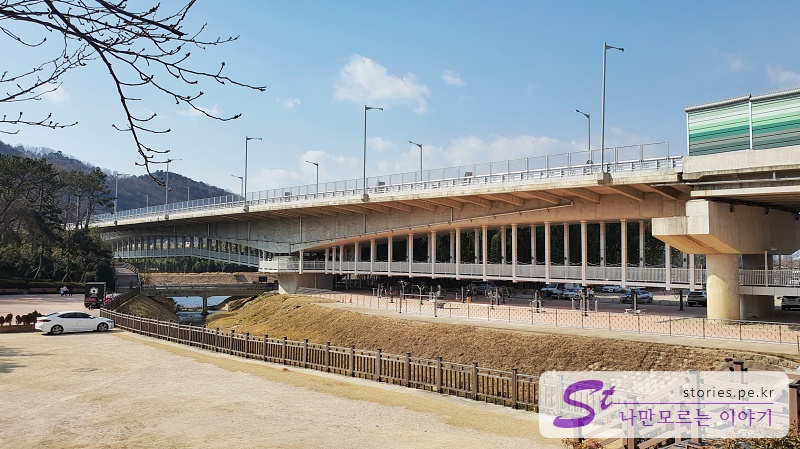
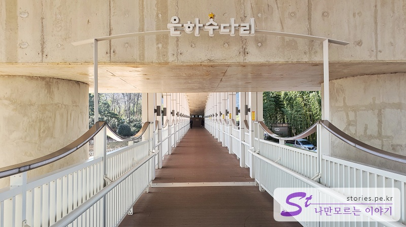
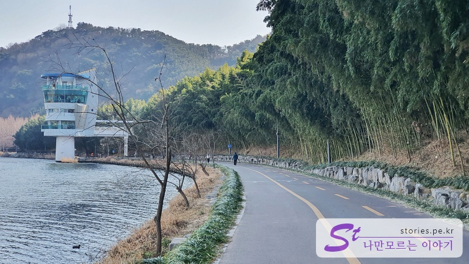
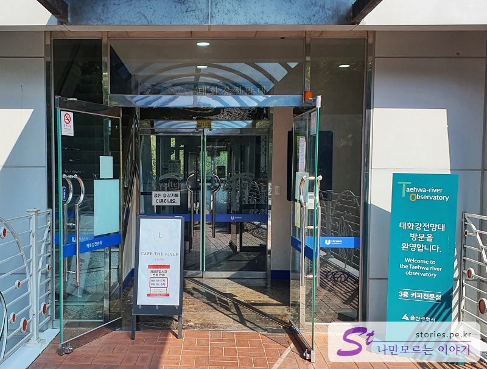
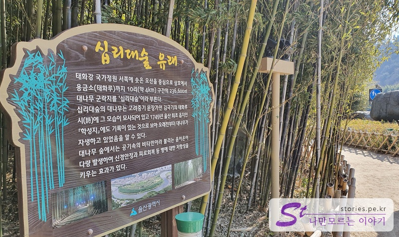

> [[A place to visit in Ulsan and Pohang] Shortcut to the key points of their trip to Ulsan and Pohang](http://junistory.blogspot.com/2022/11/a-place-worth-visiting-in-ulsan-and.html)

The first destination of the second day of the trip to Ulsan is the Taehwagang National Garden. Taehwa River is a river that flows into the East Sea from Ulju-gun to the Han River in Ulsan. It used to be a very dirty river, but now the water quality has improved a lot through various efforts. Even when I visited, I didn't think the water was dirty.

It is a national garden built along the Taehwagang River. There are not many things to see now, but the bamboo forest is thick, so it is perfect to take a walk lightly to avoid the cold wind.

Most of the public parking lots around the Taehwagang River are paid parking lots, but they were operated free of charge during the Lunar New Year holiday. We parked in the parking lot of a nearby restaurant that was closed for New Year's Day.

### the Milky Way Bridge

First, we decided to cross the Milky Way Bridge. The Milky Way Bridge is a human-friendly bridge at the bottom of the National Garden Bridge, where cars run fast.

Who made the name? The name **Gallactic Bridge** is so pretty.

If you cross the Milky Way Bridge, you can meet the parking lot and walk to the Taehwa River Observatory.

Below the Milky Way Bridge is made of glass, so you can see the Taehwa River right away. Most women pass by avoiding glass, and men seem to step on glass. Men are...

### Taehwa River Observatory

If you cross the Milky Way Bridge, a notable attraction is the Taehwa River Observatory. It's about 500 to 700m away from the bridge, so it's good to take a walk.

If you go up the Taehwa River and look toward the observatory, there is a parking lot where you can park and a coffee shop where you can drink coffee.

The first floor is used as an entrance, the second floor is used as a machine room, the third floor is used as a cafe, and the fourth floor is used as an observation deck.

We took the elevator to the observatory on the 4th floor because the purpose was not to go to the cafe.

I filmed it with a panoramic view. The observatory is on the river, so you can take a picture of the bamboo forest, which is the opposite side of the forest.

### the Great Forest

If you go back the way you came and cross the Milky Way Bridge, you can meet the Sipri Grand Forest near the National Garden. It is said that Sipridae Forest is named because the bamboo forest is connected to Sipri Street.

There are not many things to see in the national garden because it is winter, but you can feel the beauty of the bamboo forest.

First of all, the wind is not that strong because it prevents the cold winter wind to some extent. And the clear sound of bamboo hitting each other by the wind and the sound of bamboo leaves are so elegant and good to hear.

There are places where you can take pictures. There are not many people and the distance is long, so it's great to take a walk.

If you walk out of the bamboo forest, you will find the National Garden. It's winter, so it's empty now, but I think there will be plenty of other things to see if you come later in the season except for winter.

## Cost

There is no charge for admission.

## Time of entry

- Operating hours: It's open 24 hours a day, but it's pretty at night because of the lighting.

## Travel destination information

- Address: 154, Taehwagang National Garden-gil, Jung-gu, Ulsan

- Contact number: 052-229-3147

- - URL : https://www.ulsan.go.kr/garden

<iframe src='https://www.google.com/maps/embed?pb=!1m18!1m12!1m3!1d3246.240005005093!2d129.29403491553236!3d35.547774344886506!2m3!1f0!2f0!3f0!3m2!1i1024!2i768!4f13.1!3m3!1m2!1s0x35663299e1025f03%3A0xb68ed0b9362ce2bf!2z7YOc7ZmU6rCVIOq1reqwgOygleybkA!5e0!3m2!1sko!2skr!4v1644209341415!5m2!1sko!2skr' class='embed-responsive-item' allowfullscreen></iframe>

## Parking information

You can use the public parking lot and the parking lot of a nearby restaurant.
