> [[울산 포항 가볼만한곳] 겨울에 다녀 온 2박3일 울산과 포항 여행의 핵심 포인트 바로가기](https://blog.stories.pe.kr/565)

울산 여행 2일차의 첫 번째 여행지는 태화강 국가 정원입니다. 태화강은 울산의 한강으로 울주군에서 출발하여 동해바다로 흘러들어가는 강입니다. 예전에는 상당히 더러운 강이였으나 지금은 다양한 노력으로 수질이 많이 개선 되었다고 합니다. 제가 방문했을 때도 물이 더럽다는 생각은 들지 않았었습니다.

그 태화강을 끼고 조성된 국가 정원입니다. 겨울인 현재는 볼거리가 많지 않지만 대나무숲이 우거져 있어서 찬바람을 피해 가볍게 산책하기에는 더할 나위 없이 좋습니다.

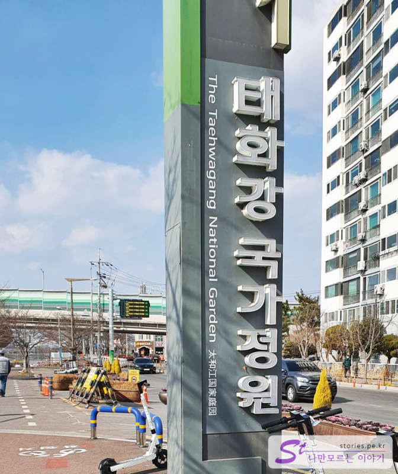

태화강 주변의 공영주차장은 대부분 유료주차장인데, 설날 연휴 기간에는 무료로 운영을 하고 있었습니다. 저희는 설날이라 문 닫은 근처 식당의 주차장에 주차를 하고 다녀왔네요.

### 은하수 다리

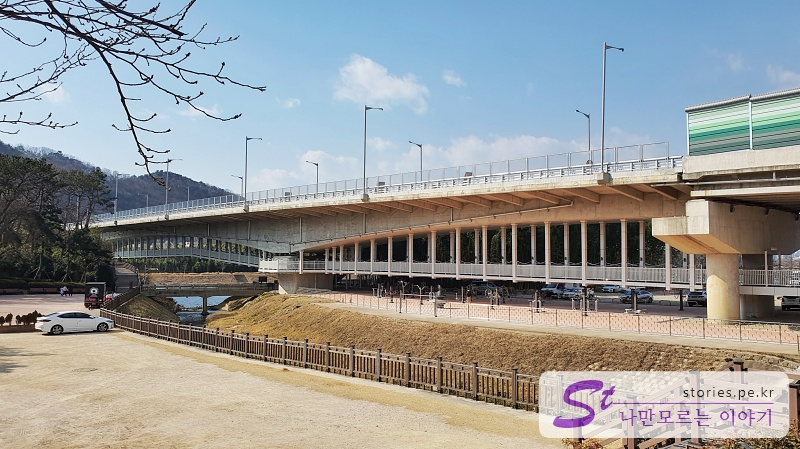

먼저 은하수 다리를 건너기로 했습니다. 은하수 다리는 차들이 쌩쌩 달리는 국가 정원교의 아래쪽에 사람이 다닐 수 있게 만들어 놓은 다리입니다.

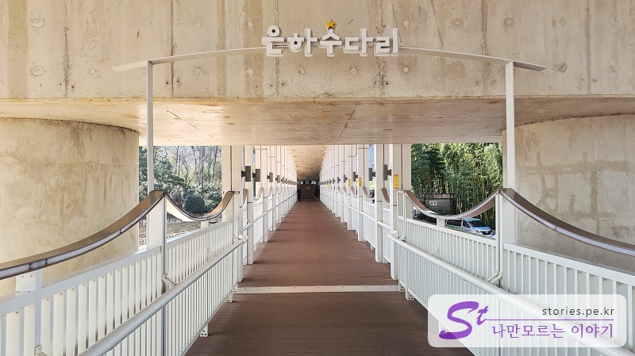

작명을 누가 했는지.. **은하수 다리**라는 이름이 너무 이쁘네요.

은하수 다리를 건너면 주차장을 만날 수 있고 태화강 전망대까지 걸어가 볼 수 있습니다.

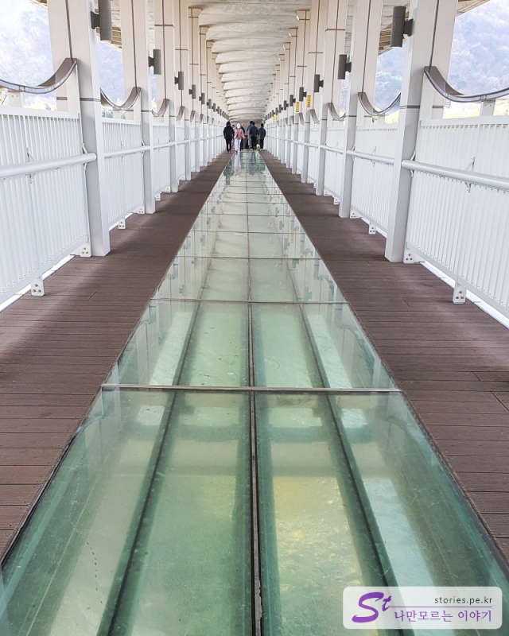

은하수 다리 아래는 유리로 제작이 되어 있어서 태화강을 바로 볼 수 있게 되어 있습니다. 대부분의 여성분들은 유리를 피해서 지나가고 남성분들은 유리를 밟고 지나가는 것 같습니다. 남자들이란.....

### 태화강 전망대

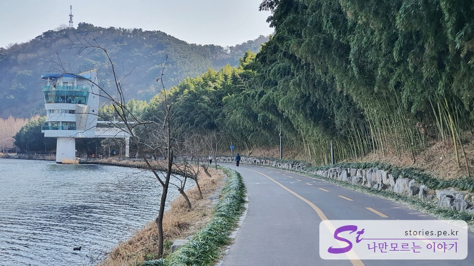

은하수 다리를 건넌다면 눈에 띄는 볼거리는 태화강 전망대입니다. 다리에서 약 500~700m 정도 거리에 있어서 산책하며 다녀오기 좋습니다.

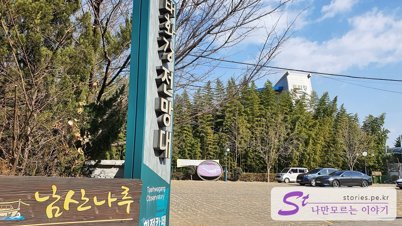

태화강을 올라와 전망대쪽을 보면 주차를 할 수 있는 주차장도 있고 커피를 마실 수 있는 커피전문점도 있습니다.

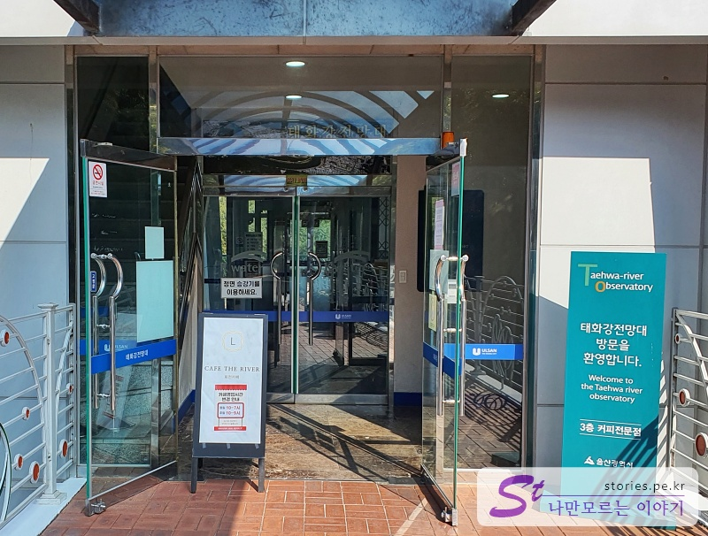

1층은 입구, 2층은 기계실, 3층은 카페, 4층은 전망대로 사용되고 있습니다.

우리는 카페가 목적이 아니라서 바로 4층 전망대로 엘리베이터를 타고 올라갔습니다.

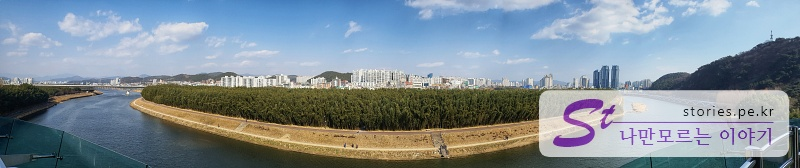

파노라마 뷰로 촬영을 해봤습니다. 전망대가 강 위에 있어서 반대쪽 십리대숲인 대나무숲을 찍을 수 있습니다.

### 십리대숲

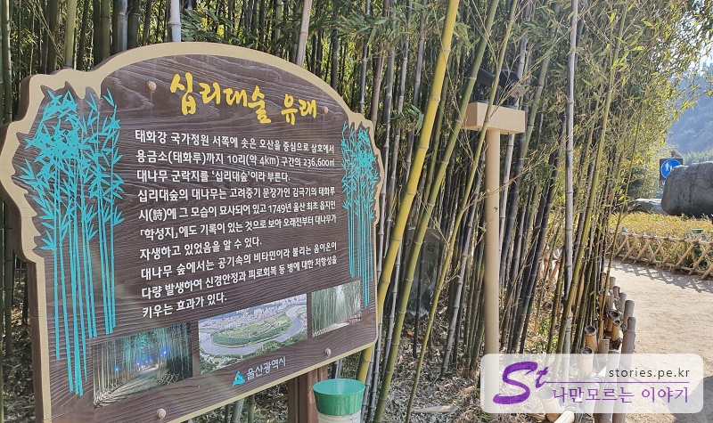

다시 왔던 길을 되돌아와서 은하수 다리를 건너면 국가정원쪽에 십리대숲을 만날 수 있습니다. 십리대숲은 대나무숲이 십리거리로 이어져있다고 해서 붙혀진 이름이라고 하네요.

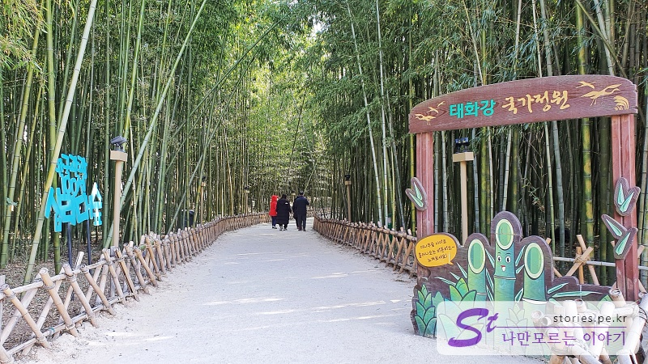

겨울이라 국가 정원에는 볼 것이 많지 않지만 대나무숲은 나름 운치를 느낄 수 있습니다.

일단 차가운 겨울바람을 어느 정도 막아주기 때문에 바람이 그렇게 세지는 않습니다. 그리고 바람에 의해 대나무가 서로 부딪히는 텅텅 거리는 맑은 소리와 대나무 잎 소리가 너무 운치 있고 듣기에 좋습니다.

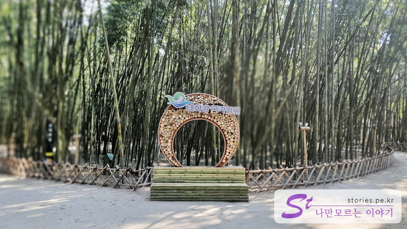

곳곳에 사진을 찍을 수 있는 공간도 있고요. 사람도 많이 없고 거리도 긴 편이라 산책하기에 너무 좋습니다.

대나무숲을 옆으로 빠져나오면 국가 정원 자리가 있습니다. 겨울이라 지금은 허허벌판이지만 나중에 겨울을 제외한 계절에 온다면 다른 볼거리도 풍부하지 않을까 하는 생각을 해봅니다.

## 비용

입장은 무료입니다.

## 입장시간

- 운영시간 : 24시간 운영을 하며 낮에도 좋지만 밤에도 조명 때문에 이쁘다고 하네요.

## 여행지 정보

- 주소 : 울산 중구 태화강국가정원길 154

- 연락처 : 052-229-3147

- URL : https://www.ulsan.go.kr/garden

<iframe src='https://www.google.com/maps/embed?pb=!1m18!1m12!1m3!1d3246.240005005093!2d129.29403491553236!3d35.547774344886506!2m3!1f0!2f0!3f0!3m2!1i1024!2i768!4f13.1!3m3!1m2!1s0x35663299e1025f03%3A0xb68ed0b9362ce2bf!2z7YOc7ZmU6rCVIOq1reqwgOygleybkA!5e0!3m2!1sko!2skr!4v1644209341415!5m2!1sko!2skr' class='embed-responsive-item' allowfullscreen></iframe>

## 주차정보

공영주차장과 인근 식당의 주차장을 이용할 수 있습니다.
