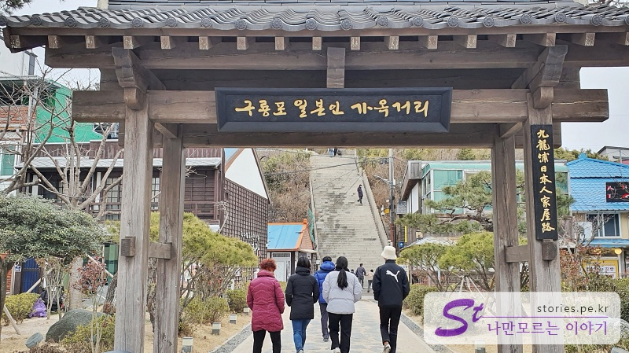
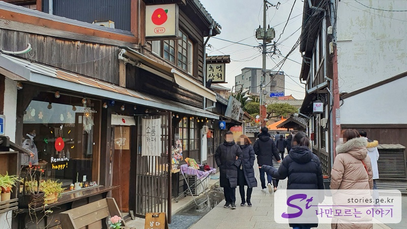
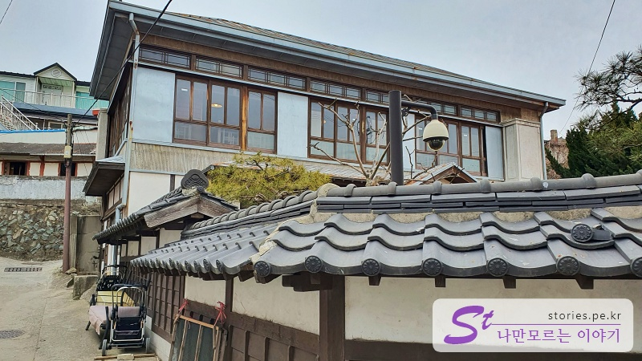

> [[A place to visit in Ulsan and Pohang] Shortcut to the key points of their trip to Ulsan and Pohang](http://junistory.blogspot.com/2022/11/a-place-worth-visiting-in-ulsan-and.html)

The first destination of Pohang was the Guryongpo Japanese House Street, which is famous for gwamegi.

**When the Camellia Blooms** is also famous as the place in the play. Although it is not spacious, it is said that it is a place where people visit because houses built by the Japanese in the past are preserved.

You can use the public parking lot of Guryongpo across the street from the Japanese house. Parking is free.

In front of the parking lot, there is a line of shops selling gwamegi, and they stare at the faces of parking people. (Sarah is what I'm just saying.) Silent pressure!!) You don't act like a heavy customer, but you're implementing a high-level psychological warfare that puts pressure on your eyes. You can leave the pressure behind, quickly turn your face toward the path, and turn your steps.

If you cross the road, you can pass the gate called Guryongpo Japanese House Street.

The Japanese house street is not much, but the gate is attached, so it feels like there is something.

I think camellia feeds all the Guryongpo here. At the entrance, the sign says **When the camellia blooms, the filming location**!

As soon as you enter, you can see the stone steps right in front of you, and this is the filming point. The direction is not from bottom to top, but from top to bottom. Camellia shot it like that, too. Then we should take it like that.

You have to take it this way. Of course, you have to line up to take this picture, but it's worth a try for a good cut. Or you can give up and take a picture from the side and come down. ^^ Pictures aren't feeding you...

Before going up the stairs, I went to the alley on the right. The building takes the form of a Japanese wooden building, and the store sells modern goods, so it's a little bit unbalanced

It's called Memories Shop, a place that sells old things and food, but when we went, the door was closed. Many stores are closed because it's New Year's Day.

If you go a little further, you can see the house on the second floor. I feel like a masterpiece would have lived in the past.

I went to the alley on the left at the entrance this time. This place was decorated to look like that. (There are more things to see in the left alley than on the right. )

I went into the Camellia Bookstore

The interior was decorated in an old-fashioned way, and the props were props that felt like I saw them in the past.

There's a hole in the side of the bookstore, and it's an entrance connected to the cafe next door **Camelia**.

There's also a place where you can take pictures so that you can reminisce about your memories.

## Travel destination information

- Address: 153-1, Guryongpo-gil, Guryongpo-eup, Nam-gu, Pohang-si, Gyeongsangbuk-do
- Contact point: 054-270-2275

<iframe src='https://www.google.com/maps/embed?pb=!1m18!1m12!1m3!1d1141.347579940902!2d129.56017979209165!3d35.99052856789957!2m3!1f0!2f0!3f0!3m2!1i1024!2i768!4f13.1!3m3!1m2!1s0x35670e7d6c2973ef%3A0x3f1aece8ad8c329c!2z6rWs66Oh7Y-sIOydvOuzuOyduOqwgOyYpeqxsOumrA!5e0!3m2!1sko!2skr!4v1644223030810!5m2!1sko!2skr' class='embed-responsive-item' allowfullscreen></iframe>

## Parking information

Use the public parking lot in Guryongpo.
