> [[울산 포항 가볼만한곳] 겨울에 다녀 온 2박3일 울산과 포항 여행의 핵심 포인트 바로가기](https://blog.stories.pe.kr/565)

포항의 첫 번째 방문지는 과메기로 유명한 구룡포 일본인 가옥 거리로 정했어요.

**동백꽃 필 무렵**의 극중 장소로 유명세를 치른 곳이기도 합니다. 넓지는 않지만 곳곳에 옛날 일본인들이 살기 위해 만들어놓은 가옥들이 보존되어 있어서 사람들이 찾는 곳이라고 하네요.

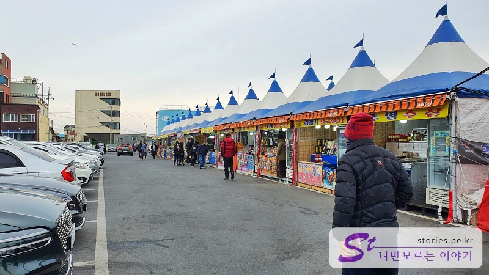

주차는 일본인 가옥거리의 길 건너에 있는 구룡포 공용 주차장을 이용하면 돼요. 주차료는 무료이니까요.

주차장 앞에는 과메기를 파는 상점들이 줄로 서 있어서 주차를 하는 사람들의 얼굴을 뚫어져라 쳐다보십니다. (사라 이거지. 무언의 압빡!!) 막 심하게 호객행위를 하지는 않지만 눈으로 압박을 가하는 고도의 심리전을 구현하고 계십니다. 그 압박감을 뒤로하고 행길 쪽으로 얼른 얼굴을 돌리고 발길을 돌리면 됩니다.

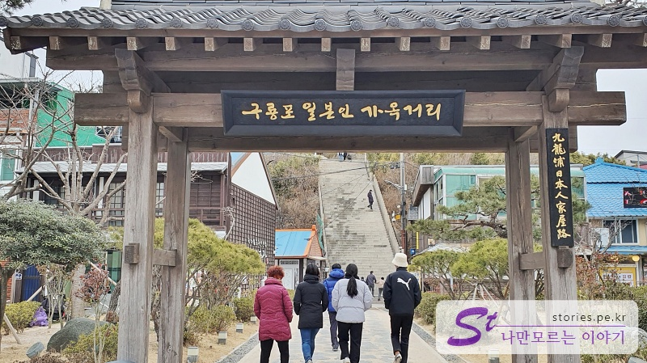

행길을 건너면 구룡포 일본인 가옥거리라는 대문을 지날 수 있어요.

일본인 가옥거리가 별건 없지만 대문을 달아놓으니 뭔가 있을 것 같은 느낌을 줍니다.

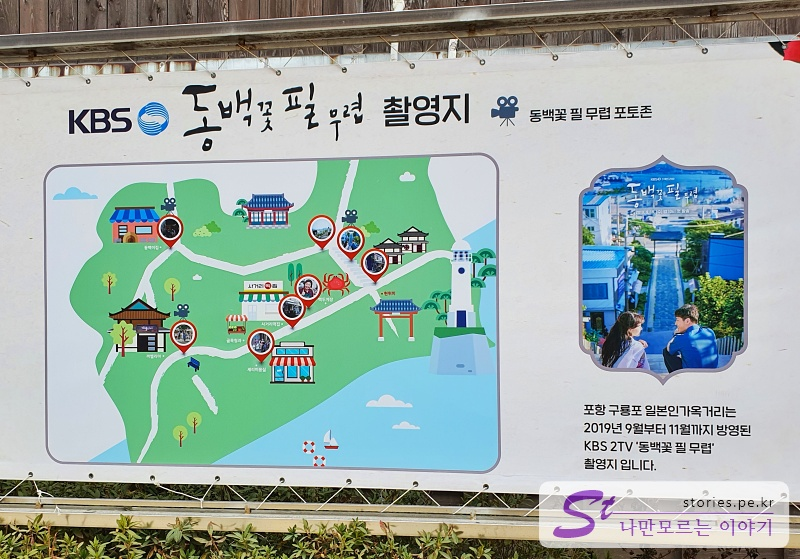

여기 구룡포는 동백이가 다 먹여살리는 것 같아요. 입구에 **동백꽃 필 무렵 촬영지**라고 입간판이 뙇!!

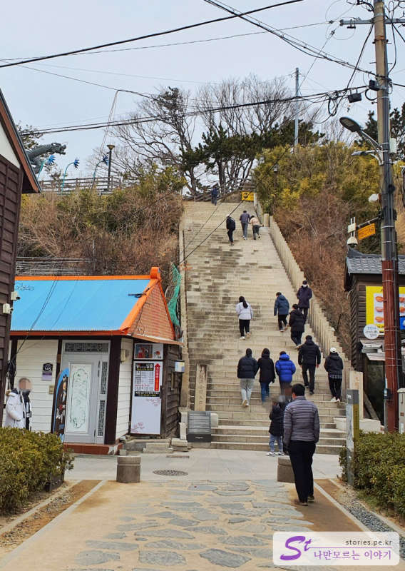

들어오자마자 바로 눈앞에 돌계단이 보이는데, 이곳이 촬영 포인트입니다. 방향은 아래에서 위가 아니라, 위에 올라가서 아래 방향으로 찍어야 한다는 거죠. 동백이도 그렇게 찍었거든요. 그럼 우리도 그렇게 찍어봐야겠죠.

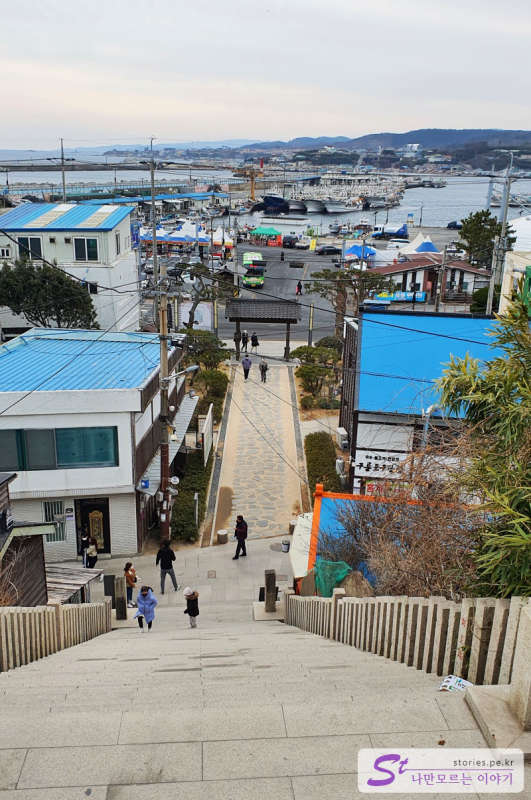

요 방향으로 찍어봐야 해요. 물론 이 사진을 찍기 위해서는 줄을 서야 하겠지만 좋은 컷을 위해서는 해볼만 하죠. 아니면 어느 정도 포기하고 모양새는 나오지 않지만 살짝 옆에서 찍고 내려와도 돼요. ^^ 사진이 밥 먹여주는 것도 아니고....

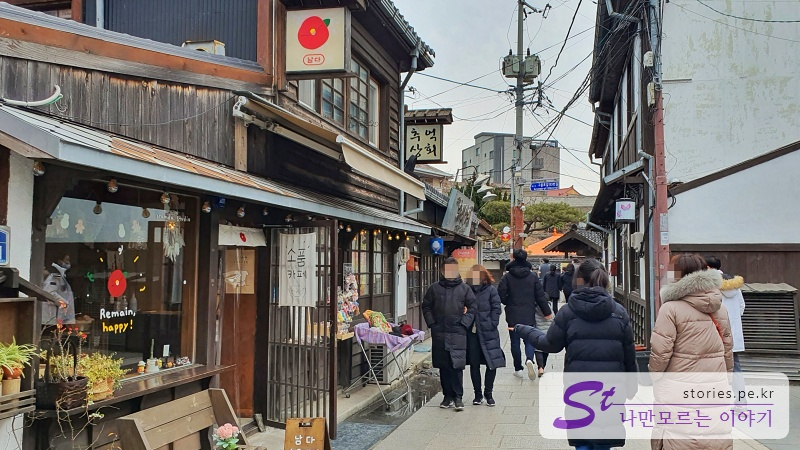

계단을 오르기 전에 먼저 오른쪽에 있는 골목길로 가봤습니다. 건물은 일본의 목조건물의 형태를 띠고 있는데 가게는 현대의 물건을 판매하고 있어서 약간의 언밸런스한 면이 있기는 하지만

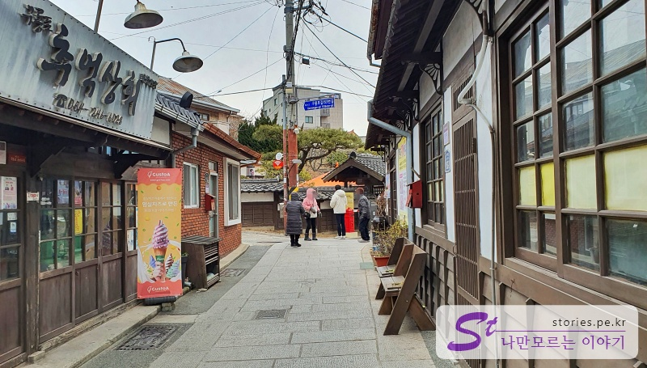

추억 상회라고 옛날 물건이나 음식을 파는 곳 같은데 우리가 갔을 때는 문이 닫혀있었어요. 설날이라 문 닫은 가게가 많더라고요.

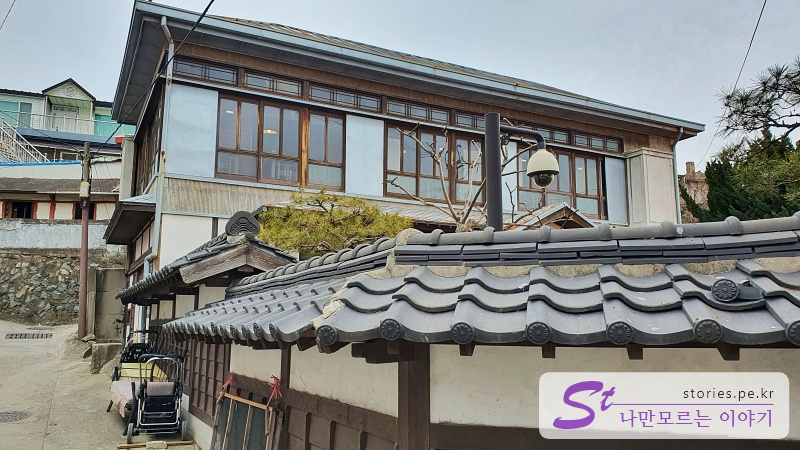

조금만 더 가면 2층 집이 보입니다. 옛날에는 고관대작이 살았을 것 같은 느낌이에요.

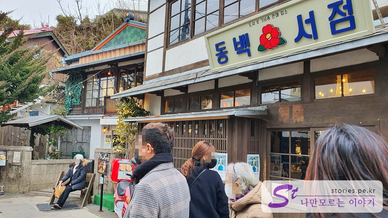

이번에 입구에서 왼쪽 골목길로 가 봤어요. 이곳도 그때 그 느낌이 나게 꾸며져 있었어요. (오른쪽보다는 왼쪽 골목이 더 볼게 많네요. )

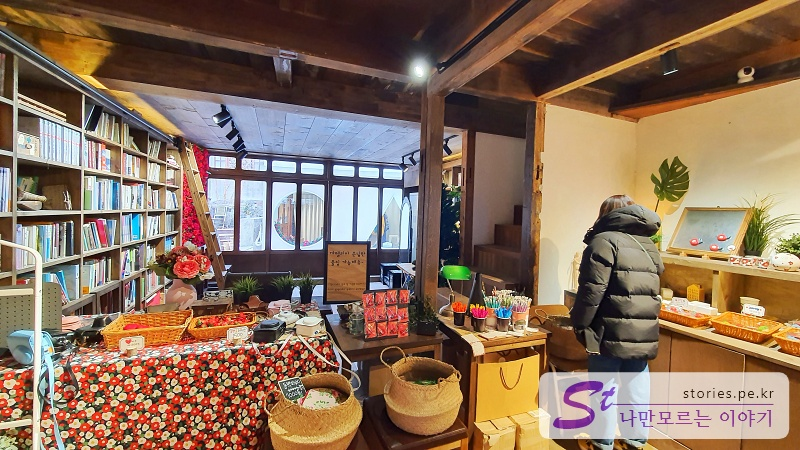

그중에 **동백 서점**에 들어가 봤어요 (그놈의 동백...)

실내도 옛날식으로 꾸며놨고 소품도 옛날에 본듯한 느낌의 소품들이었어요.

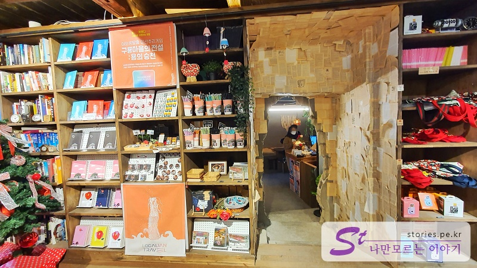

서점 옆으로 구멍이 하나 뚫려있는데, 옆집 카페인 **까멜리아**와 이어져 있는 출입구더라고요.

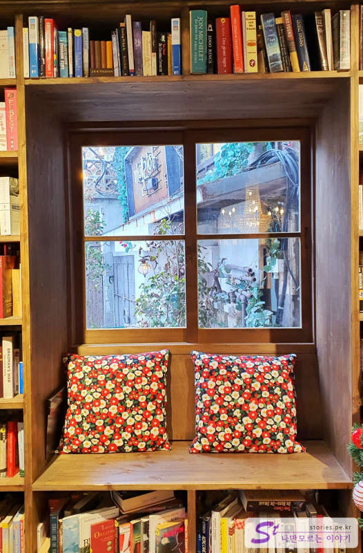

추억을 회상할 수 있게 사진을 찍을 수 있는 공간도 만들어놨네요.

## 여행지 정보

- 주소 : 경상북도 포항시 남구 구룡포읍 구룡포길 153-1
- 연락처 : 054-270-2275

<iframe src='https://www.google.com/maps/embed?pb=!1m18!1m12!1m3!1d1141.347579940902!2d129.56017979209165!3d35.99052856789957!2m3!1f0!2f0!3f0!3m2!1i1024!2i768!4f13.1!3m3!1m2!1s0x35670e7d6c2973ef%3A0x3f1aece8ad8c329c!2z6rWs66Oh7Y-sIOydvOuzuOyduOqwgOyYpeqxsOumrA!5e0!3m2!1sko!2skr!4v1644223030810!5m2!1sko!2skr' class='embed-responsive-item' allowfullscreen></iframe>

## 주차정보

구룡포에 있는 공용주차장을 이용하세요.
