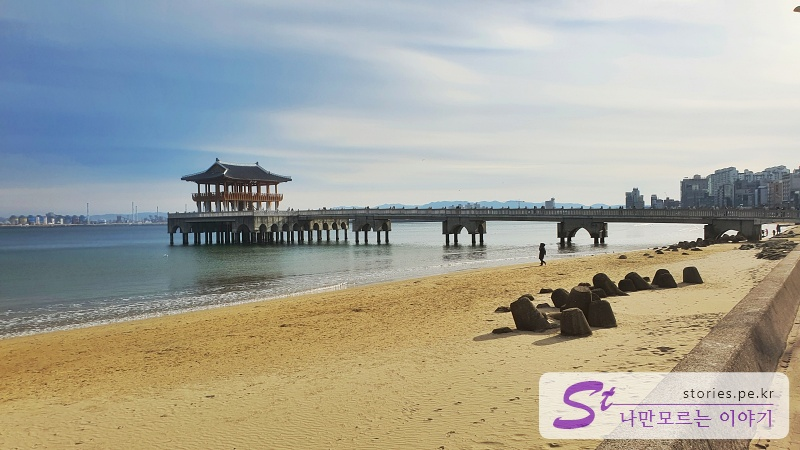
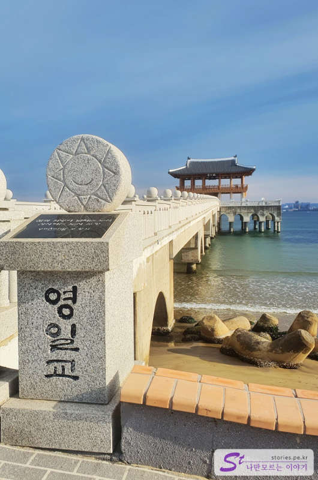

> [[A place to visit in Ulsan and Pohang] Shortcut to the key points of their trip to Ulsan and Pohang](http://junistory.blogspot.com/2022/11/a-place-worth-visiting-in-ulsan-and.html)

Yeongildae Beach is one of Pohang's representative beaches.

Actually, I didn't come here to swim in this winter or to see the winter sea that I saw enough on this trip. I just came to eat. There are a lot of good restaurants here.

While I'm here, I walked on the beach a little bit, but there was a prominent Yeongilgyo Bridge, so I took a picture.

For some reason, if there's that on the beach, I feel like I have to go over there.

So I walked in, and there's nothing much. It's a nice place to just rest and see the sea.

And the rest of the beach doesn't seem to be very different from other places.

However, there are many restaurants, parking lots, and event sites like downtown, so I thought that many people would come in spring, summer, and autumn.

## Travel destination information

- Address: 685-1 Duho-dong, Buk-gu, Pohang-si, Gyeongsangbuk-do
- Contact point: 054-270-2114

<iframe src='https://www.google.com/maps/embed?pb=!1m18!1m12!1m3!1d12902.121244095808!2d129.36941693935242!3d36.056167229044995!2m3!1f0!2f0!3f0!3m2!1i1024!2i768!4f13.1!3m3!1m2!1s0x356703a3f05e4869%3A0x98f8a6822ea8a54c!2z7JiB7J2864yA7ZW07IiY7JqV7J6l!5e0!3m2!1sko!2skr!4v1644299295119!5m2!1sko!2skr' class='embed-responsive-item' allowfullscreen></iframe>

## Parking information

There are too many parking lots nearby. However, it is operated for a fee. (It was free during the Lunar New Year holidays we went to.)
