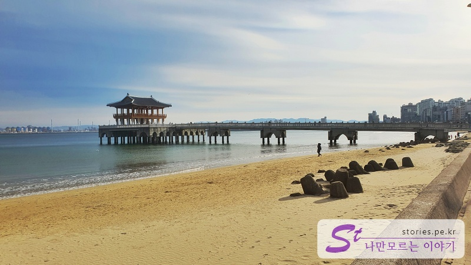

> [[울산 포항 가볼만한곳] 겨울에 다녀 온 2박3일 울산과 포항 여행의 핵심 포인트 바로가기](https://blog.stories.pe.kr/565)

포항의 대표적인 해수욕장 중 하나인 영일대 해수욕장입니다.

사실 이 겨울에 수영하러 온 것도 아니고 이번 여행에서 질릴 만큼 본 겨울바다를 보러 온 것도 아니고.. 단지 밥을 먹기 위해 왔습니다. 여기에 맛 집들이 참 많더라고요.

온 김에 해변을 좀 걸어보긴 했는데, 눈에 띄는 영일교가 있어서 살짝 찍어봤습니다.

왠지 바닷가에 저게 있으면 저리로 가봐야 할 것 같은 충동이 생겨요.

그래서 걸어들어가 봤는데 별건 없고 그냥 쉬기도 좋고 바다 보기도 좋은 그런 곳입니다.

그러고 나머지 해변은 다른 곳과 크게 차별적인 모습은 없는 것 같네요.

다만 번화가처럼 음식점과 주차장과 행사장들이 곳곳에 많이 있어서 봄, 여름, 가을에는 사람들이 많이 오겠다는 생각을 했습니다.

## 여행지 정보

- 주소 : 경북 포항시 북구 두호동 685-1
- 연락처 : 054-270-2114

<iframe src='https://www.google.com/maps/embed?pb=!1m18!1m12!1m3!1d12902.121244095808!2d129.36941693935242!3d36.056167229044995!2m3!1f0!2f0!3f0!3m2!1i1024!2i768!4f13.1!3m3!1m2!1s0x356703a3f05e4869%3A0x98f8a6822ea8a54c!2z7JiB7J2864yA7ZW07IiY7JqV7J6l!5e0!3m2!1sko!2skr!4v1644299295119!5m2!1sko!2skr' class='embed-responsive-item' allowfullscreen></iframe>

## 주차정보

주차장은 인근에 너무 많이 있습니다. 다만 유료로 운영 있습니다. (우리가 간 설날 연휴에는 무료였어요)
