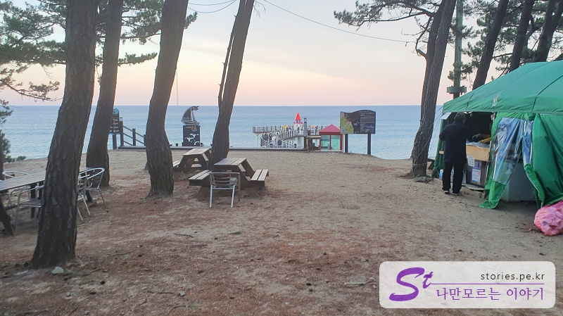
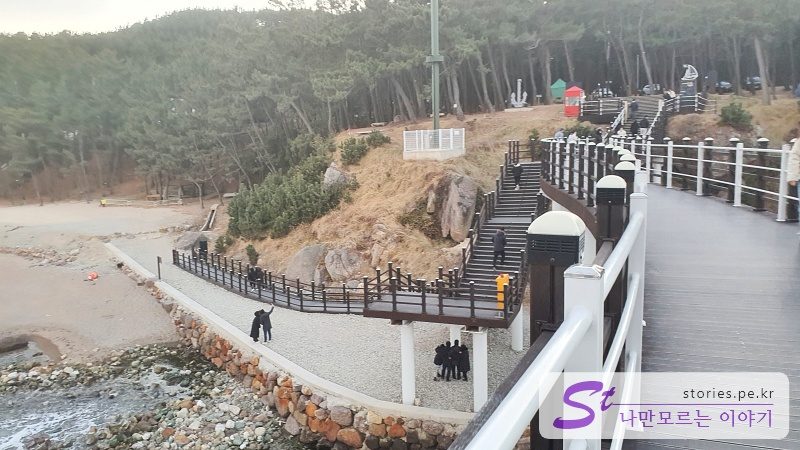

> [[A place to visit in Ulsan and Pohang] Shortcut to the key points of their trip to Ulsan and Pohang](http://junistory.blogspot.com/2022/11/a-place-worth-visiting-in-ulsan-and.html)

This is the last place I stopped by before I came to Seoul. It's hidden in the forest, so you can't see it well while driving by. It's a place where you have to come with the determination to find something.

They say this is a private property. There is no separate parking lot, but you have to park next to the street. There is a parking space across the street.

There's a cart bar doing business, but when we arrived, they were packing, so I don't know exactly what they sell.

If you pass here, you can see the observatory in the front.

I heard that the Igarari Anchor Observatory is heading for Dokdo. I can't see it

From the sky, you can clearly see the shape of an anchor, but from a human eye level, well... You have to draw the anchor in your imagination. Hah!

The red building in the center serves as a point well, so the picture is not boring.

The red building... ...is just an empty building.

When I came back to the other side, there was a way up from the beach below. This is called Igari Simple Beach, so I think you can park here and follow the stairs.

## Time of entry

- Operating hours: 09:00 - 18:00 daily (open 09:00 - 20:00 in June and August)
- Time required: 10 minutes round trip
- Closed:

## Travel destination information

- Address: 67-3 Igarisan Mountain, Cheong-myeon, Buk-gu, Pohang-si, Gyeongsangbuk-do
- Contact point: 054-270-3204

<iframe src='https://www.google.com/maps/embed?pb=!1m18!1m12!1m3!1d3220.1136973261737!2d129.37736231554493!3d36.18811660961254!2m3!1f0!2f0!3f0!3m2!1i1024!2i768!4f13.1!3m3!1m2!1s0x35671fbc3b53d3ab%3A0x75b63b8b9da22525!2z7J206rCA66asIOuLuyDsoITrp53rjIA!5e0!3m2!1sko!2skr!4v1644298392591!5m2!1sko!2skr' class='embed-responsive-item' allowfullscreen></iframe>

## Parking information

There is no formal parking lot, but you can park by the side of the road. Or you can go down to the beach, park, and walk up to the observatory.
