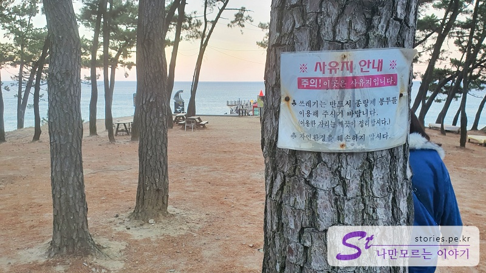
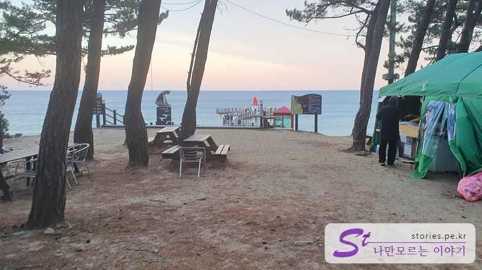
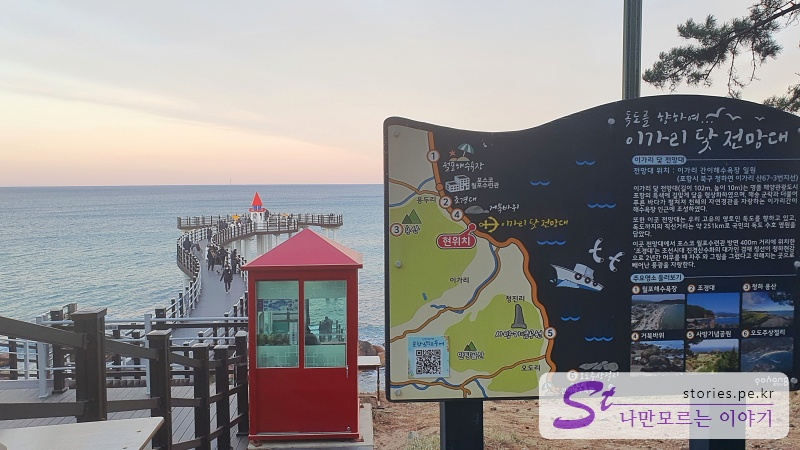
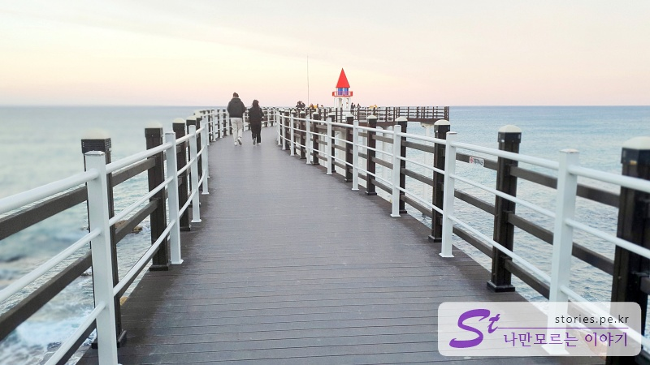
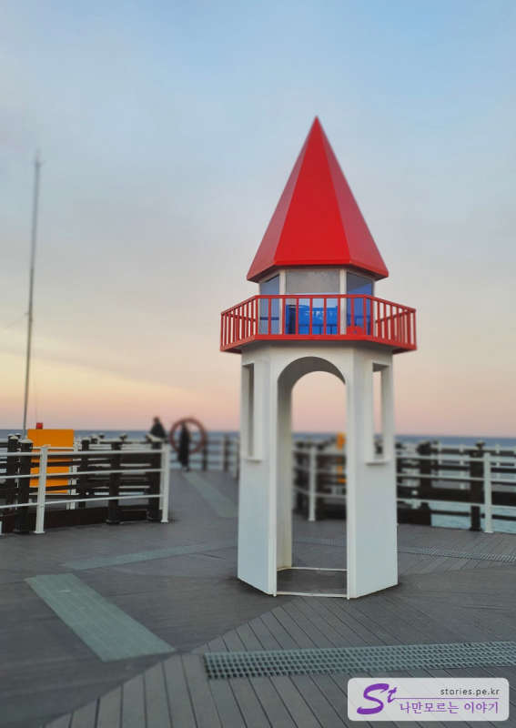
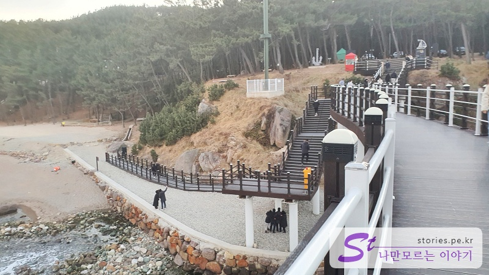

> [[울산 포항 가볼만한곳] 겨울에 다녀 온 2박3일 울산과 포항 여행의 핵심 포인트 바로가기](https://blog.stories.pe.kr/565)

서울로 올라오기 전 마지막으로 들른 곳이에요. 숲에 가려져 있어서 차를 타고 지나오면서는 잘 보이지 않아요. 별로도 찾겠다는 마음을 먹고 와야 하는 곳입니다.

이곳이 사유지라고 하네요. 별도로 갖추어진 주차장은 없고 길 옆에 주차를 해야 해요. 길 건너에도 주차를 할 수 있는 공간이 있고요.

포장마차 하나가 장사를 하고 있는데 우리가 도착했을 때는 짐을 싸고 계셔서 정확히 무엇을 파는 곳인지는 모르겠네요.

여기를 지나면 앞쪽에 전망대가 보입니다.

이가리 닻 전망대가 독도를 향하고 있다고 하는데 뭐.. 보이지는 않네욬

하늘에서 보면 명확히 닻 모양의 형태가 보이는데, 사람 눈높이에서 보면 음... 상상으로 닻을 그려야 해요. ㅎ

중앙에 있는 빨간 건물이 포인트 역할을 잘 해주고 있어서 사진이 심심하지는 않네요.

빨간 건물은......... 그냥 빈 건물이에요.

반대쪽으로 돌아오다 보니 아래 해변에서 올라오는 길도 있더라고요. 여기가 이가리 간이해변이라고 하는데 이곳에 주차를 하고 계단 따라 올라와도 될 것 같네요.

## 입장시간

- 운영시간 : 매일 09:00 - 18:00 운영 (6-8월은 09:00-20:00 개방)
- 소요시간 : 왕복 10분
- 휴무일 :

## 여행지 정보

- 주소 : 경북 포항시 북구 청하면 이가리 산67-3
- 연락처 : 054-270-3204

<iframe src='https://www.google.com/maps/embed?pb=!1m18!1m12!1m3!1d3220.1136973261737!2d129.37736231554493!3d36.18811660961254!2m3!1f0!2f0!3f0!3m2!1i1024!2i768!4f13.1!3m3!1m2!1s0x35671fbc3b53d3ab%3A0x75b63b8b9da22525!2z7J206rCA66asIOuLuyDsoITrp53rjIA!5e0!3m2!1sko!2skr!4v1644298392591!5m2!1sko!2skr' class='embed-responsive-item' allowfullscreen></iframe>

## 주차정보

정식 주차장은 없고 길옆으로 주차를 할 수 있습니다. 또는 이가리 간이해변 쪽으로 내려가서 주차를 하고 걸어서 전망대로 올라올 수도 있네요.
