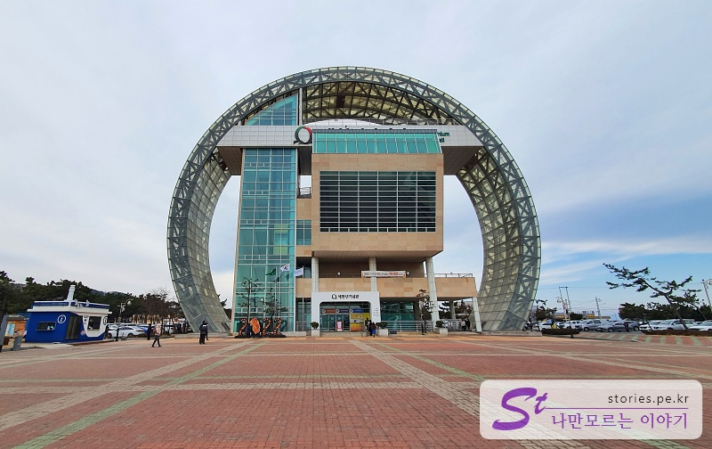
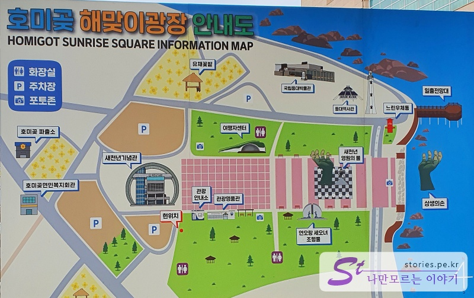
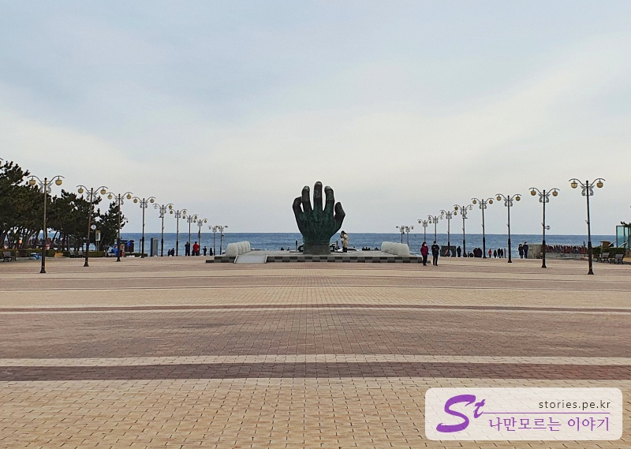
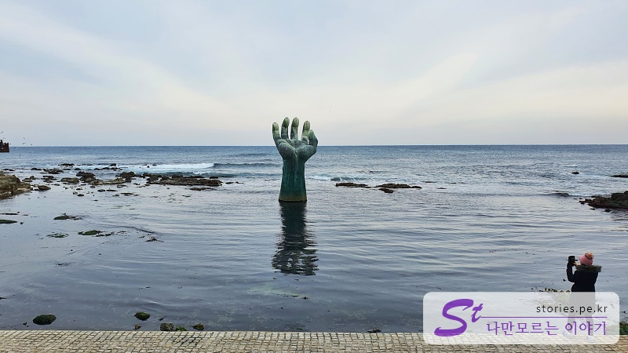
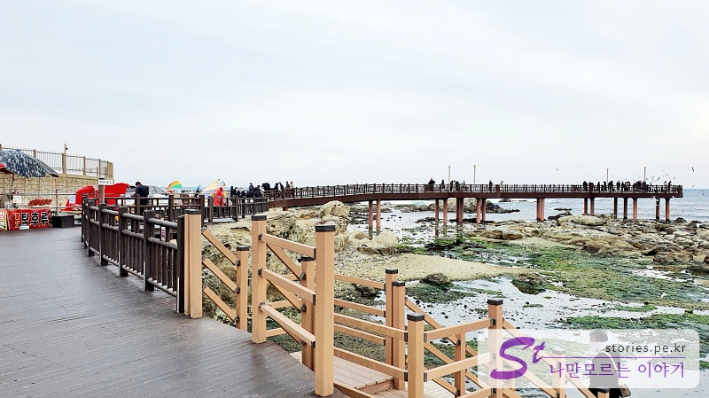
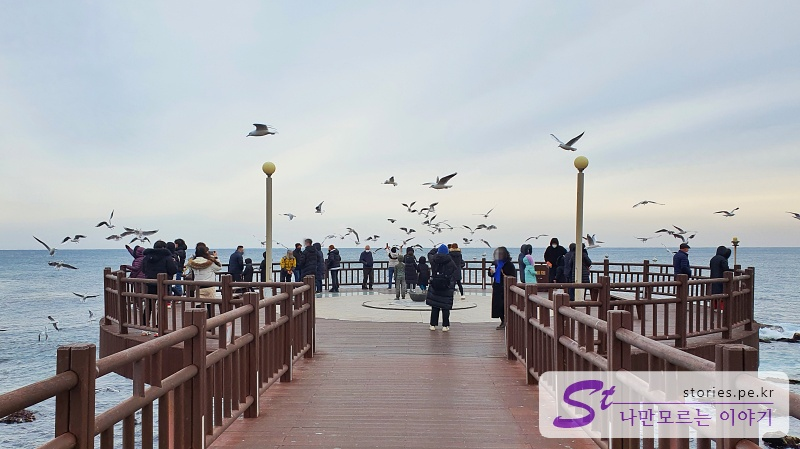
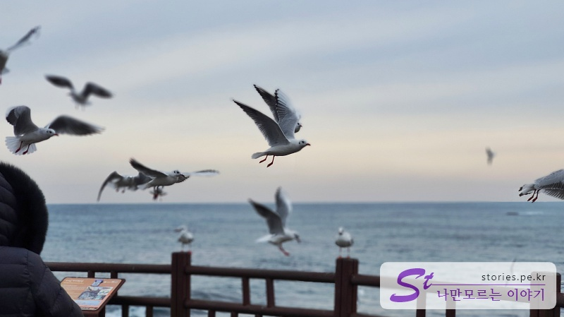

> [[A place to visit in Ulsan and Pohang] Shortcut to the key points of their trip to Ulsan and Pohang](http://junistory.blogspot.com/2022/11/a-place-worth-visiting-in-ulsan-and.html)

I went to the Sunrise Homigot, one of the most famous tourist attractions in Pohang. Before I go up to downtown Pohang, I'd like to stop by Homigot and see the famous hand-shaped structure **Win-Win Hand**.

As expected, Homigot is a place that many people visit, so the parking lot is wide, the plaza is wide, and the Millennium Memorial Hall is very large.

It's more like a park than just a beach. It's too much to look around here, and I've only been to the win-win hands and the sunrise observatory.

When I looked in the opposite direction at the Millennium Memorial, I saw a huge hand, so I was surprised and ran, and I thought it was a win-win hand. No, this hand is an imitation. You have to walk a little further along this road toward the sea to see the true hands of life.

The hands that came up from the sea are the true **creative hands**. (Is it co-prosperity or asking for help?)

Anyway, win-win's hands are unique, and they're smaller than I thought.

There is **Sunrise Observatory** where you can see the sea if you turn left from the hand of co-prosperity. This is a famous seagull restaurant.

Before going up to the sunrise observatory, the lady who sells shrimp crackers in front of the bridge is also selling them. Seagulls flock together to eat this shrimp snack.

These guys are also addicted to capitalism, so they don't come unless you give them shrimp chips. I took a picture of someone running away.

## Travel destination information

- Address: Daebori, Homigot-myeon, Nam-gu, Pohang-si, Gyeongsangbuk-do
- Contact number: 054-270-5855

<iframe src='https://www.google.com/maps/embed?pb=!1m18!1m12!1m3!1d958.7046196608792!2d129.5687223493574!3d36.07678383725865!2m3!1f0!2f0!3f0!3m2!1i1024!2i768!4f13.1!3m3!1m2!1s0x356713df8abedfe1%3A0xd19344505ac4a299!2z7Zi466-46rO2IO2VtOunnuydtOq0keyepQ!5e0!3m2!1sko!2skr!4v1644233282137!5m2!1sko!2skr' class='embed-responsive-item' allowfullscreen></iframe>

## Parking information

There is a fairly large free parking lot.
