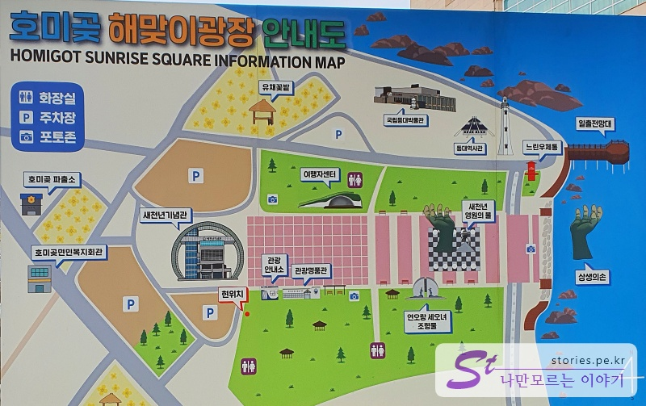
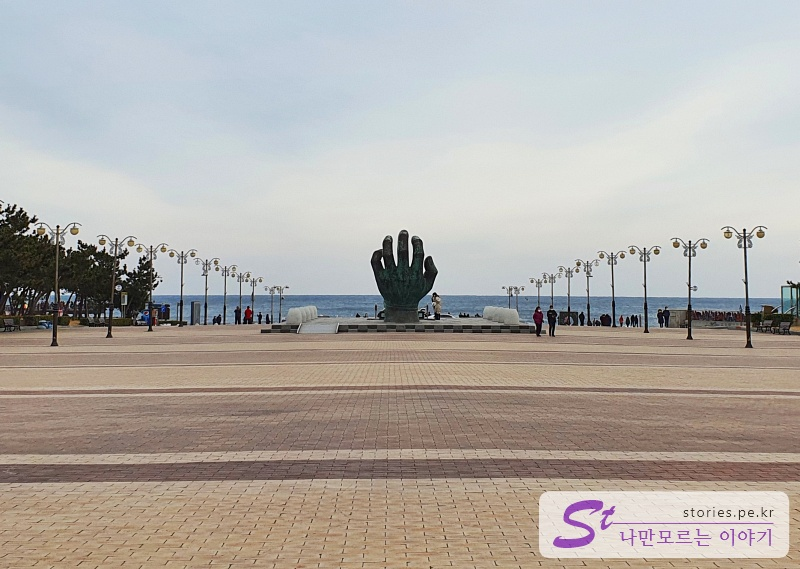
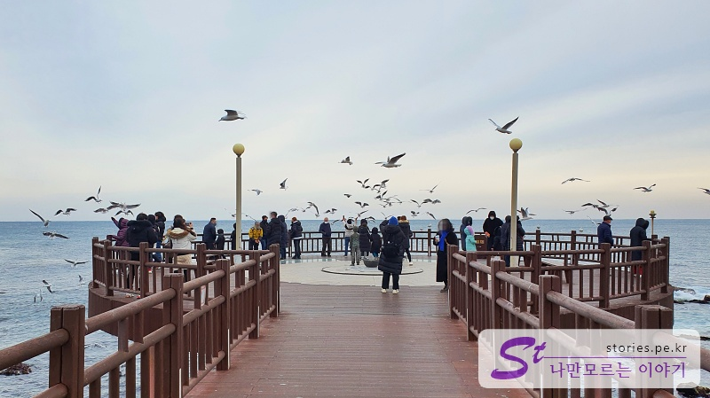

> [[울산 포항 가볼만한곳] 겨울에 다녀 온 2박3일 울산과 포항 여행의 핵심 포인트 바로가기](https://blog.stories.pe.kr/565)

포항에서 가장 유명한 관광지 중 하나인 해맞이 호미곶으로 갔습니다. 포항 시내로 올라가기 전에 호미곶을 들러서 그 유명하다는 손 모양 건축물인 **상생의 손**을 한번 보려고요.

역시 호미곶은 사람들이 많이 찾는 곳이라 그런지 주차장도 넓고 광장도 넓고 새천년기념관도 엄청 크게 생겼습니다.

이건 뭐.. 그냥 해변이라기보다는 공원에 더 가까운 모습이네요. 여기를 다 돌아보기는 너무 무리고 상생의 손과 일출 전망대만 다녀왔어요.

새천년기념관에서 반대 방향을 쳐다보니 엄청나게 큰 손이 보여서 깜짝 놀라 달려가 보니 상생의 손인 줄 알았으나... 아니네요. 이손은 모조품입니다. 이 길을 따라 좀 더 바다 쪽으로 걸어가야 진정한 생생의 손을 볼 수 있어요.

이렇게 바다에서 올라온 손이 진정한 **상생의 손**입니다. (상생인지 살려달라고 하는 것인지..)

어쨌든 상생의 손이 특이하긴 해요 그리고 생각보다 크기가 작네요.

상생의 손에서 왼쪽으로 돌아서면 바다를 볼 수 있는 **일출 전망대**가 있어요. 여기가 갈매기 맛집입니다.

일출 전망대로 올라가기 전에 다리 앞에서 장사하시는 아주머니가 새우깡도 팔고 있어요. 이 새우깡을 먹으려고 갈매기들이 엄청 몰려듭니다.

이놈들도 자본주의에 물들어서 새우깡을 주지 않으면 오지를 않아요. 도망가는 놈 살짝 찍어봤어요.

## 여행지 정보

- 주소 : 경북 포항시 남구 호미곶면 대보리
- 연락처 : 054-270-5855

<iframe src='https://www.google.com/maps/embed?pb=!1m18!1m12!1m3!1d958.7046196608792!2d129.5687223493574!3d36.07678383725865!2m3!1f0!2f0!3f0!3m2!1i1024!2i768!4f13.1!3m3!1m2!1s0x356713df8abedfe1%3A0xd19344505ac4a299!2z7Zi466-46rO2IO2VtOunnuydtOq0keyepQ!5e0!3m2!1sko!2skr!4v1644233282137!5m2!1sko!2skr' class='embed-responsive-item' allowfullscreen></iframe>

## 주차정보

상당히 넓은 무료주차장이 있습니다.
