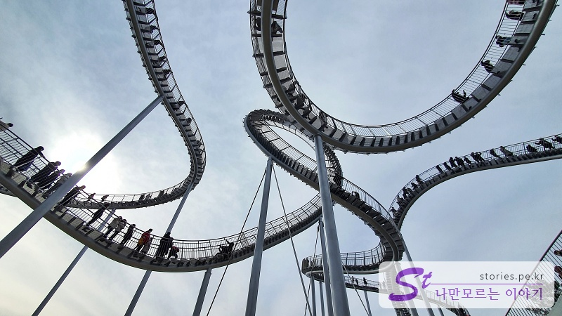

> [[A place to visit in Ulsan and Pohang] Shortcut to the key points of their trip to Ulsan and Pohang](http://junistory.blogspot.com/2022/11/a-place-worth-visiting-in-ulsan-and.html)

Pohang's rising tourist destination is the **Welcome Park Space Walk** near Yeongildae Beach. The spacewalk installed on the ridge is located in Yeongildae Beach, where you can see it naturally from nearby. This sculpture is not only seen with the eyes, but also with people who can climb up the stairs, and if you go up, it gives you a more thrilling experience than zip-line or paragliding.

It is said that POSCO donated to Pohang City, but Pohang City has a good number of tourists, and POSCO can promote POSCO widely, so I think it is a win-win deal. POSCO commissioned the author of Tiger & Turtle - Magic Mountain in Germany to make it.
It's safe to say that it's designed to withstand wind speeds and earthquakes, right?
This spacewalk is controlled when the wind blows harder than the standard level or when the number of people exceeds the limit. I think we operate with the least safety.

## Cheering Park

There are several ways to get up here as it is on the mountain ridge, and we went up through the cheering park.

Parking was difficult because of the crowd, but we barely parked in a residential area near the cheering park. It's good to go to the cheering park, but most of them seem to have come to experience the space walk.

Walk up a sloping hill along the road. The road is not bad because it's a park, so you can go up easily. Oh, my legs!

As you go, there is a guide to using Space Walk. It is open from 10 to 16 on weekdays and from 10 to 17 on weekends and holidays.

## Space Walk

Quite a lot of people are standing in line to walk here. We waited in line for 30 to 40 minutes and went up
I think the rotation rate was good because many people went up and down. There were a lot of people waiting, but it quickly decreased.

There is only one entrance and it is a structure that comes back down to the place where it went up. And as soon as you go up, you can go in two directions, right or left. Both directions are dizzying, but the right side stretches gently and the left side has to go up the steep stairs first. It looks like the stairs are connected to each other, but it's actually a form where you have to go and come back and forth. A man can't walk the turn. So the section where people can walk is divided into two parts.

You can only walk before the section that rotates in the middle 8 characters.

When the wind blows even a little, it feels like it shakes a lot on the stairs, so it's dizzying. But it's safe to say that it's designed with that in mind, right?

If you look at it from the stairs, it looks like this. It's dizzying just by looking at the picture
This is downtown and on the other side, you can see Yeongildae Beach in the air.

## Cost

It's free.

## Time of entry

- Operating hours: 10 to 16 on weekdays and 10 to 17 on weekends and holidays
- Time: Except for waiting time, you can think about 10 to 30 minutes to actually go up and down.

## Travel destination information

- Address: Duho-dong, Buk-gu, Pohang-si, Gyeongsangbuk-do
- Contact point: 054-270-8282

<iframe src='https://www.google.com/maps/embed?pb=!1m18!1m12!1m3!1d3225.117135984749!2d129.38899976554256!3d36.066246916366765!2m3!1f0!2f0!3f0!3m2!1i1024!2i768!4f13.1!3m3!1m2!1s0x356703d98a6e96a1%3A0xdc74ccb479f603ad!2z7ZmY7Zi46rO17JuQIOyKpO2OmOydtOyKpOybjO2BrA!5e0!3m2!1sko!2skr!4v1644294226976!5m2!1sko!2skr' class='embed-responsive-item' allowfullscreen></iframe>

## Parking information

**You have to use the 3rd parking lot** in the cheering park, but when we went, all the parking lots were full, so we parked in a nearby apartment.

I haven't been there, but I think you can park at **Hwanho-dong Beach Park Public Parking Lot** and come up to the other side.
