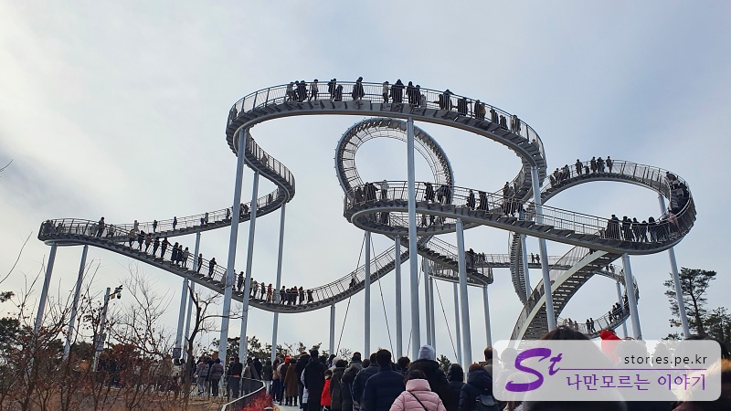
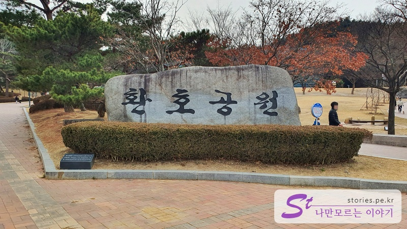
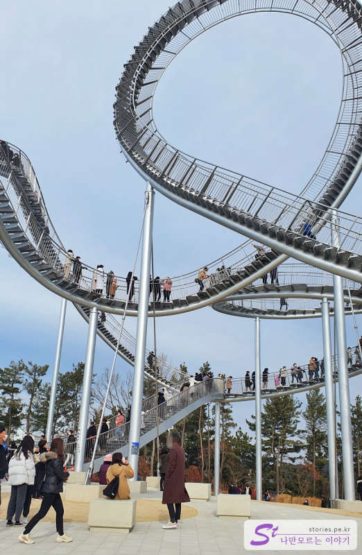
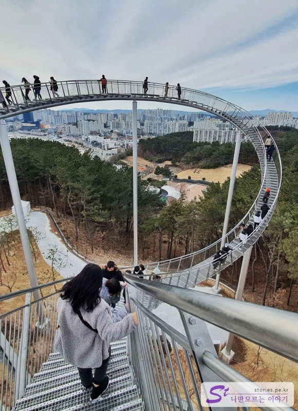

> [[울산 포항 가볼만한곳] 겨울에 다녀 온 2박3일 울산과 포항 여행의 핵심 포인트 바로가기](http://junistory.blogspot.com/2022/11/a-place-worth-visiting-in-ulsan-and.html)

포항의 떠오르는 관광지라고 하면 단연 영일대해수욕장 근처에 있는 **환호공원 스페이스 워크**라고 할 수 있습니다. 산마루에 설치되어 있는 스페이스 워크는 영일대해수욕장은 물로 인근에서 자연스럽게 볼 수 있는 곳에 위치해 있습니다. 이 조형물은 눈으로만 보는 것이 아니라 직접 사람이 계단을 타고 올라가 볼 수 있는데, 올라가면 짚라인이나 패러글라이딩 보다 더 짜릿한 경험을 선사해 줍니다.

포스코가 포항시에 기증을 했다고 하는데 포항시는 관광객이 늘어서 좋고 포스코는 포스코를 널리 알릴 수 있어서 서로 윈윈하는 거래가 아닌가 합니다. 포스코가 독일에 있는 '타이거 앤드 터틀 매직 마운틴(Tiger & Turtle - Magic Mountain)'을 제작한 작가에게 의뢰하여 만들었다고 하네요.
풍속과 어느 정도의 지진에도 견딜 수 있게 설계했다고 하니 안전하겠지요?
이 스페이스 워크는 바람이 기준치 이상 세게 불거나 제한 인원이 넘어서면 통제를 한다고 하네요. 최소한의 안전은 지키면서 운영하는 것 같아요.

## 환호 공원

산마루에 있는 만큼 이곳에 오를 수 있는 방법이 몇 가지가 있는데, 우리는 환호공원을 통해 올라갔습니다.

사람이 몰리는 만큼 주차가 어려웠는데, 우리는 겨우 환호공원 쪽의 주택가에 주차를 하고 올라갔습니다. 환호공원도 좋지만 대부분 스페이스 워크를 경험해 보고자 온 사람들인 것 같았어요.

길을 따라 경사진 언덕을 걸어 올라가야 합니다. 공원이라 길이 나쁘지는 않아서 쉽게 올라갈 수.. 아이고 다리야~

가다 보면 스페이스 워크의 이용안내가 있습니다. 평일에는 10-16시, 주말, 공휴일에는 10-17시까지 운영을 한다고 하네요.

## 스페이스 워크

제법 많은 사람들이 여기를 걸어보고자 줄을 서있습니다. 저희도 한 30~40분 줄을 서서 기다리다가 올라갔는데
많은 사람들이 올라갔다가 내려오기 때문에 회전율은 좋은 것 같았어요. 대기자가 많았는데, 금세 줄어들더라고요.

입구는 하나이며 올라간 곳으로 다시 내려오는 구조입니다. 그리고 올라가자마자 오른쪽 또는 왼쪽의 두 방향으로 갈 수 있습니다. 두 방향 모두 아찔하지만 오른쪽은 완만하게 길게 뻗어있고 왼쪽은 급경사의 계단을 먼저 올라가야 합니다. 보기에는 계단이 서로 연결되어 있는 것처럼 보이지만 실제로는 갔다가 되돌아와야 하는 형태로 되어 있습니다. 사람이 회전 구간을 걸어갈 수는 없는 노릇이니.. 그래서 사람들이 걸어볼 수 있는 구간은 2군데로 나누어집니다.

가운데 8자로 회전하는 구간 전까지만 걸어갈 수 있습니다.

바람이 조금이라도 불면 계단에서는 상당히 많이 흔들리는 것처럼 느껴져서 아찔 아찔해요. 하지만 그것까지 감안하여 설계되었다고 하니 안전은 하겠지요?

계단에서 보면 대략 이런 느낌입니다. 사진으로만 봐도 아찔아찔하죠~ㅎ
이쪽은 시내 방향이고 반대쪽으로는 영일대해수욕장을 공중에서 볼 수 있습니다.

## 비용

무료입니다.

## 입장시간

- 운영시간 : 평일에는 10-16시, 주말, 공휴일에는 10-17시
- 소요시간 : 기다리는 시간 제외하고 실제 올라가서 내려오기까지 대략 10~30분 정도 생각하면 됩니다.

## 여행지 정보

- 주소 : 경북 포항시 북구 두호동
- 연락처 : 054-270-8282

<iframe src='https://www.google.com/maps/embed?pb=!1m18!1m12!1m3!1d3225.117135984749!2d129.38899976554256!3d36.066246916366765!2m3!1f0!2f0!3f0!3m2!1i1024!2i768!4f13.1!3m3!1m2!1s0x356703d98a6e96a1%3A0xdc74ccb479f603ad!2z7ZmY7Zi46rO17JuQIOyKpO2OmOydtOyKpOybjO2BrA!5e0!3m2!1sko!2skr!4v1644294226976!5m2!1sko!2skr' class='embed-responsive-item' allowfullscreen></iframe>

## 주차정보

**환호공원 3주차장**을 이용해야 하는데, 저희가 갔을 때는 주차장이 모두 만차라서 인근 아파트에 주차를 했습니다.

가보지는 않았지만 **환호동 해변공원 공영주차장**에 주차를 하고 반대편 쪽으로 올라와도 될 것 같습니다.
