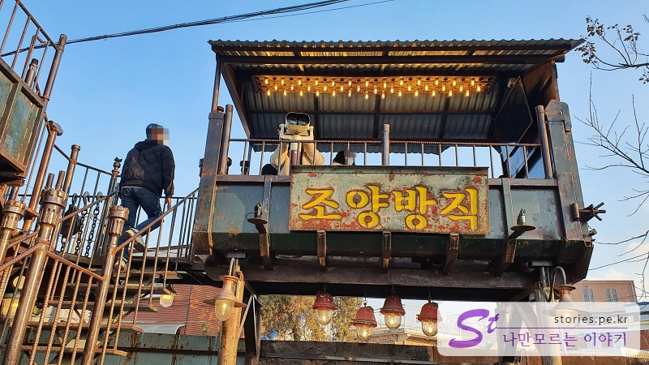

I went on a trip to Ganghwado Island to celebrate the holiday on March 1st. I made a schedule so that I can go and come back easily with a schedule that is not too hard, and the entire schedule is as follows.

**Kangwha Seaside Resort Luge** --> **Lunch Meal (Jun-recipe)** --> **Kwangseongbo** --> **Choyang Textile**

We left at 9 a.m. and traveled about an hour to visit **Gangwha Seaside Resort Luge** first.

## Ganghwa Luge (Gangwha Seaside Resort Luge)

Luge is a popular travel course in Ganghwa, so I decided to schedule it before it was crowded and it was a good choice.
The parking lot was quite spacious because Ganghwa Luge was located in the Seaside Resort. I don't think I need to worry about parking.

When you get to the luge, it's gonna be big. I see a big billboard saying, "I'm a luge!"
The first thing you have to do when you go through here is to make a ticket.

### Ticket sales

The official usage fee for luge is as above.
There is a difference in the cost of weekdays, weekends, and holidays.

We're adults, so we just bought a one-time ticket, but if you're serious about luge or have children, it would be good to use a two to three-time ticket. Luge~~ It's fun ^^
Other usage information is as follows. I brought it from the homepage.

> - Do not apply preferential treatment with other affiliated cards and promotions
> - Senior Citizens/Gimpo CC members offer discounts of 2,000 won for 1~2 luge & gondola tickets and 4,000 won for 3 tickets. > (Provide identification or documents that can be verified)
> - Group (over 20 people) Contact Us: ☏032-930-9000
> - 65 years of age or older cannot ride luge / Gondola only available
> - Available for individual boarding over 120cm and over 10 years of age (if both conditions apply)
> - Children's companion ticket 85cm to 120cm, or under 10 years of age can be purchased
> - Companion boarding guardians are adults (20 years of age or older) only.
> - Maximum weight is less than 120kg when riding together, infants and children must be at the responsibility of their guardians > (Children under 85cm cannot ride luge)
> - Please check the usage information for details
> - Elections and national holidays apply at weekend rates

### Discount information

Officially, discounts are available only for those who are **Route/Gunmin/Gimpo CC members**. In order for others to get a discount, they usually have to look for online reservation discounts. I'll give you meaningful discount information.
The place of purchase is different for each weekday and holiday.
It's cheaper to use KKday on weekdays and Waug on holidays.
**Online reservations must be made at least one day in advance.**
We only sell weekday tickets on KKday, but we don't sell weekend and holiday tickets.

- **KKday**: https://www.kkday.com/ko/product/120251
- - **와그(Waug)** : https://www.waug.com/ko/goods/110286

### Riding a gondola

If you bought the pass, you should take a gondola to the starting point.

The view from the gondola is also very good. You can see the luge course as you go up, and it's a chance to know what luge is.

When you get off the gondola, you'll see a faint picture on the floor.
I know what this is, but... If you take a picture, you can take a picture as if you are standing on a big hole. This is called magic art. ^^

Then you can see two luge sticks to the floor. A lot of people are using it as a photo spot.

If there is a **LOVE** sculpture in New York, there is a **LUE** sculpture in Ganghwado Island.
At first glance, you might think it's LOVE, but if you look closely, it's **LUE**. It's a parody.
But people always take pictures here.

If you walk up to the observatory, you can see the observatory where you can see the entire luge course.
The view from here is a good restaurant.

If you turn around and head toward the outdoor observatory of the revolving observatory, there is a space where you can sit and relax for a while.

There are butterfly wings on the wall, so you can turn people into angels
The upper part of the observatory is a cafe run by Tom & Toms.
We didn't have to go into the cafe, so we came down right away.

### Riding the Luge

We took pictures and looked around at the top. We rode the luge and came down.
Luge has a different entrance between the first and second riders.
The left side of the luge is the course where the second or more riders ride, and the right side is the entrance where the first riders ride.
I think that's how they distinguished it because first-timers need to be trained to ride luge, and second-time or higher riders can get on right away without training.
There are two courses on the luge: **Valley Course** and **Ocean Course**.
Valley course has a lot of slopes, and Ocean course has a lot of cornering.
We only rode it once, so we just rode it towards **Ocean Course**.

I couldn't take a picture because I heard I couldn't take a picture while I was on board, so I took some pictures only at the last destination.

If you get on board like this, you can put a stamp on the back of your hand.
The luge ended around 11:30, so we're going to have lunch at a nearby restaurant

## Jun's Recipe (Lunch)

The place we chose is Jun-recipe. Nearby, there was a famous broadcasting company, Kang Doenjang, but our pick was Jun-recipe.
I was busy eating, so I couldn't leave a picture of the entrance to the restaurant or the food I ate, but please check the information below.

> Junsrecipe: http://naver.me/FMA6xsZm

We ordered a three-person soban, 45,000 won and ate it.
It was 15,000 won per person, so it wasn't a bad price for a tourist destination.
The taste of the food was neat and good, and each person had one abalone, so the quality was not bad.

## a beam of light

After finishing the meal, we headed to Gwangseongbo.
Chojijin, Deokjinjinjin, and Yongjinjinjin are listed along the sea route separating Ganghwa and inland, and Gwangseongbo was the place where you can walk the most, so I went to Gwangseongbo to take a walk after eating.
When you arrive at Gwangseongbo, there is a battery on the left side based on the castle gate, and on the right side, there is a road to **Sondolmokdondae and **Yongdudondae.

We looked around the battery on the left first.

There is an exhibition space on the inside and a wall on the outside.

They're supposed to fire these cannons through holes in each wall.

This time, go up to the right by the gate. If you walk slowly for about 10 minutes this way, you will find **Sondolmokdondae**, which is the highest place in Gwangseongbo, so you can check the appearance of enemy troops on all sides. This is the view from the Sondolmokdondae toward the Yongdudondae.

I came down from Sondolmokdondae and went to Yongdudondae. Yongdudondae is a long stretch toward the beach, so it is the closest place to deal with enemies approaching the sea.
I took a walk in Gwangseongbo for about an hour, and this time I headed to Choyang Textile.

## Cao Yang Textile Co., Ltd

There used to be a lot of textile factories in Ganghwado Island. Over the years, all those textile factories have disappeared. Choyang Textile used to be one of those closed factories, and now it's very popular as someone started to convert it into a cafe and decorate it.
There are several parking lots around, but most of them are packed.

### Outdoor

It looks like someone else's yard when you go into a cafe.
In fact, the place you see in the picture is the exit and the entrance is supposed to be through the small door on the left.

Passing through the entrance, you can see a bus carrying old textile workers in a small yard.
Here, you can get a picture that can evoke nostalgia from the old days when there was a guide sheep.

**"If you don't get off~ Okay~"~"**

If you come out to the yard, you can see a panoramic view of the outside of Choyang Textile. There are sculptures here and there. It's all full of old buildings and things, so you can feel nostalgia.

You can ride a tractor. It doesn't move

There is also a viewing platform that I didn't see when I first came here.

This is a view of the outside of Joyang Textile Co., Ltd. That's cool.

### Indoor

The outside is very nice, but the interior is very unique and wonderful. At first, I think the attraction of Zhaoyang Textile is a panoramic view of the interior. It's so hip. \

It's a panoramic view of the stairs going up to the second floor. It's really vast and it looks great.
Who wouldn't fall in love with this scenery?

The interior is decorated with small old items in the corner.

I think the ceiling was dustproofed while using rafters from the existing textile factory. I think this part also plays a part in the interior.

There are simple games in every corner of the room, and there are many things to see, so it's good to drink tea, but it's good to watch.

It's a slogan that burst into laughter.
It's a course where you can easily go to Ganghwado Island on the day.
It was a travel course that satisfied all the people who went with me.
