3월 1일 휴일을 맞이하여 강화도로 여행을 다녀왔어요. 너무 힘들지 않은 일정으로 쉬엄쉬엄 다녀올 수 있게 일정을 잡았고 전체 일정은 아래와 같아요.

**강화 씨사이드 리조트 루지** --> **점심식사(준스레시피)** --> **광성보** --> **조양 방직**

오전 9시에 출발해서 약 1시간 정도 이동하여 먼저 **강화 씨사이드 리조트 루지**를 먼저 방문했습니다.

## 강화 루지 (강화 씨사이드 리조트 루지)

루지는 강화에서 인기 있는 여행 코스이기 때문에 사람들이 붐비기 전에 먼저 일정으로 잡았고 좋은 선택이었어요.
강화 루지가 씨사이드리조트 내에 있기 때문에 주차장도 상당히 넓었어요. 주차 걱정은 필요 없을 것 같아요.

루지에 도착을 하면 커다랗게.. "나 루지다!!"라고 말하고 있는 커다란 광고판이 보여요.
이리로 지나가서 가장 먼저 해야 할 일은 매표를 하는 것입니다.

### 매표하기

루지 이용의 공식적인 이용요금은 위와 같습니다.
주중과 주말 및 공휴일의 비용이 차이가 있어요.

우리는 어른이라 그냥 경험상 1회권짜리로 구매를 했는데, 루지에 진심인 분들이나 아이들이 있는 분들이라면 2~3회권을 이용하는 것도 좋을 것 같아요. 루지~~ 재밌어요 ^^
기타 이용정보는 아래와 같아요. 홈페이지에서 가져왔어요.

> - 타 제휴카드 및 프로모션 등과 중복 우대 적용 불가
> - 경로/군민/김포CC회원은 루지&곤돌라 1~2회권 2,000원, 3회권 4,000원 할인을 제공.> (확인이 가능한 신분증 또는 서류 제시)
> - 단체(20인 이상) 문의전화 : ☏032-930-9000
> - 65세 이상 루지 탑승 불가 / 곤돌라 only 이용 가능
> - 단독 탑승 기준 120cm 이상, 10세 이상 시 가능(2가지 조건 모두 해당 시)
> - 어린이 동반권 85cm 이상 120cm 이하, 10세 이하 구입 가능
> - 동반 탑승 보호자는 성인(20세 이상)에 한함.
> - 동반 탑승 시 최대 몸무게는 120kg 미만, 영유아는 필히 보호자의 책임하에 이용 가능 > (85cm 미만 유아는 루지 탑승 불가)
> - 자세한 사항은 이용안내 확인 요망
> - 선거 및 국가가 정한 공휴일은 주말 요금으로 적용됩니다

### 할인정보

공식적으로 **경로/군민/김포CC회원**에 해당하는 사람들만 할인이 돼요. 그 외의 사람들이 할인을 받기 위해서는 주로 온라인 예매 할인을 노려봐야 하는데요. 의미 있는 할인정보 알려드릴게요.
평일과 공휴일별로 구매처가 달라요.
평일일 경우는 케이케이데이(KKday)에서, 공휴일일 경우 와그(Waug)를 이용하는 것이 좀 더 저렴해요.
**온라인 예매를 할 경우 최소 하루 전에는 구매를 해야 합니다.**
케이케이데이(KKday)는 평일권만 판매하고 주말, 공휴일권은 판매를 하지 않고 있어요.

- **케이케이데이(KKday)** : https://www.kkday.com/ko/product/120251
- **와그(Waug)** : https://www.waug.com/ko/goods/110286

### 곤돌라 타기

이용권을 구매했다면, 이제 곤돌라를 타고 출발 지점으로 이동해야 해요.

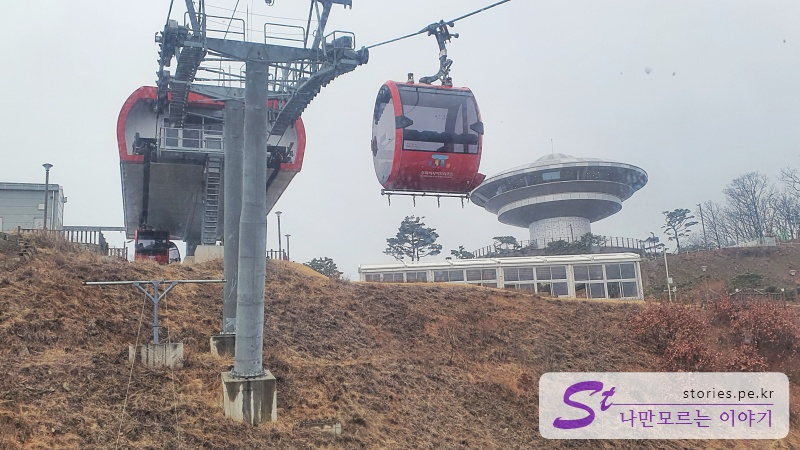
곤돌라를 타고 올라가면서 보는 경치도 매우 좋아요. 올라가면서 루지 코스를 볼 수 있는데, 루지가 뭔지 알 수 있는 기회에요.

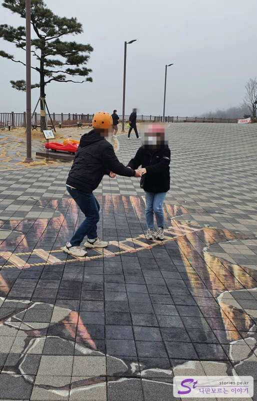
곤돌라에서 내리면 바닥에 희미한 그림이 보일 겁니다.
이게 뭔가 싶지만... 사진을 찍어보면 마치 커다란 구멍 위에 서있는 듯한 사진을 찍을 수 있어요. 이런 걸 매직아트라고 하더라고요. ^^

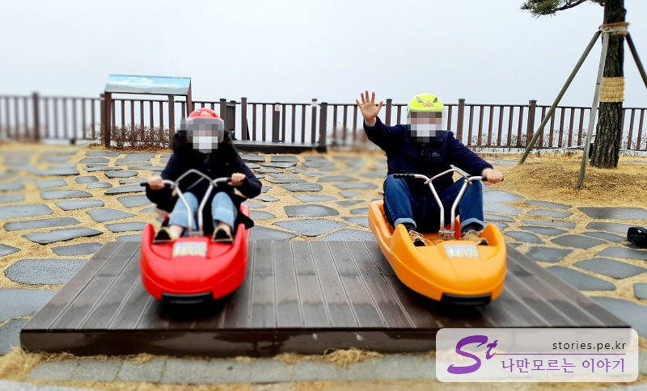
그다음 루지 2대가 바닥에 붙어있는 것을 볼 수 있어요. 많은 사람들이 포토 스폿으로 활용을 하네요.

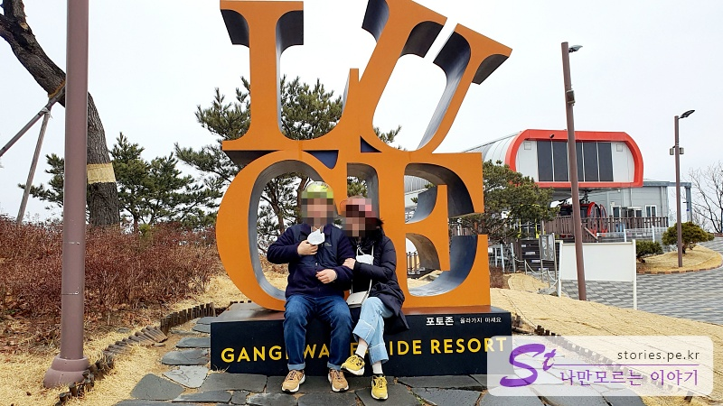
뉴욕에 **LOVE** 조형물이 있다면 강화도에는 **LUGE** 조형물이 있어요.
얼핏 보면 LOVE라고 착각하지만 자세히 보면 **LUGE**입니다. ㅎㅎㅎ 패러디네요.
그래도 항상 사람들이 여기에서 사진을 찍어요.

전망대 쪽으로 걸어 올라가다 보면 루지 코스 전체를 볼 수 있는 전망대를 볼 수 있어요.
여기서 보는 경치가 뷰 맛집입니다.

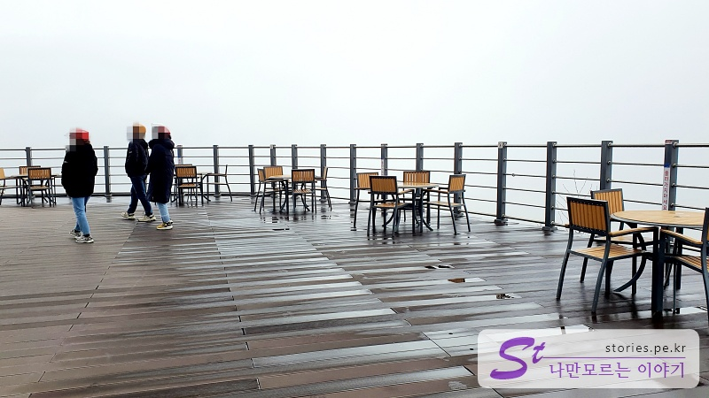
그렇게 돌아 회전 전망대의 야외 전망대 방향을 향하다 보면 잠깐 앉아서 휴식을 취할 수 있는 공간이 있습니다.

벽에는 나비 날개가 있어서 사람들을 천사로 만들 수도 있고요 ㅎ
전망대의 상층부는 탐앤탐스에서 운영하는 카페입니다.
저희는 카페를 들어갈 필요가 없어서 바로 내려왔어요.

### 루지 타기

정상에서 사진도 찍고 구경도 하고 이제 마지막으로 루지를 타고 내려왔어요.
루지는 처음 타는 사람과 두 번째 이상 타는 사람의 탑승 입구가 달라요.
루지 타는 곳의 좌측은 두 번째 이상 탄 사람이 타는 코스이고 우측은 처음 타는 사람들이 타는 입구에요.
처음 타는 사람들은 루지 타는 교육이 필요하고 두 번째 이상 타는 사람들은 교육 없이 바로 탑승이 가능해서 그렇게 구분한 것 같아요.
루지를 타면 코스가 2개가 있는데 하나는 **밸리코스**, 또 하나는 **오션코스**입니다.
밸리코스는 경사가 심하고, 오션코스는 코너링이 많은 코스라고 해요.
우리는 한 번만 탑승하는 거라서 그냥 **오션코스** 쪽으로 탔어요.

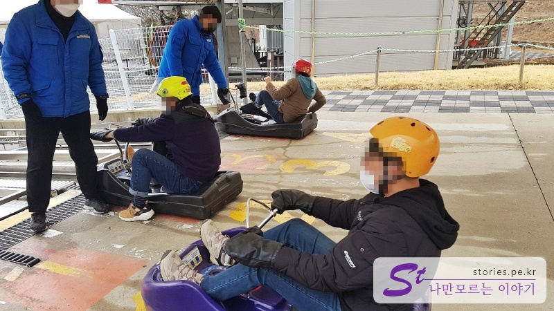
탑승 중에는 사진을 찍을 수 없다고 해서 사진을 찍지 못하고 마지막 도착지점에서만 사진을 몇 장 찍어봤습니다.

이렇게 탑승을 하게 되면 손등에 도장을 찍어 줍니다.
11시 30부쯤에 루지가 종료되어서 근처 식당에서 점심을 먹기로 했어요

## 준스레시피(점심식사)

우리가 선택한 곳은 준스레시피 입니다. 근처에 방송으로 유명한 **맛을담은강된장**이 있었지만 우리의 픽은 준스레시피 였어요.
먹는데 바빠서 식당 입구도, 먹는 음식도 사진으로 남기지는 못했는데 아래 정보에서 확인해 보세요.

> 준스레시피 : http://naver.me/FMA6xsZm

우리는 3인 소반, 45000원을 시켜서 먹었어요.
1인분에 15,000원이니 관광지 치고는 나쁘지는 않은 가격이었습니다.
음식 맛도 정갈하니 좋았고, 1인당 전복도 1개씩은 나와서 퀄리티도 나쁘지 않았어요.

## 광성보

그렇게 식사를 마치고 광성보로 향했습니다.
강화와 내륙을 분리하는 바닷길을 따라 나라를 지키기 위한 초지진, 덕진진, 용진진 등이 쭉~ 나열되어 있는데, 그중에서도 가장 많이 걸을 수 있는 곳이 광성보라서, 식사 후 산책도 할 겸 광성보로 갔어요.
광성보에 도착하면 성문을 기준으로 좌측으로는 포대가 있고 우측으로는 **손돌목돈대**와 **용두돈대**로 갈 수 있는 길이 있어요.

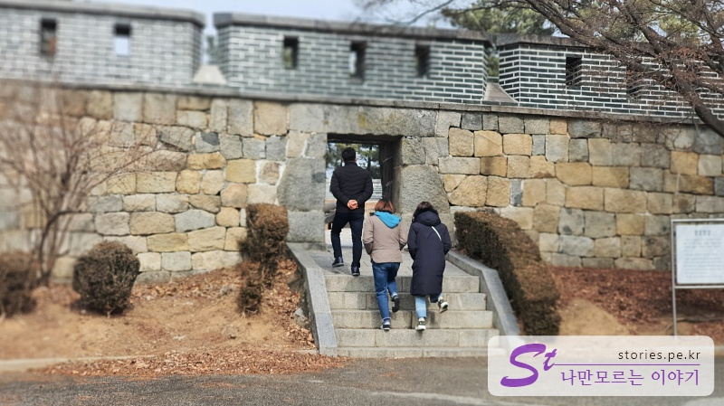
우리는 먼저 좌측에 있는 포대를 둘러봤어요.

안쪽에는 전시 공간이 있고 바깥쪽은 성벽으로 구성되어 있습니다.

이런 대포를 각 성벽의 구멍을 통해 발사하도록 되어 있습니다.

이번엔 성문을 기준으로 우측으로 올라가 봅니다. 이쪽으로 10분쯤 천천히 걸어가다 보면 **손돌목돈대**를 만날 수 있는데, 여기가 광성보에서 가장 높은 곳이라 사방의 적군들의 출몰을 확인할 수 있는 요충지입니다. 그 손돌목돈대에서 **용두돈대** 쪽을 바라본 풍경입니다.

손돌목돈대에서 내려와 **용두돈대**로 가봤습니다. 용두돈대는 바닷가 쪽으로 길게 뻗어 나와 있어서 바다로 접근하는 적들을 가장 가까운 곳에서 상대할 수 있는 곳입니다.
광성보에서 1시간 정도 산책을 하고 이번에는 조양 방직으로 향했습니다.

## 조양 방직

강화도에는 예전에 방직공장이 엄청 많았다고 합니다. 세월이 흘러 그 많던 방직공장이 모두 없어졌다고 하네요. 조양 방직도 그런 폐쇄된 공장 중의 하나였는데 누군가가 카페로 개조하고 꾸미기 시작하면서 지금은 엄청 유명세를 치르기 시작했다고 합니다.
주위에 주차장만 여러 곳이 있으나 거의 대부분 꽉 찰 정도로 붐빈다고 해요.

### 실외

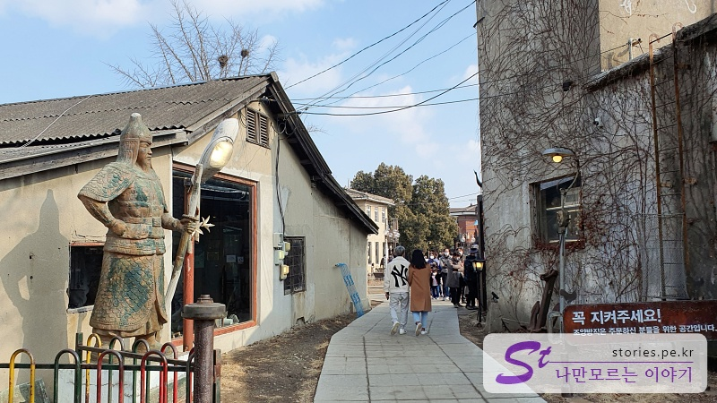
카페에 들어가면 정말 여기가 카페인가 하는 생각이 들 정도로 남의 집 마당같이 생겼어요.
사실 사진에 보이는 곳은 출구이고 입구는 왼쪽의 작은 문을 통해 들어가도록 되어 있어요.

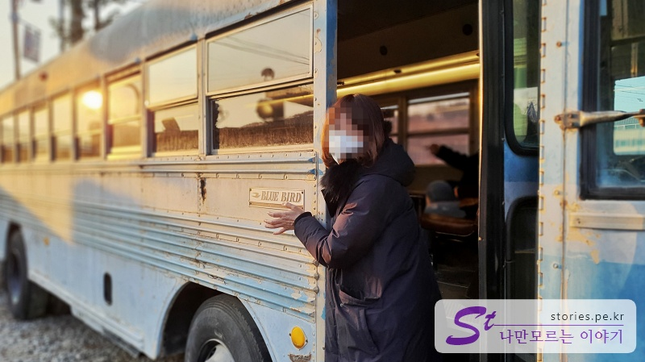
입구를 통과하면 조그만 마당에 옛날 방직공들을 실어 나르던 버스가 보입니다.
여기서 안내양이 있던 옛 시절의 향수를 불러일으킬 수 있는 사진을 건져볼 수 있어요.

**"안 내리면~ 오라이~~"**

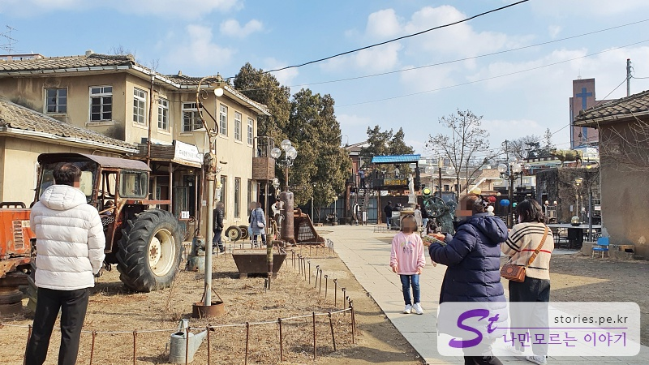
마당으로 나오면 조양 방직 외부의 전경을 볼 수 있습니다. 여기저기 조형물들이 있고요. 모두 옛날 건물과 물건들로 가득 차 있어서 향수를 느껴볼 수 있어요.

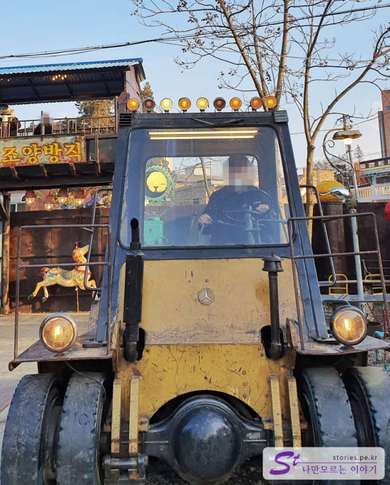
트랙터도 타볼 수 있고요. 움직이지는 않아요 ㅋ

제가 처음에 왔을 때는 보지 못했던 조망대도 설치가 되어 있네요.

이곳에서 바라다 본 조양 방직의 외부 전경입니다. 멋지네요.

### 실내

실외도 너무 멋지지만 실내도 정말 유니크하게 멋지게 구성되어 있습니다. 처음에 조양 방직의 이끌림은 실내의 전경이 아닐까 해요. 너무 힙하네요. \

2층으로 올라가는 계단에서 전경을 찍은 모습이에요. 정말 광활하고 대단해 보입니다.
이 풍경을 누가 반하지 않겠어요.

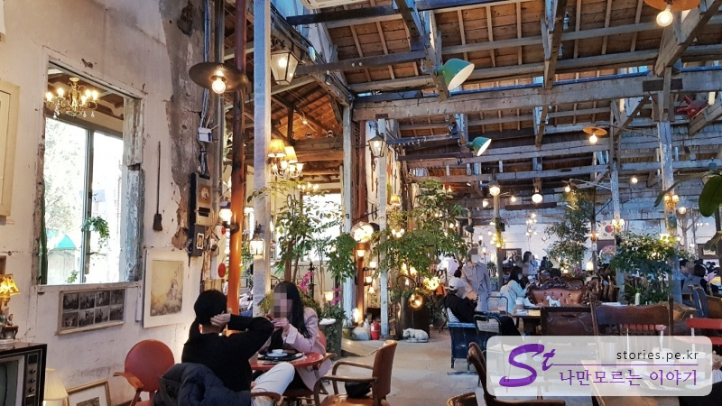
구석 구성 아기자기한 옛날 물건들로 깨알같이 인테리어를 해 놨습니다.

천정은 기존 방직공장일 때의 서까래를 그대로 사용하면서 방진 처리를 한 것 같아요. 이 부분도 인테리어에 한몫하는 것 같아요.

실내 구석구석에 간단한 게임도 있고 볼거리도 있고 알차게 구성되어 있어서 차를 마시기도 좋지만 구경을 하기도 좋게 되어 있습니다.

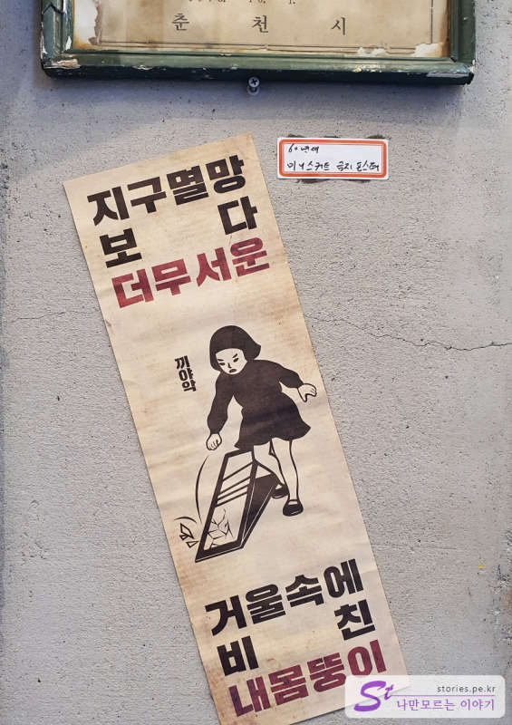
빵 터진 표어입니다.
이렇게 강화도를 당일로 쉬엄쉬엄 다녀올 수 있는 코스입니다.
같이 간 동행분들도 모두 만족한 여행 코스였습니다.
