The Hantan River is said to have been formed by a volcanic eruption about 54-120,000 years ago. In the meantime, various and beautiful terrain such as basalt cliffs, columnar joints, and waterfalls were formed.
As the Hantangang River was registered as a UNESCO World Geopark in Korea, about 3.6km was laid between Drunny Village and Sundam Valley, where you can see columnar joints of the Hantangang River.
I went here this time, and although it's about an hour and a half one way, the scenery was so good that I walked without knowing it would be hard.

## How to get back to Jusangjeolli-gil (Jando)

There are two ways to walk on the columnar joint road.
The first way is to come from Sundam Ticket Office in the direction of the ticket office, and the second way is to come from Sundam Ticket Office in the opposite direction.
I think we need to consider the sunlight and scenery. If I do something wrong, I might have to wear sunglasses in the sun the whole time I walk.

### From the Derny box office to the Sundam box office.

First of all, we walked toward Sundam at the Drunny ticket office.
I started walking around 2 p.m. in March, so I was glad to walk with my back to the sun.
Overall, the scenery was calm in the beginning, but as we moved closer to Sundam Valley, the scenery became cool, so I think we finished the race relatively without being bored. (Recommendations for this direction...)

If you do this, you will get a ticket. You may need it when you take a shuttle bus later, so you have to keep it well.

When you enter the entrance, you will find **Drunny Observatory** right in front of you. Don't start right away, stop by here and enjoy the view first. The landscape is the best.

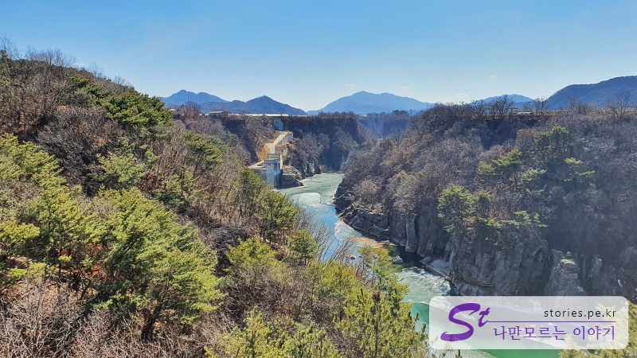
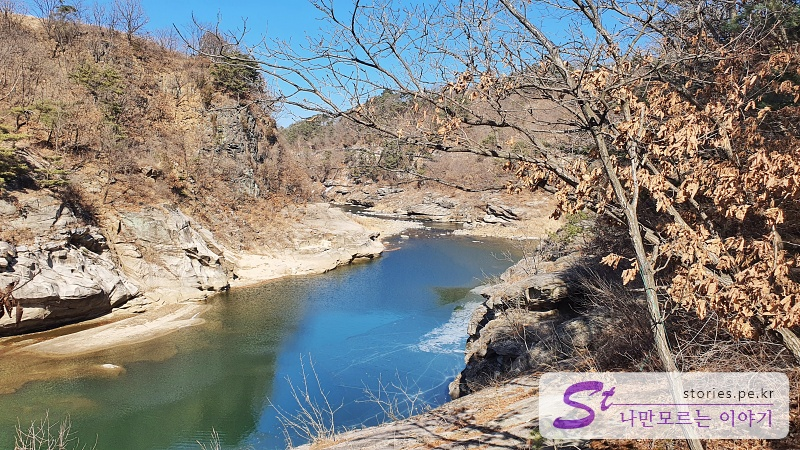
The branches are desolate because it's winter, but the scenery is so nice.

#### Drni Sky Observatory

There are a total of three sky observation decks on Jusangjeolli-gil.
**Drni Sky Observatory** on the Drni side, **Cheowon Hantan River Sky Observatory** on the middle, and **Sundam Sky Observatory** on the Sundam side.

It's the Drni Sky Observatory in the form of a bridge you meet for the first time.

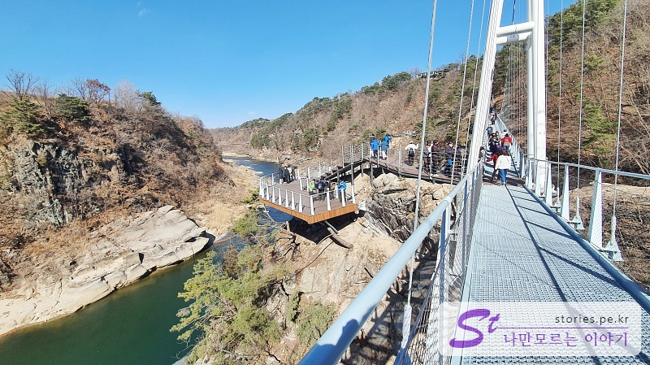
There is an observatory halfway through the bridge. You can see the left and right sides of the river at once.

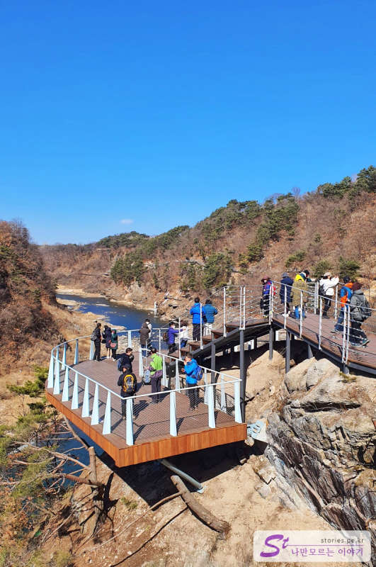
Some people take a break and have a cup of course. Some people leave memories with pictures.

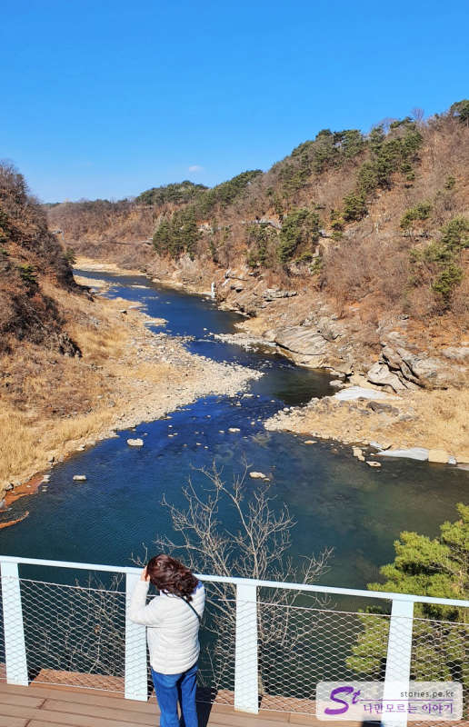
The wind is strong because it's winter, but the scenery is so wonderful that it's bearable.

#### Cheorwon Hantan River Sky Observatory

If you walk a little more, you will encounter a scary place.
**Cheolwon Hantan River Sky Observatory**, located almost halfway through the entire road.

The road is arched and the floor is made of glass. Only courageous people should walk.

If you meet this... You can think that you're halfway there.

It wasn't all in the picture, but there were various types of legs and glasses, so there was no time to get bored.

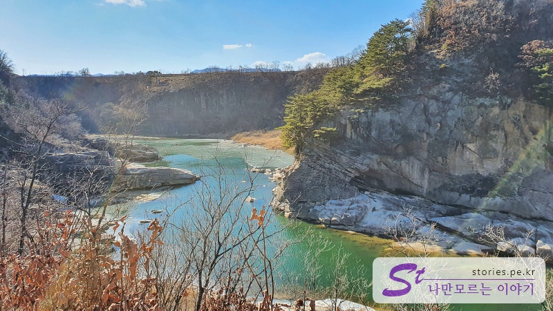
The scenery of the Hantan River while walking is really wonderful.

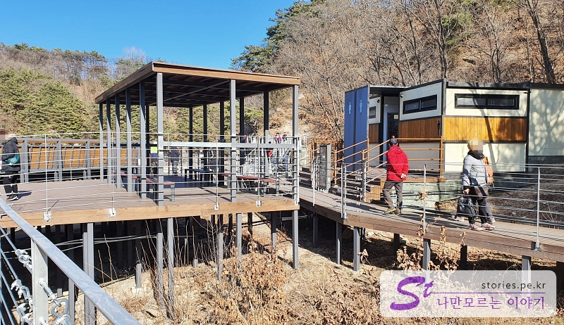
**Samso Shelter**. There is a restroom here, so you can take a break and take a break.

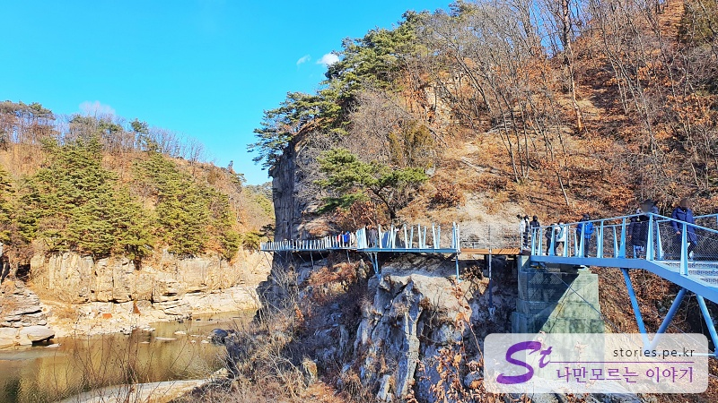
You can also see the glass road attached to the cliff toward Sundam Valley.
While looking at it... It makes me think that we've passed through this place.
I wonder how hard it must have been for the people who made this road.That's what I think.
I don't think 10,000 won is such a waste.

We're almost at the end. If you go a little further, you will find a shelter in Guri.

It's a view from the Guri shelter. It's really fantastic.
I'm just amazed.

#### Sundam Sky Observatory

This is the last Sky Observatory, Sundam Sky Observatory.

It is arched in the same shape as Cheorwon Hantan River Sky Observatory.
But the floor is not glass.

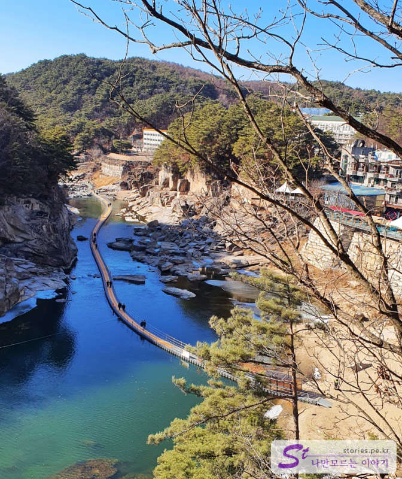
This is the last one.
The place you can see over there is the road above the water. There was a guide saying that the scenery here is so wonderful in winter.
If you're physically fit, it's a good idea to start at the Duni ticket office, come to Sundam Valley, and then follow the water road to Goseokjeong Pavilion.(They say you have to pay extra.)
I heard that you can take the shuttle bus at Goseokjeong and get off at Dronee.

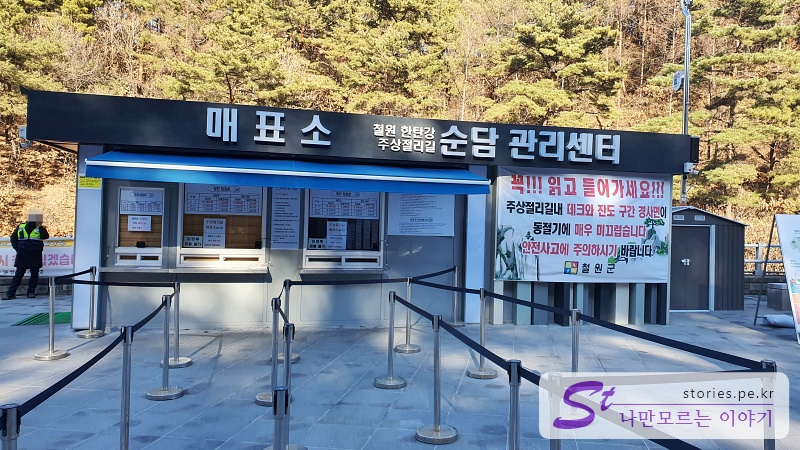
Like this, we walked for an hour and a half and arrived at the Sundam ticket office.
You can take the shuttle bus from here and go to the ticket office.

> \*\*Shuttle buses run only on weekends and holidays. It's not open on weekdays.
> So people who come here on weekdays use local gift certificates to take a taxi to Drni.

You can wait at the entrance of the parking lot and get on the shuttle bus.

## Cost

There is a general admission fee and a group admission fee.
If it is eligible for a discount, it will be reduced by 50%.

It's 10,000 won for a general adult, but I think it's 5,000 won for a Cheorwon gift certificate that can only be used in Cheorwon, so I think it's 5,000 won for a pure admission fee is 5,000 won.
It's 4,000 won for teenagers and 3,000 won for children.

I think the group is giving a little discount, and I'm not sure how many people are in the group. ^^

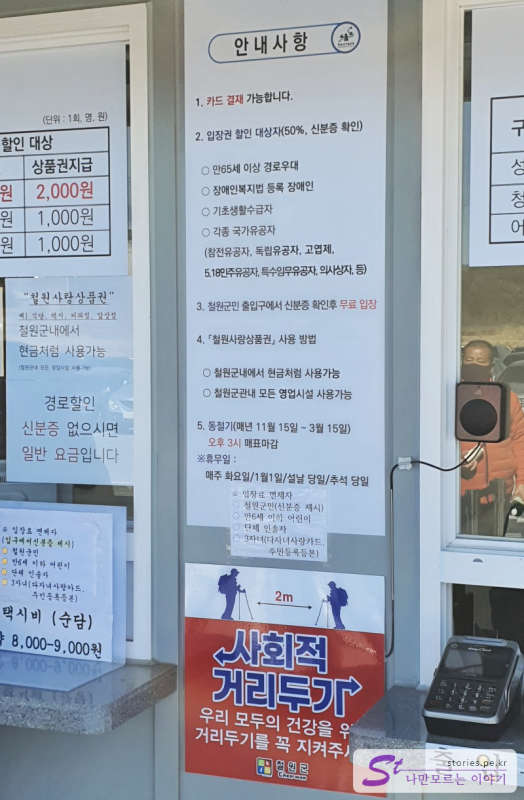
Credit card payments are available, and discounts are available for senior citizens, people with disabilities, basic livelihood recipients, and people of national merit.
It's free if you're a resident of Cheorwon-gun. Oh!  
It is also free for people under the age of 6, group leaders, and three children (multi-child love card).

## Time of entry

The admission time is different between winter and summer, and there is no lighting, so I think we decided the time considering the sunset.
Tickets close at 3 p.m. in winter.

- Operating hours: (Winter) 09:00 to 15:00
- Time required: 1 hour and 30 minutes one way
- Closed days: Every Tuesday, January 1st, New Year's Day, and Chuseok Day

## Travel destination information

- Address: 174-3 Mountain, Guntan-ri, Galmal-eup, Cheorwon-gun, Gangwon-do (Derni Ticket Office)
- Contact point: Sundam Ticket Office: 033-452-225, Drni Ticket Office: 033-452-9825
- - URL : https://www.cwg.go.kr/tour/contents.do?key=1644&ctgry=53&sortTy=RECOMEND
  

  <iframe src='https://www.google.com/maps/embed?pb=!1m18!1m12!1m3!1d12548.433777335023!2d127.28874906863656!3d38.16091916160909!2m3!1f0!2f0!3f0!3m2!1i1024!2i768!4f13.1!3m3!1m2!1s0x3562cb8be53e43f5%3A0xa173a93c2a041721!2z7ZWc7YOE6rCVIOyelOuPhOq4uA!5e0!3m2!1sko!2skr!4v1646717065949!5m2!1sko!2skr' class='embed-responsive-item' allowfullscreen></iframe>
  

## Parking information

There are 1 to 3 parking lots and it is spacious. You can park for free.

### Shuttle bus service information

There is a shuttle bus between the ticket offices on weekends and holidays, so you can use the shuttle when you return after one-way use.
However, the shuttle is not open on weekdays, so you can come back using the local gift certificate.
