한탄강은 약 54~12만 년 전 화산 폭발로 인해 형성되었다고 하는데요. 그러면서 현무암 절벽, 주상절리와 폭포 등 다양하고 아름다운 지형이 형성되었다고 해요.
한탄강이 우리나라의 유네스코 세계지질공원에 등록이 되면서 한탄강의 주상절리를 볼 수 있는 드르니 마을과 순담계곡 사이에 3.6Km 정도를 잔도로 깔았습니다.
이번에 이곳을 다녀왔는데, 대략 편도 1시간 30분 거리인데도 풍경이 너무 좋아서 힘들 줄 모르고 걸었어요.

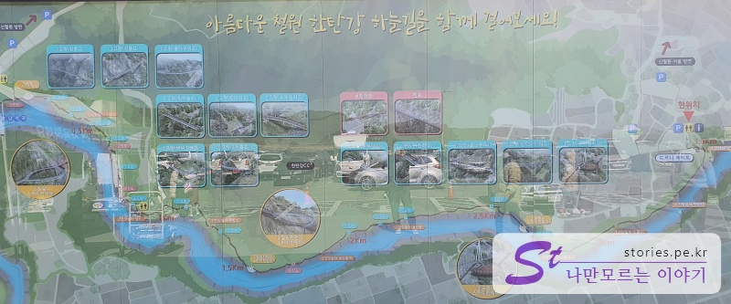
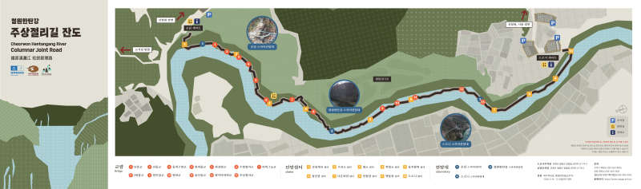

## 주상절리길(잔도) 다녀오는 방법

주상절리 길을 걷기 위해서는 2가지 방법이 있어요.
첫 번째로는 순담 매표소에서 드르니 매표소 방향으로 오는 길이고 두 번째로는 반대로 드르니 매표소에서 순담 매표소 쪽으로 오는 방법이에요.
햇빛과 풍경 등을 고려할 필요가 있을 것 같아요. 잘못하면 걸어가는 내내 햇빛에 선글라스를 끼고 다녀야 할지도 몰라요.

### 드르니 매표소에서 순담 매표소 방향..

일단 우리는 드르니 매표소에서 순담 방향으로 걸었어요.
시간은 3월 오후 2시쯤 걷기 시작했기 때문에 햇빛을 등지고 걷게 되어 다행이었습니다.
전체적으로 초반에는 풍경이 잔잔하다가 순담계곡으로 가까이 접어들면서 풍경이 멋져지기 때문에 상대적으로 지루하지 않게 완주를 했던 것 같아요. (이 방향 추천 추천..)

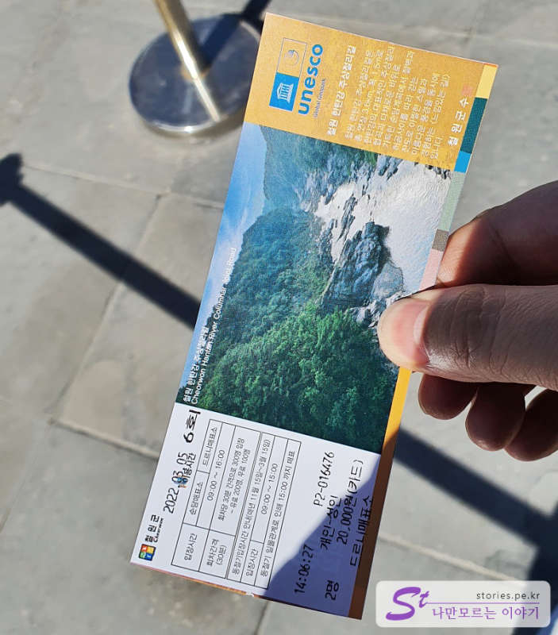
이렇게 매표를 하면 표를 줍니다. 나중에 셔틀버스를 탈 때 필요할 수도 있으니 일단은 잘 가지고 있어야 해요.

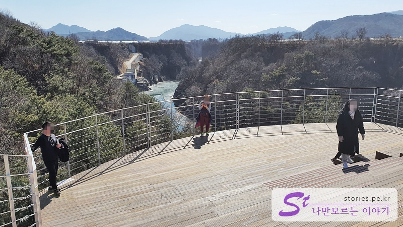
입구에 들어서면 **드르니 전망쉼터**가 바로 앞에 있어요. 바로 출발하지 마시고 여기에 들러서 먼저 경치를 감상해 보세요. 풍경이 압권입니다.

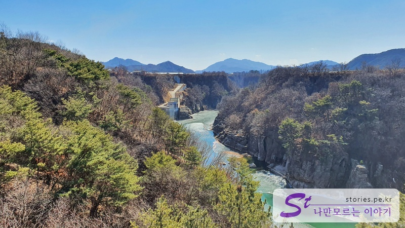
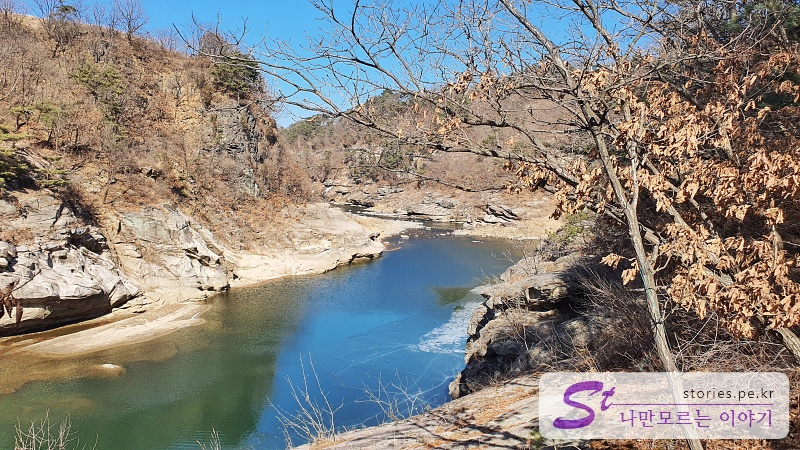
겨울이라 나뭇가지는 황량하지만 경치는 너무 멋지네요.

#### 드르니 스카이 전망대

주상절리길에는 총 3개의 스카이 전망대가 있어요.
드르니 쪽에는 **드르니 스카이 전망대**, 중간에는 **철원한탄강 스카이 전망대**, 순담 쪽에는 **순담 스카이 전망대**입니다.

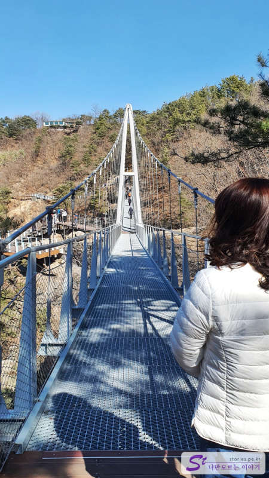
처음 만나는 다리 형태로 되어 있는 드르니 스카이 전망대입니다.

다리의 중간쯤에 전망대가 있어요. 강의 좌측과 우측을 한 번에 볼 수 있게 되어 있어요.

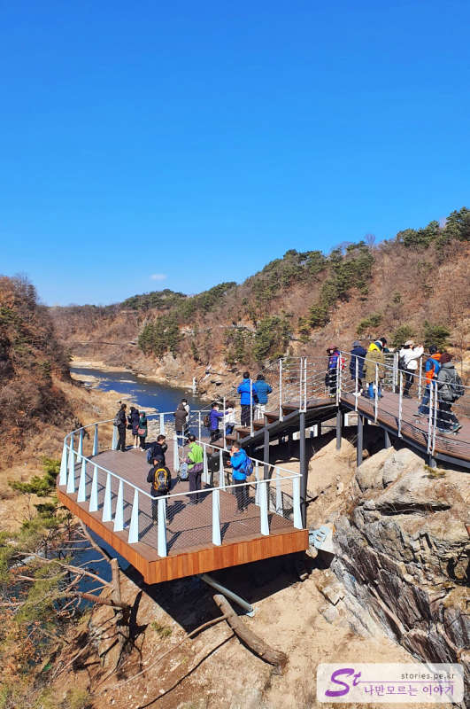
잠시 쉬면서 커피를 한잔하는 사람도 있고요. 사진으로 추억을 남기는 사람도 있어요.

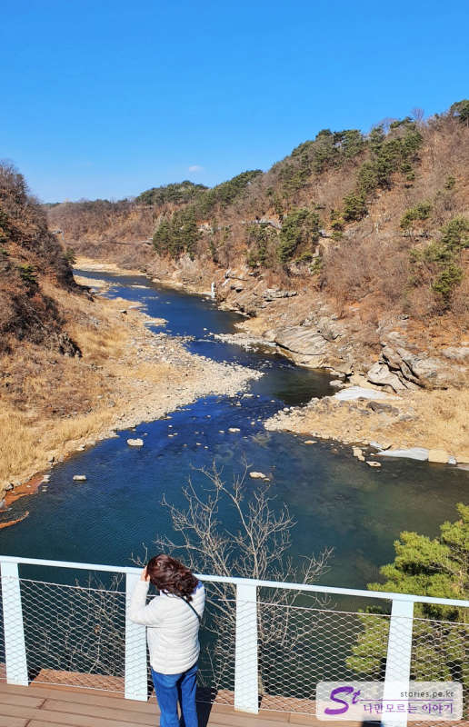
겨울이라 바람이 매섭지만 풍경이 너무 멋져서 견딜만해요.

#### 철원한탄강 스카이 전망대

조금 더 걷다 보면 무시무시한 장소를 만나게 돼요.
**철원한탄강 스카이 전망대**라고, 전체 길의 거의 중간쯤에 위치해 있어요.

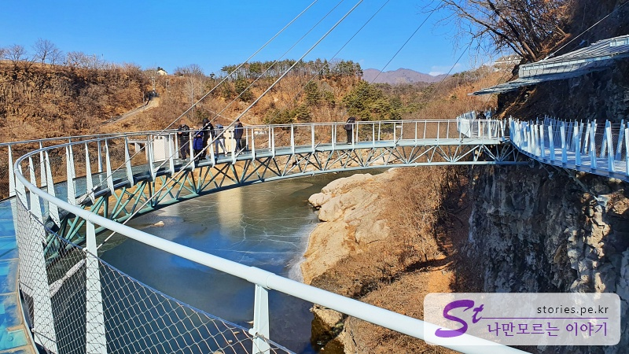
아치 형태의 길을 만들어놓고 바닥은 유리바닥으로 만들어 놨어요. 용기 있는 사람만 걸어보라는 심산이지요.

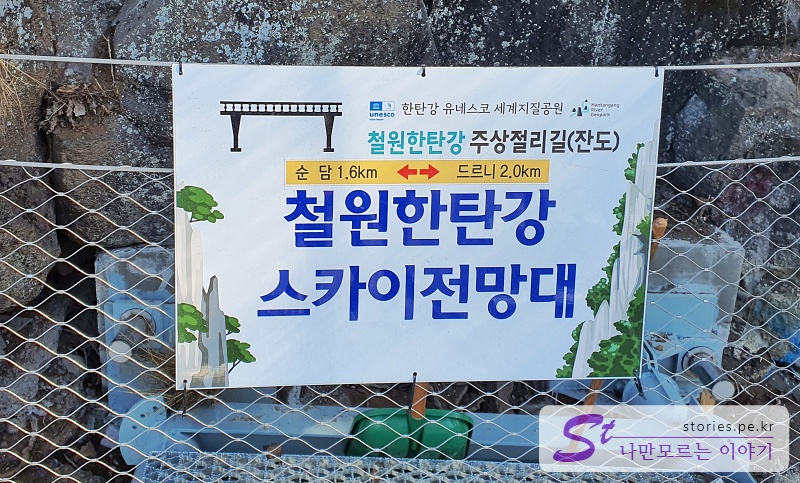
이것을 만나면.. **이제 중간쯤 왔구나**라고 생각하시면 돼요.

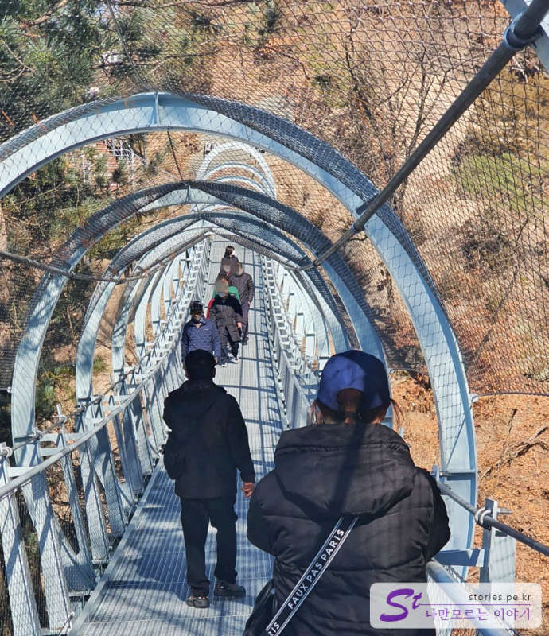
사진에 다 담지는 않았지만 다양한 형태의 다리와 잔도 길이 있어서 지루할 틈이 없었어요.

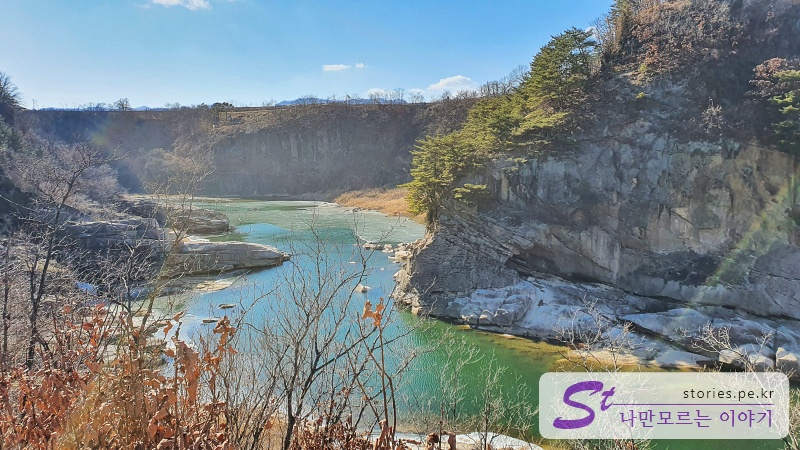
걷다가 둘러보는 한탄강의 풍경이 정말 너무 멋져요.

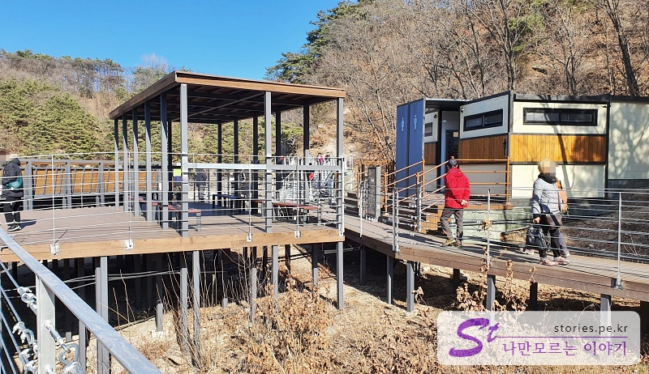
**샘소 쉼터**예요. 이곳에는 화장실이 있어서 잠시 쉬면서 **쉬야**를 할 수 있어요.

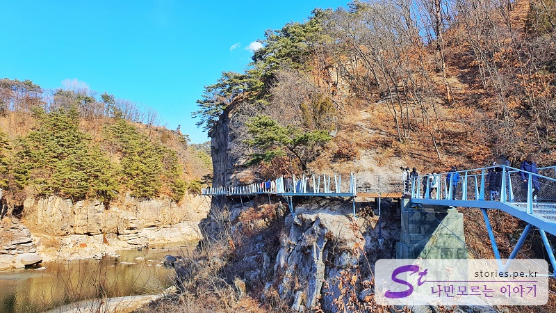
그리고 순담계곡 쪽으로 절벽에 붙어 있는 잔도 길도 볼 수 있고요.
보면서.. 우리가 이런 곳을 지나왔구나 하는 생각을 하게 돼요.
이 길을 만드시는 분들은 얼마나 고생하셨을까..라는 생각도 들고요.
입장료 1만원이 그렇게 아깝다는 생각이 들지 않더라고요.

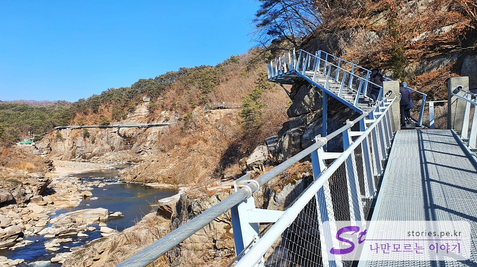
이제 거의 막바지에 들어섰어요. 조금만 더 가면 구리소 쉼터가 나올 거예요.

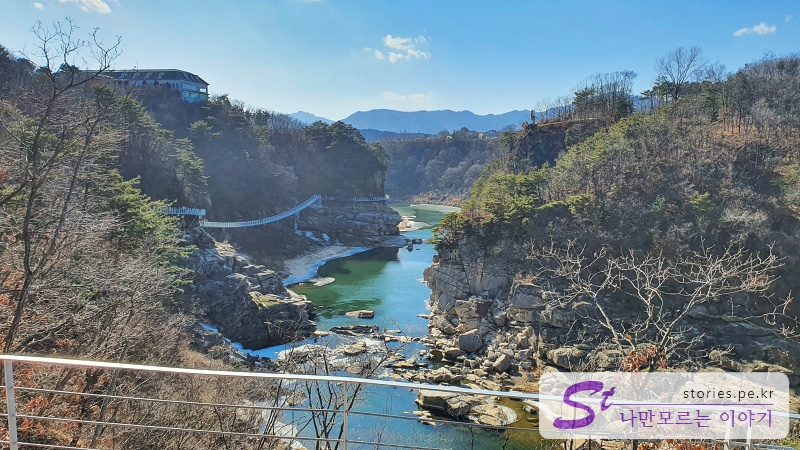
구리소 쉼터에서 바라다보는 전경이에요. 너무 멋져요.
계속 감탄만 나오네요.

#### 순담 스카이 전망대

이제 마지막 스카이 전망대인 순담 스카이 전망대입니다.

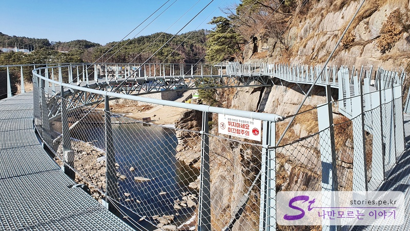
철원한탄강 스카이전망대와 동일한 형태로 아치형으로 되어있어요.
대신 바닥은 유리는 아니네요.

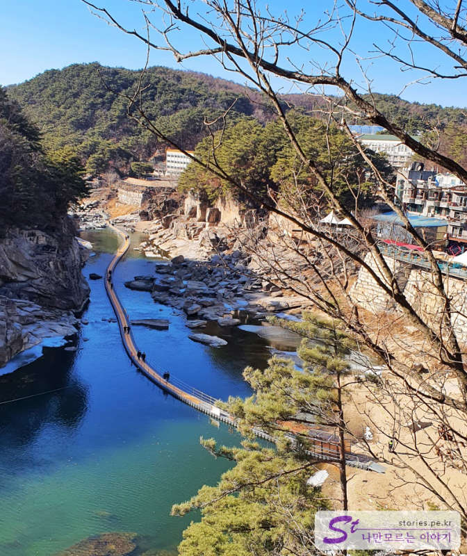
이제 마지막입니다.
저기 보이는 곳이 물윗길로 가는 길입니다. 겨울에는 이곳의 풍경이 너무 멋지다는 안내원 아저씨의 말이 있었어요.
만약 체력이 된다면, 드르니 매표소에서 시작하여 순담계곡까지 왔다가 바로 물윗길을 따라 고석정까지 가보는 것도 좋다고 하네요.(그곳은 별도 비용을 내야 한다고는 해요.)
고석정에서 셔틀버스를 타고 드르니에서 내리면 된다고 하네요.

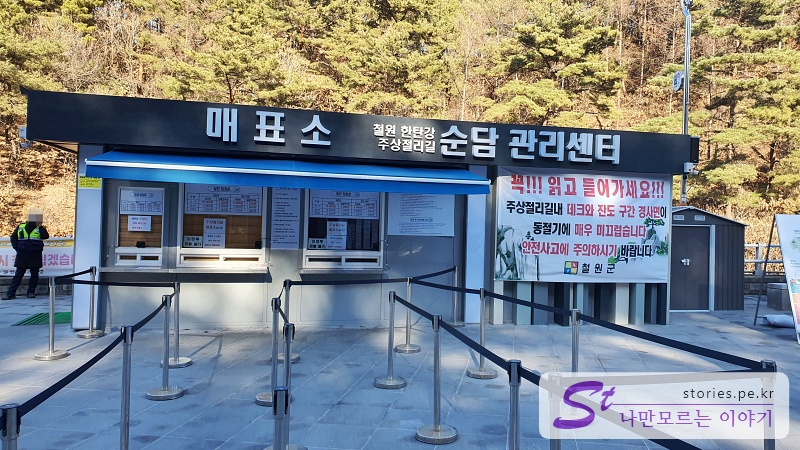
이렇게 우리는 1시간 30분 동안 걸어서 순담 매표소에 도착했어요.
여기에서 셔틀버스를 타고 다시 드르니 매표소로 이동을 하면 돼요.

> **셔틀버스는 주말과 공휴일에만 운행**한다고 하네요. 평일에는 운행하지 않는데요.
> 그래서 평일에 오는 사람들은 여기에서 지역상품권을 활용하여 택시를 타고 드르니로 간다고 합니다.

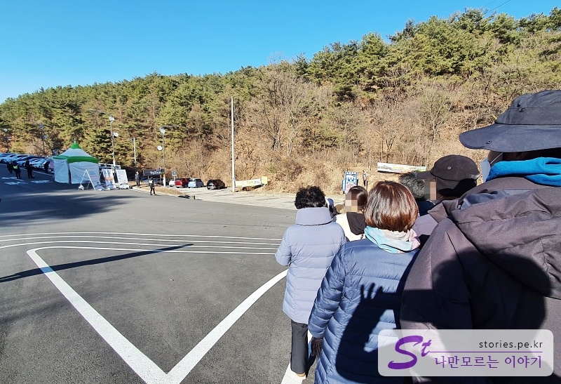
셔틀버스는 주차장 입구에서 대기하고 있다가 타면 돼요.

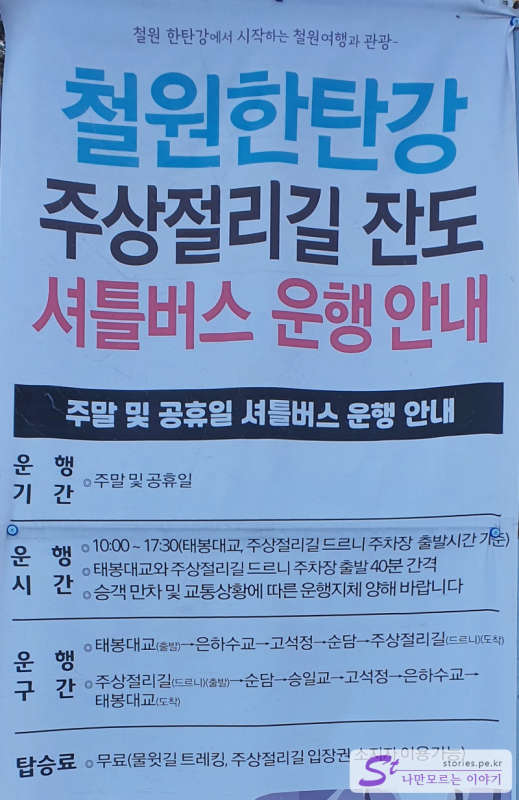

## 비용

비용은 일반 입장료와 단체 입장료가 있어요.
할인 대상에 해당한다면 50% 정도 감면이 되고요.

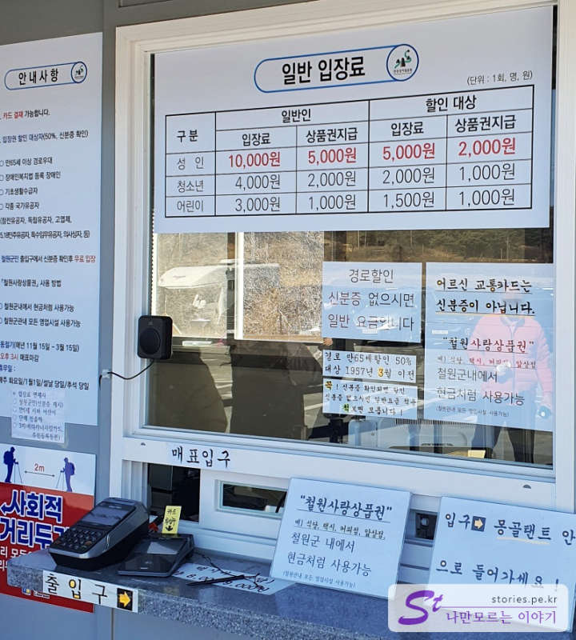
일반 성인 기준으로 10,000원인데, 철원에서만 사용 가능한 철원 상품권으로 5,000원을 돌려주니 순수 입장료는 5,000원이라고 봐야 할 것 같아요.
청소년은 4,000원, 어린이는 3,000원이네요.

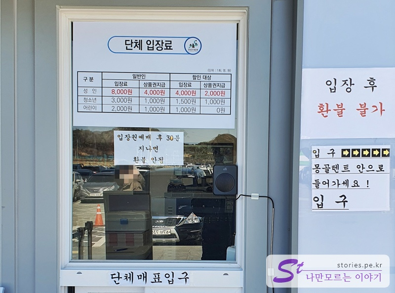
단체는 조금 할인을 해주는 것 같고 몇 명부터가 단체인지는 잘 모르겠네요. ^^

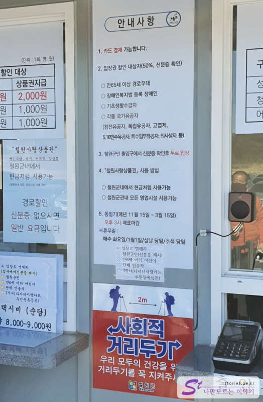
카드 결제 가능하고 할인 대상자는 경로, 장애인, 기초생활수급자, 국가유공자는 50% 감면 혜택이 있어요.
철원군 내 주민이라면 무료네요. 오~~~  
만 6세 이하, 단체 인솔자, 3자녀(다자녀 사랑카드)인 사람도 무료라고 합니다.

## 입장시간

입장시간은 동절기와 하절기가 다르며 조명이 없기 때문에 해가 지는 것을 고려해서 시간을 정한 것 같아요.
동절기는 오후 3시에 매표를 마감한다고 하네요.

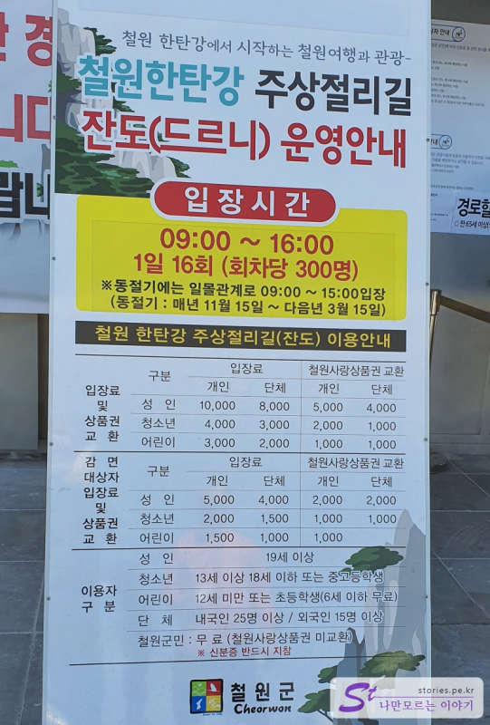

- 운영시간 : (동절기) 09:00 ~ 15:00
- 소요시간 : 편도 1시간 30분 정도
- 휴무일 : 매주 화요일, 1월 1일, 설날 당일, 추석 당일

## 여행지 정보

- 주소 : 강원도 철원군 갈말읍 군탄리 산 174-3 (드르니 매표소)
- 연락처 : 순담 매표소 : 033-452-2225, 드르니 매표소 : 033-452-9825
- URL : https://www.cwg.go.kr/tour/contents.do?key=1644&ctgry=53&sortTy=RECOMEND

<iframe src='https://www.google.com/maps/embed?pb=!1m18!1m12!1m3!1d12548.433777335023!2d127.28874906863656!3d38.16091916160909!2m3!1f0!2f0!3f0!3m2!1i1024!2i768!4f13.1!3m3!1m2!1s0x3562cb8be53e43f5%3A0xa173a93c2a041721!2z7ZWc7YOE6rCVIOyelOuPhOq4uA!5e0!3m2!1sko!2skr!4v1646717065949!5m2!1sko!2skr' class='embed-responsive-item' allowfullscreen></iframe>

## 주차정보

주차장은 1~3주차장까지 있으며 넓은 편입니다. 무료로 주차할 수 있어요.

### 셔틀버스 이용안내

주말과 공휴일에는 매표소 간 셔틀버스를 운영하기 때문에 편도 이용 후 복귀할 때 셔틀을 이용하시면 됩니다.
다만 평일에는 셔틀이 운영하지 않기 때문에 지역상품권을 활용하여 돌아오시면 돼요.
