The key to this Jeju trip is to stay one night at Udo Island, which is a bucket list, and to climb Mt. Halla Baeknokdam. I went to Seongsanpo Passenger Terminal on the first day of my trip to Jeju to visit Udo, the first of them.

When tourists enter Udo Island, they are not allowed to take their vehicles with them except for a few conditions.

## Some conditions for taking a vehicle to the Udo

If you look on the Internet, there are various articles about getting on the car. The most clear thing is that it would be most accurate to refer to the **Udo Island ferry website** below.

[Conditions for bringing a rental car](http://udoboat.smart9.net/m/pages.php?p=4_1_1_1)

But to put it simply...

- Families and guardians accompanied by infants (pre-school children under the age of 6)
- Families and carers accompanied by persons with Grade 1 or Grade 2 disabilities and persons with Grade 3 disabilities using wheelchairs
- Families and carers with over 65 years of age
- Families and carers accompanied by pregnant
- Families and carers of wheelchair users
- If you stay longer than 1 night at Udo Island,
- Vehicles for long-term rental for at least 6 months as registered address or place of business on Udo Island

We were able to bring a rental car because we stayed overnight in Udo Island.

## Time for a ship to Udo

Ship time is in units of 30 minutes. However, the time of the first and last ships is different by season.
It is said that the ship time changes from time to time depending on the weather conditions

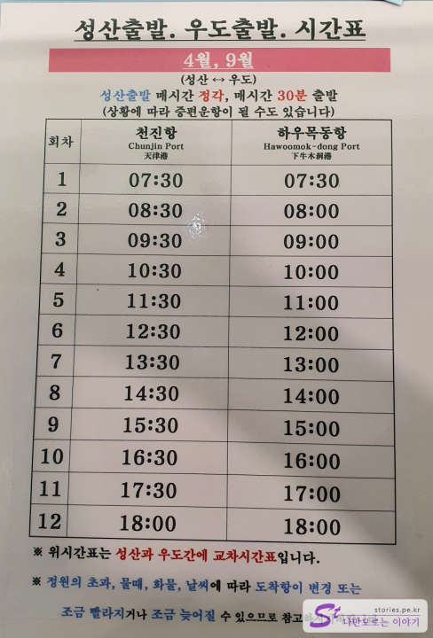
["Ship to Udo"](http://udoboat.smart9.net/m/pages.php?p=3_1_1_1))

## Moving on a boat

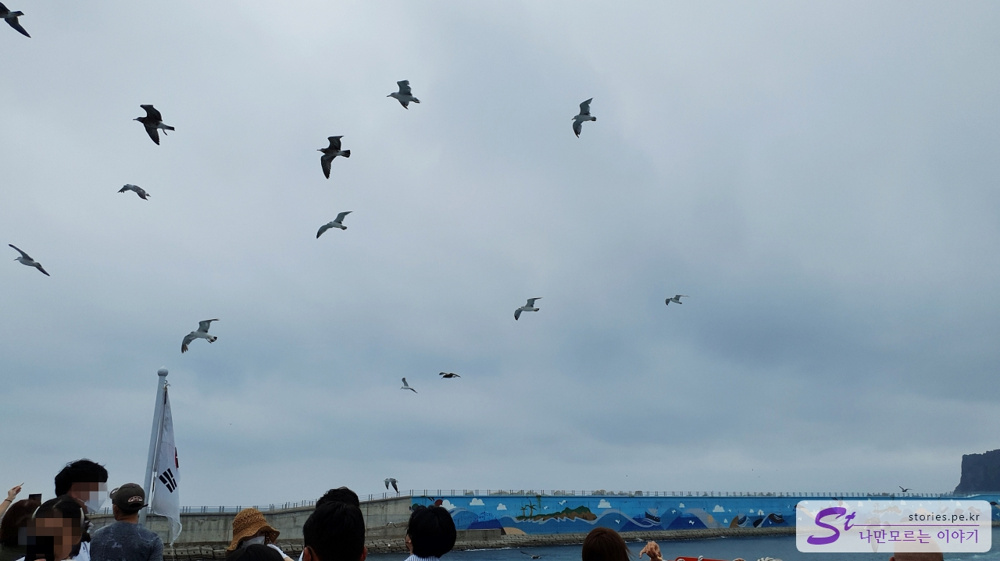

We left Seongsanpo Port and headed for Udo Island with seagulls. Usually, the 30-minute unit is **Tianjin Port**, and the 1-hour unit is **Hau Mok-dong Port**, but it can vary from time to time.

We arrived at Hau Mok-dong Port after running for about 20 minutes.

Since I arrived around 12:30, I couldn't move to the accommodation (Udo Sarang Pension) because it wasn't time to check-in the accommodation, so I moved to Geommeole Beach first.

## black-milled beach

Geommeolle is a small beach in the southeast of Udo Island, meaning Black More. It is a place that boasts a wonderful view because it is harmonized with the Udobong Cliff.

The combination of the sea scenery and cliffs is the best. If the weather is nice, you can take a **Udo tour boat** on this beach, but when we went, it was very windy, probably because of the typhoon.

There are many shops lined up on the road above Gummerle Beach. This is one of the most popular spots for tourists visiting Udo Island. Still, there aren't many people at this level.

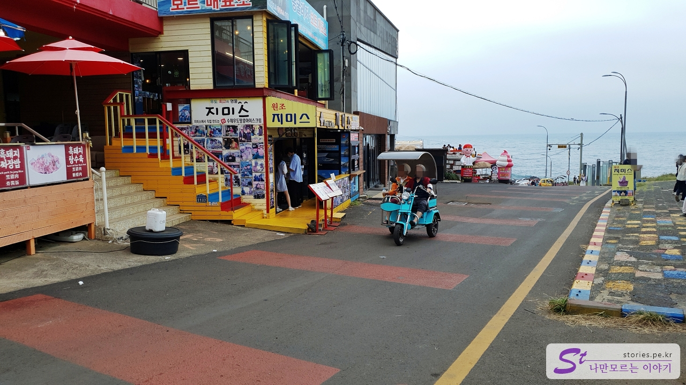

This is Jimmies**, which sells the original Udo peanut ice cream ** in Gummule.

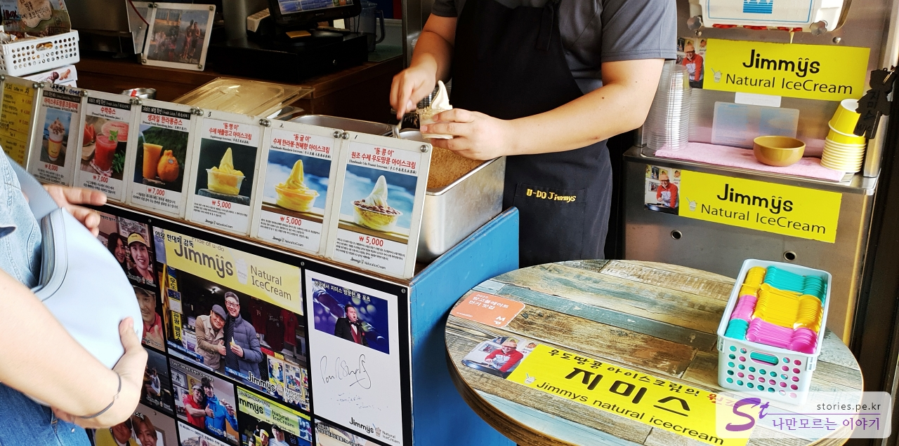

Prices range from about 5,000 won to 8,000 won, and all nearby stores sell at similar prices.

I took a picture of peanut ice cream while looking at Udo Lighthouse. Ice cream that you eat while looking at the wonderful sea scenery makes your taste and vision pleasant at the same time.

I've had ice cream, so now I'm going to take a look at the black mullet beach, right? There's a road down the road from Jimmy's, but there's also a road down the main road.

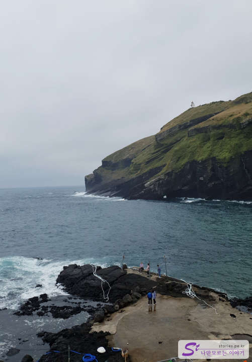

You can go down to the rocks by the sea from the end of the road.

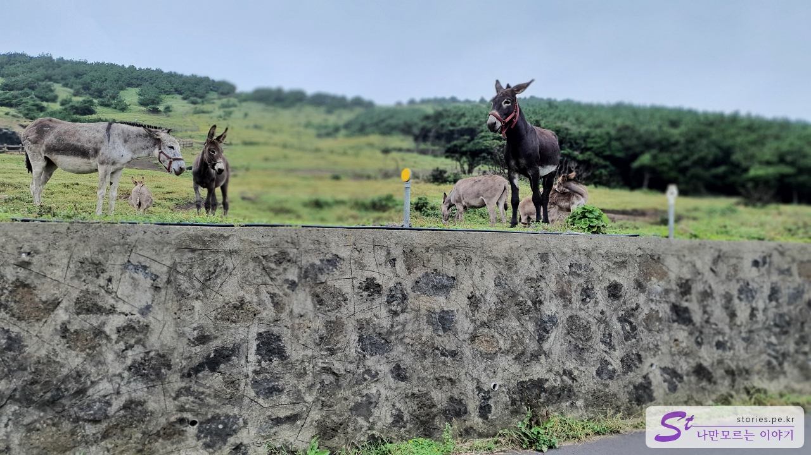

I could see a donkey playing freely on the hill on the way out of the beach of Gummule. I don't know if I'm watching a donkey or a donkey watching me.

## Udo Love Pension

The accommodation we stayed in Udo Island is Udo Sarang Pension. First of all, I chose it because it has a good rating and the price is cheap.

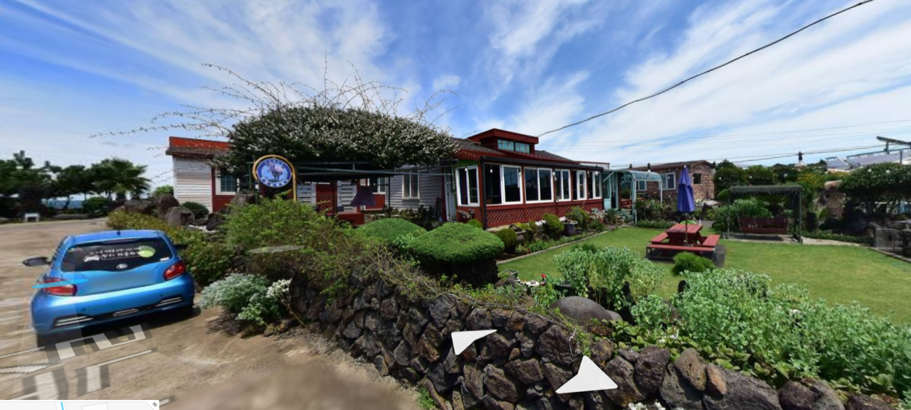

> After a hectic nap, I couldn't take any pictures of the pension even in the morning due to special circumstances. So I replaced it with Naver Map.^^

It was about 1 p.m. before the check-in time, but I was so tired that I checked in early because I was on a plane early in the morning, and I was able to enter a little early due to the boss' consideration.
The dorm was more like a guest house than a pension. However, the landscape was well decorated, the yard was good, and above all, the boss treated me kindly and well, so I was satisfied with the pension. The inside of the hotel was small but clean and satisfactory compared to the price. I recommend it

I woke up after taking a nap for about 2 hours at the accommodation. I came to Udo, but I couldn't sleep, so I woke up and started sightseeing again. And I visited Udobong Peak.

## Udobong Peak

I took a rental car and headed to the Udobong parking lot.

Udobong Peak is located in the south of Udo Island and is the highest place in Udo Island, so the sea, Udo Island, and Seongsan Ilchulbong Peak are so wonderful.

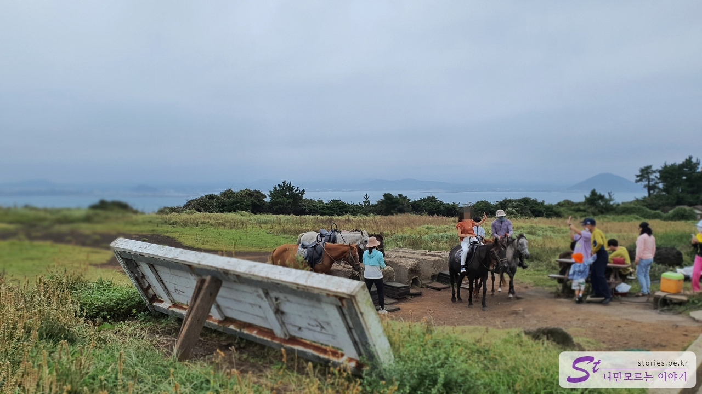

You have to park in the parking lot and walk up to the entrance of Udobong Peak for about 2 to 5 minutes. If you go up, there is a pony riding experience center. It's a course that goes around Udobong Peak on horseback, and we haven't ridden it, but I thought I should have ridden it once.

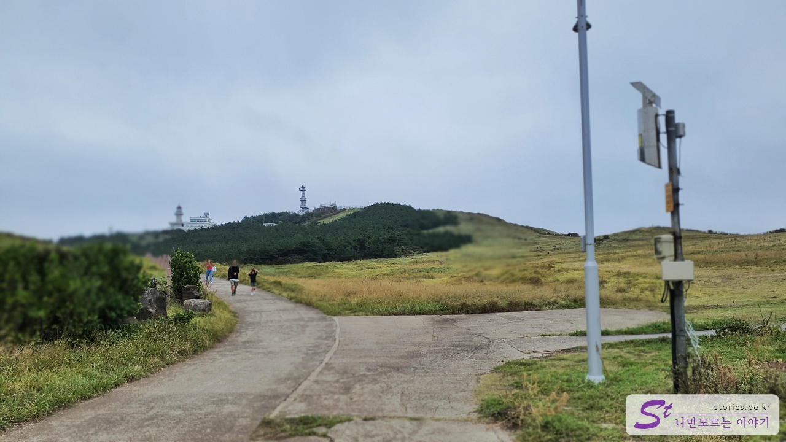

If you go up to the left, you can go up toward Udo Lighthouse, and if you go up to the right, you can see the view of the coastal cliff and Seongsan Ilchulbong Peak.

We went up to the right shore cliff.

As expected, it's a wonderful view. Seongsan Ilchulbong Peak, which you can see from far away, is really cool.

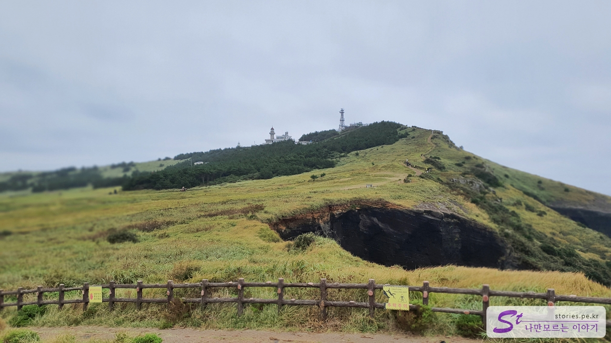

If you look to the left, you will see Udo Lighthouse. I walked towards that lighthouse.

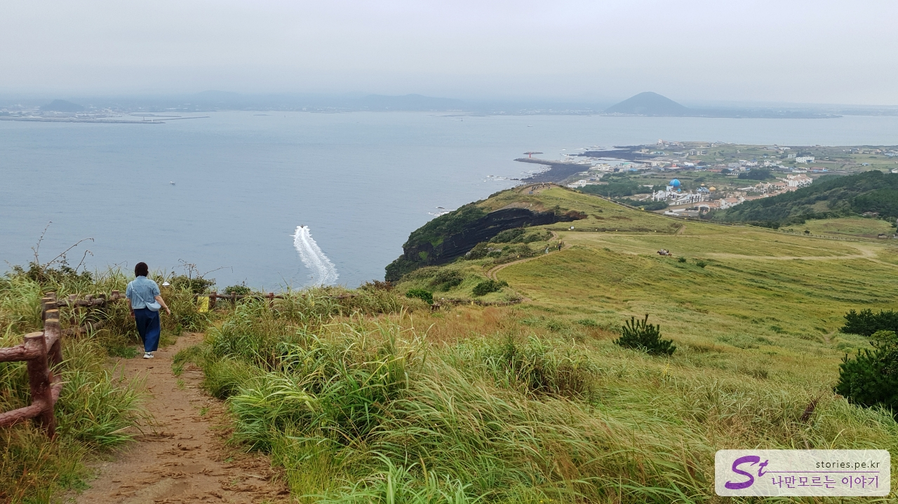

I used to be able to get to Udo Lighthouse from the top, but now it's blocked, so I had to walk down again. It's such a bummed out.

I came out of Udobong Peak, passed the Geommeolle I stopped by in the morning, and drove slowly along the eastern beach of Udo Island to see the scenery. Along the coastal road, we headed for another tourist spot, the Sudong Beach**. On the way, I stopped by **Biyangdo\*\*, the sacred place of backpacking.

Since Sudong Beach and Biyangdo Island planned to stay for one night at Udo Island and look around in detail the next day, I just passed by and headed for **daedani Tapmangdae** at the north end.

## Tapdani Tower Observatory (Udo Beacon Fire Station, Watchtower Lighthouse

Tadani Tower Observatory is located at the northern end of Udo Island, and some call it Udo Beacon Fire Station, some call it a watchtower lighthouse, and others call it Tadani Tower Observatory. The exact name is **Ddaedani Tower Observatory**, **Udo Beacon Fire Station**, and **Guardian Lighthouse**. It's all attached to the same place, so you can call it that. If I say it again It makes sense. ^^

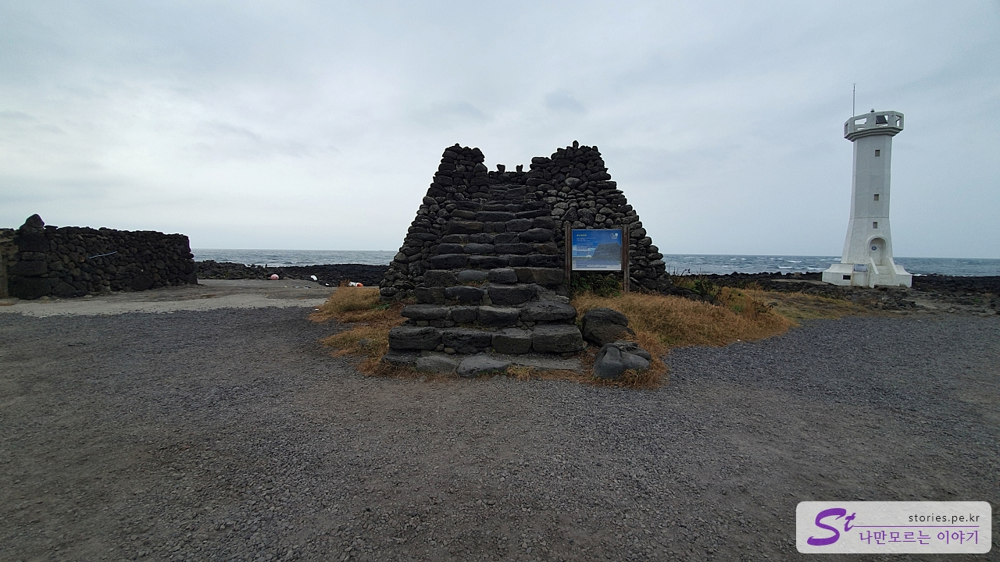

The white lighthouse on the right **is a watchtower lighthouse**, and the stone-stacked place in the middle \*\*is a beacon. Bongsudae is said to be a communication facility during the Joseon Dynasty where people who are far away exchange signals with fire and smoke.
By five o'clock, the number of people has decreased significantly and the sun is setting, so it's starting to get dark.

For dinner, we decided to eat Halla Mountain fried rice, which is famous in Udo Island. From Beacon Fire Station, we slowly rode the west coast to see the scenery and headed for **Rodem Garden** via Hau Mok East Port.

## Rodeem Garden, famous for Halla Mountain fried rice

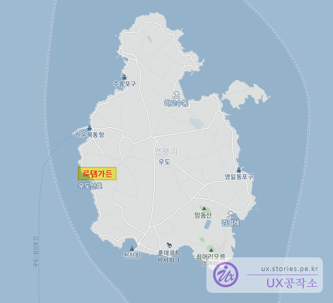

Since the last ferry leaves around 6 o'clock in Udo Island, most tourists disappear after 5 o'clock. And most restaurants are closed after 6 o'clock except for some.

Rodeem Garden still takes orders by 6 o'clock and serves meals by 7 o'clock for those left on the island.

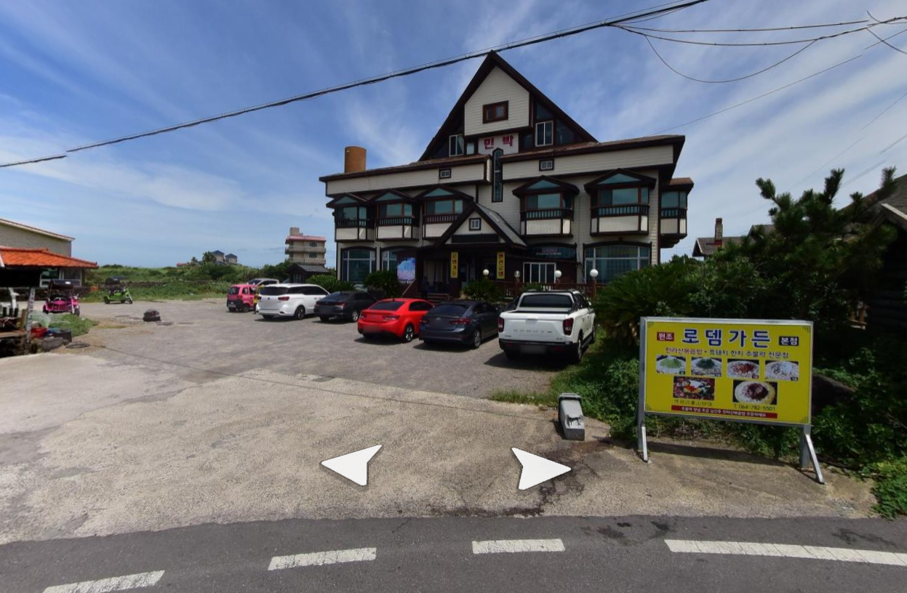

Rodem Garden was famous for its Halla Mountain fried rice. We stopped by the restaurant around 5:30 p.m., and there were not many people in the restaurant because it was time to leave Udo Island.

It is composed of black pork and Hanchi jumuluck, and you can make fried rice when you finish eating it.

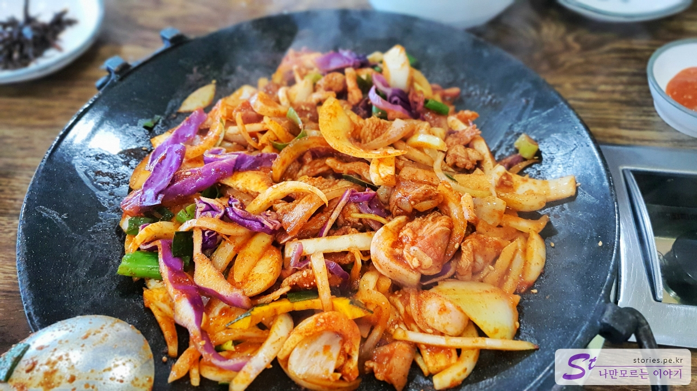

Hanchi, black pork, and vegetables are getting cooked. When cooked moderately, eat hanchi and black pork first with ssam.

If you ask the boss for fried rice when you eat it for a while, the boss makes you fried rice. They explained the process of making Hallasan with fried rice, and it was so fun. ^^

I wrote an explanation about Hallasan fried rice, but I remember the owner's explanation more. Haha

The price is not that cheap. It's 17,000 won per person and usually more than two people eat, so 34,000 won plus 4,000 won for Hallasan fried rice. You have to think about 20,000 won per person before you go.

## The filming location of the Udo Inn

On my way back to the accommodation, my wife wanted to see the filming location of the Udo Inn, so I looked it up.

It is located near Tianjin Port and is currently operated as Songun's pension. I think the Udo tavern rented Songwoo's pension during the shoot.
There's nothing right now, so I just saw it in the car and came out.

## White House of Servants

I'm back again. This time, I'm back at the white house. It is called Seobin Baeksa Temple, Coral Beach, and Red Cone Beach.

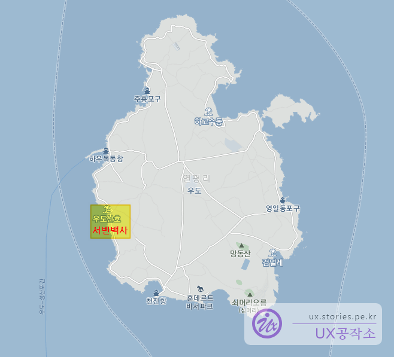

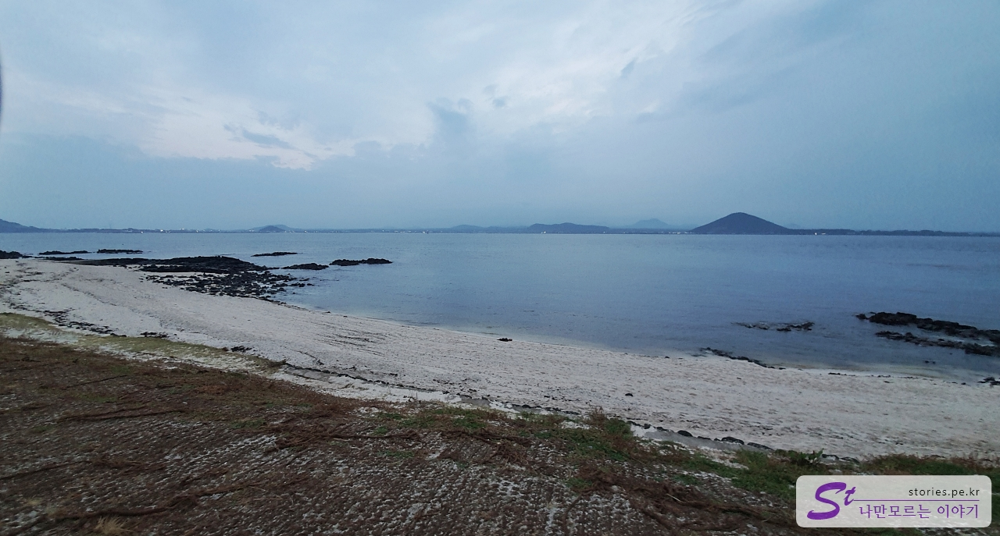

At this time, it was very quiet because all the tourists had escaped. Originally, I heard that the sunset seen here is so cool. We didn't see the sunset because there were so many clouds because we came with a typhoon.

I ended my day like this and went back to the accommodation. And while I was sleeping, the wind began to blow very hard.
I heard there's a typhoon coming.

## The next morning... What's this! one's way back

I was taking a nap at the sound of the wind, and I woke up early in the morning at the sound of knocking on the door. It was the sound of the owner knocking on the door. He said that the ship only floats once in the morning because of the typhoon, and he said he had to hurry up and clean up and go out. If you can't go out now, you have to stay in Udo for a few days. crying

No, because of the schedule, I have to go to ** and Sudong Beach**, and I have to try raw fish at **Biyangdo**.  
Without a second thought, I had to pack my luggage and take the 7:30 boat out.

I did a bucket list of "One Night at Udo" but... It was such a bummer. crying

I got on the return ship, and the wind blew so hard that the boat overturned. I was relieved and came out comforting myself.
If the schedule in Udo disappears, we urgently added the schedule in Seongsan as Plan B.

Please refer to the following posting.

## Location

<iframe src='https://www.google.com/maps/embed?pb=!1m18!1m12!1m3!1d13307.548337658378!2d126.94529323857266!3d33.50431478455578!2m3!1f0!2f0!3f0!3m2!1i1024!2i768!4f13.1!3m3!1m2!1s0x350d154cd36ef703%3A0xf4d98d795dc0c78a!2z7Jqw64-E!5e0!3m2!1sko!2skr!4v1669708079638!5m2!1sko!2skr' class='embed-responsive-item' allowfullscreen></iframe>

