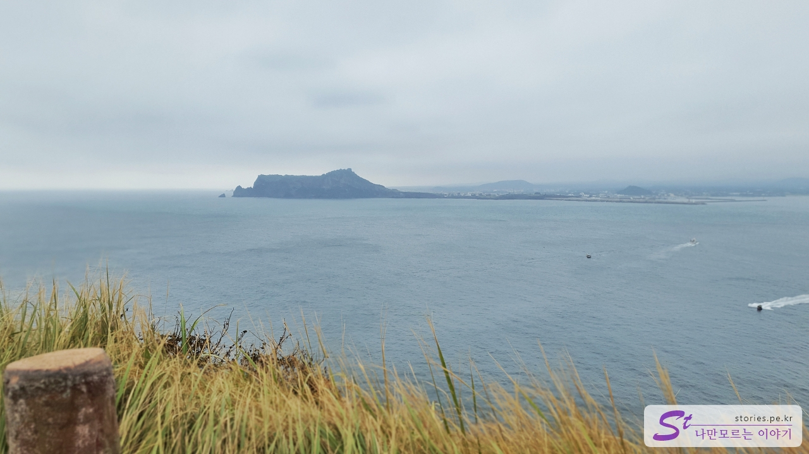
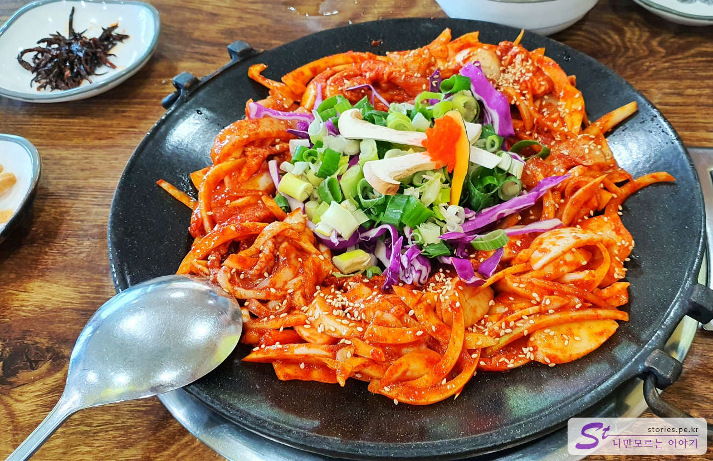

이번 제주여행의 핵심은 버킷리스트인 우도에서의 1박과 한라산 백록담 올라가기입니다. 그중에 첫 번째인 우도를 방문하기 위해 제주 여행 첫날 성산포 여객터미널로 갔습니다.

관광객이 우도에 들어갈 때 몇 가지 조건을 제외하고는 차량을 가지고 갈 수 없습니다.

## 우도에 차량을 가져갈 수 있는 몇가지 조건

인터넷을 찾아보면 차량 승선에 대한 여러 가지 글들이 있는데요. 가장 명확한 것은 아래 **우도가는배 홈페이지**를 참고하시는 것이 가장 정확할 것 같습니다.

["우도가는배" 렌터카 반입 조건](http://udoboat.smart9.net/m/pages.php?p=4_1_1_1)

그래도 간단히 정리해 보자면..

- 영유아(만 6세 미만의 취학 전 아동)를 동반한 가족 및 보호자
- 1급 또는 2급 장애인 및 휠체어를 이용하는 3급 장애인을 동반한 가족 및 보호자
- 65세 이상을 동반한 가족 및 보호자
- 임산부를 동반한 가족 및 보호자
- 휠체어를 이용하는 사람의 가족 및 보호자
- 우도에서 1박 이상을 하는 경우
- 우도에 주소 또는 사업장으로 등록된 사람으로 6개월 이상 장기 렌트하는 차량

저희는 우도에서 1박을 하기 때문에 렌터카 차량을 가져갈 수 있었습니다.

## 우도 가는 배 시간

배 시간은 30분 단위로 있습니다. 다만 계절 별로 첫배와 마지막 배의 시간만 다릅니다.
배시간은 기상 상황에 따라 수시로 바뀐다고 합니다.

["우도 가는 배" 배 시간](http://udoboat.smart9.net/m/pages.php?p=3_1_1_1)

## 배 타고 이동하기

갈매기와 함께 성산포항을 출발하여 우도로 향했습니다. 보통 30분 단위는 **천진항**으로, 1시간 단위는 **하우목동항**으로 가지만 그때그때 달라질 수 있다고 하네요.

우리는 약 20분 정도 달려서 하우목동항에 도착을 했습니다.

약 12시 30분쯤에 도착을 했기 때문에 숙소 체크인 시간이 되지 않아 숙소(우도사랑펜션)로는 이동하지 못하고 먼저 검멀레 해변으로 이동했습니다.

## 검멀레 해변

검멀레는 검은 모레라는 뜻으로 우도의 동남쪽에 있는 조그만 해변입니다. 우도봉 절벽과 어우러져 있어서 멋진 경치를 자랑하는 곳입니다.

바다 풍경과 절벽이 어우러져 있는 모습이 압권입니다. 날씨가 좋으면 이 해변에서 **우도 투어 보트**를 탈 수가 있는데, 우리가 갔을 때는 태풍 때문인지 바람이 많이 불어 운행을 하지 않고 있었습니다.

검멀레 해변 위쪽 도로에는 많은 상점들이 늘어서 있습니다. 이곳은 우도를 찾은 관광객들이 많이 찾는 스폿 중에 하나입니다. 그래도 이 정도면 사람이 많지 않은 편입니다.

검멀레에 있는 원조 **우도 땅콩 아이스크림**을 파는 **지미스** 입니다.

가격은 대략 5,000원 ~ 8,000원대를 형성하고 있으며 인근 상점 모두 비슷한 가격에 판매를 하고 있습니다.

우도 등대를 바라보며 땅콩 아이스크림을 찍어 봤습니다. 멋진 바다 풍경을 보며 먹는 아이스크림은 미각과 시각을 동시에 즐겁게 해 줍니다.

아이스크림도 먹었겠다, 이제는 검멀레 해변을 구경해 봐야겠지요? 지미스에서 바로 아래로 내려가는 길도 있지만 큰길을 따라 내려가는 길도 있습니다.

길 끝에서 바로 바닷가 바위까지 내려가 볼 수 있습니다.

검멀레 해변을 나가는 길에 언덕에서 자유롭게 놀고 있는 당나귀를 볼 수가 있었습니다. 내가 당나귀를 구경하는 것인지, 당나귀가 나를 구경하는것인지 모르겠습니다.

## 우도사랑펜션

우리가 묵은 우도의 숙소는 우도사랑펜션입니다. 일단 평점이 좋고 가격이 저렴해서 선택을 했습니다.

> 정신없이 낮잠을 자고 아침에도 특별한 사정 때문에 펜션 사진을 전혀 찍지 못했습니다. 그래서 네이버 맵으로 대체했습니다.^^

아직 체크인 시간 전인 오후 1시 정도였는데, 새벽부터 비행기 탄다고 설쳐대서 그런지 너무 피곤한 나머지 숙소에 일찍 체크인이 가능한지 확인했고 사장님의 배려로 조금 일찍 들어갈 수 있었습니다.
숙소는 펜션이라기보다는 약간 민박 같은 느낌이었습니다. 하지만 조경도 깨끗하게 잘 꾸며 놓으셨고 마당도 좋았으며 무엇보다도 사장님이 친절하게 잘 대해 주셔서 만족했던 펜션입니다. 숙소 내부는 작지만 깨끗한 편이였고 그 가격에 비하면 만족할 만한 수준이었습니다. 추천합니다. ㅎ

숙소에서 2시간 정도 낮잠을 자고 나서야 정신을 좀 차렸습니다. 우도에 왔는데 잠만 잘 수 없어서 일어나 다시 관광을 시작했습니다. 그리고 찾아간 곳이 우도봉입니다.

## 우도봉

렌터카를 타고 우도봉 주차장으로 향했습니다.

우도봉은 우도의 남쪽에 위치해 있고 우도에서 가장 높은 곳이므로 우도봉에 오르면서 구경하는 바다와 우도, 그리고 성산일출봉이 그러게 멋집니다.

주차장에 주차를 하고 대략 2~5분 정도 우도봉 입구까지 걸어 올라가야 합니다. 올라가다 보면 조랑말 타기 체험장이 있습니다. 말을 타고 우도봉 주위를 한 바퀴 도는 코스인데, 저희는 타보지 않았지만 한번 타볼 걸 그랬나?라는 생각이 들 정도였습니다.

왼쪽으로 올라가면 우도 등대 쪽으로 올라갈 수 있고 오른쪽으로 올라가면 해안 절벽의 경치와 성산일출봉 쪽을 볼 수가 있습니다.

우리는 오른쪽 해안절벽 쪽으로 올라갔습니다.

역시 멋진 풍경입니다. 저 멀리 보이는 성산 일출봉도 너무 멋지고요.

왼쪽으로 시선을 돌리면 우도 등대가 보입니다. 저 등대를 목표로 걸어갔습니다.

예전에는 꼭대기에서 우도 등대까지 갈 수 있었는데, 지금은 막혀있어서 다시 걸어내려와야 했습니다. 너무 아쉽더라고요.

우도봉에서 나와서 오전에 들렀던 검멀레를 지나 우도의 동쪽 해변을 따라 차를 타고 천천히 이동하며 경치를 구경했습니다. 해안 도로를 따라 또 하나의 관광 스폿인 **하고수동해변**으로 향했습니다. 가는 길에 백패킹의 성지인 **비양도**도 잠깐 들러봤고요.

하고수동해변과 비양도는 우도에서 1박을 하고 다음날 자세히 구경을 하기로 계획했기 때문에 그냥 그대로 지나쳐서 북쪽 끝에 있는 **답다니 탑망대**로 향했습니다.

## 답다니 탑망대 (우도 봉수대, 망루 등대)

답다니 탑망대는 우도의 북쪽 끝에 위치해 있고 누구는 우도 봉수대, 누구는 망루 등대, 누구는 답다니 탑망대라고 부릅니다. 정확한 명칭은 **답다니 탑망대**이고 **우도 봉수대**이며 **망루 등대**입니다. 이게 모두 같은 곳에 붙어 있어서 그렇게 부른다고 보시면 될 것 같습니다. 다시 말하면 다~ 맞는 말입니다. ^^

오른쪽 하얀색 등대가 **망루 등대**이고 가운데 있는 돌로 쌓은 곳이 **봉수대**입니다. 봉수대는 불과 연기로 먼 거리에 있는 사람들과 신호를 주고 받는 조선시대 통신시설이라고 하네요.

5시가 되니 이제 제법 사람들도 현저하게 줄어들고 해도 지고 있어서 어둑어둑해지기 시작했습니다.

저녁 식사는 우도에서 유명하다는 **한라산 볶음밥**을 먹기로 했습니다. 봉수대에서 천천히 서쪽 해안가를 타고 풍경을 구경하며 하우목동항을 거쳐 **로뎀 가든**으로 향했습니다.

## 한라산 볶음밥으로 유명한 로뎀 가든

우도는 대략 6시 안팎으로 막배가 떠나기 때문에 대부분의 관광객들이 5시를 넘어서게 되면 물밀듯이 사라져 버립니다. 그리고 대부분의 식당도 몇몇 식당을 제외하고는 6시 이후로는 문을 닫습니다.

로뎀 가든은 그래도 섬에 남은 사람을 위해서 6시까지 주문을 받고 7시까지는 식사를 제공해 주고 있습니다.

로뎀 가든은 한라산 볶음밥으로 유명세를 치렀던 곳입니다. 저희는 대략 5시 30분쯤에 식당에 들렀는데, 우도를 빠져나가는 시간대라서 식당에는 사람들이 별로 없었습니다.

흑돼지와 한치 주물럭으로 먼저 식사를 하고 다 먹어갈 무렵 볶음밥을 해 먹을 수 있게 구성되어 있습니다.

한치와 흑돼지와 야채가 익어가고 있습니다. 적당히 익으면 쌈과 함께 먼저 한치와 흑돼지를 먹습니다.

어느 정도 먹었을 때쯤 사장님께 볶음밥을 요청하면 사장님께서 볶음밥을 만들어 주십니다. 볶아주시면서 한라산의 생성과정에 대해서 볶음밥으로 설명을 해주시는데 너무 재미가 있었습니다. ^^

한라산 볶음밥에 대해서 글로 설명을 써 놓기는 했는데, 사장님의 설명이 더 기억에 남네요. ㅎㅎ

가격은 그렇게 싼 편은 아닙니다. 1인에 17,000원이고 보통 2인 이상이 식사를 하니 34,000원에 한라산 볶음밥 4,000원을 더하면.. 대략 인당 20,000원은 생각하고 가셔야 합니다.

## 우도 주막 촬영지

숙소로 돌아오는 길에 집사람이 우도 주막 촬영지를 보고 싶다고 해서 찾아봤습니다.

천진항 인근에 위치해 있고 현재는 송우네 펜션으로 운영 중에 있습니다. 아마도 우도 주막이 촬영 기간 동안 송우네 펜션을 임대해서 촬영을 하지 않았나 하네요.
지금은 아무것도 없어서 그냥 차에서 잠깐 보고 내려왔습니다.

## 서빈백사

다시 돌아 이번엔 서빈백사로 왔습니다. 서빈백사, 산호해수욕장, 홍조단괴해빈으로 불리고 있는 곳입니다.

이때는 관광객들이 모두 빠져나간 상태라 매우 고요했습니다. 원래는 이곳에서 보는 낙조가 그렇게 멋있다고 하던데.. 우리는 태풍을 품고 와서 그런지 구름이 많아서 낙조는 보지 못했습니다.

이렇게 하루를 마감하고 다시 숙소로 돌아갔습니다. 그리고 자는 동안 바람이 무척 불기 시작했습니다.
태풍이 온다는 소식도 들리고...

## 다음날 아침.. 이게 뭐야!! 돌아오는 길

바람 소리에 선잠을 자고 있는데, 아침 일찍 숙소 문을 두드리는 소리에 눈을 떴습니다. 주인아주머니께서 다급히 문을 두드리는 소리였습니다. 태풍 때문에 아침에 배가 한 번밖에 뜨지 않는다고 하시면서 빨리 정리하고 나가야 한다고.. 만약 지금 나가지 못하면 며칠을 우도에서 머물러 있어야 한다고 하네요. ㅠㅠ

아니, 일정상 **하고수동해변**도 가봐야 하고 **비양도**에서 회도 먹어봐야 하는데..  
두 번 생각할 것도 없이 바로 짐을 챙겨서 7시 30분 배를 타고 나와야 했습니다.

버킷리스트인 **우도에서의 1박**은 했다마는... 너무 아쉬운 1박이었습니다. ㅠㅠ

돌아오는 배를 탔는데, 정말 배가 뒤집힐 정도로 바람이 세게 불었습니다. 그나마 다행이라고 애써 마음의 위로를 하며 나왔습니다.
우도에서의 일정이 없어지면 성산에서의 일정을 플랜 B로 긴급히 추가하였습니다.

다음 포스팅을 참고하세요.

## 위치

<iframe src='https://www.google.com/maps/embed?pb=!1m18!1m12!1m3!1d13307.548337658378!2d126.94529323857266!3d33.50431478455578!2m3!1f0!2f0!3f0!3m2!1i1024!2i768!4f13.1!3m3!1m2!1s0x350d154cd36ef703%3A0xf4d98d795dc0c78a!2z7Jqw64-E!5e0!3m2!1sko!2skr!4v1669708079638!5m2!1sko!2skr' class='embed-responsive-item' allowfullscreen></iframe>

