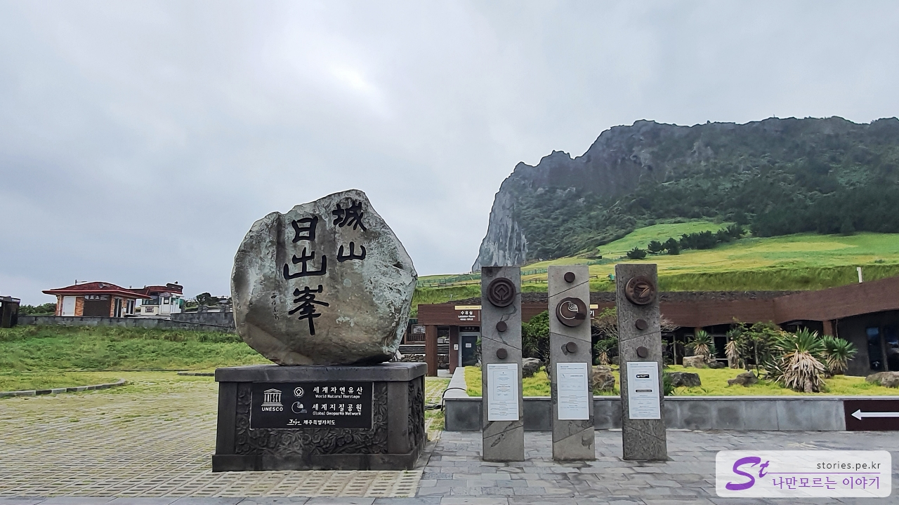
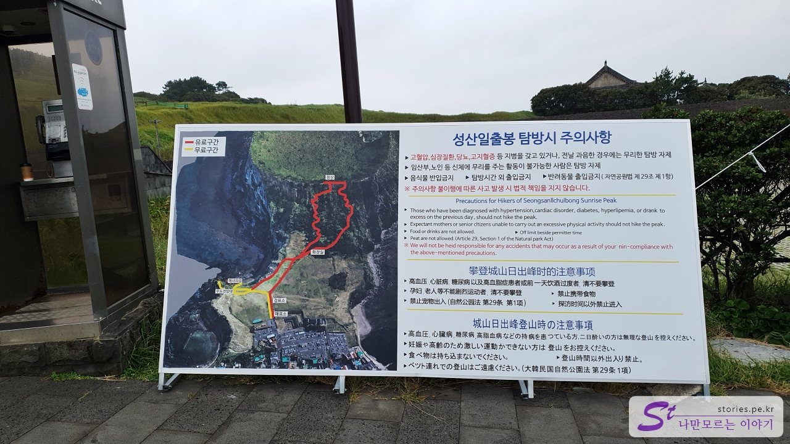
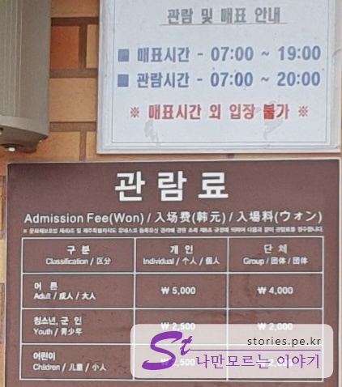
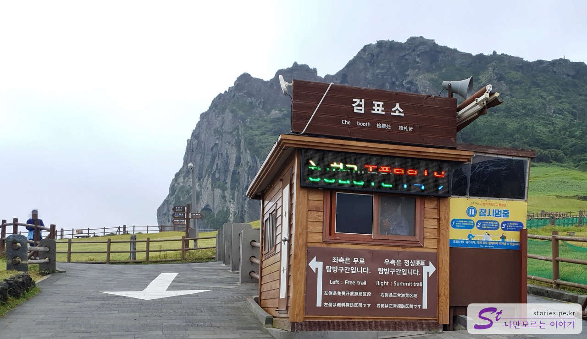

Due to the typhoon, I left Udo Island earlier than scheduled and suddenly made a schedule. I took it out on this trip because it was Seongsan Ilchulbong Peak that I visited every time I came to Jeju Island, but I had no choice but to go to Seongsan Ilchulbong Peak again this time.  
Maybe because I visited in the morning or because of the typhoon, there were not many people and it was so nice to see.

The national rule is to take a group photo. I don't know how many pictures there are. Hah!

There are precautions when visiting the entrance to Seongsan Ilchulbong Peak. Most of the general precautions are familiar, and if you look at the map, you can see the red and yellow lines. If you go up and go to the right, you can go to the red line, which is a paid section where you can go to the top of Seongsan Mountain. On the other hand, the yellow line to the left is a free section. You can't go up Seongsan Sunrise Peak, but you can see it.

The viewing time is from 7 a.m. to 8 p.m.
The price is 5,000 won for adults and 2,500 won for teenagers or younger.

There is a building before going to the ticket office. I think it's a building that used to be used as a ticket office.

This is the real ticket office. If you go to the right based on this ticket office, you will find the paid section of the red line, and the free section of the yellow line on the left.

We've been to the paid section a few times, so we've been to the free section.

This is Seongsanpo Port from the end of the free section. I can see Udo on that side.  
Unfortunately, there is no picture of Seongsan Ilchulbong Peak. crying  
It's a light tour course.

## Cost

The price is 5,000 won for adults and 2,500 won for teenagers or younger.

## Time of entry

- 03–09 September: Everyday 07:00 - 20:00
- October–February: Every day 07:30 - 19:00
- Closed: Closed on the first Monday of every month

## Travel destination information

- Address: Seongsan-ri 1, Seongsan-eup, Seogwipo-si, Jeju-do
- Contact: 064-783-0959
- - URL : https://www.visitjeju.net/kr/detail/view?contentsid=CONT_000000000500349

<iframe src='https://www.google.com/maps/embed?pb=!1m18!1m12!1m3!1d13314.653896201944!2d126.93374523855913!3d33.45807309432072!2m3!1f0!2f0!3f0!3m2!1i1024!2i768!4f13.1!3m3!1m2!1s0x350d14b9f6e3789f%3A0x555132053a23b64b!2z7ISx7IKwIOydvOy2nOu0iQ!5e0!3m2!1sko!2skr!4v1669720581856!5m2!1sko!2skr' class='embed-responsive-item' allowfullscreen></iframe>

## Parking information

The parking lot is very large, so if it's not during the peak season, there's no big problem with parking.

## a good restaurant nearby

There is a **matna restaurant** famous for its cost-effective braised cutlassfish and braised mackerel. Since the wait is long, meeting first, making a reservation at the restaurant, and visiting Seongsan Sunrise Peak, Seopjikoji, and Gwangchigi Beach while waiting for one to two hours can save time.
