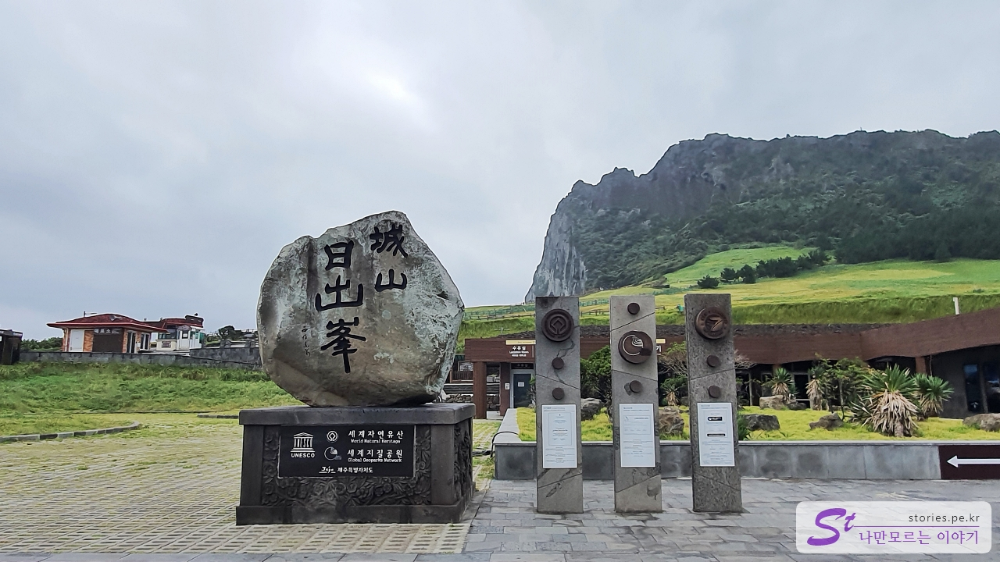
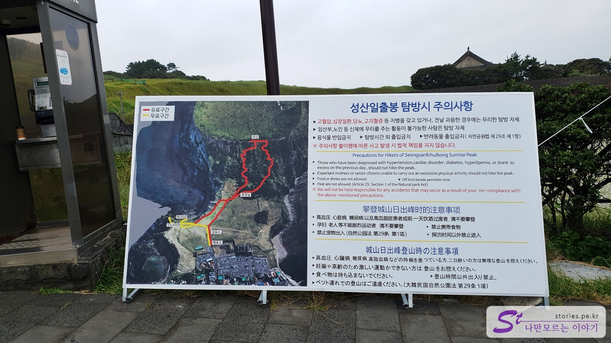
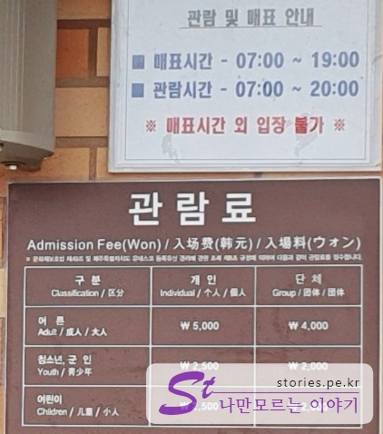
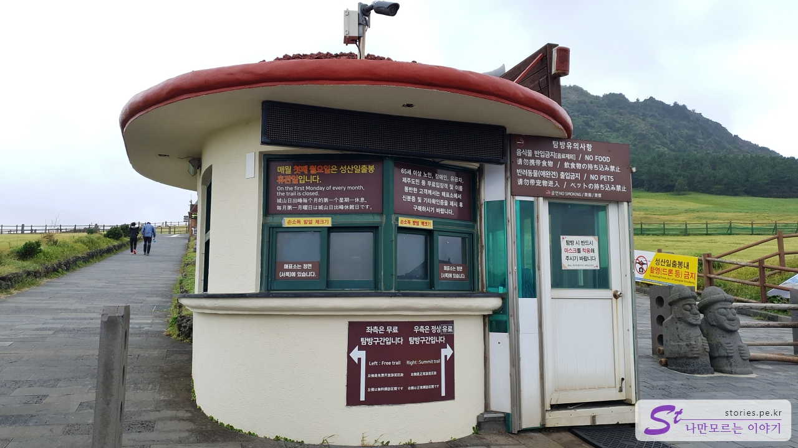
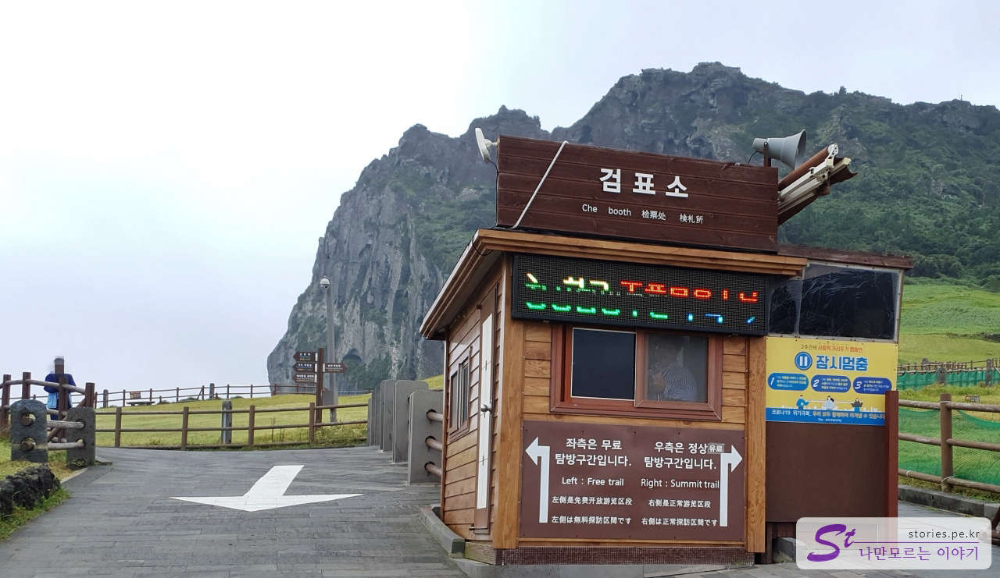
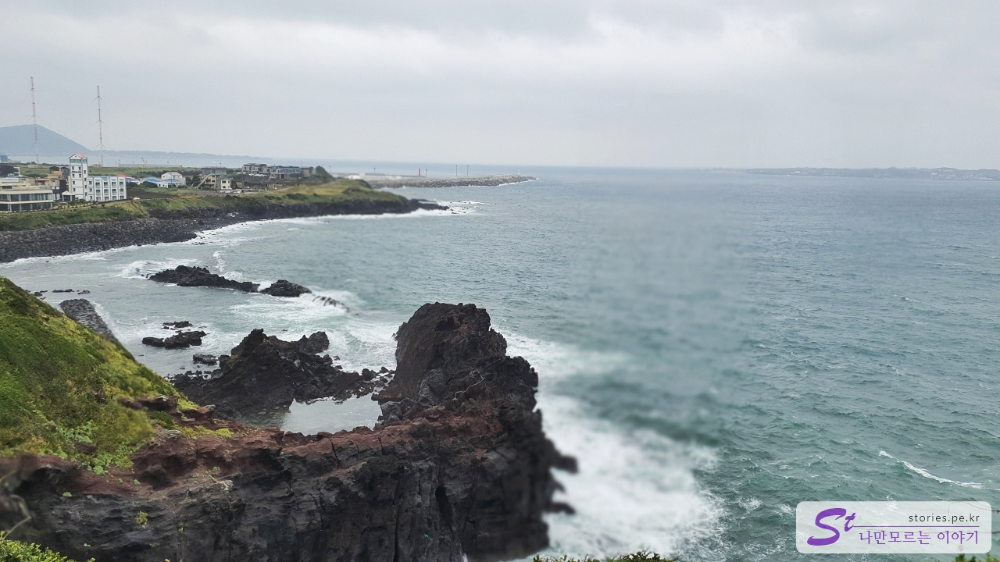

태풍으로 인해 예정보다 일찍 우도를 빠져나와 갑자기 일정을 잡았습니다. 제주도 올 때마다 방문한 성산 일출봉이라 이번 여행에서는 뺐었는데, 어쩔 수 없이 이번에도 성산 일출봉을 다녀왔습니다.  
아침에 방문해서 그런지, 태풍 때문에 그런지 사람도 별로 없고 구경하기 너무 좋았습니다.

단체사진 한 장 찍어주는 것이 국룰인 표지석입니다. 여기 사진이 몇 장이나 있는 것인지... ㅎ

성산 일출봉으로 올라가는 입구에 탐방 시 주의사항이 있네요. 일반적인 주의사항은 대부분 아는 내용이고, 지도를 보면 빨간색 라인과 노란색 라인을 볼 수 있습니다. 올라가다가 오른쪽으로 가면 빨간색 라인으로 갈 수 있는데, 성산의 꼭대기까지 다녀올 수 있는 유료 구간입니다. 반대로 왼쪽으로 노란색 라인은 무료로 다녀올 수 있는 구간입니다. 성산 일출봉을 올라갈 수는 없지만 볼 수 있는 구간입니다.

관람시간은 아침 7시부터 저녁 8시까지 가능합니다.
가격은 어른 5,000원 청소년 이하는 반값인 2,500원입니다.

검표소로 가기 전에 건물 하나가 있습니다. 아마 예전에 검표소로 활용되었던 건물 같습니다.

요기가 진짜 검표소입니다. 이 검표소를 기준으로 오른쪽으로 가면 빨간색 라인의 유료 구간이며, 왼쪽은 노란색 라인의 무료 구간입니다.

저희는 유료 구간을 몇 번 다녀왔기 때문에 무료 구간으로 관람을 다녀왔습니다.

무료 구간 끝자락에서 바라본 성산포항 방면입니다. 저짝에 우도도 보이네요.  
아쉬운 건 성산일출봉 쪽 사진이 없네요. ㅠㅠ  
가볍게 다녀올 수 있는 관광코스입니다.

## 비용

가격은 어른 5,000원 청소년 이하는 반값인 2,500원입니다.

## 입장시간

- 03~09월 : 매일 07:00 - 20:00
- 10~02월 : 매일 07:30 - 19:00
- 휴무일 : 매월 첫째 월요일 휴관

## 여행지 정보

- 주소 : 제주 서귀포시 성산읍 성산리 1
- 연락처 : 064-783-0959
- URL : https://www.visitjeju.net/kr/detail/view?contentsid=CONT_000000000500349

<iframe src='https://www.google.com/maps/embed?pb=!1m18!1m12!1m3!1d13314.653896201944!2d126.93374523855913!3d33.45807309432072!2m3!1f0!2f0!3f0!3m2!1i1024!2i768!4f13.1!3m3!1m2!1s0x350d14b9f6e3789f%3A0x555132053a23b64b!2z7ISx7IKwIOydvOy2nOu0iQ!5e0!3m2!1sko!2skr!4v1669720581856!5m2!1sko!2skr' class='embed-responsive-item' allowfullscreen></iframe>

## 주차정보

주차장은 매우 넓어서 아주 성수기가 아니라면 주차에 크게 문제는 없습니다.

## 인근 맛집

가성비 갈치조림, 고등어조림으로 유명한 **맛나 식당**이 있습니다. 웨이팅이 길어서 먼저 만나 식당에 예약을 하고 1~2시간 기다리는 동안 성산 일출봉이나 섭지코지, 광치기 해변 등을 다녀오는 것이 시간을 절약할 수 있습니다.
