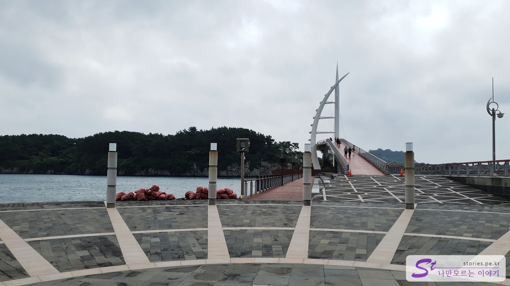
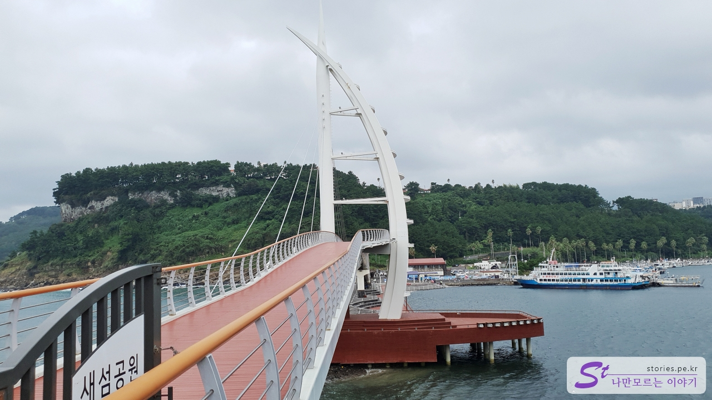
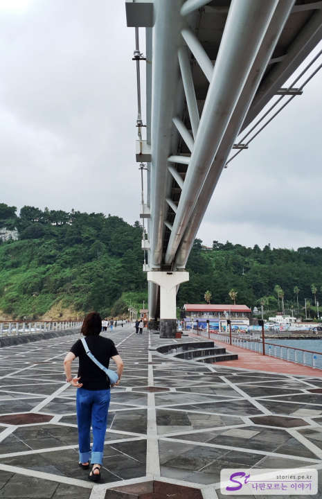
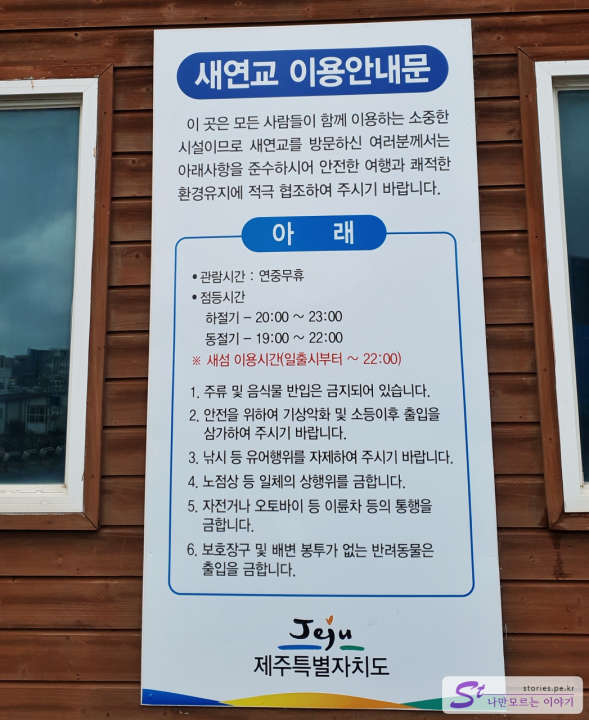

Cheonjiyeon Falls and Saeyeon Bridge are close by. It takes about 10 minutes to walk from the parking lot of Cheonjiyeon Falls, so if you have enough time, you can walk there. If it's hard to walk, there's a parking lot in front of Saeyeon Bridge, so you can move by car.

# a new bridge

Saeyeon Bridge is a bridge that connects to Saeseom Park. The motif is Teu, a traditional ship of Jeju.

Saeyeongyo Bridge is connected to Saeseom Island above and to the square under the bridge below, so there is a space to rest even in the hot summer sun. Most of all, you can see the cool side at night with the lights on.

After passing Saeyeon Bridge, you could enter Saseom Park, but now the Saseom Dulle-gil is damaged and blocked due to the typhoon. So you can't go into the new island and you have to turn back at the end of the bridge. If the new island is restored over time, you will have a chance to walk to the new.

The new bridge also has a fairly large resting area under the bridge. If you look at the form, I think they sometimes perform.

## Cost

The cost is free.

## Time of entry

I think you can enter even in the evening, but it's scary if it's too late.

- Operating hours:
  - Saeseom Island is available until 22:00 p.m., but access to Saeseom Island is currently blocked, so you have to come back from the end of Saeyeon Bridge.
  - The lighting hours of the new bridge are 20:00 to 23:00 in summer and 19:00 to 22:00 in winter.
- Closed: 24/7

## Travel destination information

- Address: Seohong-dong, Seogwipo-si, Jeju-do
- Contact: 064-760-3471
- - URL : https://www.visitjeju.net/kr/detail/view?contentsid=CONT_000000000500312

<iframe src='https://www.google.com/maps/embed?pb=!1m18!1m12!1m3!1d3337.1172269982076!2d126.55767111548901!3d33.2372321676834!2m3!1f0!2f0!3f0!3m2!1i1024!2i768!4f13.1!3m3!1m2!1s0x350c53a5ccbff7a5%3A0xb3200f8e151dd64b!2z7IOI7Jew6rWQ!5e0!3m2!1sko!2skr!4v1669871081127!5m2!1sko!2skr' class='embed-responsive-item' allowfullscreen></iframe>

## Parking information

The parking lot has a large parking space, so you don't have to worry.
