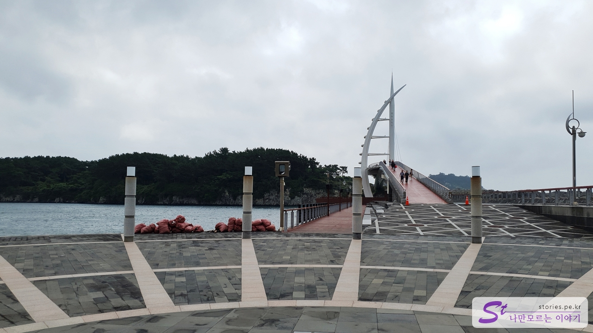
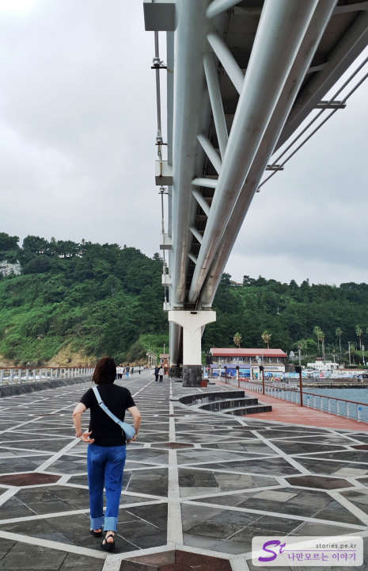

천지연폭포와 새연교는 가까운 거리에 있습니다. 천지연폭포 주차장에서 걸어서 대략 10분 정도 소요되므로 시간이 여유롭다면 충분히 걸어갈 수 있는 거리입니다. 걷기가 어렵다면 새연교 앞에도 주차장이 있어서 차로 이동해도 됩니다.

# 새연교

새연교는 새섬공원과 연결하는 다리입니다. 제주의 전통배인 테우를 모티브로 만들었다고 하네요.

새연교는 위로는 새섬과 연결이 되어 있고 아래로는 다리 밑 광장으로 연결이 되어 있어서 한여름 뙤약볕에도 쉴 수 있는 공간이 있습니다. 무엇보다도 야간에는 조명이 켜져서 멋진 모습을 볼 수도 있다고 합니다.

새연교를 지나면 새섬공원으로 들어갈 수 있었으나 지금은 태풍의 피해로 새섬 둘레길이 파손되어 막혀있습니다. 그래서 새섬으로는 들어갈 수 없고 다리 끝에서 다시 발길을 돌려야 합니다. 시간이 지나 새섬이 복구되면 새섬까지 걸어볼 수 있는 기회가 오겠지요.

새연교는 다리 아래에도 상당히 넓은 쉴 수 있는 공간이 있습니다. 형태를 보면 가끔씩 공연도 하나 봅니다.

## 비용

비용은 무료입니다.

## 입장시간

입장시간은 저녁에도 입장을 할 수 있는 것 같은데 너무 늦으면 무서워요.

- 운영시간 :
  - 새섬은 저녁 22:00까지 이용이 가능하나 현재는 새섬 출입이 막혀있어서 새연교 끝에서 다시 나와야 합니다.
  - 새연교의 점등시간은 하절기 20:00 ~23:00, 동절기 19:00 ~ 22:00입니다.
- 휴무일 : 연중무휴

## 여행지 정보

- 주소 : 제주 서귀포시 서홍동
- 연락처 : 064-760-3471
- URL : https://www.visitjeju.net/kr/detail/view?contentsid=CONT_000000000500312

<iframe src='https://www.google.com/maps/embed?pb=!1m18!1m12!1m3!1d3337.1172269982076!2d126.55767111548901!3d33.2372321676834!2m3!1f0!2f0!3f0!3m2!1i1024!2i768!4f13.1!3m3!1m2!1s0x350c53a5ccbff7a5%3A0xb3200f8e151dd64b!2z7IOI7Jew6rWQ!5e0!3m2!1sko!2skr!4v1669871081127!5m2!1sko!2skr' class='embed-responsive-item' allowfullscreen></iframe>

## 주차정보

주차장은 넓은 주차공간이 있어서 걱정할 필요 없습니다.
