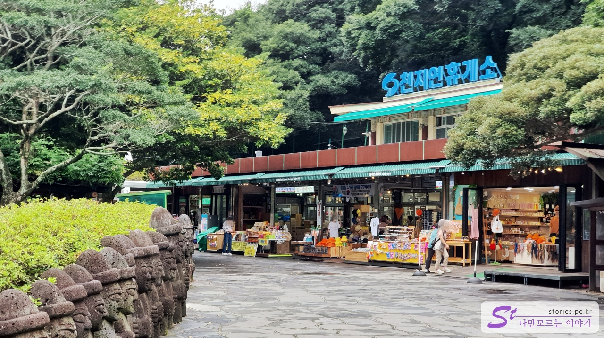

It's my first day in Seogwipo. We stayed at **Jink Hotel** located close to Cheonjiyeon Falls. I won't post it separately, but it's not a bad cost-effective hotel.  
I left the hotel around 9 a.m. and headed to Cheonjiyeon Falls. If you walk for about 10 minutes, you will find the ticket office.

  
The entrance to Cheonjiyeon Falls is not free. Admission is 2,000 won per \*\*person. There are also various conditions for free admission, so please check carefully.

  
There are two of us, so we paid 4,000 won to enter.

  
If you go about 50m, you will find a bridge with a stone statue hanging on your back. If you cross this bridge, you can go to Cheonjiyeon Falls.

  
If you cross the bridge, you will find **Cheonjiyeon Rest Area** where you can buy souvenirs right in front of you.

  
After passing the Cheonjiyeon Rest Area, you will see a wonderful waterfall in front of you as if you are walking about 500m.

  
I took a picture at the Cheonjiyeon sign, the national rule of the proof shot, and sat on a chair and watched the water falling from the waterfall to enjoy the scenery. This road is a wonderful waterfall, but it was good because the road to the waterfall was so good for a walk.

  
There is also a stone bridge that you can cross over on your way back. I've been looking around for a long time here, too.

## Cost

- Adult: 2,000 won
- Children, teenagers, soldiers: 1,000 won

### free admission

- 6 years of age or younger, 65 years of age or older
- a disabled welfare card holder
- Jeju residents
- People of independence, people of national merit, etc.

## Time of entry

- Operating hours: 09:00 to 21:20
- Time required: About 40 minutes round trip
- Closed:

## Travel destination information

- Address: 667-7 Cheonji-dong, Seogwipo-si, Jeju-do
- Contact number: 064-733-1528
- - URL : https://www.visitjeju.net/kr/detail/view?contentsid=CONT_000000000500618

<iframe src='https://www.google.com/maps/embed?pb=!1m18!1m12!1m3!1d13346.983386676493!2d126.5456622384975!3d33.24696113876349!2m3!1f0!2f0!3f0!3m2!1i1024!2i768!4f13.1!3m3!1m2!1s0x350c5397e5d18685%3A0xdb873e6da9b01b6!2z7LKc7KeA7Jew7Y-t7Y-s!5e0!3m2!1sko!2skr!4v1669821214444!5m2!1sko!2skr' class='embed-responsive-item' allowfullscreen></iframe>

## Parking information

The parking lot is very wide.

## a good restaurant nearby

[Chinese dish 1000 days dumpling](https://blog.stories.pe.kr/588))
