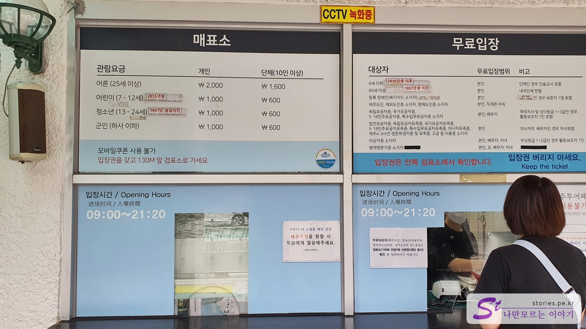
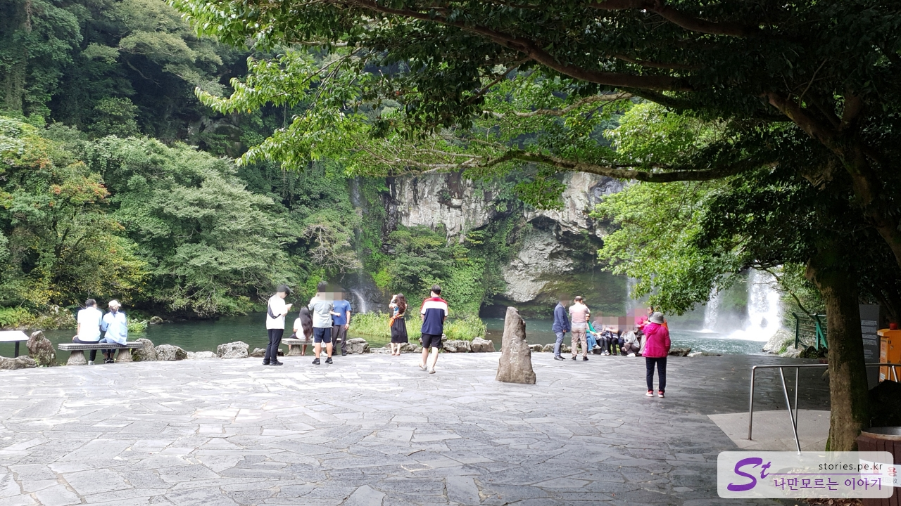

서귀포에서 첫날입니다. 우리는 천지연폭포와 가까운 곳에 위치해 있는 **징크 호텔**에 숙박을 했습니다. 따로 포스팅은 하지 않겠지만 나쁘지 않은 가성비 좋은 호텔입니다.  
아침 9시쯤 호텔을 나와 천지연 폭포로 향했습니다. 10분 정도 걸어가면 매표소가 나옵니다.

  
천지연폭포 입장이 무료는 아닙니다. 입장료가 **인당 2,000원**입니다. 무료입장이 가능한 다양한 조건도 있으니 잘 확인해 보세요.

  
저희는 2명이라 4,000원을 내고 입장을 했습니다.

  
50m쯤 가다 보면 물허벅을 매고 있는 석상이 있는 다리가 나옵니다. 이 다리를 건너면 천지연폭포로 갈 수 있습니다.

  
다리를 건너면 바로 앞에 기념품을 살 수 있는 **천지연 휴게소**가 나옵니다.

  
천지연 휴게소를 지나 500m쯤 산책하듯 걸어가다 보면 눈앞에 멋진 폭포가 나타나게 됩니다.

  
인증샷의 국룰인 천지연 표지석에서 사진도 한번 찍어보고 의자에 앉아 폭포에서 떨어지는 물도 쳐다보며 경치를 감상했습니다. 이 길은 멋진 폭포도 폭포지만 폭포로 가는 길이 산책하기에 너무 좋게 되어 있어서 좋았습니다.

  
돌아오는 길에 건너편으로 넘어갈 수 있는 돌다리도 있습니다. 여기서도 한참을 구경하다가 내려왔네요.

## 비용

- 성인 : 2,000원
- 어린이, 청소년, 군인 : 1,000원

### 무료입장

- 6세 이하, 65세 이상
- 장애인 복지카드 소지자
- 제주도민
- 독립유공자, 국가유공자 등등..

## 입장시간

- 운영시간 : 09:00 ~ 21:20
- 소요시간 : 왕복 40분 정도
- 휴무일 :

## 여행지 정보

- 주소 : 제주 서귀포시 천지동 667-7
- 연락처 : 064-733-1528
- URL : https://www.visitjeju.net/kr/detail/view?contentsid=CONT_000000000500618

<iframe src='https://www.google.com/maps/embed?pb=!1m18!1m12!1m3!1d13346.983386676493!2d126.5456622384975!3d33.24696113876349!2m3!1f0!2f0!3f0!3m2!1i1024!2i768!4f13.1!3m3!1m2!1s0x350c5397e5d18685%3A0xdb873e6da9b01b6!2z7LKc7KeA7Jew7Y-t7Y-s!5e0!3m2!1sko!2skr!4v1669821214444!5m2!1sko!2skr' class='embed-responsive-item' allowfullscreen></iframe>

## 주차정보

주차장은 매우 넓게 있습니다.

## 인근 맛집

[중국식 중화요리 천일 만두](https://blog.stories.pe.kr/588)
