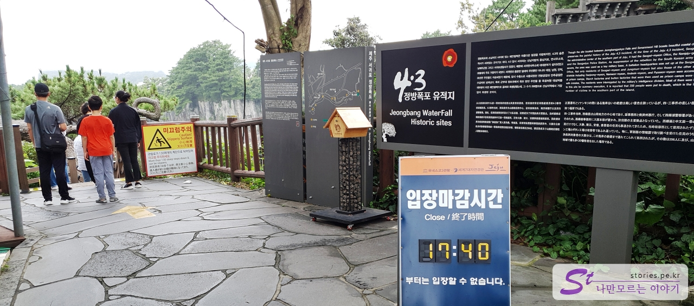
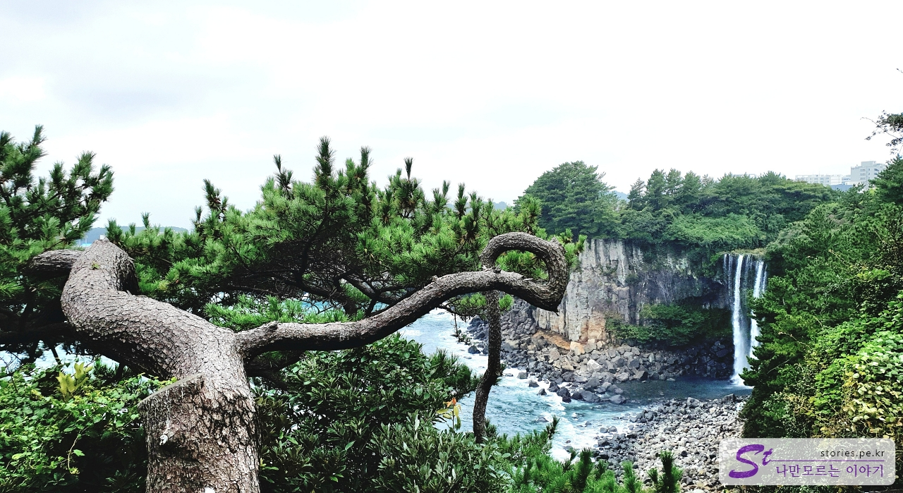
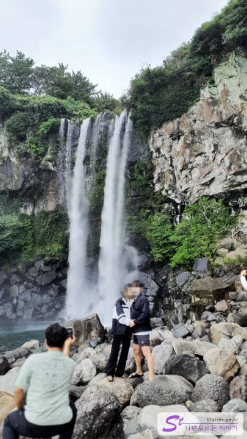

I came out of Saeyeon Bridge and went to Jeongbang Falls. Jeongbang Falls in Seogwipo is one of the three major waterfalls in Jeju Island along with Cheonjiyeon Falls and Cheonjeyeon Falls. It is said to be the only waterfall in Korea that falls directly into the sea.

Parking in the parking lot and ticketing first. The price is 2,000 won per adult, the same as Cheonjiyeon Falls.

At night, there is no light, so you can only enter until 17:40 and you cannot enter after that. Since the waterfall is down, you have to go down the stairs from the entrance.

You can see Jeongbang Falls in harmony with old pine trees in front of the way down. The waterfall is falling right into the sea.

Go down the narrow stairs. There's a checkpoint on the way down. When you come up, you have to follow the same road in the middle, but if there are many people, the stairs are narrow, so it may be dangerous.

There's a notice telling me to watch out for snakes, but the snake is drawn so cute that I laugh once. Haha

It's a square waterfall. In front of the waterfall, most people take a proof shot like this. The background is so nice, but it's a bit disappointing that we can't capture the magnificent sound of the waterfall.

## Time of entry

- Operating hours: 09:00 to 17:40
- Time required: About 30 minutes round trip
- Closed: 24/7

## Travel destination information

- Address: 37 Chilsim-ri 214beon-gil, Seogwipo-si, Jeju
- Contact number: 064-733-1530
- - URL : https://www.visitjeju.net/kr/detail/view?contentsid=CONT_000000000500531

<iframe src='https://www.google.com/maps/embed?pb=!1m18!1m12!1m3!1d3336.826191834313!2d126.56961451548905!3d33.24485656728987!2m3!1f0!2f0!3f0!3m2!1i1024!2i768!4f13.1!3m3!1m2!1s0x350c5373f9c8a7f1%3A0xa0f04e20cf99b30b!2z7KCV67Cp7Y-t7Y-s!5e0!3m2!1sko!2skr!4v1669878355870!5m2!1sko!2skr' class='embed-responsive-item' allowfullscreen></iframe>

## Parking information

Parking is free, but there is an entrance fee. There is a large parking lot, so there is no need to worry about parking.
