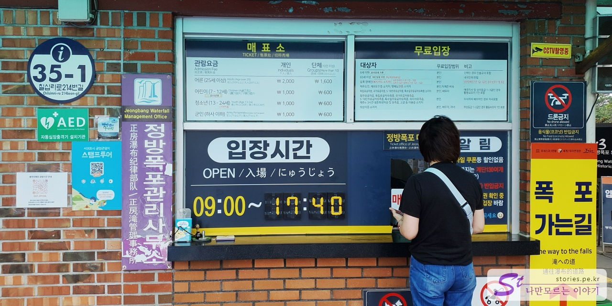
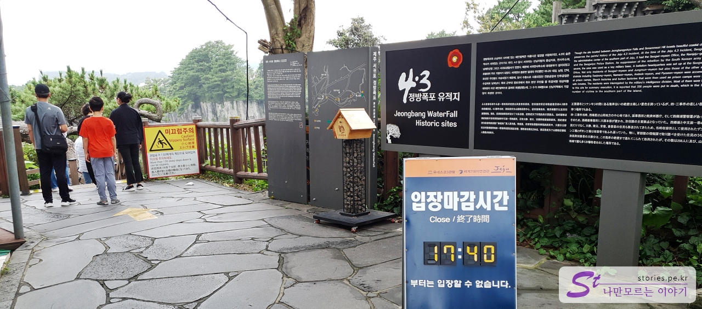
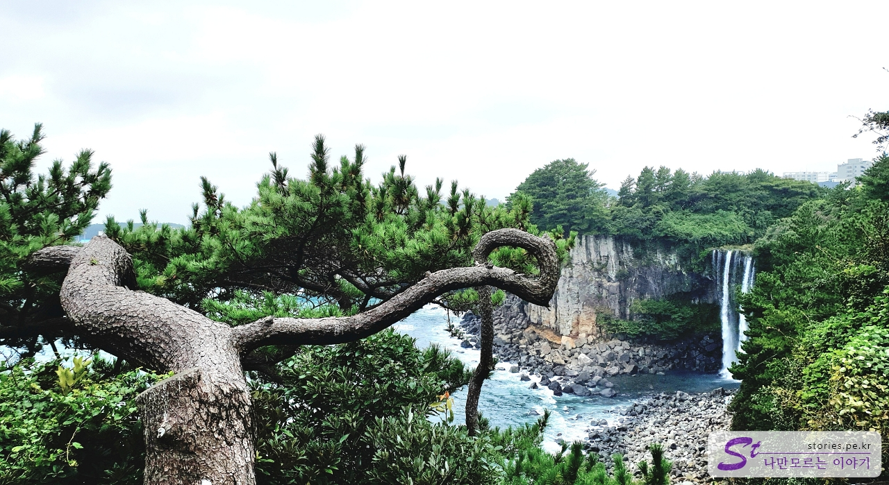
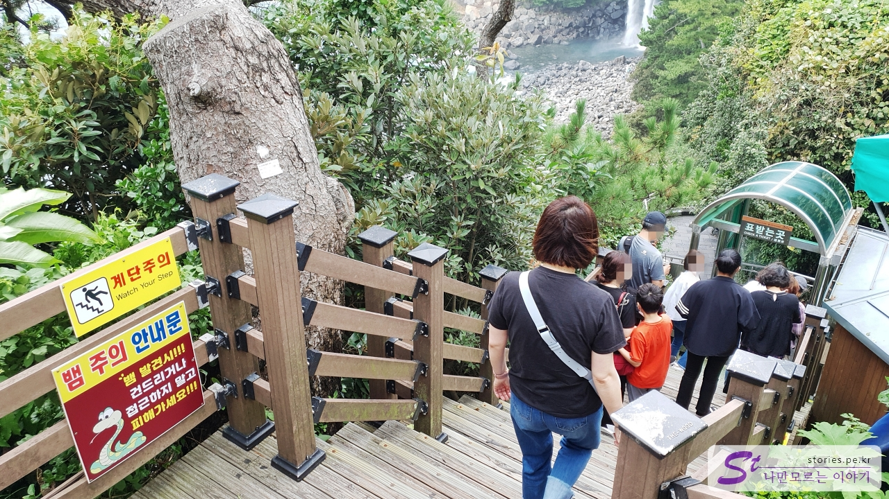
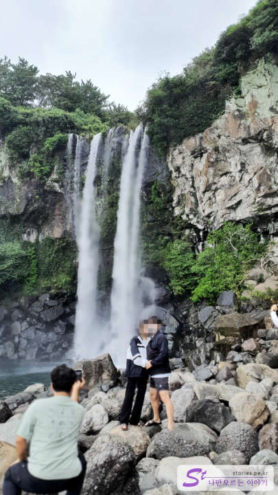

새연교에서 나와서 정방폭포를 다녀왔습니다. 서귀포에 있는 정방폭포는 천지연폭포, 천제연폭포와 더불어 제주도 3대 폭포 중 하나입니다. 국내에서는 바다로 바로 떨어지는 유일한 폭포라고 합니다.

주차장에 주차를 하고 먼저 매표를 합니다. 가격은 천지연폭포와 동일하게 어른 기준으로 인당 2,000원입니다.

밤에는 조명이 없어서 인지 17:40분까지만 입장할 수 있고 그 이후는 입장이 불가합니다. 폭포가 아래쪽에 있다 보니 입구에서 계단을 따라 아래쪽으로 내려가야 합니다.

내려가는 길 앞에 노송과 어우러져 있는 정방폭포의 모습을 볼 수 있습니다. 폭포가 바로 바다로 떨어지고 있네요.

좁은 계단을 따라 내려갑니다. 내려가는 길에 검표소가 있습니다. 올라올 때도 중간까지는 동일한 길을 따라 올라와야 하는데, 사람이 많을 경우는 계단이 좁아서 위험할 수도 있을 것 같습니다.

뱀 주의하라는 안내문이 있는데, 뱀이 너무 귀엽게 그려져 있어서 한번 웃게 되네요. ㅎㅎ

정방폭포입니다. 폭포 앞에 가면 대부분의 사람들이 이렇게 인증샷을 찍습니다. 배경이 너무 멋지지만 웅장한 폭포소리를 담지 못해서 좀 아쉽기는 하네요.

## 입장시간

- 운영시간 : 09:00 ~ 17:40
- 소요시간 : 왕복 30분 정도
- 휴무일 : 연중무휴

## 여행지 정보

- 주소 : 제주 서귀포시 칠십리로214번길 37
- 연락처 : 064-733-1530
- URL : https://www.visitjeju.net/kr/detail/view?contentsid=CONT_000000000500531

<iframe src='https://www.google.com/maps/embed?pb=!1m18!1m12!1m3!1d3336.826191834313!2d126.56961451548905!3d33.24485656728987!2m3!1f0!2f0!3f0!3m2!1i1024!2i768!4f13.1!3m3!1m2!1s0x350c5373f9c8a7f1%3A0xa0f04e20cf99b30b!2z7KCV67Cp7Y-t7Y-s!5e0!3m2!1sko!2skr!4v1669878355870!5m2!1sko!2skr' class='embed-responsive-item' allowfullscreen></iframe>

## 주차정보

주차장은 무료이나 입장료가 있습니다. 넓은 주차장이 있어서 주차 문제는 걱정 없습니다.
