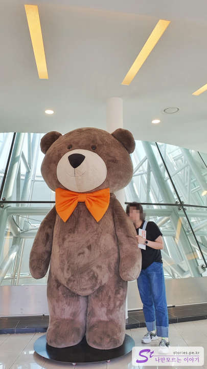
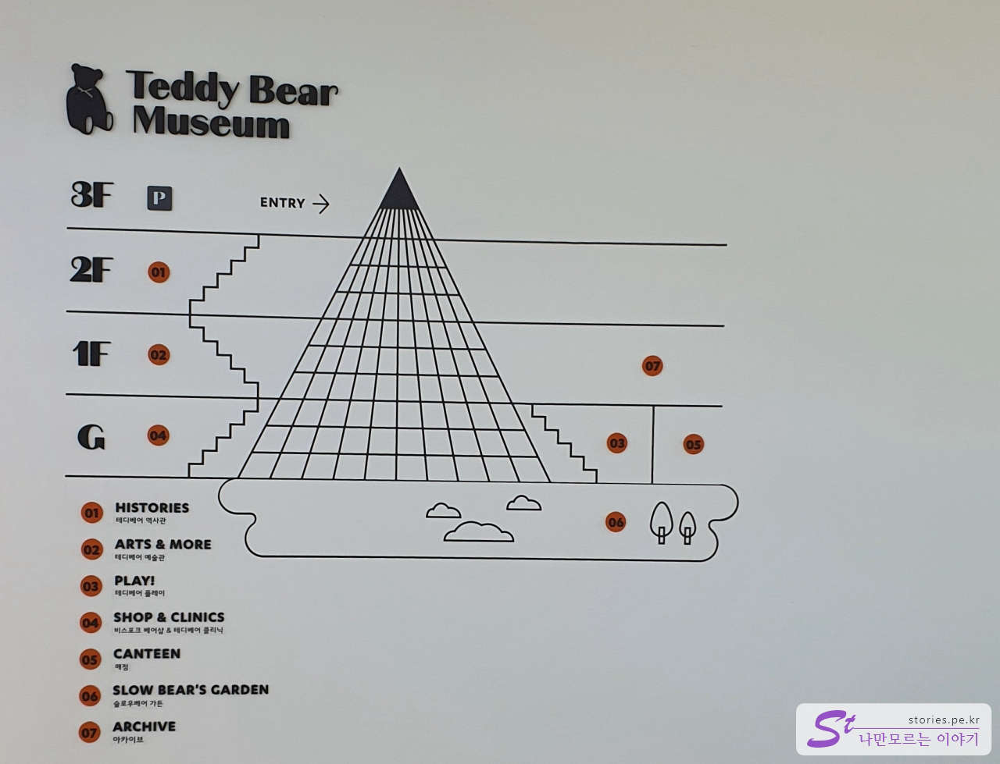
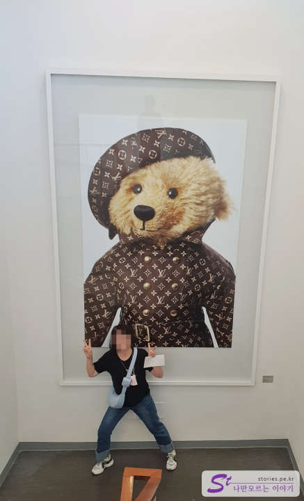
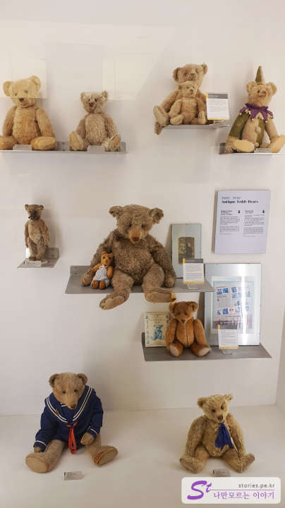
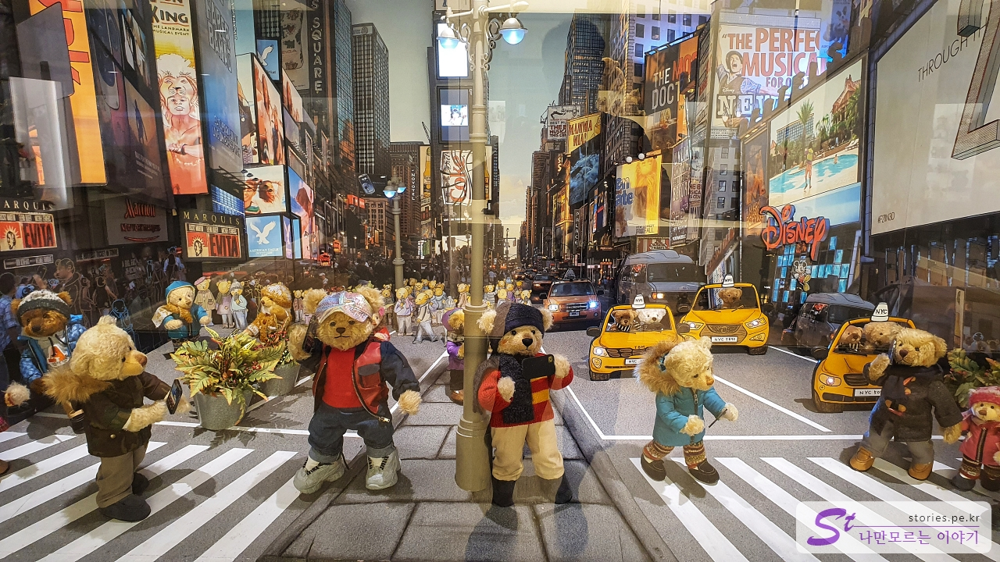
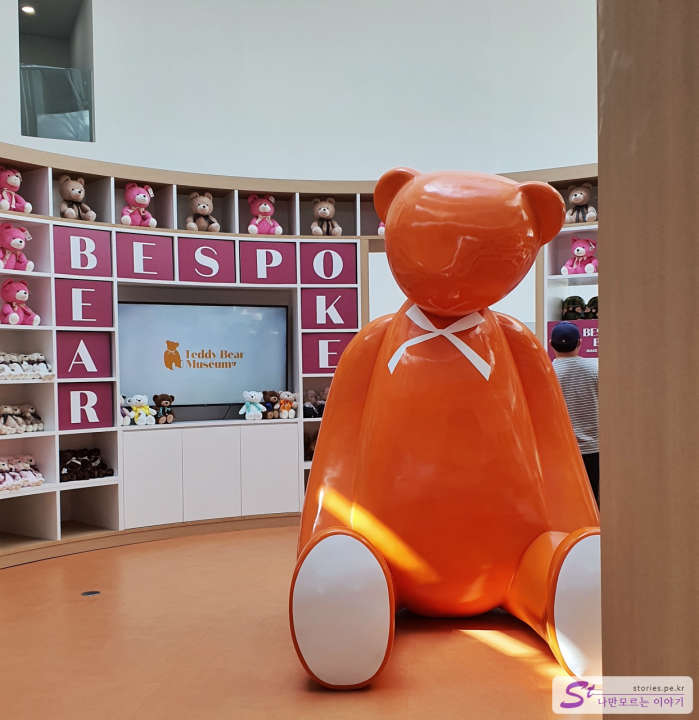
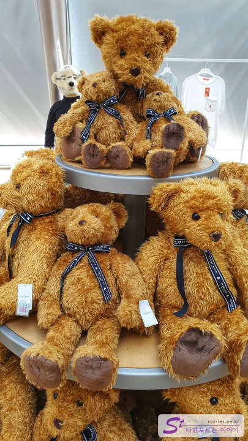

If I went to Cheonjeyeon Falls outdoors in the sunlight, this time I went to the Teddy Bear Museum located indoors.

"Why is a grown-up here?" My wife said she had to go, so I put it on her itinerary.

Actually, it is a place where my family has a lot of memories. I visited my children a few times when they were young, and I still have some teddy bear dolls I bought here. Now the kids are all grown up, and we're traveling without them, but... It's a place that makes you feel nostalgic.

Ten years ago, it was quite crowded, but now it's too quiet.

When you pass the ticket and enter through the entrance at the top of the pyramid, a large teddy bear greets the visitors. Did we have this in the past?

The Teddy Bear Museum is a pyramid-shaped building. The entrance, which says **3F**, is actually just on the ground floor. You can see it as you go down, but it's located on a slope, so it's exposed to the outside up to **1F**. **It is used as an exhibition hall from 3F to 1F, and **G\*\*It consists of stores that sell products that are recognized.

My mom is making a pose that my daughter takes a lot of. It's time for my mom to go back to her childhood.

Just by looking at it, it looks old. It seems to tell the history of teddy bears.

There are various exhibitions with teddy bears. The picture above seems to represent the streets of New York. From the third floor to the first floor, there are these kinds of exhibition halls.

If you come down to B1, the lowest floor, there is a teddy bear store. We sell a variety of teddy bear dolls.

One of them is a teddy bear. You're going to give someone another perfume like my family, right?

Lastly, I took a picture and came out.

## Cost

- Adult: 12,000 won
- Youth: 11,000 won
- Children: 10,000 won

## Time of entry

- Operating hours: 09:00 - 18:00 every day
- Time required: 1–2 hr round trip
- Closed: 24/7

## Travel destination information

- Address: 31, Jungmun Tourist-ro 110beon-gil, Seogwipo-si, Jeju
- Contact point: 064-738-7600
- - URL : http://www.teddybearmuseum.com/site/museums/jeju/guide.php

<iframe src='https://www.google.com/maps/embed?pb=!1m18!1m12!1m3!1d1668.310606767261!2d126.40999026681804!3d33.250225561620965!2m3!1f0!2f0!3f0!3m2!1i1024!2i768!4f13.1!3m3!1m2!1s0x350c5ac728409539%3A0x323101daba026ecb!2z7YWM65SU67Kg7Ja067CV66y86rSA!5e0!3m2!1sko!2skr!4v1669888020735!5m2!1sko!2skr' class='embed-responsive-item' allowfullscreen></iframe>

## Parking information

There is a free parking lot around the building.
