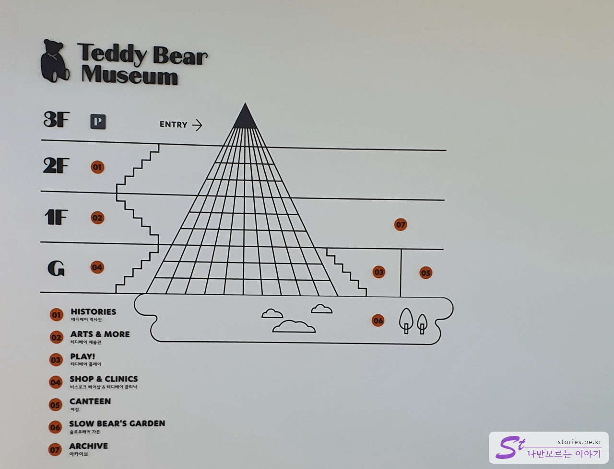
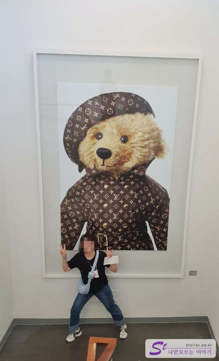
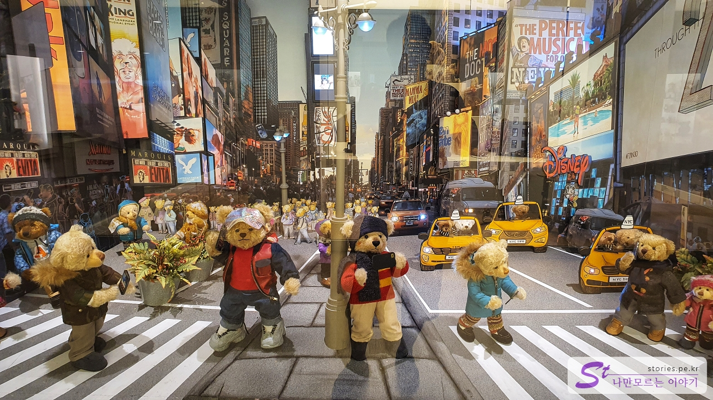
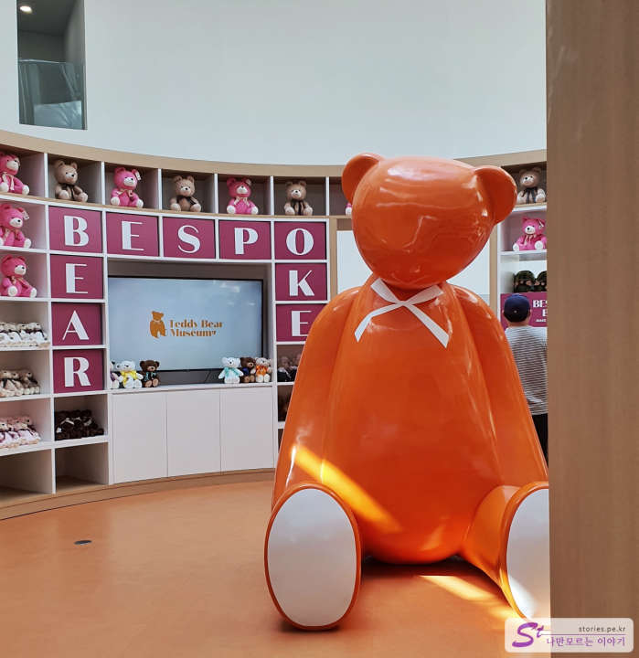
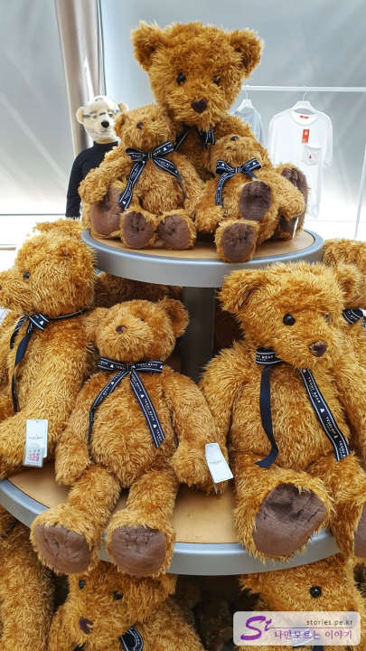

실외에서 햇빛을 맞으며 천제연폭포를 다녀왔다면 이번에는 실내에 위치한 테디베어 뮤지엄을 다녀왔습니다.

"다 큰 어른이 여길 왜??" 싶지만 아내가 꼭 가봐야 한다고 해서 여행 일정에 넣었습니다.

사실 우리 가족에게는 많은 추억이 있는 장소이기는 합니다. 아이들이 어렸을 때 몇 번 방문을 했고 아직도 집에는 여기에서 구매한 테디베어 인형 몇 마리가 있으니까요. 지금은 아이들이 다 커서 아이들 없이 우리 부부 둘만 여행을 하고 있지만.. 옛날 향수를 느끼게 해주는 장소이긴 합니다.

10년 전에는 그래도 사람들이 꽤 붐볐었는데, 지금은 너무 한산한 모습입니다.

매표를 하고 피라미드의 가장 꼭대기에 있는 입구를 통해 들어가면 커다란 테디베어가 입장객을 맞이해 줍니다. 옛날에도 이게 있었나???

테디베어 뮤지엄은 피라미드 형태의 건물입니다. **3F**이라고 되어 있는 입구는 사실 그냥 1층 같은 위치에 있습니다. 아래로 내려오면서 관람을 하지만 경사진 곳에 위치해 있어서 **1F**까지는 외부에 노출이 되어 있습니다. **3F~1F까지는 전시관**으로 사용을 하고 **G**인 지하는 상품을 판매하는 매장으로 이루어져 있습니다.

우리 딸내미가 많이 취하는 포즈를 엄마가 하고 있네요. 엄마도 동심으로 돌아가는 시간이네요.

딱 보기만 해도 상태가 오래되어 보입니다. 테디베어의 역사를 말해 주는 것 같네요.

테디베어로 다양한 전시를 하고 있습니다. 위의 사진은 뉴욕 거리를 표현한 것 같네요. 3층에서 1층까지는 이런 식의 전시관들이 이어져 있습니다.

가장 아래층인 지하 1층으로 내려오면 테디베어 매장이 있습니다. 다양한 테디베어 인형들을 판매하고 있습니다.

그중에 한 종류의 테디베어입니다. 우리 가족처럼 누군가에게 또 다른 향수를 선사하겠지요?

마지막으로 사진을 찍고 나왔습니다.

## 비용

- 성인 : 12,000원
- 청소년 : 11,000원
- 어린이 : 10,000원

## 입장시간

- 운영시간 : 매일 09:00 - 18:00
- 소요시간 : 왕복 1시간 ~ 2시간
- 휴무일 : 연중무휴

## 여행지 정보

- 주소 : 제주 서귀포시 중문 관광로 110번 길 31
- 연락처 : 064-738-7600
- URL : http://www.teddybearmuseum.com/site/museums/jeju/guide.php

<iframe src='https://www.google.com/maps/embed?pb=!1m18!1m12!1m3!1d1668.310606767261!2d126.40999026681804!3d33.250225561620965!2m3!1f0!2f0!3f0!3m2!1i1024!2i768!4f13.1!3m3!1m2!1s0x350c5ac728409539%3A0x323101daba026ecb!2z7YWM65SU67Kg7Ja067CV66y86rSA!5e0!3m2!1sko!2skr!4v1669888020735!5m2!1sko!2skr' class='embed-responsive-item' allowfullscreen></iframe>

## 주차정보

건물 주위로 무료 주차장이 있습니다.
