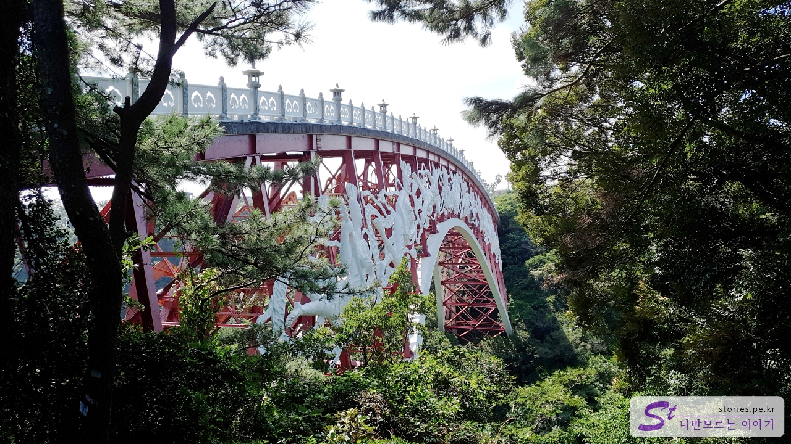

After visiting Cheonjiyeon Falls, Jeongbang Falls, and Cheonjeyeon Falls, I visited all three major waterfalls \*\*Jeju Island.  
What is this... It's nothing, but I'm proud. (Laughing)

If Cheonjiyeon Falls and Jeongbang Falls are located in downtown Seogwipo, Cheonjeyeon Falls is located in the Jungmun Tourist Complex, which is a little far away.

Cheonjeyeon Falls itself consists of the first, second, and third waterfalls. There are two ways to see Cheonjeyeon Falls, and there is a way to park at Yeomiji Botanical Garden and cross the senior bridge to see it, and there is a way to park in the parking lot of Cheonjeyeon Falls.

We parked in the parking lot of Cheonjeyeon Falls and looked around. The parking lot is spacious and free of charge.

Parking is free, but there is a separate entrance fee. ** 2,500 won for adults** and 1,350 won for children and teenagers. It's 500 won more expensive than Cheonjiyeon and Jeongbang Falls because it's in the tourist complex. Hah!

If you enter after ticketing, you can see the information sign for 1 to 3 falls. There is **First Falls** on the right and 2nd and 3rd Falls on the left, relative to the current location. The third waterfall is located farthest past **Senior Bridge**. So I decided to see the first waterfall first.

If you go a little further, you'll see a milestone to get to the first waterfall. I can see a jade-colored pond in the distance.

It's the first waterfall. It's a waterfall, but you can't see it in general. It's raining a lot, so you can only see the waterfall when the river water comes down from the upper stream. However, the pond itself is beautiful in jade color and the walls are shaped like columnar joints, so this alone purifies the eyeball. It's worth a visit.

If you turn around and go further down the road, you will find a sign indicating **Second Falls**. If you go down that road, you can see the second waterfall.

From here, you can actually see the waterfall. The waterfall is beautiful and the scenery is beautiful. We took a rest in the wind and moved to the Third Falls. It's a little far from the second waterfall to the third waterfall.

If you go down in the direction of the third waterfall, you will see **Senior Bridge**. Since it is a senior bridge because the seven fairies appear, you can see that the seven fairies are carved.

**You don't cross the senior bridge, you just have to brush past it and go further down.**

In front of the bridge, you see a milestone indicating the direction of the third waterfall. Go straight in this direction.

If you go in like that for about 10 minutes, you can finally meet the third waterfall.

On my way back to the parking lot, I saw the senior bridge and couldn't pass by, so I just crossed it. ^^ It was a very high position, so it was a dizzying and fun experience.

As soon as you cross the senior bridge, you will see Yeomiji Botanical Garden, and we just crossed the bridge and came back.

## Cost

- Adult: 2,500 won
- Children and teenagers: 1,350 won

## Time of entry

- Operating hours: 09:00 to 17:20 (Closing hours may vary depending on sunset time)
- Time required: 1–3 falls: About 1 hour round trip
- Closed: 24/7

## Travel destination information

- Address: 132 Cheonjeyeon Falls Management Office, Cheonjeyeon-ro, Seogwipo-si, Jeju
- Contact number: 064-760-6331
- - URL : https://www.visitjeju.net/kr/detail/view?contentsid=CNTS_000000000019331#

<iframe src='https://www.google.com/maps/embed?pb=!1m18!1m12!1m3!1d3336.6041578272807!2d126.41458391548923!3d33.25067226698959!2m3!1f0!2f0!3f0!3m2!1i1024!2i768!4f13.1!3m3!1m2!1s0x350c5a8f16823ba3%3A0x39e5a0cf7d94136b!2z7LKc7KCc7Jew7Y-t7Y-s!5e0!3m2!1sko!2skr!4v1669884348200!5m2!1sko!2skr' class='embed-responsive-item' allowfullscreen></iframe>

