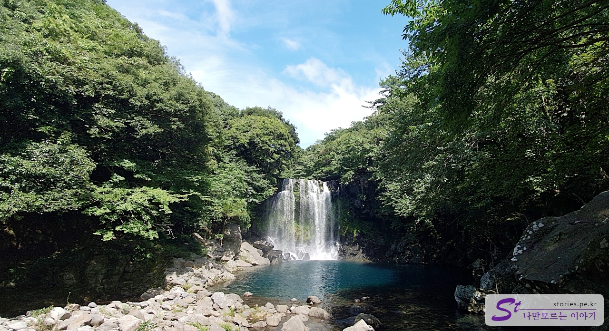
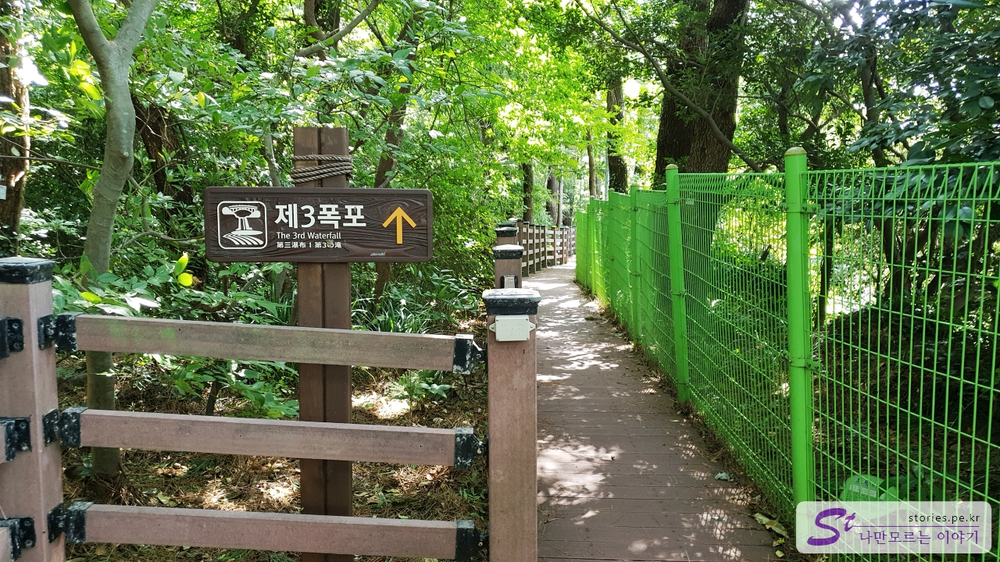
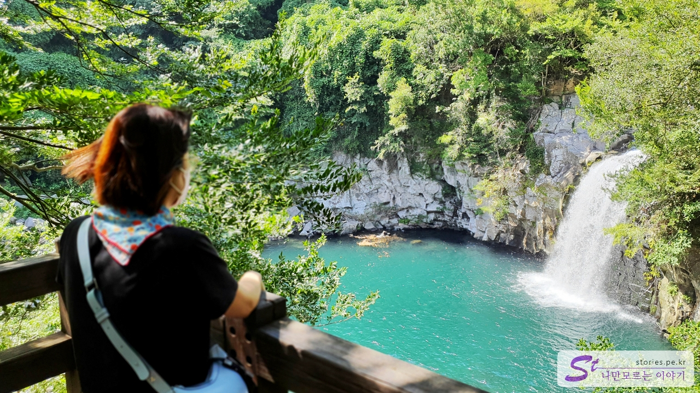
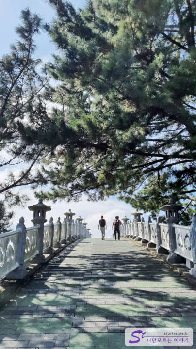

천지연폭포, 정방폭포, 이번엔 **천제연폭포**를 다녀오면서 **제주도 3대 폭포**를 모두 다녀왔습니다.  
이게 뭐라고.. 별것도 아닌데 뿌듯하네요. ㅎㅎㅎㅎ

천지연폭포와 정방폭포가 서귀포 시내에 위치해 있다면 천제연폭포는 조금 떨어져 있는 중문 관광단지 내에 있습니다.

천제연 폭포 자체도 제1, 2, 3 폭포로 이루어져 있습니다. 천제연 폭포를 구경하는 방법은 2가지가 있는데 여미지식물원에 주차를 하고 선임교를 넘어와서 구경하는 방법이 있고 천제연폭포 주차장에 주차를 하고 구경하는 방법이 있습니다.

저희는 천제연폭포 주차장에 주차를 하고 구경을 했습니다. 주차장은 넓은 편이고 주차료도 무료입니다.

주차료는 무료이지만 입장료는 따로 있습니다. **어른 기준으로 2,500원**, 어린이, 청소년 기준으로 1,350원입니다. 관광단지 내에 있어서 그런지 천지연, 정방 폭포보다 500원 더 비싸네요. ㅎ

매표를 하고 들어서면 1~3폭포에 대해서 안내 표지판을 볼 수 있습니다. 현 위치를 기준으로 오른쪽에 **제1폭포**가 있고 왼쪽으로 제2, 제3의 폭포가 있습니다. 제3폭포는 **선임교**를 지나서 가장 먼 곳에 위치해 있습니다. 그래서 일단 제 1폭포를 먼저 보기로 했습니다.

조금 더 들어가면 제1폭포로 갈 수 있는 이정표를 만나게 됩니다. 저 멀리 옥색의 연못이 보이기도 하네요.

제1폭포입니다. 말이 폭포지 일반적으로 폭포를 볼 수는 없다고 합니다. 비가 많이 와서 상류에서 하천수가 내려와야 겨우 폭포를 볼 수 있다고 하네요. 하지만 연못 자체가 옥색으로 아름답고 벽이 주상절리형으로 이루어져 있어서 이것만으로도 안구 정화가 되는 풍경입니다. 한번 와볼만합니다.

발길을 돌려 왔던 길을 되돌아 좀 더 아래로 내려가다 보면 **제2폭포**를 알려주는 안내 표지판을 만나게 됩니다. 그 길을 따라 내려가면 제2폭포를 볼 수 있습니다.

여기서부터는 실제로 폭포를 볼 수 있습니다. 폭포도 이쁘고 풍경도 이쁘고 멋집니다. 바람을 맞으며 좀 쉬었다가 제3폭포로 이동했습니다. 제2폭포에서 제3폭포까지는 거리가 좀 있습니다.

제3폭포 방향으로 내려오다 보면 **선임교**를 만날 수 있습니다. 7선녀가 나타난다 하여 선임교인지라 7선녀가 조각되어 있는 모습을 볼 수 있습니다.

**선임교를 건너는 것은 아니고 그냥 스쳐지나서 더 아래로 내려가야 합니다.**

선임교 앞에 제3폭포의 방향을 나타내는 이정표가 보입니다. 이 방향으로 쭉~ 더 들어갑니다.

그렇게 10분 정도 들어가면 드디어 제3폭포를 만날 수 있습니다.

다시 주차장으로 되돌아오는 길에 선임교를 보고 지나칠 수 없어서 그냥 한번 건너봤습니다. ^^ 상당히 높은 위치에 있어서 아찔하고 재미있는 경험이었습니다.

선임교를 건너면 바로 여미지 식물원이 나오는데, 우리는 그냥 다리만 건넜다가 다시 되돌아왔습니다.

## 비용

- 어른 : 2,500원
- 어린이, 청소년 : 1,350원

## 입장시간

- 운영시간 : 09:00 ~ 17:20 (폐장시간은 일몰시간에 따라 변경될 수 있음)
- 소요시간 : 1~3폭포 : 왕복 1시간 정도
- 휴무일 : 연중무휴

## 여행지 정보

- 주소 : 제주 서귀포시 천제연로 132 천제연폭포 관리소
- 연락처 : 064-760-6331
- URL : https://www.visitjeju.net/kr/detail/view?contentsid=CNTS_000000000019331#

<iframe src='https://www.google.com/maps/embed?pb=!1m18!1m12!1m3!1d3336.6041578272807!2d126.41458391548923!3d33.25067226698959!2m3!1f0!2f0!3f0!3m2!1i1024!2i768!4f13.1!3m3!1m2!1s0x350c5a8f16823ba3%3A0x39e5a0cf7d94136b!2z7LKc7KCc7Jew7Y-t7Y-s!5e0!3m2!1sko!2skr!4v1669884348200!5m2!1sko!2skr' class='embed-responsive-item' allowfullscreen></iframe>

