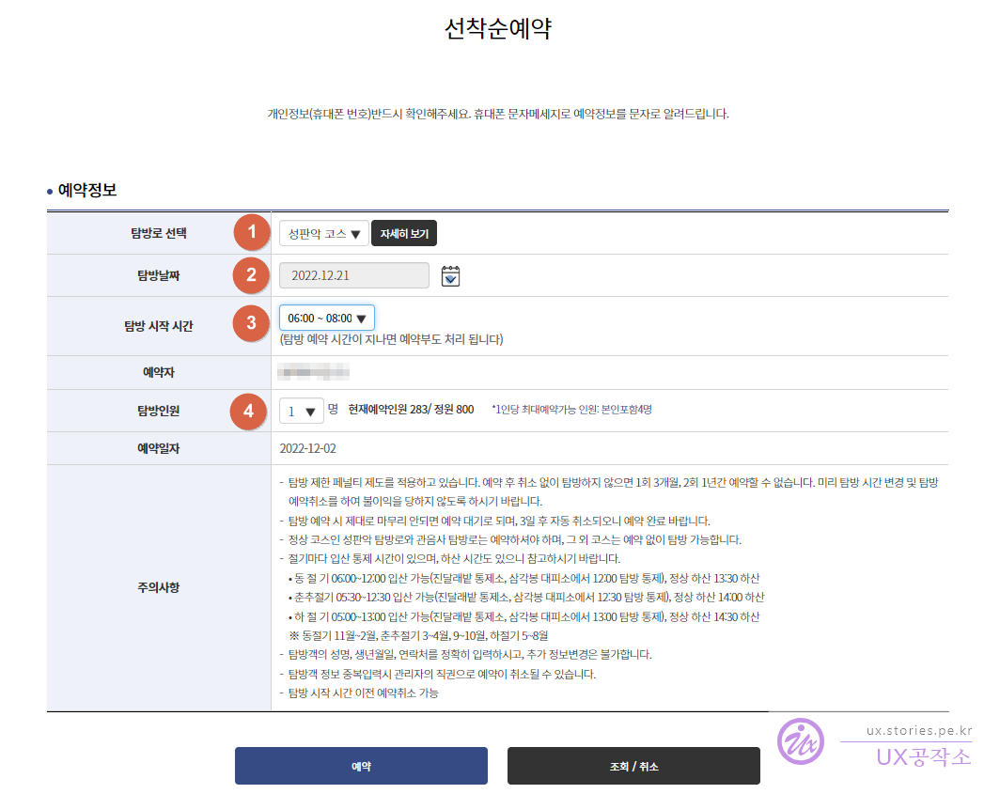
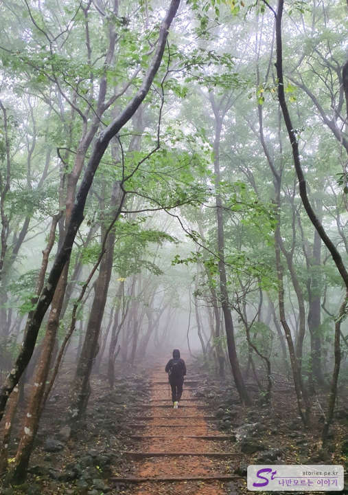
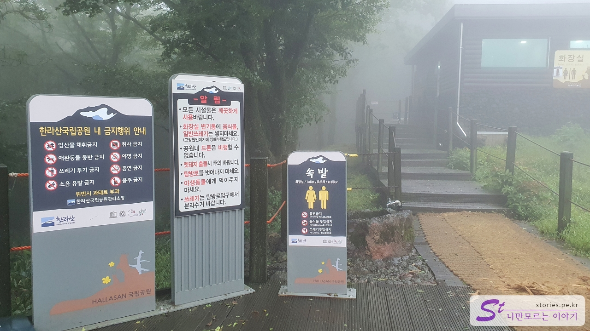
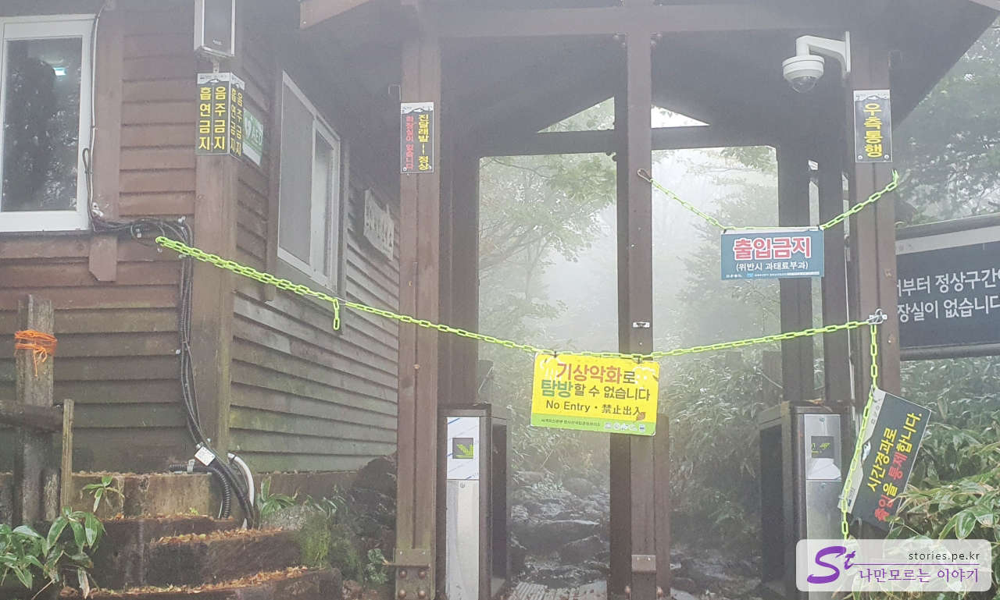

The second bucket list for this trip to Jeju Island is **Hallasan Baeknokdam Climbing**. I've been fully prepared even before the trip. Today, I made a plan only for climbing Hallasan Mountain.

## an advance reservation

You have to make a reservation in advance to climb the Seongpanak and Gwaneumsa courses of Hallasan Mountain. You can't go up without a reservation because the number of people climbing per day is 800.

1. Select the Trail Reservation menu.
2. Select the reservation status menu.
3. You can only schedule dates that say **Reserveable** on your calendar.
4. Check the desired date and select **Reserve on a first-come, first-served basis** menu.

1. Choose between Seongpanak course and Gwaneumsa Temple course.
2. Select the date of the visit.
3. Select a visit time. You have to go up at 06:00 or 08:01 to shoot Baekrokdam and come down. If you go up at 10:00, ordinary people cannot go up to Baeknokdam due to time.
4. Select the number of visitors. Only up to 4 people can register per person.

## Course Introduction

The Seongpanak course is a relatively easy course that even beginners can go up because of the time.  
Gwaneumsa Temple course has a serious stair-climbing course, so it's a bit difficult and the scenery is wonderful.  
If it's your first try at Hallasan Mountain, I recommend **Sungpanak Course**.

## a vocal music course

The course we went up is Seongpanak.  
I left Jungmun at 5 a.m. and arrived at about 5:40 a.m. Originally, you can't park in the Seongpanak parking lot at this time. It's full before that.  
In fact, there was a typhoon warning on the day of the hike, so I received a text message from the azalea shelter to Baengnokdam. Maybe that's why the parking lot was empty because there were many people who canceled it. We thought a lot about whether to go or not and decided to go up.

As expected, it drizzled from the start of the climb. In fact, the rain didn't matter much. It had its own mood and atmosphere. What I was worried about was that I might not be able to go up to Baeknokdam from Azalea shelter. I went up with the hope that the entrance control would be lifted.

After going up for about an hour and a half, we finally found **Inside Shelter**. Actually, there wasn't a difficult section until here.

There was a small room to avoid the rain, and there was a big bathroom. I took a quick break, ate an energy bar, rested for about 20 minutes, and went up again.

If you go up about an hour and 40 minutes from here, you will find the next shelter, Azalea Field Shelter.

I met an elk at a very close distance on my way up. I don't know if it's a baby elk or not. I took a lot of pictures. I'm going to upload it because it came out well. If seeing this guy once is the harvest of this climb, it's a harvest.

I climbed up for about an hour and a half and finally met **An azalea shelter**. Looking at the shelter in the fog, there's something... I was a little touched. Oh, you can rest. In fact, it is simply expressed in writing, but there was a joy of rest because the general public came up for nearly three hours without a break.

I heard that the bowl noodles in the mountains are so delicious, so I brought hot water and bowl noodles to the thermos. It was a hassle to prepare kimbap since early in the morning, so I just prepared triangular kimbap at the convenience store.  
In the past, azalea field shelters used to sell various foods, but now they don't sell anything. Fortunately, however, there is a sleeping tank where you can throw away the remaining soup if you only use a bowl at the shelter. I brought a zipper bag to throw away the leftover soup, but I don't need it anymore. When I asked, they said they didn't have it in other evacuation centers, but they only have it here. So if you want to eat bowl noodles, it's better to eat at the azalea shelter.

I came here hoping that the entrance control would be lifted on the way up, but as expected, I couldn't go up any further. I turned around and went down the mountain.  
I thought I'd achieve one bucket list of my life. Unfortunately, it didn't work.  
I'm planning to try again soon.

So, about 15 days later, I took a day off and came to Jeju by plane at dawn to climb Hallasan Mountain, and then took an evening flight to Gimpo Airport to conquer Hallasan Mountain. Please refer to the posting below. ^^

> [The standard way to climb Mt. Halla Baekrokdam on the same day](http://junistory.blogspot.com/2022/12/jeju-trip-standard-of-climbing-mt-halla.html)

## Time of entry

You have to make a reservation for the hiking day and time in advance.
Please note that there is a time to control entry and exit in each season, and there is also a time to go down.

- **Winter season** You can enter the mountain from 06:00 to 12:00 (Jindalae Field Control Center, Triangle Peak Evacuation Center 12:00), Climb the summit, 13:30
- **Spring and autumn season** You can enter the mountain from 05:30 to 12:30 (Jindalae Field Control Center, Triangle Peak Evacuation Center at 12:30), Climbing the summit at 14:00
- **Summer season** From 05:00 to 13:00 You can enter the mountain (Jindalae Field Control Center, Samgakbong Shelter 13:00 Visit Control Center), Climb the summit, 14:30 Climb the mountain

Climbing time is also very important. If you do something wrong, it gets dark while coming down, so you can't walk without a lantern. (We got dark, too, so we barely came down to the smartphone flash.)

- Time required: Approximately 8 to 9 hours round trip

## Travel destination information

- Address: 1865 Seongpanak Exploration Center, 516-ro, Jocheon-eup, Jeju-si
- Contact number: 064-725-9950
- - URL : http://www.jeju.go.kr/hallasan/info/center/center2.htm

<iframe src='https://www.google.com/maps/embed?pb=!1m18!1m12!1m3!1d1665.7343672981428!2d126.61809105820168!3d33.38493333482389!2m3!1f0!2f0!3f0!3m2!1i1024!2i768!4f13.1!3m3!1m2!1s0x350d01e5e191fd53%3A0xb8a0605f4b3126c5!2z7ZWc65287IKw6rWt66a96rO17JuQIOyEse2MkOyVhSDtg5DrsKnslYjrgrTshow!5e0!3m2!1sko!2skr!4v1669972201856!5m2!1sko!2skr' class='embed-responsive-item' allowfullscreen></iframe>

## Parking information

There is a parking lot in Seongpanak, but it is almost full with the opening time, so parking here is a star picking in the sky.
If you can't park here, there are two ways to park.

- **Magangmokji Parking**: Free of charge and after parking, you must take a bus or taxi to Seongpanak.
- **Jeju University parking lot**: It is free and you must come to Seongpanak by bus or taxi after parking.

## Supplies

### Required

- Climbing bags, hiking boots, hiking sticks
- Gimbap for lunch, behavioral meals (chocolate bar, bread, etc.), water (about 3 per person), garbage bags
- Hiking hats, gloves, windbreakers
- Personal medicine, Tylenol, digestive medicine, antidiarrheal, fucidine, bandage, compression bandage
- Auxiliary battery, battery cable

### Options

- Sunglasses, multi scarf, towel, hiking socks, LED head lantern, Panchowoo's
- Insulation water (500ml), bowl noodles, wooden chopsticks, wet tissue, tissue, fruit
