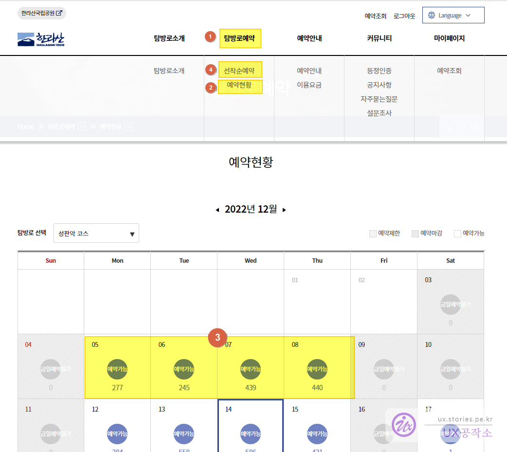
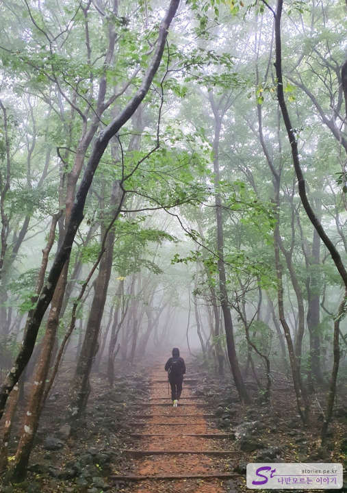
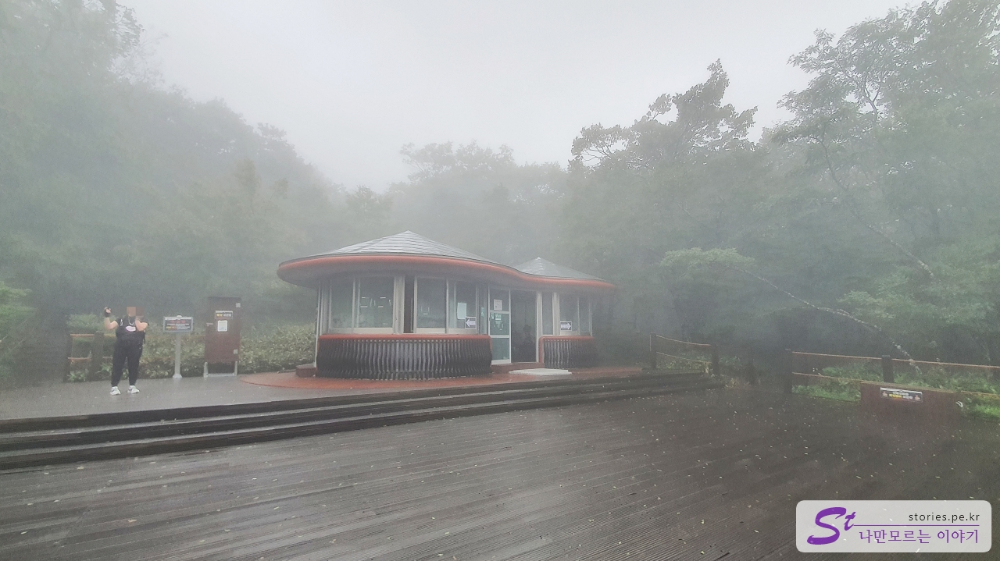
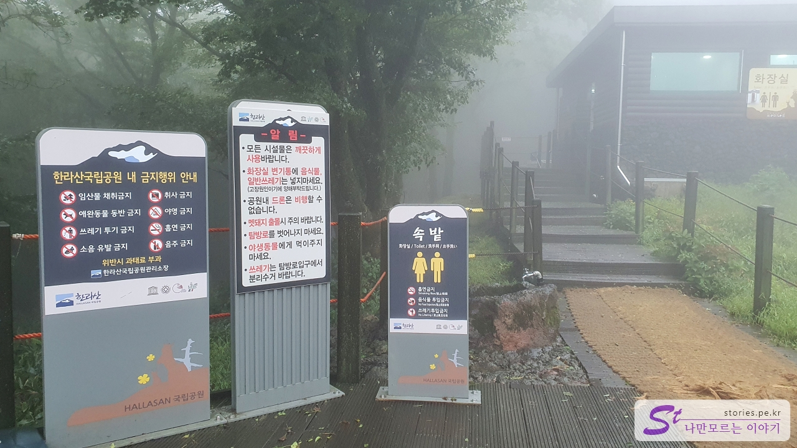
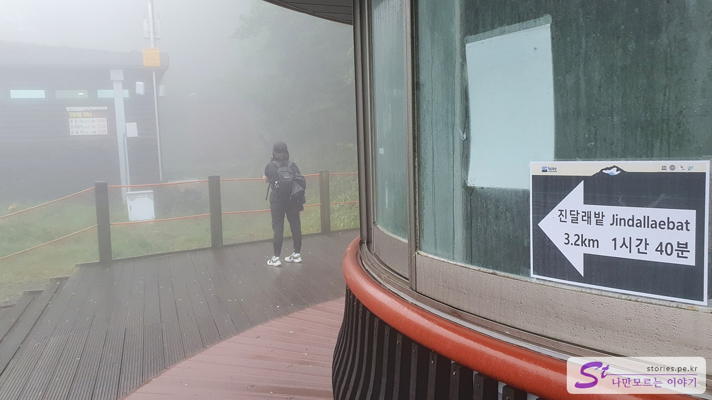
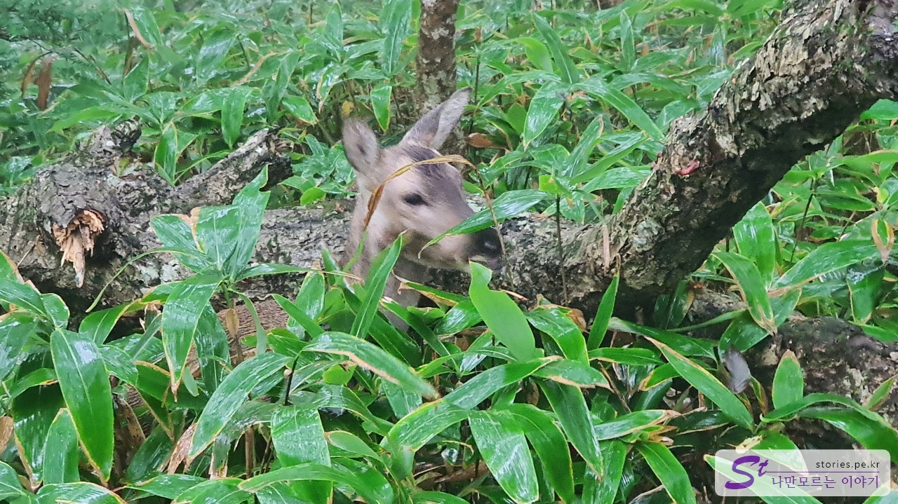
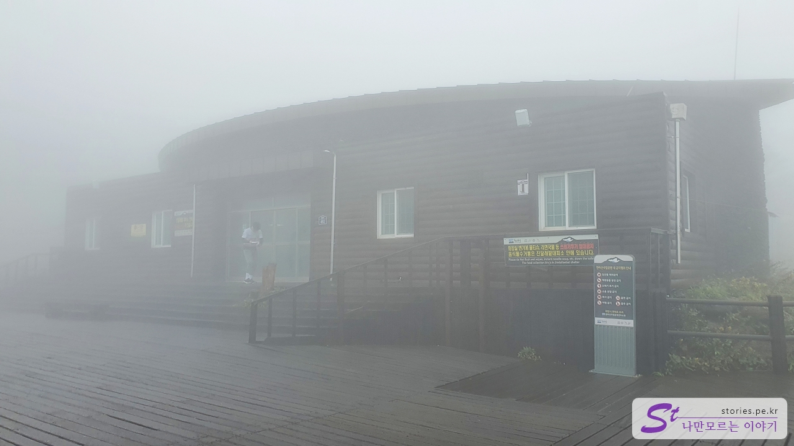
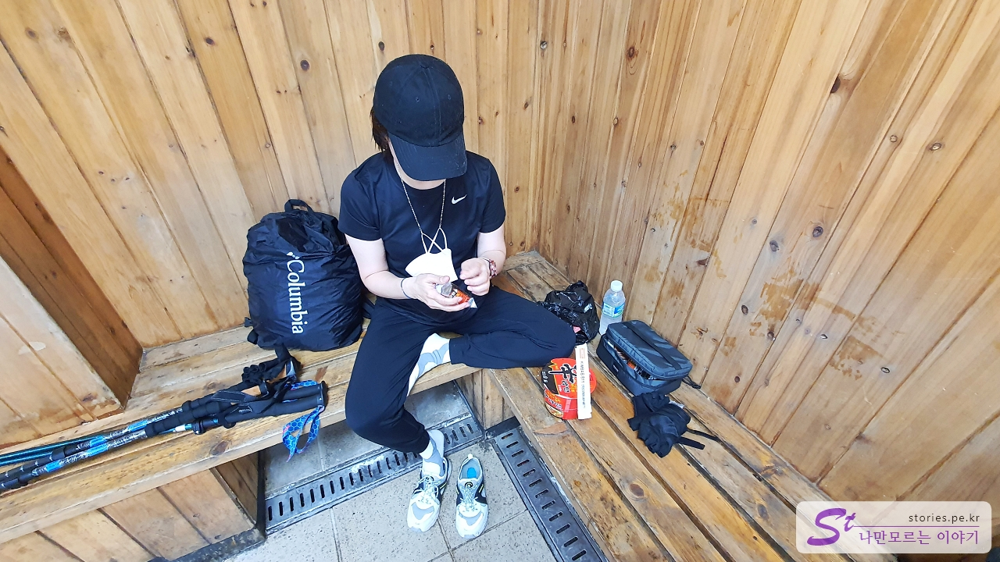
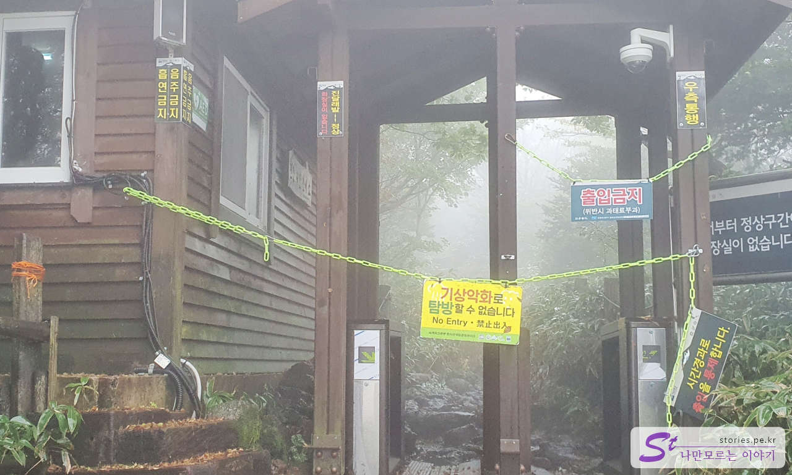

이번 제주도 여행의 2번째 버킷리스트는 **한라산 백록담 등반**입니다. 여행 준비 전부터 만반의 준비를 하고 왔습니다. 오늘 하루는 오롯이 한라산 등반을 위해서만 계획을 잡았습니다.

## 사전예약

한라산의 성판악, 관음사 코스로 등산을 하려면 미리 예약을 해야 합니다. 하루 등반 인원이 800명으로 정해져 있어서 예약 없이는 올라갈 수 없습니다.

1. 탐방로 예약 메뉴를 선택합니다.
2. 예약 현황을 메뉴를 선택합니다.
3. 달력에서 **예약 가능**이라고 쓰여있는 날짜만 예약할 수 있습니다.
4. 원하는 날짜를 확인 후 **선착순 예약** 메뉴를 선택합니다.

1. 탐방로는 성판악 코스와 관음사 코스 중 선택을 합니다.
2. 탐방 날짜를 선택합니다.
3. 탐방 시간을 선택합니다. 백록담을 찍고 내려오려면 06:00 또는 08:01에는 올라가야 합니다. 10:00에 올라간다면 일반 평민은 백록담까지는 시간상 올라가지 못합니다.
4. 탐방인원을 선택합니다. 1인당 최대 4명까지만 등록이 가능합니다.

## 코스 소개

성판악 코스는 시간이 문제지 초보자도 올라갈 수 있는 비교적 쉬운 코스입니다.  
관음사 코스는 심각한 계단 오르막 코스가 있어서 조금 힘든나 풍경이 멋진 코스입니다.  
한라산 첫 도전이라면 **성판악 코스**를 추천드립니다.

## 성판악 코스

저희가 올라간 코스는 성판악 코스입니다.  
중문에서 아침 5시에 출발해서 대략 5시 40분에 도착했습니다. 원래는 이 시간에 와도 성판악 주차장에 주차를 할 수 없습니다. 그전에 만차가 되거든요.  
사실 등산 당일 태풍주의보가 있어서 진달래밭 대피소에서 백록담까지 입산통제라는 문자를 받았었습니다. ㅠㅠ 그래서 취소하는 사람이 많아서인지 주차장이 많이 비어있었습니다. 우리도 갈까 말까 많은 고민 끝에 일단 올라가 보기로 했습니다.

예상한 것처럼 올라갈 때부터 보슬비가 내렸습니다. 사실 비는 크게 문제 될 것이 없었습니다. 나름 분위기와 운치가 있었거든요. 걱정되는 것은 진달래 대피소에서 백록담까지 올라가지 못할까 봐였습니다. 혹시나 입산통제가 해제되지는 않을까라는 희망을 가지고 올라갔습니다.

약 1시간 30분 정도를 올라가니 드디어 **속밭 대피소**가 나왔습니다. 사실 여기까지는 힘든 구간은 없었습니다.

비를 피할 수 있는 조그만 실내가 있었고 화장실도 크게 하나 있었습니다. 간단하게 볼일을 보고 에너지바도 하나 먹으면서 20분 정도 쉬고 다시 올라갔습니다.

여기서부터 대략 1시간 40분 정도 올라가면 다음 대피소인 진달래밭 대피소가 나옵니다.

올라가는 길에 매우 가까운 거리에서 고라니를 만났습니다. 새끼 고라니인지 사람을 별로 경계를 하지 않더라고요. 사진을 여러 방 찍었는데.. 그나마 이게 잘 나온 거라 올려봅니다. 요놈 한번 본 것이 이번 등산의 수확이라면 수확이겠네요.

약 1시간 30분 정도 올라가서 드디어 **진달래밭 대피소**를 만났습니다. 안갯속에 대피소를 보니 뭔가.. 약간 감동이 있었습니다. 오~ 쉴 수 있구나.. 사실 글로는 간단하게 표현되지만 일반인이 3시간 가까이 쉼 없이 올라온 거라 휴식의 기쁨이 있었습니다.

산에서 먹는 사발면이 그렇게 맛있다고 해서 보온병에 뜨거운 물과 사발면을 가지고 왔습니다. 김밥은 새벽부터 준비하기가 좀 번거로워서 그냥 편의점에서 삼각김밥을 준비했고요.  
예전에는 진달래밭 대피소에서 여러 음식들을 판매했었다고 하는데 현재는 아무것도 판매하고 있지 않습니다. 다만 다행인 것은 여기 대피소에만 사발면 남은 국물을 버릴 수 있는 잠통이 있습니다. 혹시나 해서 남은 국물 버리려고 지퍼백을 들고 왔었는데 필요가 없게 되었습니다. 물어보니 다른 대피소에는 없고 여기에만 짬통을 비치해 놨다고 하네요. 그래서 사발면을 먹으려면 진달래밭 대피소에서 먹는 것이 좋다고 하네요.

혹시나 올라오는 도중에 입산통제가 풀릴지는 않을까 기대하고 왔는데 역시나 더 이상 올라갈 수는 없었습니다. 그대로 발길을 돌려 하산을 하게 되었습니다.  
내 생의 버킷리스트 하나를 달성하나 싶었는데.. 아쉽게도 불발이 되었네요.  
조만간 다시 한번 도전할 계획입니다.

그래서 보름 정도 뒤에 하루 휴가를 내서 새벽 비행기 타고 제주에 와서 한라산 등산만 하고 다시 저녁 비행기를 타고 김포공항으로 가는 당일치기 한라산 정복을 했습니다. 아래 포스팅을 참고하세요. ^^

> [당일치기 한라산 백록담 등반하기의 정석](https://blog.stories.pe.kr/582)

## 입장시간

미리 등산 일과 시간을 예약해야 합니다.
절기마다 입산 통제 시간이 있으며, 하산 시간도 있으니 참고하시기 바랍니다.

- **동 절 기** 06:00~12:00 입산 가능(진달래밭 통제소, 삼각봉 대피소에서 12:00 탐방 통제), 정상 하산 13:30 하산
- **춘추 절기** 05:30~12:30 입산 가능(진달래밭 통제소, 삼각봉 대피소에서 12:30 탐방 통제), 정상 하산 14:00 하산
- **하 절 기** 05:00~13:00 입산 가능(진달래밭 통제소, 삼각봉 대피소에서 13:00 탐방 통제), 정상 하산 14:30 하산

하산 시간도 매우 중요합니다. 잘못하면 내려오는 도중 깜깜해져서 랜턴이 없으면 걸을 수가 없습니다. (저희도 깜깜해져서 스마트폰 플래시로 겨우 내려왔습니다.)

- 소요시간 : 왕복 약 8 ~ 9시간

## 여행지 정보

- 주소 : 제주 제주시 조천읍 516로 1865 성판악 탐방안내소
- 연락처 : 064-725-9950
- URL : http://www.jeju.go.kr/hallasan/info/center/center2.htm

<iframe src='https://www.google.com/maps/embed?pb=!1m18!1m12!1m3!1d1665.7343672981428!2d126.61809105820168!3d33.38493333482389!2m3!1f0!2f0!3f0!3m2!1i1024!2i768!4f13.1!3m3!1m2!1s0x350d01e5e191fd53%3A0xb8a0605f4b3126c5!2z7ZWc65287IKw6rWt66a96rO17JuQIOyEse2MkOyVhSDtg5DrsKnslYjrgrTshow!5e0!3m2!1sko!2skr!4v1669972201856!5m2!1sko!2skr' class='embed-responsive-item' allowfullscreen></iframe>

## 주차정보

성판악 주차장이 있으나 거의 개장시간과 함께 만차가 되어버려서 여기에 주차하기는 하늘의 별 따기입니다.
만약 이곳에 주차를 하지 못한다면 2가지 주차방법이 있습니다.

- **마방목지 주차장** : 무료이며 주차 후 버스나 택시를 타고 성판악으로 와야 합니다.
- **제주대학교 주차장** : 무료이며 주차 후 버스나 택시를 타고 성판악으로 와야 합니다.

## 준비물

### 필수

- 등산 가방, 등산화, 등산 스틱
- 점심 식사용 김밥, 행동식(초코바, 빵 등등..), 물(인당 3개 정도), 쓰레기봉투
- 등산 모자, 등산장갑, 바람막이
- 개인 약, 타이레놀, 소화제, 지사제, 후시딘, 대일밴드, 압박붕대
- 보조배터리, 배터리 케이블

### 옵션

- 선글라스, 멀티스카프, 수건, 등산양말, LED 헤드랜턴, 판초 우의
- 보온 물(500ml), 사발면, 나무젓가락, 물티슈, 휴지, 과일
